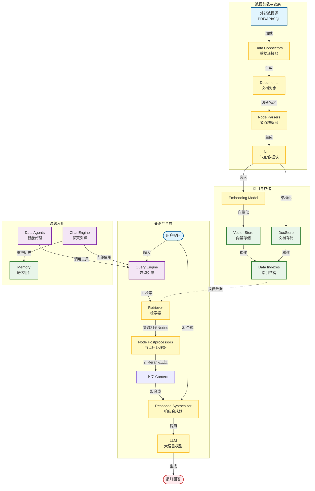

LlamaIndex 的架构体系非常丰富，为了方便理解，通常将其划分为 **5 到 7 个** 关键核心组件/阶段。根据官方架构逻辑，可以将其归纳为三大阶段（数据摄取、索引构建、查询检索）中的若干具体组件。

根据搜索结果[blog.csdn.net](https://blog.csdn.net/weixin_41688410/article/details/145537157)、[blog.csdn.net](https://blog.csdn.net/2301_76168381/article/details/146417646)，LlamaIndex 主要包含 **7 个核心组件**。

以下是使用 Mermaid 绘制的组件关系图，以及各组件的详细解析。

### LlamaIndex 核心组件关系图

这个流程图展示了数据从外部源进入，经过处理、索引，最终通过查询引擎被用户消费的完整闭环。

---

### 核心组件详细解析

LlamaIndex 的组件可以分为三个主要处理阶段：**加载（Loading）**、**索引（Indexing）** 和 **查询（Querying）**。

#### 1. Data Connectors（数据连接器）
这是数据的入口。它的作用是将外部数据源（如 PDF、Notion、SQL 数据库、API 等）加载进来，并转换成 LlamaIndex 可以处理的**Document**格式。
*   **输入：** 外部文件或数据流。
*   **输出：** `Document` 对象列表。
*   *参考来源：[blog.csdn.net](https://blog.csdn.net/weixin_41688410/article/details/145537157)*

#### 2. Node Parsers（节点解析器/变换器）
这是数据预处理的关键步骤。大文档直接处理效率低且容易超出 LLM 上下文限制，因此需要切分。
*   **作用：** 将由连接器加载的 `Document` 切分成更小的、原子的数据块，称为 **Node（节点）**。Node 不仅包含文本切片，还包含元数据（如页码、文件名）和关系信息（上一个节点/下一个节点）。
*   **关系：** Document $\rightarrow$ 多个 Nodes。

#### 3. Data Indexes（数据索引）
这是核心的数据结构。它定义了如何组织和存储 Nodes，以便高效检索。
*   **常见类型：**
    *   `VectorStoreIndex`（最常用）：将节点转换为向量嵌入（Embeddings）并存储，用于语义相似度搜索。
    *   `SummaryIndex`（列表索引）：存储节点列表，用于总结类任务。
    *   `TreeIndex`：树状结构，用于层次化查询。
*   **存储支持：** 索引通常持久化在 **StorageContext** 中，底层可以是内存，也可以是 Chroma、Milvus 等向量数据库。

#### 4. Retrievers（检索器）
这是查询阶段的第一步。它的任务是根据用户的 Query（问题），从 Index 中找到最相关的 Nodes。
*   **机制：** 对于向量索引，它会计算 Query Embedding 和 Node Embedding 的相似度，返回 Top-K 个相关节点。
*   **关系：** Index $\rightarrow$ Retriever。

#### 5. Node Postprocessors（节点后处理器）
这是提高 RAG（检索增强生成）准确率的关键组件。它接收检索器找到的 Nodes，并进行进一步的处理。
*   **常见操作：**
    *   **Reranking（重排序）：** 使用更精细的模型（如 Cohere Rerank）对检索结果重新打分排序。
    *   **Filtering（过滤）：** 根据元数据过滤掉不符合条件的节点（例如只看2024年的文档）。
    *   **Keyword Filters：** 过滤掉不包含特定关键词的内容。

#### 6. Response Synthesizers（响应合成器）
这是生成最终答案的组件。它将“用户的问题”和“检索并处理过的上下文（Nodes）”结合起来，构建 Prompt（提示词），发送给 LLM。
*   **模式：**
    *   `refine`：迭代式地询问 LLM，逐步完善答案。
    *   `compact`：将尽可能多的上下文塞进一次 API 调用中。
    *   `tree_summarize`：自底向上构建摘要树。

#### 7. Engines & Agents（引擎与代理）
这是用户直接调用的顶层接口，封装了上述复杂的管道。
*   **Query Engine（查询引擎）：**  $Retrieval \rightarrow Postprocessing \rightarrow Synthesis$ 的端到端管道。 用户输入问题，直接得到答案。
*   **Chat Engine（聊天引擎）：**  $Query Engine + Memory$。 增加了对话历史记忆，允许用户像与 ChatGPT 聊天一样与数据交互。
*   **Data Agents（数据代理）：**  由 LLM 驱动的自动化决策者。它不仅是回答问题，还可以决定使用哪些工具（不同的 Query Engines）、是否需要联网搜索等。
    *   *参考来源：[blog.csdn.net](https://blog.csdn.net/weixin_41688410/article/details/145537157)*

### 总结
简单来说，LlamaIndex 的工作流公式为：
$$ \text{LlamaIndex} = \text{Data (Nodes)} + \text{Index (Vectors)} + \text{Retrieval (Search)} + \text{LLM (Synthesis)} $$