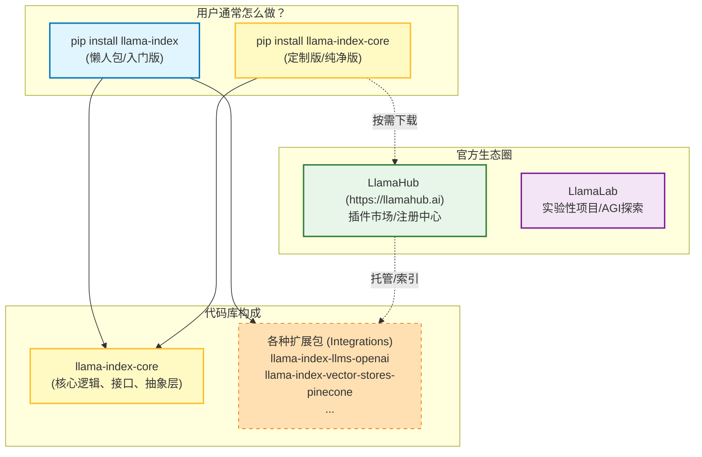

LlamaIndex 在 **v0.10.0 版本（2024年初）** 做了一次架构大重构，把原来的一个大杂烩包拆分成了现在的“核心+插件”模式。这直接导致了你看到的这一堆名字。

简而言之：**你看到的不是架构组件（如索引、检索器），而是“项目组织结构”和“Python 包的安装方式”。**

我们可以把它们分为 **“代码库/安装包”** 和 **“生态项目”** 两类。

### 核心关系图解（Mermaid）

这张图展示了这些名字在**项目层级**上的关系：

---

### 1. 代码库/安装包（你写代码时用到的）

这部分是你最容易混淆的 `llama-index` 和 `llama-index-core`。

#### **`llama-index-core` (基石)**
*   **是什么**：这是框架的“骨架”。
*   **包含**：所有的核心抽象（Documents, Nodes, VectorStoreIndex, QueryEngine 等接口）和基础逻辑。
*   **不包含**：**它不包含具体的第三方集成**。只有 `core` 你连 OpenAI 都调不通，因为里面没有 `OpenAI` 类，只有 `LLM` 抽象类。
*   **适用场景**：高阶用户，只想引入自己需要的组件，保持环境轻量。

#### **`llama-index` (懒人包)**
*   **是什么**：这是官方为了方便初学者打包的一个“全家桶”。
*   **包含**：
    1.  `llama-index-core` (骨架)
    2.  `llama-index-llms-openai` (默认支持 OpenAI)
    3.  `llama-index-embeddings-openai`
    4.  以及一些最常用的扩展。
*   **适用场景**：初学者、快速原型开发。`pip install llama-index` 就行了。

#### **各种扩展包 (Namespace Packages)**
为了防止代码库过于臃肿，官方把所有跟第三方工具（如 Chroma, LangChain, HuggingFace）的连接代码都拆出来了。
*   例如：你想用 Ollama，你需要安装 `pip install llama-index-llms-ollama`。

---

### 2. 生态项目（你去哪里找资源）

这部分是 `LlamaHub` 和 `LlamaLab` 的范畴。

#### **`LlamaHub` (插件市场)**
*   **定位**：**LlamaIndex 的“App Store”或“Docker Hub”。**
*   **作用**：这是一个社区驱动的集成库。
    *   你需要读取 `.notion` 文件？去 LlamaHub 找 Notion Loader。
    *   你需要存入 Milvus 数据库？去 LlamaHub 找 Vector Store 插件。
    *   你需要一个现成的 AI 代理工具（比如查那斯达克股票）？去 LlamaHub 找 Llama Packs。
*   **现状**：以前它是一个单独的代码库，现在它的内容大部分已经转化为可以通过 `pip` 安装的 Python 包（就是上面的扩展包），但[LlamaHub 网站](https://llamahub.ai/)依然作为检索这些工具的门户存在。

#### **`LlamaLab` (实验室)**
*   **定位**：**R&D 部门，或者叫“臭鼬工厂”。**
*   **作用**：这里存放的是**实验性的、前沿的、不稳定的**项目。
*   **内容**：比如自动生成整个 RAG 系统的 `Auto-RAG`，或者一些复杂的自主 Agent 演示。
*   **注意**：这里的代码可能还没准备好进入 `core` 核心库，主要是为了展示 LlamaIndex 的潜力或探索 AGI 方向。

---

### 总结：一句话理清关系

1.  **`llama-index-core`** 是**心脏**，定义了怎么玩。
2.  **`LlamaHub`** 是**武器库**，里面有各种枪支弹药（插件/集成扩展）。
3.  **`llama-index`** 是**新手大礼包**，直接送你心脏+一把最常用的枪（OpenAI）。
4.  **`LlamaLab`** 是**概念设计室**，里面展示未来的武器原型。