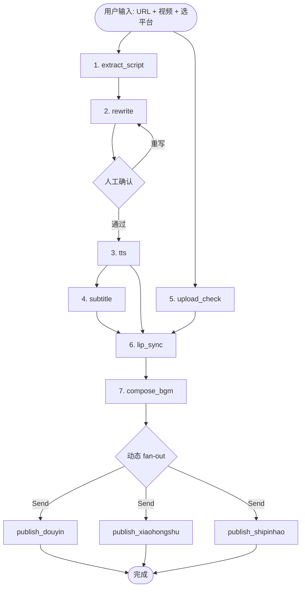
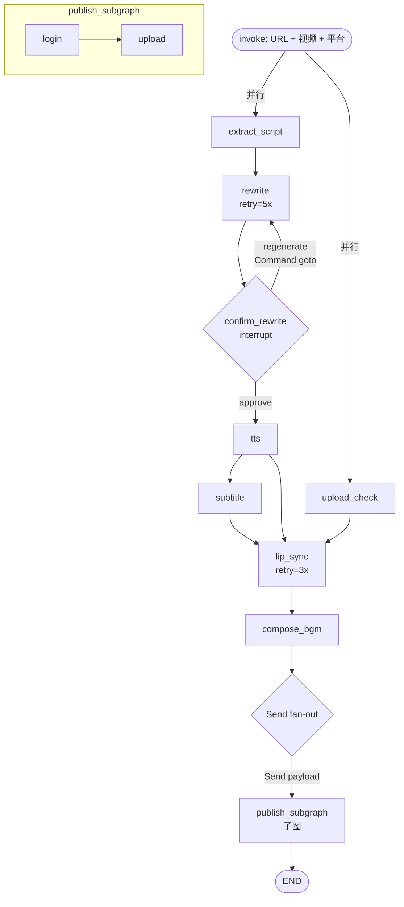

> 以一个真实产品（超级IP智能体：抖音素材 → AI 改写 → 语音 → 对口型视频 → 一键发布）为背景，**分 8 个版本渐进引入 LangGraph API**。每一版只加一个新 API，配清晰的"痛点 → 新能力"动机。

---

## 工作流本身

产品界面显示了 4 个面板 / 8 个步骤：

| # | 步骤 | 输入 | 输出 | 关键参数 |
|---|------|------|------|---------|
| 1 | 提取文案 | 抖音视频 URL | 原始文案 | - |
| 2 | AI 改写 | 原始文案 | 改写后文案 | LLM 模型（豆包） |
| 3 | 生成语音 | 改写后文案 | 音频文件 | 音色（w6） |
| 4 | 生成时间字幕 | 音频 | SRT 字幕 | 字体/颜色/边距 |
| 5 | 选择视频文件 | 本地视频 | 源视频（用户上传） | - |
| 6 | AI 对口型 | 源视频 + 音频 | 对口型视频 | 清晰度（1080P/720P/480P） |
| 7 | 背景音乐 | 对口型视频 + 字幕 + BGM | 最终视频 | 音量 |
| 8 | 自动发布 | 最终视频 | 各平台发布状态 | 平台（抖音/小红书/视频号）|

**关键依赖观察**：

- 第 1–4 步是一条"文案→音频→字幕"链
- 第 5 步是独立的用户操作，可以 **并行** 于 1–4
- 第 6 步需要 **等两条支路都到齐**（音频 ✚ 源视频）
- 第 8 步发布的平台数量是 **用户运行时选择** 的，1–3 个不等
- 改写和发布前都应该让用户 **确认一下** 才放心

## 目标图形（最终形态）



下面分 8 个版本把这张图一步一步搭出来。

---

## v0：最朴素的线性图

### 痛点

什么都没有，先让流程跑起来。

### 引入的 API

- `StateGraph(SchemaClass)` — 图构建器
- `START` / `END` — 保留起终点
- `.add_node(name, fn)` — 注册节点
- `.add_edge(from, to)` — 连边
- `.compile()` / `.invoke(input)` — 编译并执行

### 代码

```python
from typing import TypedDict
from langgraph.graph import StateGraph, START, END


class State(TypedDict):
    douyin_url: str
    video_file: str
    raw_script: str
    rewritten_script: str
    audio_file: str
    subtitle_file: str
    lip_synced_video: str
    final_video: str
    publish_status: dict


# 假装调用外部工具的函数
def extract_script(state):
    return {"raw_script": douyin_extract(state["douyin_url"])}

def rewrite(state):
    return {"rewritten_script": doubao_llm(state["raw_script"])}

def tts(state):
    return {"audio_file": tts_w6(state["rewritten_script"])}

def subtitle(state):
    return {"subtitle_file": asr(state["audio_file"])}

def lip_sync(state):
    return {"lip_synced_video": ai_lipsync(
        state["video_file"], state["audio_file"], quality="720p")}

def compose_bgm(state):
    return {"final_video": compose(
        state["lip_synced_video"], state["subtitle_file"], bgm="default.mp3")}

def publish(state):
    return {"publish_status": {"douyin": post_to_douyin(state["final_video"])}}


g = StateGraph(State)
for name, fn in [
    ("extract", extract_script), ("rewrite", rewrite), ("tts", tts),
    ("subtitle", subtitle), ("lip_sync", lip_sync),
    ("bgm", compose_bgm), ("publish", publish),
]:
    g.add_node(name, fn)

g.add_edge(START, "extract")
g.add_edge("extract", "rewrite")
g.add_edge("rewrite", "tts")
g.add_edge("tts", "subtitle")
g.add_edge("subtitle", "lip_sync")
g.add_edge("lip_sync", "bgm")
g.add_edge("bgm", "publish")
g.add_edge("publish", END)

app = g.compile()
result = app.invoke({"douyin_url": "https://...", "video_file": "/tmp/raw.mp4"})
```

### 讲解

- 一个节点 = 一个函数，输入 state 返回 dict
- dict 里的 key 会被 **合并到 state**（默认覆盖）
- `START` / `END` 是保留节点名——它们其实是两个 channel，框架用来识别"用户输入从哪进、什么时候返回结果"（详见 `notes/第一性原理-Graph.md`）

---

## v1：State 的 reducer（追加日志）

### 痛点

想记录每一步的进度日志（"✅ 改写完成 128 字"之类）。但现在 `logs` 字段每个节点一写就覆盖前面的，留不下历史。

### 引入的 API

- `Annotated[T, reducer]` — 给 state 字段声明合并规则

### 代码

```python
from typing import Annotated
from operator import add

class State(TypedDict):
    # ...其他字段
    logs: Annotated[list[str], add]   # ← list 的 + 语义：追加


def rewrite(state):
    new_text = doubao_llm(state["raw_script"])
    return {
        "rewritten_script": new_text,
        "logs": [f"✅ 改写完成，{len(new_text)} 字"],
    }
```

### 讲解

- `Annotated` 里第二个元素是 **reducer**，LangGraph 编译时会根据它选 channel 类型
- `operator.add` 用于 list → 得到 `BinaryOperatorAggregate` channel，自动拼接
- 这是 state 合并的底层机制（详见 `notes/第一性原理-State.md` 和 `notes/第一性原理-Channel.md`）
- 常用 reducer：
  - `operator.add` — list / int / str 的累加
  - `langgraph.graph.add_messages` — 消息列表合并（去重、ID 维护）
  - 自定义 `lambda old, new: {**old, **new}` — dict 合并

---

## v2：条件边（按用户意图跳过步骤）

### 痛点

用户有时手头已经有 **写好的文案**，不需要从抖音爬——想直接进改写。纯线性图做不到"按 state 跳步"。

### 引入的 API

- `.add_conditional_edges(source, router_fn, path_map)` — 运行时动态路由

### 代码

```python
def route_start(state) -> str:
    if state.get("raw_script"):
        return "skip_extract"   # 已有文案
    return "do_extract"

g.add_conditional_edges(
    START,
    route_start,
    {
        "do_extract": "extract",
        "skip_extract": "rewrite",  # 直接跳到改写
    },
)
```

### 讲解

- `router_fn` 读 state 返回一个字符串键
- `path_map` 把键映射到节点名
- **router 必须 deterministic**（同样的 state 总产出同样的结果），否则 checkpoint 回放会出问题（详见 `notes/第一性原理-Send.md`）
- 实际在 Pregel 里，"条件边"不是边，而是源节点出口的 **动态 write 动作**（详见 `notes/第一性原理-Graph.md`）

---

## v3：并行执行（文案链 ∥ 视频上传）

### 痛点

第 5 步"上传视频"和第 1–4 步没有任何依赖——它们 **本来就可以并行**。但 v0 写成了线性，白白浪费时间。

### 引入的 API

- 一个节点连 **多条 out-edge** = fan-out
- 一个节点有 **多条 in-edge** = fan-in（默认等所有上游都到齐）

### 代码

```python
def upload_check(state):
    # 校验用户上传的视频格式/时长
    assert state.get("video_file"), "请先上传源视频"
    return {"logs": ["✅ 视频文件就绪"]}


g.add_node("upload_check", upload_check)

# START 同时 fan-out 到两条支路
g.add_edge(START, "extract")        # 文案支路
g.add_edge(START, "upload_check")   # 视频支路

# 两条支路在 lip_sync fan-in
g.add_edge("subtitle", "lip_sync")      # 文案支路终点（音频在 tts 里也 ready）
g.add_edge("upload_check", "lip_sync")  # 视频支路终点
```

### 讲解

- 在 Pregel 的同一个 superstep 里，`extract` 和 `upload_check` 会 **并发跑**（参见 `notes/第一性原理-Pregel.md`）
- `lip_sync` 有两条入边，框架默认用 `LastValueAfterFinish` 语义：**等所有上游都跑完才激活**
- 并发不需要你写 asyncio——节点函数可以是同步或异步，框架自动选调度器

---

## v4：Send 动态 fan-out（用户选几个平台就发几个）

### 痛点

第 8 步发布。用户勾了"抖音 + 小红书"，或者勾了三个全选——**数量运行时才知道**。静态图写不出"N 个并发节点"。

### 引入的 API

- `Send(node_name, payload)` — 动态派发原语
- `add_conditional_edges` 的 router 可以返回 `list[Send]`

### 代码

```python
from langgraph.types import Send

class State(TypedDict):
    # ...
    selected_platforms: list[str]                           # ["douyin", "xiaohongshu"]
    publish_status: Annotated[dict, lambda a, b: {**a, **b}]  # dict 合并


def publish_to_platform(state):
    # state 是 Send 的 payload，不是主图的 state
    platform = state["platform"]
    video = state["video"]
    status = PUBLISH_API[platform](video)
    return {"publish_status": {platform: status}}


g.add_node("publish_to_platform", publish_to_platform)


def fan_out_publish(state) -> list[Send]:
    return [
        Send("publish_to_platform", {
            "platform": p,
            "video": state["final_video"],
        })
        for p in state["selected_platforms"]
    ]


g.add_conditional_edges("bgm", fan_out_publish, ["publish_to_platform"])
g.add_edge("publish_to_platform", END)
```

### 讲解

- `Send("publish_to_platform", payload)` 告诉 Pregel："派一个新实例，给它这个 payload"
- 同一个节点被多次派发 → **并发多个实例**
- **每个实例的 `state` 是 Send 的 payload**（不是主图 state），所以上面函数里读 `state["platform"]` 而不是 `state["selected_platforms"]`
- 汇总靠 channel 的 reducer：`publish_status` 字段声明了 dict 合并 reducer，多个实例的写入自动 merge
- Send 和 channel 是 map-reduce 的两半：**Send 分发，channel 汇总**（详见 `notes/第一性原理-Send.md`）

---

## v5：Interrupt 人工确认（AI 改写后让用户审）

### 痛点

AI 改写不一定合口味。强制让人审一眼，不通过就回到改写节点重来。

### 引入的 API

- `interrupt(value)` — 挂起节点，等外部 resume
- `Command(resume=...)` — 外部注入 resume 值
- `Command(goto=...)` — 节点里直接跳到另一个节点

### 代码

```python
from langgraph.types import interrupt, Command

def confirm_rewrite(state):
    # 这一行会"暂停"节点，实际语义是 raise + 回滚 + 等 resume
    decision = interrupt({
        "preview": state["rewritten_script"],
        "options": ["approve", "regenerate"],
    })

    if decision == "approve":
        return {"logs": ["✅ 用户批准改写"]}
    else:
        # 回到 rewrite 节点再改一次
        return Command(goto="rewrite", update={"logs": ["↩️ 重新改写"]})


g.add_node("confirm_rewrite", confirm_rewrite)
g.add_edge("rewrite", "confirm_rewrite")
g.add_edge("confirm_rewrite", "tts")   # 默认继续，除非 Command 改了
```

**调用**：

```python
config = {"configurable": {"thread_id": "user_42_job_1"}}

# 第一次 invoke：跑到 interrupt 停下
for event in app.stream(initial_state, config=config):
    print(event)
# 此时 state 已经存档。前端展示预览，用户按按钮。

# 用户点了"approve"
for event in app.stream(Command(resume="approve"), config=config):
    print(event)
# 从 interrupt 那一行继续，像没停过一样
```

### 讲解

- `interrupt()` **不是真的暂停节点**，而是"抛异常 → 回滚节点 → 存档 → resume 时重跑节点 → interrupt() 短路返回 resume 值"（详见 `notes/第一性原理-Interrupt.md`）
- 因此 **`interrupt()` 之前的代码必须幂等**——`confirm_rewrite` 里只做决策没有副作用，安全
- 用户三天后回来也能恢复（只要 checkpointer 活着）
- `Command(goto=...)` 可以在节点里 **动态改变下一步走向**，比 `add_conditional_edges` 更灵活

---

## v6：Checkpointer + Retry（持久化 & 节点级重试）

### 痛点

- 跑到 lip_sync 挂了（AI 服务抽风）——整条链白跑？
- interrupt 等用户，进程肯定重启过

### 引入的 API

- `MemorySaver` / `PostgresSaver` / `SqliteSaver` — checkpoint 后端
- `RetryPolicy(max_attempts=..., backoff_factor=...)` — 节点级重试

### 代码

```python
from langgraph.checkpoint.postgres import PostgresSaver
from langgraph.types import RetryPolicy

# 节点级重试：仅失败的节点本身重试，其他成功节点的写入都保留
g.add_node(
    "lip_sync",
    lip_sync,
    retry=RetryPolicy(max_attempts=3, backoff_factor=2.0),
)
g.add_node(
    "extract",
    extract_script,
    retry=RetryPolicy(max_attempts=5, backoff_factor=1.5),
)

# compile 时绑定 checkpointer
app = g.compile(
    checkpointer=PostgresSaver.from_conn_string("postgresql://...")
)

# 用同一个 thread_id 调用 = 同一个"会话"，自动续跑
config = {"configurable": {"thread_id": "user_42_job_1"}}
app.invoke(initial_state, config=config)
```

### 讲解

- **每个 superstep 结束自动 checkpoint** 一次（对应 BSP 屏障，参见 `notes/第一性原理-Pregel.md`）
- 同一 thread_id 再次调用 → 从最近 checkpoint 恢复
- RetryPolicy 只重试 **出错的那个节点**，不重跑整条链（因为 Pregel 的 superstep 屏障前，节点的 writes 不会被 commit）
- checkpointer 可选：
  - `MemorySaver` — 开发/测试
  - `SqliteSaver` — 单机持久化
  - `PostgresSaver` — 生产

---

## v7：流式输出（实时进度）

### 痛点

产品界面要显示"第 3 步运行中..."这种实时进度。`invoke` 是同步等整条链跑完才回来，不行。

### 引入的 API

- `app.stream(input, config, stream_mode=...)` — 流式迭代器
- `stream_mode` 可选值：`values` / `updates` / `messages` / `custom` / `debug`

### 代码

```python
for event in app.stream(
    initial_state,
    config=config,
    stream_mode="updates",   # 每个节点完成时 emit 一次
):
    # event = {"rewrite": {"rewritten_script": "...", "logs": [...]}}
    node_name, updates = list(event.items())[0]
    print(f"✓ {node_name} 完成 → {updates.get('logs', [])}")
```

不同 stream_mode：

| mode | 时机 | 场景 |
|------|------|------|
| `values` | 每 superstep emit 完整 state | 前端要完整快照 |
| `updates` | 每节点完成 emit 该节点的 dict | 进度条 |
| `messages` | LLM 吐 token 就 emit | 流式打字机 |
| `custom` | 节点里调 `get_stream_writer()` 手动发 | 自定义事件 |
| `debug` | 详细调度事件 | 调试 |

### 讲解

- stream 在 Pregel 超步循环里，每个 superstep 结束时 emit 当轮事件——天然和 BSP 屏障对齐
- 可以订多个模式：`stream_mode=["updates", "messages"]`
- 异步版本：`async for event in app.astream(...)`

---

## v8：子图（把"发布"独立封装）

### 痛点

发布逻辑越写越多——每个平台都有 cookie 管理、重试、错误上报。全塞在主图里看着乱。想把"发布"整体抽出来当一个黑盒。

### 引入的 API

- compiled graph **本身是一个 Runnable**，可以当节点
- 子图可以有自己的 state schema / checkpointer

### 代码

```python
# 子图：专门做一个平台的发布
class PublishState(TypedDict):
    platform: str
    video: str
    cookie: dict
    publish_status: Annotated[dict, lambda a, b: {**a, **b}]


def login_check(state):
    assert check_cookie(state["platform"], state["cookie"])
    return {}

def upload(state):
    return {"publish_status": {
        state["platform"]: upload_video(state["platform"], state["video"])
    }}


sub = StateGraph(PublishState)
sub.add_node("login", login_check, retry=RetryPolicy(max_attempts=3))
sub.add_node("upload", upload, retry=RetryPolicy(max_attempts=3))
sub.add_edge(START, "login")
sub.add_edge("login", "upload")
sub.add_edge("upload", END)
publish_subgraph = sub.compile()   # 这是个 Pregel 实例

# 主图里直接把它作为节点
g.add_node("publish_to_platform", publish_subgraph)  # ← 关键：Pregel 当节点
```

### 讲解

- 这符合 Graph 拆解里的结论：**Graph 是 DSL + 编译器，产物是 Pregel 实例，Pregel 实例是 Runnable，Runnable 可以当节点**
- 子图有自己的 state schema——主图调用时会把主 state 映射给子图（payload 通过 Send 带）
- 子图也可以有独立 checkpointer（高级用法）

---

## 完整整合

把 v0 到 v8 合起来，大概是这么一张图（终极版）：



---

## 这次学到的 API 速查

| API | 何时用 | 对应的拆解 |
|---|---|---|
| `StateGraph` / `START` / `END` / `add_node` / `add_edge` | 搭一条流程 | Graph |
| `Annotated[T, reducer]` | state 字段要自定义合并 | State / Channel |
| `add_conditional_edges` | 静态分支 | Graph |
| 多边 fan-in / fan-out | 并行与汇合 | Pregel |
| `Send` | 动态数量派发 | Send |
| `interrupt` + `Command(resume=...)` | 人工确认 / HITL | Interrupt |
| `Command(goto=...)` | 节点内跳目标 | Graph |
| `MemorySaver` / `PostgresSaver` | 长流程持久化 | Pregel / Checkpoint |
| `RetryPolicy` | 节点级重试 | Pregel |
| `app.stream()` | 流式事件 | Pregel |
| compiled graph 作节点 | 子图 / 模块化 | Graph |

---

## 收尾：LangGraph API 的学习节奏

这次从最简单的线性图一路加到子图，8 个版本 **每版只多引入一个 API**。你会发现：

1. **每个 API 都有明确的痛点驱动**——不是堆砌 feature，是问题追着答案跑
2. **API 数量其实不多**——把 `StateGraph / add_node / add_edge / Annotated / add_conditional_edges / Send / interrupt / Command / RetryPolicy / MemorySaver / stream` 这 10 个搞清楚，90% 场景已经够用
3. **大部分"高级能力"（并行、人工确认、动态派发、子图）都是底层机制的组合**——它们不需要新概念，只需要把已有的通道/屏障/checkpoint 机制 **用对地方**

所以学 LangGraph API 的最佳节奏：**先写最朴素的线性图跑通 → 每次真的撞到痛点再查文档引入新 API**。一上来背 API 手册是效率最低的方法。
