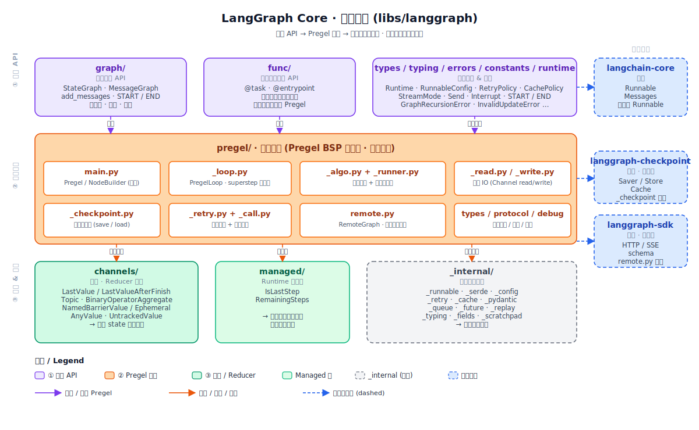

> 从"Pregel = 一个循环"出发，戳破它，推导出 Pregel 是 **在 agent 引擎约束下几乎被唯一确定的形状**——而不是一个神谕或商标。

## 为什么挑 Pregel

Pregel 是 LangGraph 里 **最容易被神化、也最容易被懒惰接受** 的概念。两种常见误解：

1. **神化派**："Pregel 是 Google 发明的，所以它很牛"——把本可以推导出的工程选择当成神谕。
2. **懒惰派**："Pregel 就是 LangGraph 的调度器名字罢了"——把一整套有深刻动机的设计降维成一个商标。

真正值得问的是：**为什么 agent 引擎"必然"长成 BSP 超步调度器的样子？** 如果你从 0 开始推导 agent 引擎必须解决哪些问题，Pregel 会 **自动浮现**——它不是神谕也不是商标，是一个几乎 **被约束条件唯一确定** 的形状。

---

## 天真理解：Pregel = "一个循环"？

一句话描述 agent 执行引擎，你大概会写：

```python
while not done:
    active_nodes = pick_ready_nodes(state)
    for node in active_nodes:
        node(state)   # 修改 state
    done = check_finished(state)
```

一个 while 循环，每轮跑活跃节点，改改 state。这就是引擎？

让我们看看这个天真模型能撑多久。

---

## 杀伤力 1：加"并发"

同一轮里独立的节点应该并行跑。改成 asyncio：

```python
while not done:
    active = pick_ready_nodes(state)
    results = await asyncio.gather(*(node(state) for node in active))
    state = merge(state, results)
```

似乎也行？但接下来每一个需求都会让它崩一次。

---

## 杀伤力 2：加"持久化"——"瞬间状态"根本定义不清

用户要求"随时能关机恢复"。问题来了：

- **在什么时刻存盘？** 某个节点跑到一半，读了 state 但还没写入，这时存盘，恢复后重跑，会不会 **重复副作用**？
- **如果"一个节点完成就存一次"**，那并发的 2 个节点一个完成一个没完成时，存进去的状态是 **半成品**——算哪个版本？
- **如果用分布式快照算法（Chandy-Lamport）**，你不是在写 agent 框架了，你在写分布式系统。

这个难题有名字：**一致性快照 (consistent snapshot) 问题**。异步模型里 **根本没有天然的"一致状态"时刻**——你得 **人为制造一个**。

---

## 杀伤力 3：加"重试"——哪些写入该回滚？

某个节点挂了要重试。问题：

- 它挂之前已经 **部分写入** 了 state 里几个字段怎么办？
- 它挂之前已经 **trigger 了下游节点** 开始执行，那些下游要撤销吗？
- 多个节点并发跑，只有一个挂了，其他的写入保留不保留？

同样地：你没有一个明确时刻可以说"这之前是 OK 的，重试从这开始"。

---

## 杀伤力 4：加"回放"——事件顺序是什么？

用户想"回到第 5 步重跑"。问题：

- 异步模型里，"第 5 步"是什么？时间戳？事件序号？
- 并发节点的完成顺序是不确定的——你存的是 `{A, B, C}` 完成，但下次回放时顺序可能是 `{B, A, C}`——结果一样吗？
- 如果不一样（某节点有非确定性），回放等于废话。

---

## 发现：所有这些问题指向同一个缺陷

"半成品状态"、"不明确的重试起点"、"不确定的事件顺序"——它们其实是同一件事的不同症状：

> **异步并发模型里没有天然的"一致时刻"。每个问题都在问同一件事：到底什么时候状态是 clean 的？**

那就 **强制制造一个**。

---

## 必然的推论：必须引入 **同步屏障**

既然自然的"一致时刻"不存在，那就 **规定** 一些时刻作为一致点：

1. 把时间切成 **离散的 step**
2. 每个 step 内部允许并发
3. **step 之间有屏障**——所有节点完成，才进入下一 step
4. **屏障处 = 一致状态**，所有问题在这里都有明确答案

这个模型 1990 年就有名字：**BSP (Bulk Synchronous Parallel)**，Leslie Valiant 提出。

BSP 提供了什么？

| 之前的难题 | BSP 的答案 |
|---|---|
| 何时存盘？ | **屏障处**，状态天然一致 |
| 怎么重试？ | **回到上个屏障**，重跑这一步 |
| 怎么回放？ | **按屏障顺序**重放每个 step |
| 如何挂起？ | **在屏障处挂起**，安全 |
| 流式事件怎么发？ | **每个屏障发一批** |
| 并发的正确性？ | step 内并发无依赖，**屏障处合并** |

**同步屏障不是负担，是礼物**。它一次性解决了持久化、重试、回放、挂起、流式五件事。

---

## 再推一步：BSP + "顶点为中心" = Pregel

BSP 只规定了"时间分步 + 屏障"，没规定"怎么组织计算"。Google 2010 年把 BSP 和 **"顶点为中心 (vertex-centric)"** 的计算范式结合起来，发表了 *Pregel* 论文：

> **每个超步里，每个活跃的"顶点"（= 计算单元）接收上一步的消息，执行一个函数，产生本步的输出（消息、状态更新）。**

所以 **Pregel = BSP + 顶点为中心**。它原本是解决"亿级顶点图上算 PageRank"这类问题的。

但你看——把"顶点"换成 LangGraph 的"节点"，把"消息"换成"通道写入"，把"超步"换成"step"，Pregel 和 agent 执行引擎 **结构同构**。

这就是为什么 LangGraph 直接拿 Pregel 当底座：**不是因为 Google 很牛，而是因为 BSP + 顶点为中心这两个选择，在 agent 调度上同样自然**。

---

## 杀伤力 5：Pregel 在 LangGraph 里不是"一个类"，是一组职责

打开 `libs/langgraph/langgraph/pregel/`：

```
main.py          ← Pregel 类 + NodeBuilder
_loop.py         ← 超步主循环 (PregelLoop)
_algo.py         ← 调度算法 (prepare_next_tasks, apply_writes)
_runner.py       ← 并发执行器
_read.py / _write.py ← 通道读写
_checkpoint.py   ← 持久化集成
_retry.py        ← 重试策略
_call.py         ← 任务调用胶水 (给 @task 用)
remote.py        ← 远程图 (RemoteGraph)
types.py / protocol.py ← 引擎内部接口
```

**Pregel 不是一个类，是一组协同工作的职责**。`main.py` 的 `Pregel` 类更像是个"门面"——真正的执行循环在 `_loop.py`，任务准备在 `_algo.py`，并发在 `_runner.py`。

这种拆分不是炫技，是 BSP 模型自然对应的模块划分：

- **主循环** (loop) = "推进超步"
- **调度算法** (algo) = "决定哪些节点活跃 + 合并写入"
- **执行器** (runner) = "并发跑一组节点"
- **IO** (read/write) = "节点和通道之间的桥"
- **持久化** (checkpoint) = "屏障处存盘"
- **重试** (retry) = "单步级别的失败恢复"

每个模块对应 BSP 超步循环里的一个阶段。**你要再造一个 Pregel，模块划分大概率也会这样**——因为这些职责是 BSP 模型本身要求的。

把 `libs/langgraph` 整个包摊开看，Pregel 在内部架构里的位置是这样：



三层读法：**①用户 API** (`graph/` + `func/` + 公开类型) 在最上面，写代码的人只会看到这一层；**②执行引擎** (`pregel/`) 是中间的橘色大块，也就是本文推导出的那个 BSP 调度器——`main.py` 是门面，`_loop.py` 推超步，`_algo.py` 决定调度，`_runner.py` 跑并发，`_checkpoint.py` / `_retry.py` 处理屏障处的持久化与重试；**③状态与支撑** (`channels/` + `managed/` + `_internal/`) 是 Pregel 借以存放状态和与外部世界打交道的基础设施。整张图就是前面抽象推导在源码里的物理投影。

---

## 杀伤力 6：LangGraph 的 Pregel 和论文 Pregel 的差异

Google 论文 Pregel 和 LangGraph Pregel 长得像，但场景差了 9 个数量级：

| 维度 | Google Pregel | LangGraph Pregel |
|---|---|---|
| 顶点规模 | `10^9` 级 | `10^1` 级 |
| 单顶点耗时 | 微秒 | 秒级（一次 LLM 调用） |
| 分区 | 必须（一机装不下） | 不需要 |
| 负载均衡 | 核心问题 | 几乎没问题 |
| 同步屏障开销 | 要最小化 | 完全可以忽略 |
| 容错粒度 | 每 N 步 checkpoint | 每步 checkpoint |

**核心模型 (BSP + vertex-centric) 一致，周边工程完全不同**。LangGraph 省掉了分区、负载均衡、worker 协调这些论文关心的硬骨头——因为在 agent 场景根本用不着。同时加上了论文没有的：checkpoint persistence、interrupt、time travel、stream events、remote graph——因为这些是 agent 场景特有的需求。

**Pregel 在这里是"被合理化的架构决策"，不是"原封不动的学术移植"**。

---

## 重新定义：Pregel 是什么

三层视角：

| 层 | Pregel 在这层的形态 |
|---|---|
| **学术层**（Google 2010） | BSP + 顶点为中心的大规模图计算框架 |
| **架构层**（被 LangGraph 借用） | 一个满足"离散超步 + 屏障同步 + 顶点为中心"这三条约束的调度模型 |
| **LangGraph 实现层** | `pregel/` 下 10+ 个子模块合作实现的 agent 执行引擎 |

**Pregel 不是一个名字，是一组约束下的必然形状**。

BSP 本身，是"异步并发模型里没有一致时刻"这个根本难题的 **唯一工程化解法**（除非你愿意写 Chandy-Lamport）。顶点为中心是"如何组织并发计算"的自然选择（因为我们关心 state，而不是指令流）。把它们组合起来，形状就被固定了——Google 发现了这个形状叫它 Pregel，LangGraph 借用了这个形状。

---

## 反过来看源码

带这个定义打开 `libs/langgraph/langgraph/pregel/_loop.py`：

- `PregelLoop` 的主循环是 **一个 while，每轮推进一个超步**
- 每一轮都清晰分成：`prepare_tasks` → `run_tasks` → `apply_writes` → `checkpoint` → `emit_stream_events`
- 这 5 个阶段精准对应 BSP 超步的 5 个逻辑阶段

再看 `_algo.py`：

- `prepare_next_tasks` 回答"下一步谁活跃"
- `apply_writes` 回答"屏障处怎么合并写入"
- 这两个函数合起来 = Pregel 论文里的 "superstep" 一个周期

再看 `_checkpoint.py`：

- 它只在一个时机被调用：**屏障处**（每个超步结束）
- 这就是为什么 checkpoint 在 LangGraph 里如此简单——**因为它只在"一致状态"时发生**

**每一个模块，每一行代码，都能对应到 BSP 模型里的某个角色**。这就是从第一性原理推导出 Pregel 之后再看源码的爽感——不再是"代码为什么这么组织"，而是"模型要求代码必须这么组织"。

---

## 收尾：这次拆解的产出

从"Pregel = 一个循环"出发，被几个尖锐问题戳破后得到：

1. **异步并发模型的根本缺陷是"没有一致时刻"**，持久化/重试/回放/挂起全都卡在这上面
2. **解决方案是人为引入同步屏障**——BSP 模型
3. **同步屏障一次性解决 5 件事**：持久化、重试、回放、挂起、流式
4. **BSP + 顶点为中心 = Pregel**，Google 2010 年给这个组合起了名字
5. **Pregel 不是一个类**，是一组协同职责（主循环、调度、执行、IO、持久化、重试）
6. **LangGraph 的 Pregel 是被场景重新合理化的**（省掉分区，加上 checkpoint/interrupt/time travel）

**关键洞察**：Pregel 不是 LangGraph 的"借鉴"，是"在 agent 引擎的约束条件下，BSP + vertex-centric 几乎是唯一合理的选择"。Google 2010 年恰好给这个形状取了个好听的名字。如果 LangGraph 自己造一套，大概率也会造出这个形状——只是可能叫别的名字。
