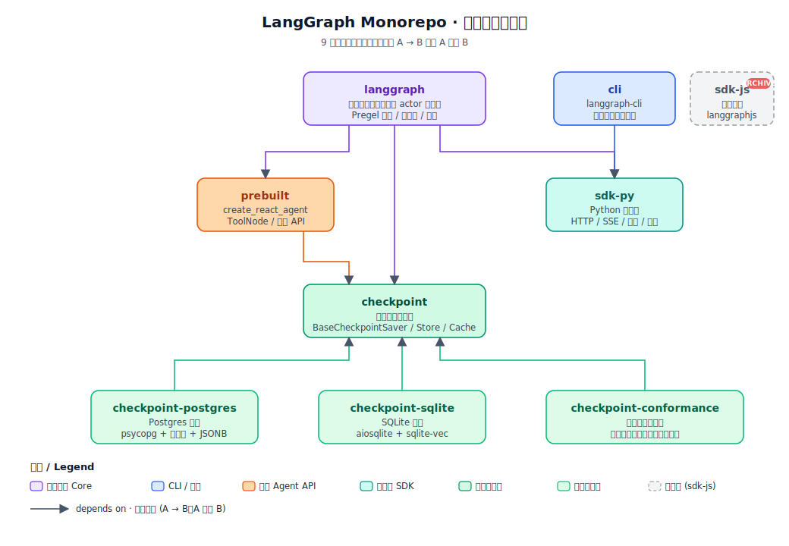

假设你要做一个"帮我订机票"的 agent，流程大致是：

1. 理解用户意图
2. 调用搜索工具查航班
3. 调用日历工具查时间冲突
4. 挑一个推荐给用户
5. 等用户确认
6. 调用订票 API 下单

第一次写，大概会写成这样：

```python
def book_flight(query):
    intent = llm_parse(query)
    flights = search_tool(intent)
    conflicts = calendar_tool(intent.date)
    suggestion = llm_pick(flights, conflicts)
    if ask_user(suggestion):
        return booking_api(suggestion)
```

看着没问题。但只要你真在生产里跑一跑，就会撞一堆墙：

- **中途断网了怎么办？** 整段重来？前面调的几次 LLM 都白花钱了。
- **用户过了半小时才回复**，你的进程早退出了。
- **"出错再试一次"从哪一步再来？** 你没记录状态，没法回滚。
- **想并发查三家航司** 同时跑，怎么改？
- **想调试一下**："为什么 LLM 当时选了这个航班"，能不能退回第 4 步换个 prompt 重跑？不能，状态没了。
- **想加一个"金额超 5000 走人工审批"的分支**，代码怎么改都别扭。

问题不在你代码写得糟，是 **工具选错了**。你把一个 **带状态的长流程** 写成了一段 **一次性的命令式代码**。

## 第一步：把 agent 看成一张图

把上面 6 步画出来：

```
parse ─► search ─┐
       └► cal   ─┴► pick ─► confirm ─► book
```

节点是步骤，边是流程，中间有一张"共享草稿纸"记录当前状态（航班列表、用户偏好、挑中的那个）。所有节点都能读写草稿纸。

这就是 `StateGraph` 的心智模型：

```python
graph = StateGraph(State)
graph.add_node("parse", parse_fn)
graph.add_node("search", search_fn)
graph.add_edge("search", "pick")
graph.add_conditional_edges("confirm", route_fn)
```

这样你得到三个好处：**结构可视化**（能画给同事看）、**状态集中**（不用到处传参）、**能插边**（加分支只是多连一条线）。

**但这远远不够**——很多 workflow 工具（Airflow、Prefect、Temporal）都能做到这些。LangGraph 真正特别的地方在下一步。

## 关键突破：借了 Pregel 的调度模型

Google 2010 年发过一篇论文叫 *Pregel*，解决的是"亿级顶点图怎么算 PageRank"之类的大规模图计算问题。它的核心思想朴素得出奇：

> **计算按"超步 (superstep)"推进。每一超步里，所有活跃的顶点并发执行一轮；执行完统一同步，再进入下一超步。**

翻译成白话：**每一轮，谁该动谁就动，都动完之后大家一起进入下一轮。**

LangGraph 发现，把"顶点"换成"agent 的节点"，这个模型 **一模一样合身**：

| Pregel | LangGraph |
|---|---|
| 顶点 | 节点 (node) |
| 顶点间发消息 | 节点往通道 (channel) 写值 |
| 超步 | 一次调度 step |
| 消息合并 | channel 的 reducer |
| 顶点停机 | 没节点有新写入 / 到达 `END` |

于是 LangGraph 的引擎每一步做的事情就是：

```
重复直到没人活跃：
  1. 看哪些节点有新输入（上一步有值写进它读的通道）
  2. 把这些节点并发跑一遍
  3. 汇总它们的写入到各 channel
  4. 把当前状态整体存一份 (checkpoint)
  5. 回到 1
```

这看起来简单到过分，但魔法就在 **第 4 步**。

## "免费"得到的五件事

一旦套上这个模型，之前写到头秃的那些能力，**自动** 就有了：

### 1. 长任务随时可中断、随时可恢复

每个 step 结束就 checkpoint 一次。你可以 **任意时刻关机**，明天开机从最近的 checkpoint 继续，状态、历史、进度分毫不差。代码只多一行：

```python
graph.compile(checkpointer=PostgresSaver(...))
```

之所以能这样，是因为 superstep 之间天然有一个"同步屏障"——所有节点都跑完了才进入下一步。这意味着每个屏障都是一个 **一致状态**，落盘安全。

### 2. Human-in-the-Loop（让人类掺和进来）

想在某一步停下等用户？一行 `interrupt()`：

```python
def confirm_node(state):
    user_input = interrupt("请确认这次订票")
    return {"confirmed": user_input}
```

graph 会在这里挂起，把状态存好。等用户回来（可能过了三天），把回答传进来，graph 就 **像没停过一样** 从这行继续。

你甚至可以在用户回复前关掉整台服务器，只要 checkpointer 还在，流程就还在。

### 3. 时间旅行（Time Travel）

所有 step 都存档了。想回到第 3 步换个参数重新试？可以：

```python
graph.update_state(config, {"suggestion": new_one}, as_node="pick")
graph.stream(None, config)  # 从 pick 之后重新跑
```

对调试 agent 这是救命的能力。你在第 5 步发现 LLM 选错工具，退回第 3 步改个 prompt 重跑——**不用从头来，不用编造中间状态**。

### 4. 并发是自带的

同一个 superstep 里多个节点天生并发。想同时查三家航司？把三个节点都连到 `search`，它们自动并行。配合 `Send` 原语还能动态派发任意数量的子任务（map-reduce 风格）。

### 5. 细粒度重试

每个节点单独配 `RetryPolicy`。某次 LLM 调用挂了？**只重试这一个节点**，其他已成功的节点和它们的写入都保留。因为 superstep 屏障的存在，重试不会读到半成品状态。

---

这五件事合起来，基本就是"agent 工程里最烦的所有问题"。LangGraph 不是一件件单独解决了它们，而是 **选了一个底层模型，它们就一起出现了**。这就是好的抽象的味道。

## 三层抽象，按需下沉

LangGraph 把复杂度切成了三层，大多数人永远只在最上面：

```
    prebuilt  (create_react_agent / ToolNode)    ← 90% 用户在这里
        │ 生成
        ▼
    StateGraph  (声明式节点 + 边)                 ← 需要自定义流程时下到这里
        │ 编译
        ▼
    Pregel  (调度引擎)                            ← 几乎没人需要碰
```

日常写 agent：

```python
agent = create_react_agent(llm, tools)
```

这一行底下的全部机制——channel、superstep、checkpoint、并发、重试——对你是黑盒。但 **一旦需要定制**（人工审批分支、多 agent 协作、RAG + agent 混合流程），你可以下沉到 `StateGraph`；真要改调度行为，还能再下沉到 `Pregel`。

这个 **渐进下沉** 的 API 设计，是 LangGraph 能在复杂场景也不崩的关键。

把三层抽象摊到整个 monorepo 上看，是这样一张图：



核心 `langgraph` 居中，`prebuilt` 是它的高阶 API 层，`checkpoint` 系列是它的持久化抽象与实现，`cli` / `sdk-py` 则是开发与调用这条链路的外围工具。箭头方向 A → B 表示"A 依赖 B"——读这张图的顺序和前面的三层抽象正好对应：从外圈往内圈下沉。

## 总结：LangGraph 的设计理念是什么

一句话：**"把 agent 当成分布式迭代计算来调度。"**

展开是这样一串判断：

1. **Agent 不是一段代码，是一个流程。** 有状态、有分支、有失败、有人工介入、可能挂好几天。
2. **这种流程最适合用图表达。** 节点=步骤，边=转移，状态=共享数据。
3. **但图只是数据结构，需要调度器把它跑起来。** 调度器要能并发、容错、挂起、回放。
4. **这种调度器 2010 年就有成熟方案了——Pregel。** 借过来、裁剪一下，正好合身。
5. **把引擎藏好，只给用户看高层 API。** 大多数人不需要知道 Pregel 是什么。

某种意义上，LangGraph 的设计理念一点都 **不时髦**——它没发明新东西，只是把 **2010 年的分布式图计算模型** 和 **2020 年代的 LLM agent** 对上了接口。正因为这套底子经过了十几年大规模工业验证，agent 开发里那些"看起来很难"的问题（持久化、并发、中断、回放），在 LangGraph 里才不是 **小心翼翼地 workaround**，而是 **天然就该那样**。

这就是它的核心美学：**用成熟的老方法，解决新问题。**
