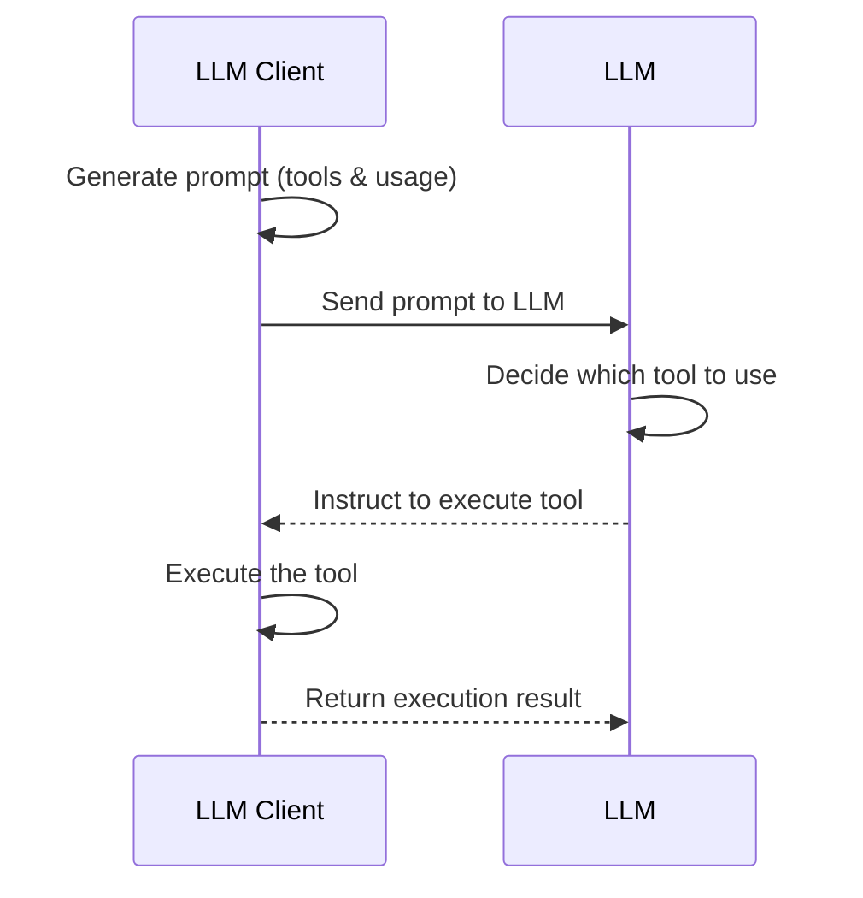
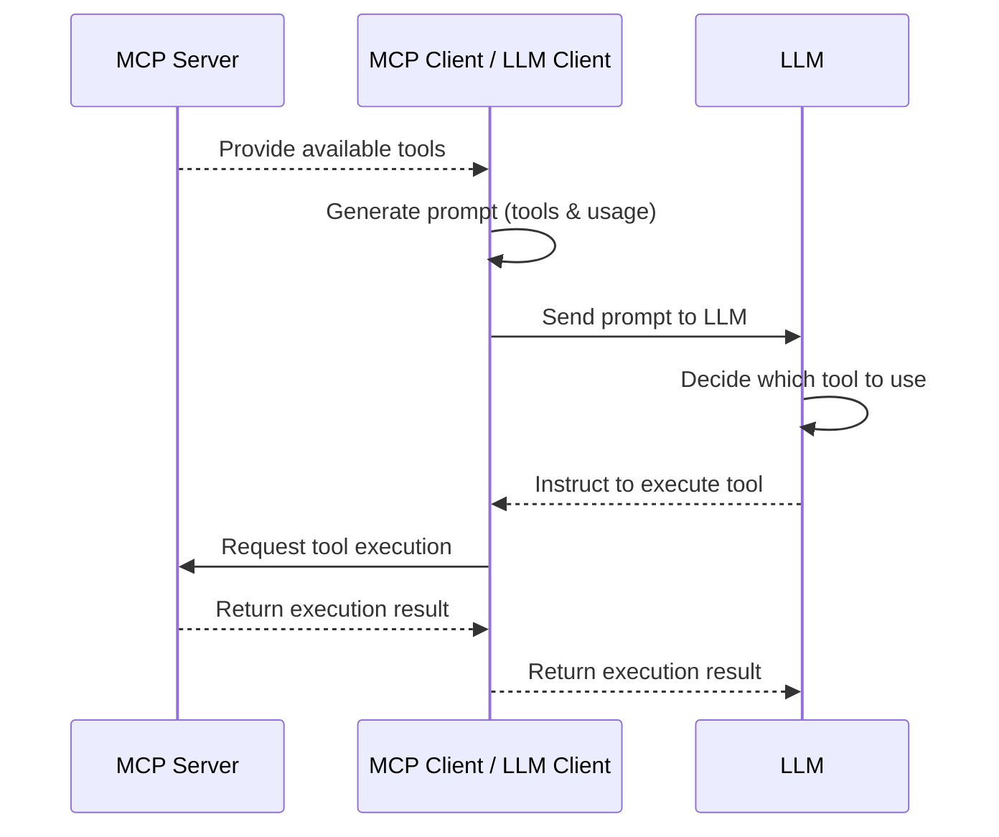

> 原文链接：https://oalieno.tw/posts/mcp
> 
> 发布时间：2025年4月6日（更新：2025年4月24日）
> 
> 分类：计算机 • 阅读时间：14分钟

## MCP 到底是什么

最近 MCP 超级火，都被吹到天上去了，有人说 MCP 是 AI 领域的「USB-C 标准」，甚至有人预测它将引领下一个 AI 应用时代的到来。不过，乍看之下，MCP 不就跟原本的 function calling 干的是同一件事吗？

其实不然，MCP 不是想取代 function calling，MCP 实际上是把 Tool Execution 的部分从原本 function calling 的流程中抽离出来，并统一了接口。另外，不只是 Tool，MCP 总共提出了三个核心概念：Tool、Resource、Prompt，目的是把 AI Agent 常见的操作逻辑抽象成一套标准化的接口。

### Tool

其中大家最关心的核心功能就是 Tool，Tool 是为了 function calling 所设计的通信协议。它的重点在于，把原本写在每个 LLM Client 里的「怎么调用工具」这段逻辑，抽离成一个独立的通信协议。这样开发者只需要专注在工具本身的实现，不需要再管怎么塞给每个模型怎么用。

为了更清楚理解这件事，我们来看看原本的 function calling 过程：



而 MCP 的出现，最大的变化就是把 **执行工具的阶段** 抽离出来，改由 MCP Server 来执行，如下图：



### Resource

再来讲 Resource。每个 Resource 都有一个唯一的 URI，MCP Client 可以通过这些 URI 访问对应的资源内容。重点来了，Resource 的使用方式是由 MCP Client 决定的，MCP Server 只是提供资源清单和数据本体，怎么用、什么时候用，完全交给 Client 自己发挥。举例来说，像 Cursor 这类工具就得自己决定要怎么把 Resource 的内容喂给 LLM 当作 context，或是通过 UI 显示给用户看，让用户选，都可以。等于是让 MCP Client 自由发挥，这也难怪目前支持 Resource 的 MCP Client 还不多 😅

### Prompt

最后是 Prompt。Prompt 并不是像 Tool 一样「让模型主动调用」的东西，它比较像是 Prompt Template，由 MCP Client 在 UI 上显示给用户，让用户决定什么时候套用。你可以把它想象成是一些常用的提示语句封装，例如「问答模板」、「摘要格式」、「重写句子」这种固定用途的提示，方便重复使用。

### MCP 设计逻辑

可以看出 MCP 的设计逻辑其实很清楚：

- Tool 是给 **模型** 决定什么时候用的
- Resource 是给 **应用（MCP Client）** 决定怎么使用的
- Prompt 则是让 **用户** 自己挑要不要用、什么时候用

三种能力刚好对应三个角色 —— 模型、应用、用户 —— 各自有不同的控制权限与灵活度。

如果还不清楚的话，建议直接参阅 [官方的 spec](https://modelcontextprotocol.io/specification/)，比各种介绍文写的清楚、直接，问就是 RTFM！

### 2025-03-26 MCP 新标准

我才写好文章，MCP 就出了新版标准，主要改动 4 个部分：

- 加入 OAuth 2.1 验证机制
- 把 SSE 换成 Streamable HTTP（Server 可以选择要不要使用 SSE，SSE 用完就关，不需要保持一个一直在线的 SSE，灵活性更高）
- 支持 JSON-RPC Batch
- 新增 Tool Annotations，能更好的描述 Tool

更多请参考 [https://modelcontextprotocol.io/specification/2025-03-26/changelog](https://modelcontextprotocol.io/specification/2025-03-26/changelog)

## MCP Server 模式

初步理解 MCP 到底是在做什么之后，我们来看 MCP 通信协议的部分。
目前 MCP 协议支持 `STDIO` 和 `SSE` 两种传输模式。

### STDIO

在 STDIO 模式下，当 LLM 决定要使用某个工具时，LLM Client 会直接执行对应的 MCP Server，将输入数据喂进该 Process 的 STDIN，然后从 STDOUT 读取结果并回传给模型。虽然名称叫 MCP Server，但在 STDIO 模式下它其实就是个本地 CLI 程序，可以参考下面这个简化的 Process Tree：

```
Process Tree:
-----
claude desktop (MCP Client)
    └─ npx main.js (MCP Server)
```

MCP Client 的配置文件会指定一个 "command"，想跑什么就跑什么，可以包成一个 shell script，甚至可以用 docker 跑。不过一般 python 是用 `uvx` 跑，而 node.js 则是用 `npx` 跑，这我们待会再来讲讲。
比如 [mcp-server-git](https://github.com/modelcontextprotocol/servers/tree/main/src/git) 的配置文件就长这样：

```json
{
  "mcpServers": {
    "git": {
      "command": "uv",
      "args": [
        "--directory",
        "/<path to mcp-servers>/mcp-servers/src/git",
        "run",
        "mcp-server-git"
      ]
    }
  }
}
```

### SSE

另一种模式是 SSE，当 LLM 决定要使用某个工具时，MCP Client 会发送 HTTP 请求连接到 MCP Server，这时的 Server 通常是常驻在远端、开了一个 port 的 HTTP 服务，也就是我们传统认知的 "Server"。

> **SSE 连不上请看这里**
> 
> 填写配置文件的时候，记得不只要填 domain，url 后面要加上 `/sse`
> 用官方的 python-sdk 开发，预设是开在 `/sse` 路径

```json
{
  "mcpServers": {
    "git": {
      "url": "http://192.168.1.200:8000/sse"
    }
  }
}
```

另外这边补充一下：SSE（Server-Sent Events）并不是 MCP 发明的新概念，它是 Web 世界中既有的标准，用来实现一种「单向的、持续的数据推送」机制。Server 可以通过一条长连线，主动推送消息给 Client，而 Client 不需要一直 Long Polling。SSE 和 WebSocket 不同，它是单向的（只有 Server → Client），也不像 Long Polling 需要频繁建立连线。对于 MCP 这种「工具执行完之后，要把结果推回去」的场景来说，使用 SSE 可谓恰到好处。

在 MCP 的实现里，Client 会先对 `/sse` 发出一个连线请求，建立一个长时间不中断的 stream。之后 MCP Server 执行工具时，不会立刻把结果塞进 HTTP 回应，而是走这个 SSE stream 将数据慢慢传回去。

比如当你调用一个 `List Tool` 的操作时，可能会先收到一个 HTTP Response 显示 `"status": "Accepted"`（打开 F12 的你这时候可能满头问号，啊我的结果呢？），但实际的执行结果则是通过最一开始就建立的 `/sse` stream 陆续推回来的。

> **常见坑**
> 
> 这边要特别注意的是：如果 MCP Server 中途重启了，而 MCP Client 没有重新建立 `/sse` stream，这时候当 Client 再送请求给 Server，就会发生错误。记得去 MCP Client 点一下重整之类的就好了。

```
mcp-test | ERROR: Exception in ASGI application
mcp-test | + Exception Group Traceback (most recent call last):
mcp-test | | File "/root/.venv/lib/python3.11/site-packages/mcp/server/sse.py", line 131, in connect_sse
mcp-test | | yield (read_stream, write_stream)
...
mcp-test | | RuntimeError: Received request before initialization was complete
```

## MCP Server 开发语言与执行方式

目前开发 MCP Server 最主流的语言是 **Python** 和 **TypeScript (Node.js)**。官方的 SDK 也已经支持多种语言，像是 C#、Java、Kotlin 等，未来生态可能会越来越广。

### Python

官方提供的 Python SDK 为 [modelcontextprotocol/python-sdk](https://github.com/modelcontextprotocol/python-sdk)，使用方式相当直观，基本上照着范例就可以跑起来。SDK 预设是使用 STDIO 模式，想改用 SSE 模式，需要在启动时加上 `mcp.run(transport="sse")` 的参数来启用。

另一个大家常用的套件是 [FastMCP](https://github.com/jlowin/fastmcp)，他其实已经 merge 进去官方的 python-sdk，也就是官方的 python-sdk 用的就是 FastMCP v1。但最近 FastMCP 又推出 v2，感觉要搞事了，可以持续观察。

在不到一年前 [astral-sh/uv](https://github.com/astral-sh/uv) 横空出世，迅速在 Python 开发圈掀起一波浪潮，现在新的项目，比如 MCP Server 们都是使用 `uv` 作为套件与项目管理器。`uv` 本身是 Rust 开发的，所以标榜速度超快（现在什么都要用 Rust 重写就对了）。以前要用 `pyenv`, `poetry`, `pipenv` 等一堆工具才能做到的事，现在装一个 `uv` 就全搞定了，超方便，用过都说赞，我也跳槽啦 xD

对 MCP 开发者来说，`uv` 的其中一个特别实用的工具就是 `uvx`，它的定位等同于隔壁 js 阵营的 `npx`，可以直接执行一个外部套件，免安装、免额外环境设定，非常适合用来启动 MCP Server。比如以下就是一个使用 `uvx` 启动 `mcp-server-git` 的范例配置：

```json
{
  "mcpServers": {
    "git": {
      "command": "uvx",
      "args": ["mcp-server-git", "--repository", "path/to/git/repo"]
    }
  }
}
```

这里示范一个简单的范例，将以下程序代码储存为 `server.py`，然后执行 `uv run server.py`，预设就会听在 8000 port，要在 MCP Client 上连线时填上 `http://your-ip:8000/sse`。

```python
from mcp.server.fastmcp import FastMCP

# Create an MCP server
mcp = FastMCP("Demo")


# Add an addition tool
@mcp.tool()
def add(a: int, b: int) -> int:
    """Add two numbers"""
    return a + b

if __name__ == "__main__":
    mcp.run(transport="sse")
```

我们可以通过 [MCP Inspector](https://github.com/modelcontextprotocol/inspector) 去戳 List Tool，接着右键检查封包，就可以看到 MCP 回传的 json 信息。其实，MCP Server 本质上就是一个 REST API，跟 LLM 是完全解耦、独立运作的。最后，是 Cursor 这类的 MCP Client 要负责把这些拿回来的 JSON 信息组装成 prompt 喂给 LLM。

```json
{
  "jsonrpc": "2.0",
  "id": 1,
  "result": {
    "tools": [
      {
        "name": "add",
        "description": "Add two numbers",
        "inputSchema": {
          "properties": {
            "a": { "title": "A", "type": "integer" },
            "b": { "title": "B", "type": "integer" }
          },
          "required": ["a", "b"],
          "title": "addArguments",
          "type": "object"
        }
      }
    ]
  }
}
```

### TypeScript

另一个常见的选择是 TypeScript，官方 SDK 为 [modelcontextprotocol/typescript-sdk](https://github.com/modelcontextprotocol/typescript-sdk)。开发方式与 Python 相似，不过这边我自己是用 Python 开发的，TypeScript SDK 我就没实际用过。

Node.js 的套件管理还是照旧使用 `npm`, `pnpm` 或 `yarn`，而 Server 的启动方式则通常使用 `npx` 指令，这样可以不需要预先安装套件，直接执行远端的 MCP Server。例如下面这段配置，就是用 `npx` 启动 `server-puppeteer` 的范例配置：

```json
{
  "mcpServers": {
    "puppeteer": {
      "command": "npx",
      "args": ["-y", "@modelcontextprotocol/server-puppeteer"]
    }
  }
}
```

## MCP Server Debug

官方提供了一套非常实用的测试工具 [modelcontextprotocol/inspector](https://github.com/modelcontextprotocol/inspector)。这个工具可以让你直接与 MCP Server 互动，手动发送请求、查看回应，方便快速 debug。这是纯戳 MCP Server 拿到结果，没有任何 LLM 的部分。

## MCP Server 列表

### 官方提供的

- [modelcontextprotocol/servers](https://github.com/modelcontextprotocol/servers)

### 第三方列表

这些第三方网站要格外注意啊，这个没有经过验证的，小心载到有毒的，尤其是 smithery 和 mcp-get 多帮你包一层，你都不知道你跑了什么。最好是有 github 原始码可以看的，自己装。

- [punkpeye/awesome-mcp-servers](https://github.com/punkpeye/awesome-mcp-servers)
- [mcp.so](https://mcp.so/)
- [smithery](https://smithery.ai/)
  - 他自己多包了一层 `@smithery/cli` 帮你安装的脚本工具
- [mcp-get](https://mcp-get.com)
  - 他自己多包了一层 `@michaellatman/mcp-get` 帮你安装的脚本工具

## MCP Client 有哪些

可以参见这个表：[Example Clients - Model Context Protocol](https://modelcontextprotocol.io/clients)

目前支持 SSE 的 MCP Client 还不多。像 Cursor 是有支持的，但 Claude Desktop 本身还不支持 SSE，只能用 STDIO 模式，也就是要把工具装在本地执行。

至于 Resource 和 Prompt 的功能，各家 Client 的支持状况也不太一致，不一定都有实现。但 Tool 几乎是大家都有支持的，只要有 Tool，其实就够用了。

---

**标签：** #mcp #mcp-server #ai #llm #sse

**原文作者：** oalieno  
**翻译时间：** 2025年7月10日
