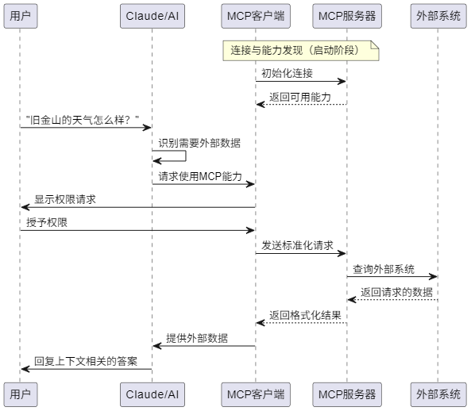

# 模型上下文协议(MCP)是什么及其工作原理

> 原文：[What Is the Model Context Protocol (MCP) and How It Works](https://www.descope.com/learn/post/mcp)  
> 翻译日期：2024年

## 引言

像Claude、ChatGPT、Gemini和LlaMA这样的大型语言模型(LLMs)已经彻底改变了我们与信息和技术的交互方式。它们能够优雅地写作、进行深入研究，并解决日益复杂的问题。但是，虽然典型的模型擅长响应自然语言，它们却受到与现实世界数据和系统隔离的限制。

**模型上下文协议(Model Context Protocol, MCP)** 通过提供一种标准化的方式解决了这一挑战，使LLMs能够连接外部数据源和工具——本质上是AI应用的"通用遥控器"。作为由Anthropic发布的开源协议，MCP在现有函数调用的基础上消除了LLMs与其他应用之间的自定义集成需求。这意味着开发者可以构建更强大、更具上下文感知的应用，而无需为每种AI模型和外部系统的组合重新发明轮子。

本指南解释了模型上下文协议的架构和功能，它如何解决AI集成的固有挑战，以及如何开始使用它来构建超越孤立聊天界面的更好的AI应用。

## LLM隔离与NxM问题

众所周知，LLMs非常强大，但它们通常与现实世界系统和当前数据隔离运行。这造成了两个不同但相关的挑战：一个针对终端用户，另一个针对开发者和企业。

对于普通用户，这种隔离意味着需要不断地"复制粘贴"才能获得关于最新数据的相关响应。这需要手动从各种来源收集信息，将其输入到LLM的聊天界面，然后在其他地方提取或应用AI的输出。虽然一些模型提供[AI驱动的网络搜索](https://www.descope.com/customers/you-com)，而Anthropic的Sonnet 3.X模型[拥有计算机使用功能](https://docs.anthropic.com/en/docs/agents-and-tools/computer-use)，但它们仍然缺乏与知识库和工具的直接集成。

对于开发者和企业来说，挑战更为复杂："NxM问题"，其中_N_代表LLMs，_M_代表工具。在_N_方面，有许多AI系统，在_M_方面，有无数系统。每个LLM提供商都有自己的协议来连接外部工具，使潜在的集成点基本上是无限的。

通过分解NxM问题，我们可以看到它导致：

* **重复的开发工作：** 开发团队将为每个新的AI模型或数据源重复解决相同的集成问题。例如，将ChatGPT与你的知识库连接需要从头开始使用自定义代码。但随着每增加一个AI系统或工具，你的开发人员必须每次都从头开始做_所有事情_——_N_乘以_M_。

* **过度维护：** 工具、模型和API必然会发展，而企业希望保持在前沿。缺乏标准化意味着集成可能因为工具或模型更新或旧版本被弃用而停止工作。

* **实现碎片化：** 不同的集成可能以完全意想不到的方式处理类似的功能，产生不可预测或不理想的结果。这种碎片化可能导致终端用户困惑或沮丧，因为不同的开发者和公司实现了不一致的集成。

然而，重要的是要理解MCP并不是通过简单地替换之前的集成方法来解决NxM问题。它通过构建在函数调用（从LLMs调用API的主要方法）之上，将AI应用连接到上下文，使开发更简单、更一致。

### 函数调用与模型上下文协议的关系

函数调用允许LLMs根据用户请求调用预定义的函数，是现代AI模型的一个成熟特性。有时被称为"工具使用"，函数调用与MCP并不互斥；新协议只是标准化了这个API功能的工作方式。

没有MCP时，当你直接使用LLM API进行函数调用时，你需要：

1. 定义特定模型的函数模式，这是函数、可接受参数及其返回内容的JSON描述。
2. 为这些函数实现处理程序（函数被调用时执行的实际代码）。
3. 为你支持的每个模型创建不同的实现。

MCP通过以下方式标准化这一过程：

1. 定义一种在任何AI系统中指定工具（函数）的一致方式。
2. 提供用于发现可用工具并执行它们的协议。
3. 创建一种通用的即插即用格式，任何AI应用都可以使用任何工具，无需自定义集成代码。

你可能熟悉使用函数调用的AI应用，如使用[GPT Actions](https://platform.openai.com/docs/actions/introduction)的Custom GPTs。Custom GPT可以确定哪个API调用解决用户的提示，创建必要的JSON，然后使用它进行API调用。虽然这允许一些专门构建的工具，但它受限于OpenAI的生态系统。MCP将类似的功能带给任何实现该协议的AI应用，无论底层模型供应商是谁。

## MCP架构和核心组件

模型上下文协议使用客户端-服务器架构，[部分受到语言服务器协议(LSP)的启发](https://spec.modelcontextprotocol.io/specification/2024-11-05/)，后者帮助不同的编程语言与各种开发工具连接。同样，MCP的目标是通过标准化上下文，为AI应用与外部系统交互提供一种通用方式。

图：MCP一般架构

### 核心组件

MCP架构由四个主要元素组成：

图：MCP核心组件

1. **宿主应用：** 与用户交互并发起连接的LLMs。这包括Claude Desktop、增强AI的IDE如Cursor，以及标准的基于网络的LLM聊天界面。

2. **MCP客户端：** 集成在宿主应用中，处理与MCP服务器的连接，在宿主的需求和模型上下文协议之间进行转换。客户端内置于宿主应用中，如Claude Desktop内的MCP客户端。

3. **MCP服务器：** 添加上下文和功能，通过MCP向AI应用公开特定功能。每个独立服务器通常专注于特定的集成点，如用于存储库访问的GitHub或用于数据库操作的PostgreSQL。

4. **传输层：** 客户端和服务器之间的通信机制。MCP支持两种主要传输方法：
   * **STDIO（标准输入/输出）：** 主要是本地集成，服务器在与客户端相同的环境中运行。
   * **HTTP+SSE（服务器发送事件）：** 远程连接，HTTP用于客户端请求，SSE用于服务器响应和流式传输。

MCP中的所有通信都使用[JSON-RPC 2.0](https://www.jsonrpc.org/specification)作为底层消息标准，为请求、响应和通知提供标准化结构。

## MCP如何工作

当用户与支持MCP的宿主应用（AI应用）交互时，后台会发生几个过程，使AI与外部系统之间的通信快速无缝。让我们仔细看看当用户要求Claude Desktop执行一个调用聊天窗口外工具的任务时会发生什么。

### 协议握手

1. **初始连接：** 当MCP客户端（如Claude Desktop）启动时，它连接到你设备上配置的MCP服务器。
2. **能力发现：** 客户端询问每个服务器"你提供什么能力？"每个服务器回应其可用的工具、资源和提示。
3. **注册：** 客户端注册这些能力，使它们在你的对话中可供AI使用。

图：MCP工作流程图，展示Claude如何使用MCP与外部工具交互。

### 从用户请求到外部数据

假设你问Claude："今天旧金山的天气如何？"以下是发生的情况：

1. **需求识别：** Claude分析你的问题，并认识到它需要外部、实时的信息，这些信息不在其训练数据中。
2. **工具或资源选择：** Claude确定它需要使用MCP能力来满足你的请求。
3. **权限请求：** 客户端显示权限提示，询问你是否允许访问外部工具或资源。
4. **信息交换：** 一旦获得批准，客户端使用标准化协议格式向适当的MCP服务器发送请求。
5. **外部处理：** MCP服务器处理请求，执行所需的操作——查询天气服务、读取文件或访问数据库。
6. **结果返回：** 服务器以标准化格式将请求的信息返回给客户端。
7. **上下文集成：** Claude接收这些信息并将其纳入对话理解中。
8. **响应生成：** Claude生成包含外部信息的响应，基于当前数据为你提供答案。

理想情况下，整个过程在几秒钟内完成，创造一种不引人注目的体验，Claude似乎"知道"它不可能从训练数据中获得的信息。

## MCP客户端和服务器生态系统

自2024年底推出以来，MCP已在众多平台上获得快速采用，创建了多样化的客户端和服务器生态系统，弥合了LLMs与外部工具之间的差距。

### MCP客户端示例

MCP客户端多种多样，从桌面应用到开发环境。[Claude Desktop](https://claude.ai/download)作为Anthropic的第一方产品，提供对MCP所有功能的全面支持。

几个代码编辑器和IDE已采用该协议支持，包括[Zed](https://zed.dev/blog/mcp)（将提示作为斜杠命令呈现）、[Cursor](https://docs.cursor.com/context/model-context-protocol)（在其Composer环境中使用MCP工具）、[Continue](https://blog.continue.dev/model-context-protocol/)（JetBrains和Visual Studio Code的开源AI代码助手）和[Sourcegraph Cody](https://sourcegraph.com/blog/cody-supports-anthropic-model-context-protocol)（通过OpenCtx实现MCP）。

框架支持已扩展到包括[Firebase Genkit](https://github.com/firebase/genkit/tree/main/js/plugins/mcp)、[LangChain](https://github.com/langchain-ai/langchain-mcp-adapters)适配器和[Superinterface](https://superinterface.ai/blog/mcp)等平台，后者帮助开发者构建具有MCP功能的应用内AI助手。

### MCP服务器示例

MCP生态系统包括多种服务器，包括参考服务器（由协议维护者创建作为实现示例）、官方集成（由公司为其平台维护）和社区服务器（由独立贡献者开发）。

#### 参考服务器

参考服务器展示核心MCP功能，并作为开发者构建自己实现的示例。这些由MCP项目贡献者维护的服务器包括基本集成，如：

* [**PostgreSQL**](https://github.com/modelcontextprotocol/servers/blob/main/src/postgres)：允许与PostgreSQL数据库交互，在连接的系统上执行只读SQL查询。所有命令都以只读限制部署的事实展示了如何将MCP工具保持在特定参数内。

* [**Slack**](https://github.com/modelcontextprotocol/servers/blob/main/src/slack)：使AI应用能够在Slack工作区中读写消息、添加反应、检索频道历史等。虽然简单明了，但这强调了MCP从各种来源（包括流行的消息应用）检索信息的潜力。

* [**GitHub**](https://github.com/github/github-mcp-server)：支持各种操作，包括自动化流程（如推送代码）、提取或分析数据，甚至构建基于AI的应用。虽然[发布版本](https://github.com/modelcontextprotocol/servers/tree/main/src/github)有限，但当前的GitHub MCP服务器作为AI助手如何与外部API交互的基准。

#### 官方MCP集成

这些服务器由拥有工具的公司官方支持。这些集成是可立即使用的生产就绪连接器。

* [**Stripe**](https://github.com/stripe/agent-toolkit)：此集成可以处理生成发票、创建客户或通过自然语言请求管理退款等用例。这里的主要吸引力是将支付问题委托给面向客户的聊天机器人的潜力。

* [**JetBrains**](https://github.com/JetBrains/mcp-jetbrains)：让开发者直接在JetBrains IDE中利用AI辅助。此集成通过自然语言提供代码探索（即读取文件）、断点设置和终端命令执行。

* [**Apify**](https://github.com/apify/actors-mcp-server)：通过使用4,000多个Apify Actors，实现各种功能，包括RAG（检索增强生成）网络浏览器、跨多平台的数据抓取和内容爬取。

#### 社区MCP服务器

社区驱动的生态系统展示了标准化如何加速采用和创新。以下服务器由爱好者而非企业维护，这意味着它们趋向于更多样化的需求范围。

* [**Discord**](https://github.com/v-3/discordmcp)：专注于游戏的消息应用Discord与Slack有许多相似之处，MCP服务器集成也不例外。这允许用户发送和阅读消息，自动服务器和频道发现使导航更容易。

* [**Docker**](https://github.com/ckreiling/mcp-server-docker)：使用自然语言与Docker交互来管理容器、卷和卷。面向服务器管理员和修补者，这将Docker本地和远程引擎管理抽象为更友好的界面。

* [**HubSpot**](https://github.com/buryhuang/mcp-hubspot)：与无处不在的CRM HubSpot的集成允许用户列出和创建联系人、获取最近的互动以及管理公司。虽然简单，但这个服务器提供了一种简单的方式来检索信息，以便与其他工具一起使用。

## MCP服务器的安全考虑

MCP使用HTTP+SSE传输服务器的[OAuth](https://www.descope.com/learn/post/oauth)实现与标准OAuth流程具有相同的风险。开发者应警惕开放重定向漏洞，[正确保护令牌](https://www.descope.com/blog/post/refresh-token-rotation)，并为所有授权码流程实现PKCE。

[当前MCP授权规范](https://www.descope.com/blog/post/mcp-auth-spec)包含OAuth 2.1的一个子集。这意味着核心关注点保持不变，熟悉[常见OAuth错误配置](https://www.descope.com/blog/post/5-oauth-misconfigurations)可以帮助开发者避免安全漏洞。

[以人为本的设计](./以人为本的设计：交互式AI系统.md)是保护MCP服务器用户的关键元素。客户端必须在访问工具或资源之前请求用户的明确许可，这对自动化漏洞利用设置了重要检查点。然而，这种保护取决于清晰的权限提示，帮助用户做出明智的决定——以及对所提议范围的透明理解。

这一责任主要落在服务器开发者身上，他们应严格遵循最小权限原则。理想情况下，MCP服务器将只请求其功能所必需的最小访问权限。这确保服务器不会意外暴露敏感数据，同时增强对利用不安全连接的供应链攻击的抵抗力。你可以在我们的[OAuth范围和提供者令牌指南](https://docs.descope.com/auth-methods/oauth/customize/custom-scopes)中了解更多关于自定义范围的信息。

## 结论

模型上下文协议代表了将LLMs连接到外部系统的重大飞跃，标准化了一个碎片化的生态系统，并可能解决NxM问题。通过普遍化AI应用与工具和数据源的对话方式，MCP减少了开发开销，并实现了一个更具互操作性的生态系统，创新惠及整个社区，而不是保持孤立。

随着MCP继续作为标准发展，几个新发展已出现在地平线上：

* **官方MCP注册表：** 正在计划一个由维护者认可的MCP服务器注册表，这将简化可用工具的发现和集成。这个集中存储库将使任何人（不仅仅是那些愿意搜索GitHub的人）更容易找到符合其需求的服务器。

* **采样能力：** 虽然许多客户端尚未完全支持，但采样功能将使服务器能够通过客户端从LLMs请求完成。这本质上允许复杂的AI到AI协作，同时保持彻底的人类监督。

* **授权规范改进：** 当前的MCP授权规范相对较新，对安全服务器实现留下了挥之不去的问题。随着协议的广泛采用，我们可以期待授权组件与之一起成熟和发展。

虽然这些即将到来的添加将进一步巩固MCP在使AI开发更快更容易方面的作用，但该协议已经对LLM生态系统产生了巨大影响。提供集成的通用格式不仅仅是加速我们已有的流程。它创造了一个空间，大型企业和个人贡献者都可以构建同样可行、越来越有价值的选项，使每个人的生活更美好。

随着采用继续增长，我们可能会看到AI助手不仅对特定上下文更了解，而且在管理和导航我们周围复杂的数字世界方面真正更有帮助。

要了解更多来自身份验证、访问控制和AI世界的开发者更新，请订阅我们的博客或[在LinkedIn上关注我们](https://www.linkedin.com/company/descope/)。
