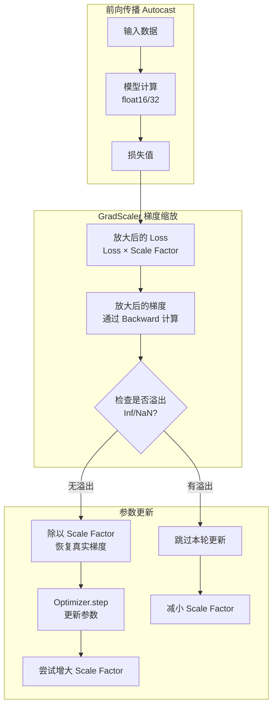

深入解析 GradScaler：自动混合精度的梯度缩放器

> **摘要**：在混合精度训练（AMP）中，`float16` 的数值范围有限，容易导致梯度下溢（Underflow）。`torch.cuda.amp.GradScaler`（现更新为 `torch.amp.GradScaler`）是 PyTorch 提供的核心工具，通过动态缩放损失值来解决这一问题，确保模型在加速训练的同时不损失精度。

## 1. 核心问题：梯度下溢 (Gradient Underflow)

`float16`（半精度浮点数）的最小正规数约为 $6 \times 10^{-8}$。在深度神经网络的反向传播中，许多梯度的数值非常小（例如 $10^{-10}$ 甚至更小）。

*   **问题**：如果直接使用 `float16` 存储这些微小的梯度，它们会因为精度不足变成 0。
*   **后果**：参数无法更新，模型无法收敛。

## 2. 解决方案：动态损失缩放 (Dynamic Loss Scaling)

`GradScaler` 的工作原理非常巧妙且直观：

1.  **放大 (Scale)**：在反向传播（Backward）之前，将 Loss 乘以一个巨大的因子（Scale Factor，例如 65536）。
    *   $$ \text{Scaled Loss} = \text{Loss} \times \text{Scale Factor} $$
    *   根据链式法则，计算出的梯度也会自动放大相同的倍数，从而“逃离”下溢区。
2.  **缩小 (Unscale)**：在参数更新（Optimizer Step）之前，将梯度除以同一个因子，恢复到真实的数值大小。
    *   $$ \text{Real Grad} = \text{Scaled Grad} / \text{Scale Factor} $$
3.  **动态调整**：
    *   如果本轮迭代**没有**出现 `Inf` 或 `NaN`（溢出），说明缩放因子是安全的，甚至可以尝试增大一点。
    *   如果本轮迭代**出现**了 `Inf` 或 `NaN`，说明缩放因子太大了，导致梯度溢出。此时应**跳过**参数更新，并将缩放因子减小（Backoff）。

### 2.1 流程图解



## 3. 核心 API 与参数

```python
torch.amp.GradScaler(
    device='cuda', 
    init_scale=65536.0, 
    growth_factor=2.0, 
    backoff_factor=0.5, 
    growth_interval=2000, 
    enabled=True
)
```

| 参数 | 默认值 | 含义 |
| :--- | :--- | :--- |
| `init_scale` | 65536.0 | 初始缩放因子 ($2^{16}$)。 |
| `growth_factor` | 2.0 | 当连续 N 次迭代未溢出时，缩放因子的倍增系数。 |
| `backoff_factor` | 0.5 | 当检测到溢出时，缩放因子的缩减系数。 |
| `growth_interval` | 2000 | 连续多少次未溢出后尝试增大缩放因子。 |

## 4. 工程实践：标准代码范式

### 4.1 基本用法

```python
import torch
from torch.amp import autocast, GradScaler

model = MyModel().cuda()
optimizer = torch.optim.SGD(model.parameters(), lr=0.01)
scaler = GradScaler('cuda') # 1. 初始化 Scaler

for epoch in range(epochs):
    for input, target in data_loader:
        optimizer.zero_grad()

        # 2. 前向传播：开启 Autocast
        with autocast(device_type='cuda', dtype=torch.float16):
            output = model(input)
            loss = loss_fn(output, target)

        # 3. 反向传播：Scale Loss
        scaler.scale(loss).backward()

        # 4. 参数更新：Step Optimizer
        # 内部逻辑：先 Unscale 梯度，如果无 Inf/NaN 则执行 optimizer.step()，否则跳过
        scaler.step(optimizer)

        # 5. 更新缩放因子
        scaler.update()
```

### 4.2 梯度裁剪 (Gradient Clipping)

梯度裁剪必须在 `unscale_` 之后、`step` 之前进行，否则裁剪阈值会与缩放因子混淆。

```python
# ... backward ...
scaler.scale(loss).backward()

# 必须显式 Unscale
scaler.unscale_(optimizer)

# 现在梯度是真实大小，可以安全裁剪
torch.nn.utils.clip_grad_norm_(model.parameters(), max_norm=1.0)

# Step 时 Scaler 会知道已经 unscale 过了，不会重复操作
scaler.step(optimizer)
scaler.update()
```

### 4.3 多优化器 / 梯度累积

*   **多优化器**：每个 Optimizer 都需要调用一次 `scaler.step(opt)`，但 `scaler.update()` 在一轮迭代中只能调用一次。
*   **梯度累积**：`scaler.step` 和 `scaler.update` 应该只在累积步数达到（即真正更新参数）时调用。

## 5. 常见问题 (FAQ)

### Q1: 为什么我的 Loss 变成了 NaN？
如果是训练初期出现，可能是 `init_scale` 太大，Scaler 会自动减小它，通常几轮后会恢复正常。如果一直 NaN，需检查数据或模型结构。

### Q2: 必须配合 `autocast` 使用吗？
是的。`GradScaler` 是为了解决 `float16` 梯度下溢问题的。如果全用 `float32` 训练，不需要 Scaler。

### Q3: `torch.cuda.amp` 和 `torch.amp` 有什么区别？
从 PyTorch 1.10 开始，推荐使用 `torch.amp`（设备无关的新 API），`torch.cuda.amp` 是旧版 API，目前为了兼容性仍保留，但建议迁移。

## 6. 参考资料

1.  [PyTorch Docs - Automatic Mixed Precision](https://pytorch.org/docs/stable/amp.html)
2.  [PyTorch Tutorial - AMP Recipe](https://pytorch.org/tutorials/recipes/recipes/amp_recipe.html)
3.  [WandB - How to Use GradScaler](https://wandb.ai/wandb_fc/tips/reports/How-to-Use-GradScaler-in-PyTorch--VmlldzoyMTY5MDA5)
