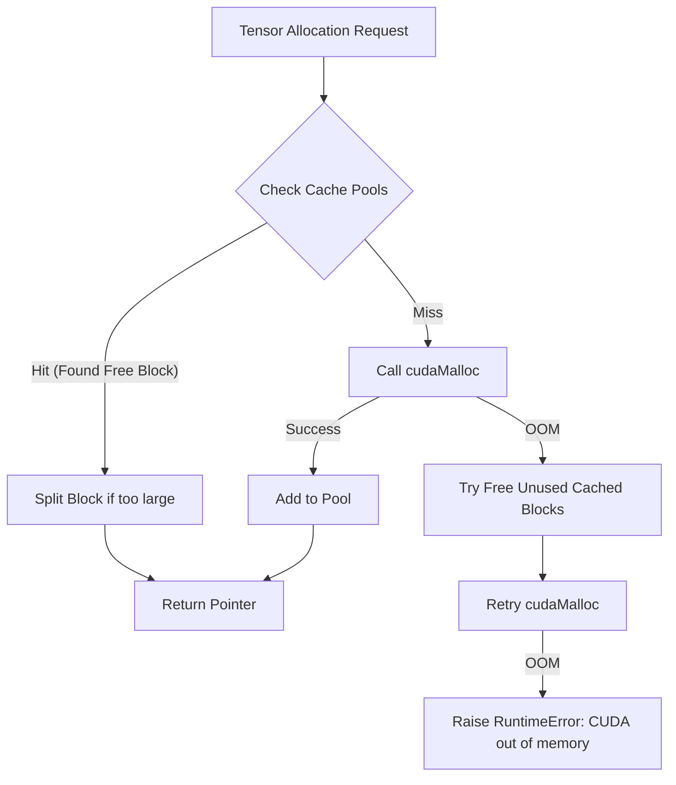

`torch.cuda` 是 PyTorch 与 NVIDIA GPU 进行交互的核心接口包。它不仅封装了 CUDA Runtime API，还实现了一套复杂的**内存管理机制 (Caching Allocator)** 和**异步执行模型 (Asynchronous Execution)**，以最大化深度学习任务的吞吐量並降低 CPU 开销。

理解 `torch.cuda` 的底层原理对于解决 Out Of Memory (OOM) 错误、优化模型训练速度以及进行高性能算子开发至关重要。

## 2. 内存管理机制 (Memory Management)

PyTorch 并不直接对每一次 Tensor 分配都调用 CUDA 原生的 `cudaMalloc` 和 `cudaFree`，因为这些系统调用（System Calls）会导致设备同步（Device Synchronization），从而显著阻塞 CPU 线程，破坏流水线并行。

### 2.1 Caching Allocator 架构

PyTorch 实现了一个 **Caching Allocator**（缓存分配器），其核心策略是：**向 CUDA 申请大块内存，然后在内部进行切分管理，释放时归还给缓存而非操作系统**。

#### 核心组件
*   **Block**: 内存块的基本单位，包含元数据（大小、是否空闲、所属 Stream）。
*   **Pools**:
    *   **Small Pool**: 管理小于 1MB 的 allocations。通常分配 2MB 的 Page。
    *   **Large Pool**: 管理大于 1MB 的 allocations。通常分配 20MB 的 Page。
*   **Split & Merge**: 分配器会尝试将大 Block 切分为小 Block 以满足请求；释放时会尝试合并相邻的空闲 Block 以减少碎片。



### 2.2 内存状态与监控
*   **Allocated Memory**: 实际被 Tensor 占用的内存。
*   **Reserved Memory**: PyTorch 从 CUDA 申请并缓存的总内存（包含 Allocated 和未被使用的 Cached Memory）。
*   **Fragmentation**: 当 Reserved 远大于 Allocated 但仍发生 OOM 时，通常是因为内存碎片化（Memory Fragmentation）。

```python
import torch

# 打印内存统计摘要
print(torch.cuda.memory_summary())

# 释放未使用的缓存（不推荐频繁调用，会增加后续分配开销）
torch.cuda.empty_cache()
```

## 3. 异步执行模型 (Asynchronous Execution)

默认情况下，PyTorch 的 CUDA 操作是异步的。当 CPU 发起一个 GPU Kernel 调用时，它只是将命令放入 **Command Queue**（命令队列）后立即返回，而不会等待 GPU 执行完毕。

### 3.1 Streams (流)
Stream 是 GPU 上执行序列的抽象。
*   **Default Stream (Stream 0)**: 默认使用的流。
*   **Non-default Streams**: 用户创建的流，支持并发执行。

**并发原理**：不同 Stream 中的 Kernel 可以并行执行（受限于 GPU 硬件资源），从而实现 Compute-Compute Overlap 或 Copy-Compute Overlap。

```mermaid
gantt
    dateFormat  s
    axisFormat  %S
    title Multi-Stream Execution
    
    section Default Stream
    Kernel A       :a1, 0, 3
    Kernel B       :a2, 3, 5
    
    section Stream 1
    Data Transfer  :b1, 0, 2
    Kernel C       :b2, 2, 4
```



### 3.2 Events (事件)
Event 是用于 Stream 间同步的轻量级标记。
*   **Record**: 在 Stream 中记录一个时间点。
*   **Wait**: 让另一个 Stream 等待该 Event 完成。
*   **Synchronize**: 阻塞 CPU 直到 Event 完成。

```python
s1 = torch.cuda.Stream()
s2 = torch.cuda.Stream()

# 在 s1 上执行操作
with torch.cuda.stream(s1):
    A = torch.matmul(X, W)

# 同步机制：确保 s2 使用 A 之前，s1 已经计算完毕
event = torch.cuda.Event()
s1.record_event(event)
s2.wait_event(event)  # s2 将阻塞直到 event 被记录

with torch.cuda.stream(s2):
    B = A + 1
```

## 4. 高级性能优化 (Advanced Optimization)

### 4.1 Pinned Memory (页锁定内存)
主机（CPU）内存默认是分页的（Pageable）。GPU 无法直接通过 DMA 访问分页内存。
*   **机制**：`pin_memory()` 将 Tensor 锁定在物理内存中，防止被换出（Swap out）。
*   **优势**：启用 `pin_memory=True` 和 `non_blocking=True` 可以实现 **Host-to-Device 传输与 GPU 计算的重叠**。

### 4.2 CUDA Graphs
针对 CPU-Bound 场景（如小 Batch Size 或大量微小算子），启动 Kernel 的 CPU 开销（Launch Overhead）可能超过 Kernel 执行时间。
*   **机制**：**CUDA Graphs** 将一系列 Kernel Capture 成一个静态图，通过单次 API 调用发射整个图。
*   **限制**：不支持动态控制流（Dynamic Control Flow）和动态形状（Dynamic Shapes）。

```python
# CUDA Graph 示例
g = torch.cuda.CUDAGraph()
# Warmup
static_input = torch.randn(10, device='cuda')
s = torch.cuda.Stream()
s.wait_stream(torch.cuda.current_stream())
with torch.cuda.stream(s):
    for _ in range(3):
        static_output = static_input * 2
torch.cuda.current_stream().wait_stream(s)

# Capture
with torch.cuda.graph(g):
    static_output = static_input * 2

# Replay
static_input.copy_(real_input)
g.replay()
```

## 5. 调试与环境变量 (Debugging)

PyTorch 提供了一系列环境变量用于调试 CUDA 行为：

*   `CUDA_LAUNCH_BLOCKING=1`: 强制同步执行，使报错堆栈指向触发错误的具体代码行（生产环境禁用）。
*   `PYTORCH_CUDA_ALLOC_CONF`: 调整分配器行为。
    *   `max_split_size_mb`: 限制最大切分块大小，减少碎片。
    *   `garbage_collection_threshold`: 设置垃圾回收阈值。

## 6. 参考资料 (References)

1.  **PyTorch Documentation: CUDA Semantics**. [https://pytorch.org/docs/stable/notes/cuda.html](https://pytorch.org/docs/stable/notes/cuda.html)
2.  **A Guide to PyTorch’s CUDA Caching Allocator**. [https://zdevito.github.io/2022/08/04/cuda-caching-allocator.html](https://zdevito.github.io/2022/08/04/cuda-caching-allocator.html)
3.  **NVIDIA Developer Blog: CUDA Graphs**. [https://developer.nvidia.com/blog/cuda-graphs/](https://developer.nvidia.com/blog/cuda-graphs/)
