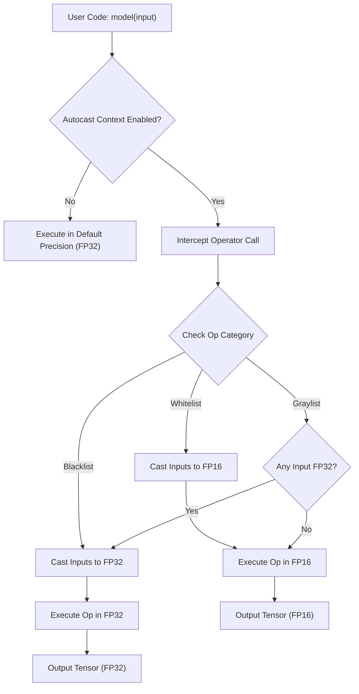
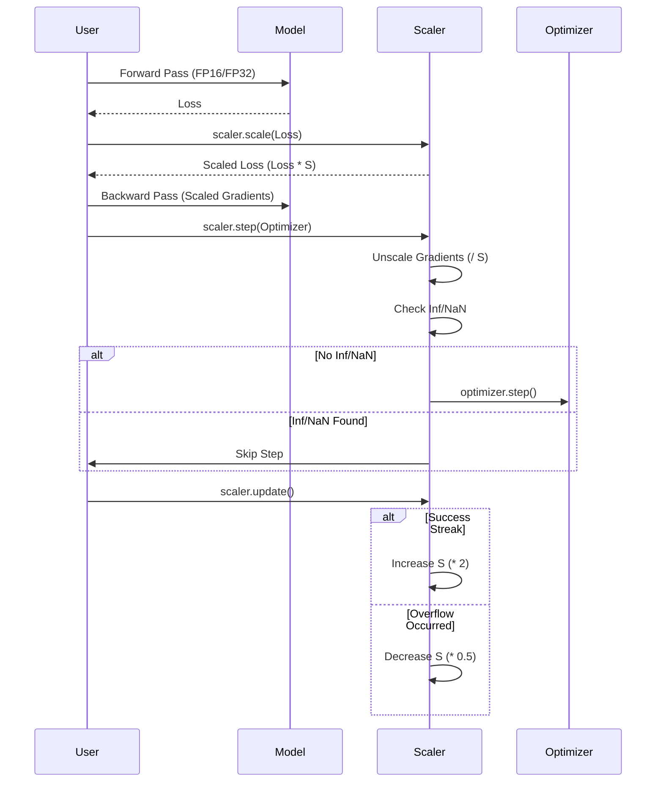

`torch.cuda.amp` (Automatic Mixed Precision) 是 PyTorch 提供的自动混合精度训练工具包，旨在通过在计算中动态混合使用 `float32` (单精度) 和 `float16` (半精度) / `bfloat16`，在保持模型精度的前提下显著提升训练速度并降低显存占用。

**注意**：从 PyTorch 2.4 开始，推荐使用更通用的 `torch.amp` 接口，它支持 CUDA、CPU 以及其他硬件后端（如 XPU, HPU）。

## 2. 核心组件架构 (Core Architecture)

AMP 的工作流程主要由两个独立但协同工作的组件构成：`autocast` 和 `GradScaler`。

### 2.1 Autocast (自动类型转换)

`autocast` 是一个上下文管理器 (Context Manager)，它负责拦截 CUDA 算子调用，并根据算子的数值特性自动选择最佳的计算精度。

#### 算子分类策略 (Op Eligibility)
Autocast 维护了三个算子列表（White/Black/Gray Lists），决定了不同算子的执行精度：

1.  **Whitelist (允许 FP16)**: 计算密集型算子，对精度不敏感，在 FP16 下能获得显著加速。
    *   *Examples*: `conv2d`, `matmul`, `linear`, `lstm`.
2.  **Blacklist (强制 FP32)**: 数值敏感算子，要求高精度以保证稳定性。
    *   *Examples*: `pow`, `log`, `exp`, `softmax`, `norm`, `sum` (reduction).
3.  **Graylist (Promote to Widest)**: 如果输入中有 FP32，则以 FP32 运行；若全为 FP16，则以 FP16 运行。
    *   *Examples*: `add`, `mul`, `cat`.

#### 工作流 (Workflow)



### 2.2 GradScaler (梯度缩放)

由于 `float16` 的动态范围较小 ($6 \times 10^{-5} \sim 65504$)，训练过程中反向传播的梯度往往非常小，容易导致**下溢 (Underflow)**，即梯度变为 0。`GradScaler` 通过在反向传播前放大 Loss，在更新参数前缩小梯度，来解决这个问题。

#### 动态缩放机制 (Dynamic Scaling)

1.  **Scale**: 前向传播结束后，将 Loss 乘以一个缩放因子 (Scale Factor, 初始默认 $2^{16}$)。
2.  **Unscale**: 反向传播结束后，优化器更新前，将梯度除以缩放因子还原。
3.  **Update**: 检查梯度中是否存在 `Inf` 或 `NaN`。
    *   **Success**: 如果没有溢出，正常更新参数。若连续 N 次成功，增大 Scale Factor。
    *   **Overflow**: 如果发现 `Inf/NaN`，跳过本次参数更新，减小 Scale Factor。



## 3. 最佳实践与代码示例 (Best Practices)

### 3.1 标准训练循环

```python
import torch
from torch.amp import autocast, GradScaler

model = MyModel().cuda()
optimizer = torch.optim.SGD(model.parameters(), lr=1e-3)
scaler = GradScaler("cuda") # 初始化 Scaler

for input, target in data_loader:
    optimizer.zero_grad()

    # 1. Autocast Context: 前向传播
    with autocast("cuda"):
        output = model(input)
        loss = loss_fn(output, target)

    # 2. Scale & Backward: 缩放 Loss 并反向传播
    scaler.scale(loss).backward()

    # 3. Step: 尝试更新参数 (如果梯度正常)
    scaler.step(optimizer)

    # 4. Update: 更新缩放因子
    scaler.update()
```

### 3.2 关键注意事项

1.  **Loss Function**: 尽量在 `autocast` 范围内计算 Loss，但部分 Loss（如 `BinaryCrossEntropy`）可能需要显式使用 `with_logits` 版本或在 FP32 下计算以避免数值不稳定。
2.  **Custom Autograd Functions**: 自定义 Function 需要使用 `@torch.amp.custom_fwd` 和 `@torch.amp.custom_bwd` 装饰器，以确保自动转换逻辑正确传播。
3.  **Multiple Models/Losses**: 如果有多个 Loss，应对它们分別进行 `scale`，并在所有 `backward` 完成后统一调用 `scaler.step`。
4.  **BFloat16**: 如果使用 BF16 (`dtype=torch.bfloat16`)，通常**不需要** `GradScaler`，因为 BF16 的动态范围与 FP32 相同，极少发生下溢。

## 4. 参考资料 (References)

1.  **PyTorch Official Docs**: [Automatic Mixed Precision package - torch.amp](https://docs.pytorch.org/docs/stable/amp.html)
2.  **PyTorch Tutorials**: [Automatic Mixed Precision Recipe](https://docs.pytorch.org/tutorials/recipes/recipes/amp_recipe.html)
3.  **NVIDIA Developer Blog**: [Mixed-Precision Training of Deep Neural Networks](https://developer.nvidia.com/blog/mixed-precision-training-deep-neural-networks/)
