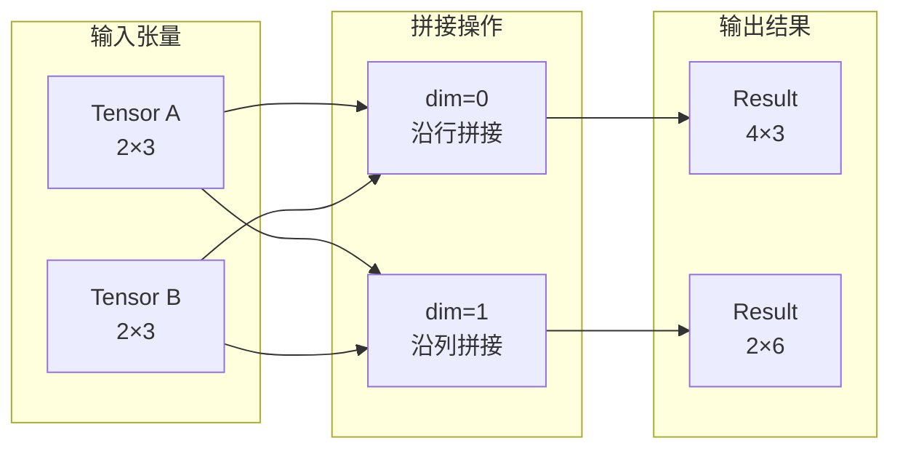

# torch.cat

## 1. 概述 (Overview)

`torch.cat` (concatenate) 是 PyTorch 中用于在**现有维度**上连接一系列[张量（Tensors）](../相关概念/张量.md)的核心操作。它将多个张量的数据沿指定的轴（dimension）紧密拼接，形成一个新的连续张量。

与 `torch.stack` 不同，`torch.cat` **不会创建新的维度**，而是扩展现有的维度。

## 2. 数学与几何原理 (Mathematical Principles)

假设我们有一组秩为 $N$ 的张量 $\{T_1, T_2, ..., T_k\}$。
若要沿着维度 $d$ 进行拼接，必须满足以下条件：

1.  **维度一致性**：所有张量的维度数量（rank）必须相同。
2.  **形状约束**：除了拼接维度 $d$ 之外，所有其他维度的大小必须完全一致。即 $\forall i, \forall j \neq d, \text{shape}(T_i)[j] = \text{shape}(T_1)[j]$。

拼接后的输出张量 $T_{out}$ 的形状为：
$$
\text{shape}(T_{out})[i] = \begin{cases} 
\sum_{k} \text{shape}(T_k)[d] & \text{if } i = d \\
\text{shape}(T_1)[i] & \text{if } i \neq d 
\end{cases}
$$

### 架构图 (Architecture Diagram)

以下展示了两个 $2 \times 3$ 的张量在不同维度拼接的效果：



## 3. API 说明 (API Specification)

```python
torch.cat(tensors, dim=0, *, out=None) -> Tensor
```

| 参数 | 类型 | 说明 |
| :--- | :--- | :--- |
| `tensors` | `sequence of Tensors` | 待拼接的张量序列（如 tuple 或 list）。除 `dim` 外，其他维度形状必须一致。 |
| `dim` | `int` | 拼接发生的维度。默认为 0。 |
| `out` | `Tensor` (可选) | 用于存储结果的输出张量。若提供，操作将直接写入该内存。 |

## 4. 核心差异：`cat` vs `stack`

这是面试和实际开发中最高频的混淆点。

| 特性 | `torch.cat` | `torch.stack` |
| :--- | :--- | :--- |
| **维度变化** | **保持不变** (Rank $N \to N$) | **增加维度** (Rank $N \to N+1$) |
| **几何意义** | 延长/扩充现有轴 | 创建全新的堆叠轴 |
| **输入要求** | `dim` 以外的形状必须一致 | 所有输入张量的形状必须**完全一致** |
| **底层实现** | 直接数据拷贝 | 相当于先 `unsqueeze` 再 `cat` |

**示例对比**:
```python
import torch
A = torch.ones(2, 3)
B = torch.ones(2, 3)

# cat 沿着 dim 0 拼接 -> (4, 3)
print(torch.cat((A, B), dim=0).shape) 

# stack 创建新 dim 0 堆叠 -> (2, 2, 3)
print(torch.stack((A, B), dim=0).shape) 
```

## 5. 内存与性能分析 (Memory & Performance)

### 5.1 内存分配 (Memory Allocation)
`torch.cat` 是一个**非原位 (Out-of-place)** 操作。
*   它会申请一块全新的连续内存，大小等于所有输入张量体积之和。
*   **代价**：执行过程中，内存峰值至少为 $\sum \text{inputs} + \text{output}$。如果处理大规模张量（如大模型中的 KV Cache 拼接），极易触发 OOM (Out of Memory)。

### 5.2 列表（List） vs 迭代拼接
**反模式 (Anti-pattern)**：在循环中不断调用 `torch.cat`。
```python
# ❌ 极差的性能：产生大量中间临时张量，频繁申请内存，二次复杂度 O(N^2)
output = torch.tensor([])
for tensor in tensor_list:
    output = torch.cat((output, tensor))

# ✅ 最佳实践：收集到列表中，一次性拼接，线性复杂度 O(N)
output = torch.cat(tensor_list)
```

## 6. 参考资料 (References)

1.  [PyTorch Official Docs: torch.cat](https://docs.pytorch.org/docs/stable/generated/torch.cat.html)
2.  [PyTorch Forum: torch.cat vs torch.stack](https://discuss.pytorch.org/t/torch-cat-torch-stack-which-one/40916)
3.  [Understanding Memory Usage in PyTorch](https://pytorch.org/docs/stable/torch_cuda_memory.html)
