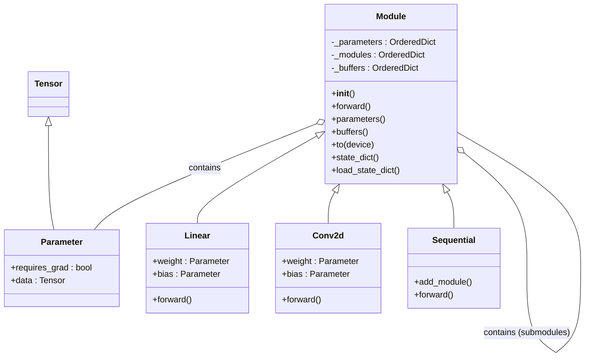

## 1. 概述

PyTorch 的 `torch.nn` 模块是构建深度学习模型的核心库。它提供了一系列构建神经网络所需的组件，包括层（Layers）、激活函数（Activation Functions）、损失函数（Loss Functions）等。

其中，`nn.Module` 是所有神经网络模块的基类（Base Class）。在 PyTorch 中，无论是简单的线性层、复杂的卷积神经网络（CNN），还是整个 Transformer 模型，本质上都是 `nn.Module` 的子类。理解 `nn.Module` 的设计模式和生命周期，是掌握 PyTorch 模型开发的关键。

## 2. 架构设计

`nn.Module` 采用了**组合模式（Composite Pattern）**的设计思想。它既可以表示一个单独的层（如 `nn.Linear`），也可以表示由多个层组成的整个神经网络。这种递归结构使得模型的构建、管理和转换变得极其灵活。

### 2.1 类层次结构



### 2.2 核心职责

`nn.Module` 主要承担以下职责：

1.  **状态管理（State Management）**：
    *   **Parameters（参数）**：模型中需要被优化的权重（如 `weight` 和 `bias`）。它们是 `torch.nn.Parameter` 的实例（`Tensor` 的子类），在赋值给 `Module` 属性时会自动注册到 `_parameters` 字典中。
    *   **Buffers（缓冲区）**：不需要计算梯度的状态（如 BatchNorm 中的 `running_mean`）。通过 `register_buffer` 方法注册，包含在 `state_dict` 中但不参与反向传播更新。
    *   **Submodules（子模块）**：嵌套的 `nn.Module` 实例。赋值时会自动注册到 `_modules` 字典中，形成树状结构。

2.  **计算图构建（Computation Graph Construction）**：
    *   通过实现 `forward()` 方法定义前向传播逻辑。
    *   与 PyTorch 的 Autograd 系统无缝集成，自动处理反向传播。

3.  **设备与类型转换（Device & Dtype Casting）**：
    *   提供 `.to(device)`, `.cuda()`, `.cpu()`, `.half()` 等方法，递归地将所有参数和缓冲区移动到指定设备或转换数据类型。

4.  **序列化（Serialization）**：
    *   通过 `state_dict()` 和 `load_state_dict()` 方法，方便地保存和加载模型参数。

## 3. 核心机制详解

### 3.1 参数自动注册机制

当我们在 `__init__` 方法中将一个 `nn.Parameter` 或 `nn.Module` 对象赋值给成员变量时，PyTorch 会利用 Python 的 `__setattr__` 魔法方法自动将其注册。

```python
import torch
import torch.nn as nn

class MyModel(nn.Module):
    def __init__(self):
        super().__init__()
        # 自动注册为 Parameter
        self.weight = nn.Parameter(torch.randn(10, 10))
        
        # 自动注册为 Submodule
        self.linear = nn.Linear(10, 5)
        
        # 不会被注册（普通 Tensor）
        self.temp_data = torch.randn(10) 

model = MyModel()
print(list(model.parameters()))  # 包含 self.weight 和 self.linear.weight/bias
```

### 3.2 前向传播（Forward Propagation）

`forward` 方法定义了数据流向。虽然我们可以直接调用 `model.forward(input)`，但**强烈建议**通过 `model(input)`（即 `__call__` 方法）来执行。

`__call__` 方法不仅调用了 `forward`，还负责处理 **Hooks（钩子）**。这对于调试、特征提取和可视化至关重要。

### 3.3 训练模式与评估模式

`nn.Module` 维护一个 `training` 标志位，通过 `.train()` 和 `.eval()` 方法切换。

*   **Training Mode (`model.train()`)**: 启用 Dropout，BatchNorm 使用当前 batch 的统计量更新 running mean/var。
*   **Evaluation Mode (`model.eval()`)**: 禁用 Dropout，BatchNorm 使用累积的 running mean/var。

## 4. 常用容器（Containers）

PyTorch 提供了几种特殊的 `nn.Module` 容器来组织层：

*   **`nn.Sequential`**: 按顺序执行的容器。输入数据按添加顺序流经每个模块。
*   **`nn.ModuleList`**: 类似于 Python 的 `list`，但其中的 `nn.Module` 会被正确注册。**注意**：`ModuleList` 本身不定义 `forward`，需要手动遍历执行。
*   **`nn.ModuleDict`**: 类似于 Python 的 `dict`，用于按键索引模块，其中的模块也会被自动注册。

## 5. 高级功能：Hooks (钩子)

`nn.Module` 提供了注册 Hook 的接口，允许用户在不修改类定义的情况下介入计算过程：

*   `register_forward_pre_hook(hook)`: 在 `forward` 执行**前**调用。
*   `register_forward_hook(hook)`: 在 `forward` 执行**后**调用（可获取输入和输出）。
*   `register_full_backward_hook(hook)`: 在反向传播计算梯度时调用。

## 6. 代码示例：构建自定义模型

```python
import torch
import torch.nn as nn
import torch.nn.functional as F

class CustomClassifier(nn.Module):
    def __init__(self, input_dim, hidden_dim, num_classes):
        super(CustomClassifier, self).__init__()
        
        # 定义层
        self.feature_extractor = nn.Sequential(
            nn.Linear(input_dim, hidden_dim),
            nn.BatchNorm1d(hidden_dim),
            nn.ReLU(),
            nn.Dropout(p=0.5)
        )
        
        self.classifier = nn.Linear(hidden_dim, num_classes)
        
        # 定义一个 Buffer（不参与梯度更新）
        self.register_buffer('dummy_buffer', torch.zeros(1, hidden_dim))

    def forward(self, x):
        # 前向传播逻辑
        x = self.feature_extractor(x)
        logits = self.classifier(x)
        return logits

# 实例化模型
model = CustomClassifier(input_dim=784, hidden_dim=256, num_classes=10)

# 打印模型结构
print(model)

# 检查参数
for name, param in model.named_parameters():
    print(f"Parameter: {name}, Shape: {param.shape}, Requires Grad: {param.requires_grad}")

# 设备移动
device = torch.device("cuda" if torch.cuda.is_available() else "cpu")
model.to(device)
```

## 7. 总结

`torch.nn.Module` 是 PyTorch 深度学习框架的基石。它通过优雅的面向对象设计，实现了参数的自动化管理、计算图的动态构建以及模型状态的序列化。无论是构建简单的感知机还是复杂的超大规模模型，遵循 `nn.Module` 的设计规范都是实现高效、可维护代码的前提。

## 8. 参考资料

1.  [PyTorch Documentation: Modules](https://pytorch.org/docs/stable/notes/modules.html)
2.  [PyTorch Tutorials: Building Models with PyTorch](https://docs.pytorch.org/tutorials/beginner/introyt/modelsyt_tutorial.html)
3.  [PyTorch Tutorials: Build the Neural Network](https://docs.pytorch.org/tutorials/beginner/basics/buildmodel_tutorial.html)
