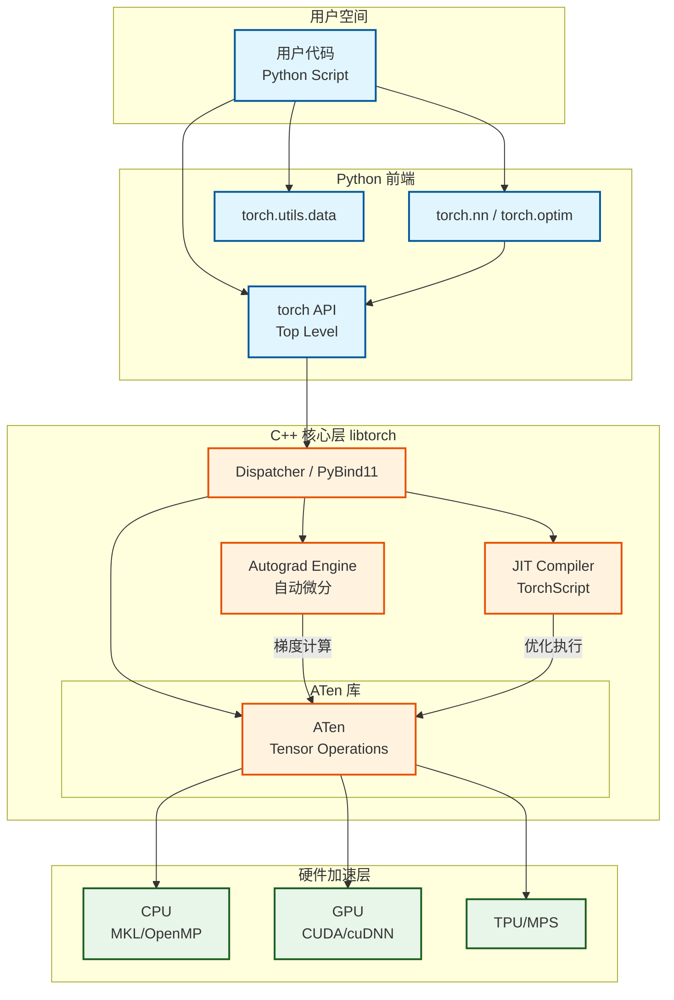

PyTorch 是一个开源的机器学习库，最初由 Facebook 的人工智能研究实验室（FAIR）开发。它基于 Torch 库，底层由 C++ 实现，能够提供强大的 [GPU 加速张量计算（Tensor computing）](./参考/1.md)和构建在磁带基础上的自动微分系统（Tape-based autograd system）。

PyTorch 因其**动态计算图**（Dynamic Computational Graph）特性而备受研究人员喜爱，这意味着计算图是在代码运行时构建的，允许使用标准的 Python 控制流（如 `if`, `for` 循环）来改变神经网络的结构。

### 主要特点
*   **Python 优先**：深度集成 Python 生态，易于使用和调试。
*   **动态图机制**：灵活的 Eager Execution 模式，所见即所得，极大利于实验和原型设计。
*   **丰富的生态**：拥有 TorchVision, TorchText, TorchAudio 等强大的领域库。
*   **生产部署**：通过 TorchScript 和 TorchServe 支持从研究到生产的无缝过渡。

---

## 2. 核心模块详解

PyTorch 的强大功能由以下几个核心模块支撑：

### 2.1 torch.Tensor (张量)
PyTorch 的核心数据结构，类似于 NumPy 的 ndarray，但支持在 GPU 上运行以加速计算。它是所有深度学习操作的基础载体。

### 2.2 torch.autograd (自动微分)
这是 PyTorch 的神经网络训练引擎的核心。它为 Tensors 上的所有操作提供自动微分。它是一个“按运行定义”（Define-by-Run）的框架，这意味着反向传播是根据代码的运行方式定义的，每次迭代都可以不同。

### 2.3 torch.nn (神经网络构建)
专为构建神经网络设计的模块。它提供了层（Layer）、损失函数（Loss Function）和容器（如 `Sequential`）。`torch.nn.Module` 是所有神经网络模块的基类，封装了参数管理和前向传播逻辑。

### 2.4 torch.optim (优化器)
实现了各种优化算法（如 SGD, Adam, RMSprop 等）。优化器负责接收模型参数，并根据计算出的梯度更新这些参数，以最小化损失函数。

### 2.5 torch.utils.data (数据处理)
提供了 `Dataset` 和 `DataLoader` 两个核心工具。`Dataset` 封装了数据源和读取逻辑，`DataLoader` 则负责高效地批量加载数据、打乱顺序和多进程读取。

---

## 3. PyTorch 内部架构与模块交互

PyTorch 的架构设计旨在连接易用的 Python 前端和高性能的 C++ 后端。

### 架构分层
1.  **Python Frontend**: 用户交互层，提供 Python API。
2.  **C++ Frontend / Bindings**: 通过 PyBind11 将 Python 调用映射到 C++。
3.  **Core (libtorch)**:
    *   **ATen (A Tensor Library)**: 底层张量运算库，处理数学计算。
    *   **Autograd Engine**: 负责记录运算历史并计算梯度。
    *   **JIT (Just-In-Time) Compiler**: 将动态图转换为静态图（TorchScript）以进行优化。
4.  **Hardware Abstraction**: 适配 CPU, CUDA (NVIDIA GPU), MPS (Apple Silicon) 等硬件。

### 模块作用图解 (Mermaid)

下面的组件图展示了 PyTorch 内部各个模块如何协同工作，从用户代码到底层硬件执行。

### 图解说明

1.  **User Code**: 开发者编写的 Python 脚本，定义模型、数据加载和训练循环。
2.  **torch.nn / torch.optim**: 高级 API，用户通过它们构建模型和管理优化过程，最终调用底层的 Tensor 操作。
3.  **Dispatcher**: 这是一个关键的分发机制。当你在 Python 中调用 `torch.add` 时，Dispatcher 负责根据 Tensor 的类型（是 CPU 还是 GPU，是 float 还是 int）将调用分发到正确的 C++ 实现函数。
4.  **Autograd Engine**: 在前向传播（Forward Pass）时，它会构建一个动态计算图。在反向传播（Backward Pass）时，它遍历这个图来计算梯度。
5.  **ATen**: PyTorch 的“肌肉”。它是一个高性能的 C++ 库，实现了所有底层的张量运算（加法、矩阵乘法、卷积等）。
6.  **Hardware**: 最终的计算指令被发送到 CPU 或 GPU 上执行。
