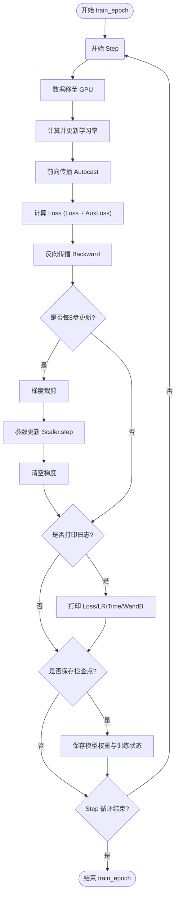
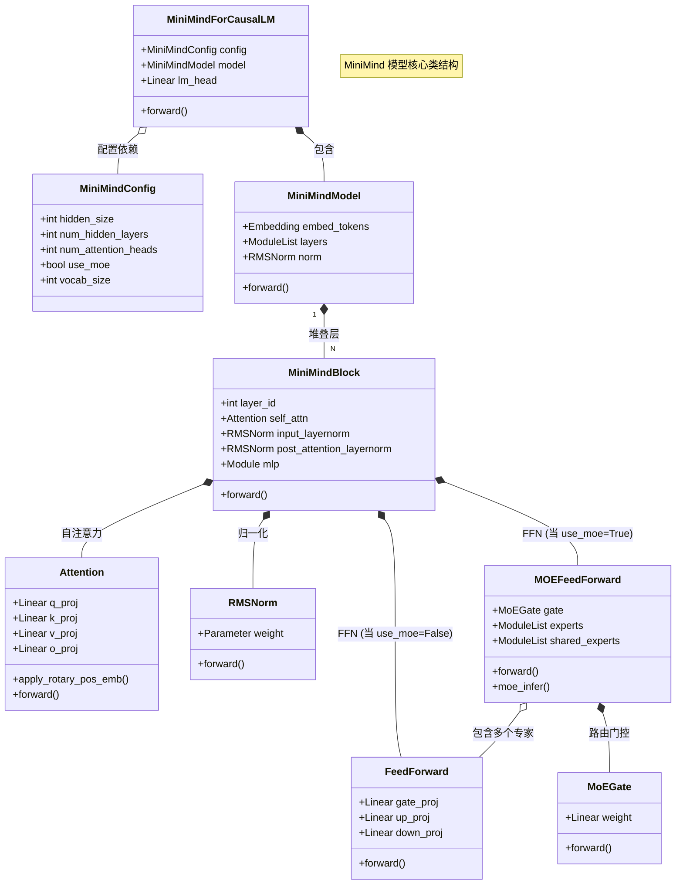
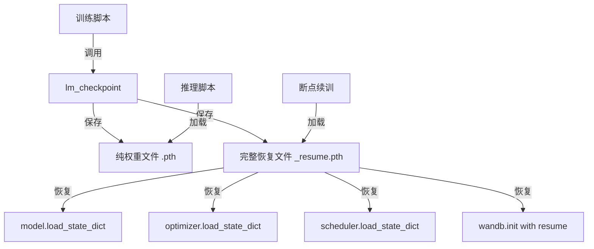
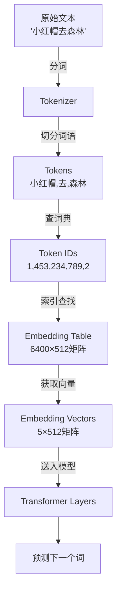
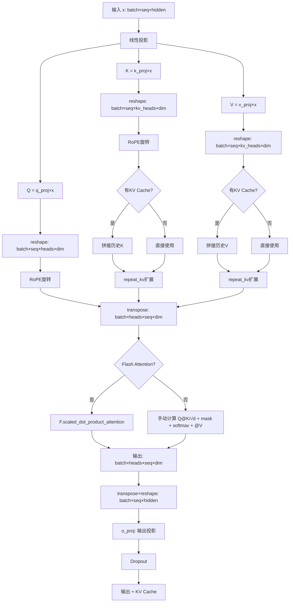

# 从头开始训练自己的大模型 - 流程图

基于 `从头开始训练自己的大模型.py` 代码的训练流程分析。

## 1. 整体训练流程


## 2. 训练循环详情 (train_epoch)



## 3. 模型组件架构 (Class Diagram)



## 4. 关键组件说明

*   **MiniMindConfig**: 模型的配置中心，定义了模型大小、层数、头数以及是否开启 MoE 等关键超参数。
*   **MiniMindForCausalLM**: 顶层封装，包含基础 Transformer 模型 (`MiniMindModel`) 和语言模型头 (`lm_head`)，用于生成任务。
*   **MiniMindModel**: 不含 Head 的基础模型，负责 Token Embedding、多层 Decoder 堆叠以及最终的 RMSNorm。
*   **MiniMindBlock**: 单个 Transformer Decoder 层，采用 Pre-Norm 结构，包含 Self-Attention 和 FFN/MoE。
*   **Attention**: 支持 GQA (Grouped Query Attention) 和 RoPE (Rotary Positional Embeddings) 的注意力机制，包含 Flash Attention 优化。
*   **FeedForward (SwiGLU)**: 标准的 SwiGLU 前馈网络，用于 Dense 模式或作为 MoE 的专家单元。
*   **MOEFeedForward**: 混合专家模块，包含一个门控网络 (`MoEGate`) 和多个专家网络 (`experts`/`shared_experts`)。
*   **MoEGate**: 路由网络，计算输入 Token 对各个专家的权重（Top-K 路由）。

---


为了让你彻底看懂这段代码，我们将贯穿使用一个核心例子：**教一个完全不懂中文的外国留学生"小明"（MiniMind）学习写中文小说。**

---

## 一、开场准备：设置随机种子 (`setup_seed`)

### 📝 代码片段 (第 114-121 行)

```python
def setup_seed(seed: int):
    random.seed(seed)
    np.random.seed(seed)
    torch.manual_seed(seed)
    torch.cuda.manual_seed(seed)
    torch.cuda.manual_seed_all(seed)
    torch.backends.cudnn.deterministic = True
    torch.backends.cudnn.benchmark = False
```

### 🎯 隐喻翻译：固定考试题库的顺序

想象一下，你要教小明写小说，准备了 1000 道练习题。

#### 问题场景：

如果每次练习时都**随机打乱**题目顺序，会发生什么？

- **今天**：小明先学习"如何描写人物"，再学"如何构建情节"
- **明天**：小明先学习"如何构建情节"，再学"如何描写人物"
- **结果**：两天后对比小明的进步时，你无法判断到底是教学方法改进了，还是纯粹因为题目顺序变了

这就像科学实验中的**不可重复性问题**——你无法确认结果是由你的改进导致的，还是运气好碰到了简单的题。

#### 解决方案：**固定随机种子** = 固定题库顺序

```python
random.seed(seed)          # 固定 Python 内置随机数生成器
np.random.seed(seed)       # 固定 NumPy 的随机数生成器  
torch.manual_seed(seed)    # 固定 PyTorch CPU 上的随机数
torch.cuda.manual_seed(seed)       # 固定单个 GPU 的随机数
torch.cuda.manual_seed_all(seed)   # 固定所有 GPU 的随机数
```

**隐喻对应**：

- `random.seed(seed)`：固定 Python 自己的题库洗牌方式
- `np.random.seed(seed)`：固定数据预处理（比如图片增强）的随机性
- `torch.manual_seed(seed)`：固定模型初始化时的"大脑初始连接方式"
- `torch.cuda.manual_seed_all(seed)`：如果小明有多个"副大脑"（多GPU），让它们的初始状态也一致

#### 额外的严格措施：关闭自动优化

```python
torch.backends.cudnn.deterministic = True  # 强制使用确定性算法
torch.backends.cudnn.benchmark = False     # 禁用自动算法选择
```

**隐喻**：

- `deterministic = True`：强制要求"每次计算都用相同的解题步骤"，哪怕慢一点
  - 类似于：要求小明每次写作文都严格按照"开头-发展-高潮-结尾"的步骤，不允许跳步
- `benchmark = False`：关闭"自动选择最优算法"功能
  - 类似于：禁止小明在考试时"看题目难度临时调整答题策略"，必须用固定套路

#### 为什么需要这么做？

| 场景 | 不设置随机种子 | 设置随机种子 |
|------|--------------|-------------|
| **实验对比** | 无法确认改进是否有效 | 可以精确对比不同方法的效果 |
| **Bug 调试** | 每次运行结果不同，无法定位问题 | 每次运行结果一致，方便排查 |
| **论文复现** | 别人无法复现你的结果 | 提供种子值后，别人可以完全复现 |
| **协作开发** | 团队成员看到不同的训练曲线 | 大家看到相同的训练过程 |

### 💡 类比总结

设置随机种子就像：

1. **摄影棚打光**：每次拍摄都用相同的灯光布置，这样对比照片时，差异只来自演员表现，而不是光线变化
2. **考试标准化**：让所有学生做同一套卷子，公平比较谁学得更好
3. **菜谱配方**：严格按照"盐5克、糖10克"的配方，而不是"适量"，这样才能稳定复现美味

### ⚠️ 注意事项

1. **性能代价**：
   - 设置 `deterministic=True` 会**牺牲一些速度**，因为禁用了某些快速但非确定性的算法
   - 适合**实验验证阶段**，生产环境可以关闭以提速

2. **并不是100%确定性**：
   - 即使设置了种子，在**不同硬件**（如不同型号的GPU）或**不同PyTorch版本**上，结果仍可能略有差异
   - 就像相同菜谱在不同品牌的烤箱里，温度曲线会有微小区别

3. **种子值的选择**：
   - 通常选择 `42`（程序员梗，源自《银河系漫游指南》）、`0`、`1234` 等任意整数
   - 只要保持一致即可，具体数值并不重要

---

## 二、设计大脑蓝图：MiniMindConfig 配置类

### 📝 代码片段 (第 27-102 行)

```python
class MiniMindConfig(PretrainedConfig):
    model_type = "minimind"

    def __init__(
        self,
        dropout: float = 0.0,
        bos_token_id: int = 1,
        eos_token_id: int = 2,
        hidden_act: str = "silu",
        hidden_size: int = 512,
        intermediate_size: int = None,
        max_position_embeddings: int = 32768,
        num_attention_heads: int = 8,
        num_hidden_layers: int = 8,
        num_key_value_heads: int = 2,
        vocab_size: int = 6400,
        rms_norm_eps: float = 1e-05,
        rope_theta: int = 1000000.0,
        inference_rope_scaling: bool = False,
        flash_attn: bool = True,
        ####################################################
        # Here are the specific configurations of MOE
        # When use_moe is false, the following is invalid
        ####################################################
        use_moe: bool = False,
        num_experts_per_tok: int = 2,
        n_routed_experts: int = 4,
        n_shared_experts: int = 1,
        scoring_func: str = "softmax",
        aux_loss_alpha: float = 0.01,
        seq_aux: bool = True,
        norm_topk_prob: bool = True,
        **kwargs,
    ):
        super().__init__(**kwargs)
        self.dropout = dropout
        self.bos_token_id = bos_token_id
        self.eos_token_id = eos_token_id
        self.hidden_act = hidden_act
        self.hidden_size = hidden_size
        self.intermediate_size = intermediate_size
        self.max_position_embeddings = max_position_embeddings
        self.num_attention_heads = num_attention_heads
        self.num_hidden_layers = num_hidden_layers
        self.num_key_value_heads = num_key_value_heads
        self.vocab_size = vocab_size
        self.rms_norm_eps = rms_norm_eps
        self.rope_theta = rope_theta
        self.inference_rope_scaling = inference_rope_scaling
        # 外推长度 = factor * original_max_position_embeddings = 32768
        self.rope_scaling = (
            {
                "beta_fast": 32,
                "beta_slow": 1,
                "factor": 16,
                "original_max_position_embeddings": 2048,
                "attention_factor": 1.0,
                "type": "yarn",
            }
            if self.inference_rope_scaling
            else None
        )
        self.flash_attn = flash_attn
        ####################################################
        # Here are the specific configurations of MOE
        # When use_moe is false, the following is invalid
        ####################################################
        self.use_moe = use_moe
        self.num_experts_per_tok = num_experts_per_tok  # 每个token选择的专家数量
        self.n_routed_experts = n_routed_experts  # 总的专家数量
        self.n_shared_experts = n_shared_experts  # 共享专家
        self.scoring_func = scoring_func  # 评分函数,默认为'softmax'
        self.aux_loss_alpha = aux_loss_alpha  # 辅助损失的alpha参数
        self.seq_aux = seq_aux  # 是否在序列级别上计算辅助损失
        self.norm_topk_prob = norm_topk_prob  # 是否标准化top-k概率
```

### 🎯 隐喻翻译：设计小明的大脑蓝图

在教小明写小说之前,我们需要**给小明设计一个"大脑"**。MiniMindConfig 就像是大脑的设计图纸,上面标注了各种参数:记忆容量多大、思考速度多快、注意力机制怎么工作等等。

让我们逐个拆解这些参数:

---

### 🧠 核心结构参数

#### 1. `hidden_size: int = 512` (大脑的"神经元总数")

**代码位置**: 第 36 行

**作用**: 决定模型内部表示的维度大小。

**隐喻解释**:

想象小明的大脑有 **512 个神经元细胞**。每当小明读到一个词(比如"爱情"),这个词会被转换成一个包含 512 个数字的向量(类似于 512 个神经元的激活状态)。

- **`hidden_size=512`**: 小明有 512 个神经元,适合理解简单的故事情节
- **`hidden_size=4096`** (像 Llama-7B): 小明有 4096 个神经元,能处理更复杂的逻辑和细节

**类比**:

```
hidden_size = 大脑的"像素分辨率"

- hidden_size=128  → 看世界就像 16x16 的马赛克图片
- hidden_size=512  → 看世界就像 480p 的标清视频
- hidden_size=4096 → 看世界就像 4K 超清画面
```

**技术细节**:

```python
# 在代码中的应用示例
self.embed_tokens = nn.Embedding(vocab_size, hidden_size)
# 把每个词(vocab_size种)映射成 hidden_size 维的向量
```

---

#### 2. `num_hidden_layers: int = 8` (大脑的"思考层数")

**代码位置**: 第 40 行

**作用**: 决定模型堆叠了多少层 Transformer Block。

**隐喻解释**:

小明处理一个问题时,会经过 **8 轮深度思考**:

1. **第 1 层**: 识别基本词语("玫瑰"、"爱情")
2. **第 2 层**: 理解简单关系("玫瑰象征爱情")
3. **第 3 层**: 把握句子结构("他送她一朵玫瑰")
4. **第 4 层**: 理解情感色彩("暗示爱意的表达")
5. **第 5-8 层**: 更高级的逻辑推理、隐喻理解、情节连贯性...

**层数越多** = 思考越深入,但也需要更多"计算时间"(更慢,更耗显存)。

**类比**:

```
写作文时的思考步骤:
num_layers=1  → 看到题目就直接写(幼儿园水平)
num_layers=8  → 审题→构思→列提纲→写草稿→修改润色(中学生水平)
num_layers=32 → 深度哲学思辨、反复推敲细节(学术论文水平,如 Llama-70B)
```

**经验法则**:

| 模型规模 | 层数 | 对应能力 |
|---------|------|----------|
| 小模型 (< 1B) | 8-12 层 | 简单对话、基础问答 |
| 中模型 (1B-10B) | 24-32 层 | 代码生成、长文摘要 |
| 大模型 (> 10B) | 40-80 层 | 复杂推理、创意写作 |

---

#### 3. `num_attention_heads: int = 8` (大脑的"注意力探照灯数量")

**代码位置**: 第 39 行

**作用**: 决定自注意力机制中有多少个"注意力头"。

**隐喻解释**:

小明在阅读一句话时,会同时用 **8 个探照灯** 关注不同的重点:

**示例句子**: "小红帽走进森林,遇到了大灰狼"

- **探照灯 1**: 关注主语("小红帽")
- **探照灯 2**: 关注动作("走进")
- **探照灯 3**: 关注地点("森林")
- **探照灯 4**: 关注因果关系("走进" → "遇到")
- **探照灯 5**: 关注角色关系("小红帽" vs "大灰狼")
- **探照灯 6-8**: 关注语气、情感、潜在危险暗示...

**为什么需要多个头?**

单个注意力头可能只关注一种模式(比如只看名词),而多个头能**并行关注不同维度的信息**,然后综合起来形成全面理解。

**类比**:

```
看电影时的注意力分配:
num_heads=1  → 只盯着主角,忽略背景和配角
num_heads=8  → 同时关注:主角表情、背景音乐、镜头运动、配角反应...
num_heads=32 → 像专业影评人,连道具细节、色彩隐喻都不放过
```

**技术细节**:

```python
# 在注意力机制中的应用
head_dim = hidden_size // num_attention_heads  
# 每个注意力头负责的维度 = 512 / 8 = 64 维
```

---

#### 4. `num_key_value_heads: int = 2` (分组查询注意力 GQA)

**代码位置**: 第 41 行

**作用**: 在分组查询注意力(GQA)中,Key 和 Value 使用的头数(通常少于 Query 的头数)。

**隐喻解释**:

这是一个**优化技巧**,用来节省小明的"记忆存储空间"。

**标准注意力机制(MHA)**:

```
Query (问题) 有 8 个头
Key   (索引) 有 8 个头  ← 每个头都有独立的 Key
Value (答案) 有 8 个头  ← 每个头都有独立的 Value
```

**分组查询注意力(GQA)**:

```
Query (问题) 有 8 个头
Key   (索引) 有 2 个头  ← 多个 Query 共享同一个 Key
Value (答案) 有 2 个头  ← 多个 Query 共享同一个 Value

分组方式:
- Query头 0, 1, 2, 3 → 共享 Key-Value头 0
- Query头 4, 5, 6, 7 → 共享 Key-Value头 1
```

**类比**:

想象图书馆的检索系统:

- **MHA**(Multi-Head Attention): 8 个读者,每人有一本**专属的图书目录**
- **GQA**(Grouped Query Attention): 8 个读者,但只有 2 本**共享的图书目录**(每 4 人共用一本)
- **好处**: 目录册少了,存储空间省了 75%,但检索效率基本不降

**实际效果**:

- **显存节省**: KV Cache 从 `8 * seq_len * head_dim` 降到 `2 * seq_len * head_dim`
- **速度提升**: 推理时减少内存访问,尤其在长文本生成时效果明显
- **性能损失**: 几乎没有(Meta 的 Llama 2 论文证明 GQA 性能接近 MHA)

---

#### 5. `vocab_size: int = 6400` (小明的"词汇量")

**代码位置**: 第 42 行

**作用**: 模型能识别的不同 token(词或字符)数量。

**隐喻解释**:

小明的词汇表里有 **6400 个词**。

**例子**:

```python
vocab = {
    0: "<PAD>",      # 填充符号
    1: "<BOS>",      # 句子开始
    2: "<EOS>",      # 句子结束
    3: "我",
    4: "爱",
    5: "你",
    ...
    6399: "量子纠缠"
}
```

**不同 vocab_size 的对比**:

| Vocab Size | 覆盖语言 | 典型应用 | 
|-----------|---------|---------|
| 6,400 | 中文常用字 + 基础词汇 | 中文小说生成 |
| 32,000 | 中英文混合 | GPT-2 |
| 50,257 | 英文 + 特殊符号 | GPT-3 |
| 100,000+ | 多语言 + 代码 | Llama 2 |

**为什么不设置得越大越好?**

```
词汇量太小(如 1000):
- 优点: 模型小,训练快
- 缺点: 很多词表达不了,只能用组合(如"量子"+"纠缠")

词汇量太大(如 100000):
- 优点: 覆盖更多生僻词和专业术语
- 缺点: 
  1. 增加模型参数量(嵌入层占用空间大)
  2. 每个词的训练样本变少(稀疏性问题)
```

**技术细节**:

```python
# 嵌入层的参数量计算
embedding_params = vocab_size * hidden_size
# 6400 * 512 = 3,276,800 个参数
# 如果 vocab_size 扩大到 64000,参数量就会 x10
```

---

### ⚙️ 优化与技巧参数

#### 6. `intermediate_size: int = None` (FFN 的"中间层扩张倍数")

**代码位置**: 第 37 行

**作用**: 前馈网络(FFN)中间层的维度。如果设为 `None`,代码会自动计算为 `hidden_size * 8/3`。

**隐喻解释**:

小明在思考时,会经历一个"**发散思维 → 收敛总结**"的过程:

```
输入(512 维) 
  ↓ 
【扩张】→ 中间层(1365 维)  ← 这里是 intermediate_size
  ↓
【压缩】→ 输出(512 维)
```

**为什么要先扩张再压缩?**

类比写作文的思考过程:

1. **扩张阶段**(`gate_proj` + `up_proj`):
   - 看到主题词"春天",大脑瞬间联想到:
     - 视觉: 绿色、花朵、阳光
     - 听觉: 鸟鸣、流水
     - 触觉: 温暖、微风
     - 情感: 希望、活力
   - 从 1 个概念扩张到 N 个相关联想

2. **压缩阶段**(`down_proj`):
   - 从所有联想中,筛选出最相关的几个
   - 合成最终输出:"春天是万物复苏的季节"

**默认配置计算**:

```python
# 在 FeedForward 类的 __init__ 中(第 260-264 行)
if config.intermediate_size is None:
    intermediate_size = int(config.hidden_size * 8 / 3)  # 512 * 8/3 ≈ 1365
    # 对齐到 64 的倍数(为了 GPU 计算效率)
    config.intermediate_size = 64 * ((intermediate_size + 64 - 1) // 64)
    # 最终 = 1408 (21 * 64)
```

**为什么是 8/3 倍?**

- 这是 Llama 架构的经验值
- 在性能和计算成本之间取得平衡
- GPT 系列通常用 4 倍(如 `hidden_size=768` → `intermediate_size=3072`)

---

#### 7. `dropout: float = 0.0` (防止"死记硬背"的遗忘率)

**代码位置**: 第 32 行

**作用**: 训练时随机"关闭"一部分神经元,防止过拟合。

**隐喻解释**:

小明在练习写作文时,我们会随机"屏蔽"他的一部分记忆:

**场景**:

```
完整记忆(dropout=0.0):
- 小明记得:"开头必须用'在一个风和日丽的早晨'"
- 结果:写100篇作文都是这个开头(死记硬背,没有创造力)

随机遗忘(dropout=0.1):
- 训练时,随机让小明"忘记" 10% 的记忆
- 有时忘了固定开头,被迫自己创造新的开头
- 结果:学会了举一反三,而不是死记模板
```

**为什么代码里设置为 0.0?**

```python
dropout: float = 0.0  # 默认不使用 Dropout
```

**原因**:

1. **大模型时代的新发现**: 
   - 在小模型(BERT/GPT-2)时代,Dropout 很重要
   - 但在大模型(Llama/GPT-3+)时代,发现 Dropout 效果不明显,甚至有负作用
   
2. **训练数据够大**: 
   - 训练数据有几百 GB 时,模型很难"死记硬背"所有数据
   - 天然就有"泛化能力"
   
3. **其他正则化方法**: 
   - 使用了 Weight Decay(权重衰减)
   - 数据增强(Data Augmentation)
   - 训练时的随机性(如 Batch 顺序)

**如果你的场景需要 Dropout**:

```python
config = MiniMindConfig(
    dropout=0.1,  # 小数据集时可以尝试
    hidden_size=512,
    ...
)
```

---

#### 8. `max_position_embeddings: int = 32768` (小明的"记忆长度上限")

**代码位置**: 第 38 行

**作用**: 模型能处理的最大序列长度(token 数量)。

**隐喻解释**:

小明的短期记忆最多能记住 **32768 个词**。

**实际对比**:

| 长度 | 对应内容 | 
|------|---------|
| 512 | 一篇短新闻 |
| 2048 | 一篇中长文章(GPT-3 默认) |
| 4096 | 一本短篇小说的一章 |
| 32768 | 一本中篇小说 / 一份长研究报告 |
| 128000 | GPT-4 Turbo 的长度,约一本《哈利波特》 |

**为什么不设置得越长越好?**

```
问题 1: 计算复杂度爆炸
- 注意力计算复杂度 = O(seq_len²)
- 长度翻倍,计算量翻 4 倍!
  - 2048 token → 需要计算 2048² = 419 万次注意力
  - 32768 token → 需要计算 32768² = 10.7 亿次注意力

问题 2: 显存占用激增
- KV Cache 大小 = 2 * num_layers * seq_len * hidden_size
- 长度翻倍,显存占用也翻倍
```

**技术细节**:

```python
# 在 precompute_freqs_cis 函数中(第 608-690 行)
# 会预先计算 max_position_embeddings 个位置的旋转编码
freqs_cos, freqs_sin = precompute_freqs_cis(
    dim=head_dim,
    end=32768,  # 提前计算好 32768 个位置的 cos/sin 值
    rope_base=config.rope_theta,
)
```

---

#### 9. `rope_theta: int = 1000000.0` (位置编码的"时钟频率")

**代码位置**: 第 44 行

**作用**: RoPE(旋转位置编码)的基频参数,影响位置信息的编码方式。

**隐喻解释**:

想象小明的大脑里有一个"时钟系统",用来记录每个词在句子中的位置。

**两种时钟对比**:

```
快速时钟(rope_theta=10000,GPT/BERT 常用):
- 位置 0: 指针指向 0°
- 位置 1: 指针指向 36°
- 位置 2: 指针指向 72°
- ...
- 位置 100: 指针转了 10 圈,又回到 0°(产生混淆!)

慢速时钟(rope_theta=1000000,Llama 常用):
- 位置 0: 指针指向 0°
- 位置 1: 指针指向 0.36°
- 位置 2: 指针指向 0.72°
- ...
- 位置 10000: 指针才转 3.6°(仍然清晰可辨)
```

**为什么用 1000000?**

**目的**: 支持更长的序列,避免位置信息"循环混淆"

**类比**:

```
就像钟表的设计:
- 秒针: 60 秒转一圈(短周期,适合计时几分钟)
- 分针: 60 分钟转一圈(中周期)
- 时针: 12 小时转一圈(长周期,适合计时一整天)

rope_theta 就是控制"时针转速"的参数
- theta=10000   → 像秒针,适合短文本
- theta=1000000 → 像时针,适合长文本
```

**技术细节**:

```python
# 在 precompute_freqs_cis 中的计算(第 632 行)
freqs = 1.0 / (rope_base ** (torch.arange(0, dim, 2).float() / dim))
# rope_base=1000000 时,频率会非常低,适合编码长序列
```

---

#### 10. `flash_attn: bool = True` (启用"闪电注意力"加速)

**代码位置**: 第 46 行

**作用**: 是否使用 Flash Attention 算法优化注意力计算。

**隐喻解释**:

**普通注意力计算**:

```
小明阅读一篇文章(1000 个词):
1. 先把所有词的关系写在一张大表格上(1000x1000 = 100 万个格子)
2. 再从表格中查找需要的信息
3. 最后把表格扔掉

问题: 这张表格非常占地方(显存),而且大部分信息其实用不到
```

**Flash Attention**:

```
改进方案:
1. 不要一次性生成整张大表格
2. 分块计算: 每次只算 64x64 的小块(4096 个格子)
3. 算完一块,立刻用掉,再算下一块
4. 最终结果完全一样,但节省了 95% 的临时存储空间!
```

**实际效果对比**:

| 指标 | 普通注意力 | Flash Attention |
|------|----------|----------------|
| **显存占用** | 16 GB | 4 GB |
| **速度** | 100 ms | 30 ms |
| **精度** | 完全一致 | 完全一致 |

**代码中的应用**(第 499-513 行):

```python
if self.flash and (seq_len > 1) and ...:
    # 使用 PyTorch 内置的高效实现
    output = F.scaled_dot_product_attention(
        xq, xk, xv,
        dropout_p=self.dropout if self.training else 0.0,
        is_causal=True,  # 自动应用因果掩码
    )
else:
    # 降级到手动实现(兼容旧版本)
    scores = (xq @ xk.transpose(-2, -1)) / math.sqrt(self.head_dim)
    ...
```

**要求**:

- PyTorch >= 2.0
- CUDA 支持

---

### 🔧 特殊Token参数

#### 11-12. `bos_token_id` 和 `eos_token_id` (句子的"起止标记")

**代码位置**: 第 33-34 行

```python
bos_token_id: int = 1  # Beginning of Sequence
eos_token_id: int = 2  # End of Sequence
```

**隐喻解释**:

就像书面语言的标点符号:

```
bos_token_id = 【 (左书名号,表示"故事开始")
eos_token_id = 】 (右书名号,表示"故事结束")

示例:
原始文本: "小红帽去森林"
编码后:   [1, 453, 234, 789, 123, 2]
           ↑                      ↑
         开始                    结束
```

**作用**:

1. **训练时**: 告诉模型"这是一个完整的句子"
2. **生成时**: 
   - 遇到 `eos_token_id`,就停止生成
   - 避免模型无休止地生成下去

**例子**(生成文本时):

```python
# 模型生成过程
input_ids = [1]  # 从 <BOS> 开始
while True:
    next_token = model.generate(input_ids)
    if next_token == 2:  # 遇到 <EOS>
        break
    input_ids.append(next_token)

# 最终生成: [1, 453, 234, ..., 789, 2]
# 解码: "<BOS> 小红帽去森林 <EOS>"
```

---

### 🔬 高级参数

#### 13. `rms_norm_eps: float = 1e-05` (归一化计算的"防崩溃保险")

**代码位置**: 第 43 行

**作用**: RMSNorm 计算时的极小数,防止除零错误。

**隐喻解释**:

小明在计算平均成绩时:

```python
# RMSNorm 的计算公式(简化版)
rms = sqrt(mean(x²) + eps)
output = x / rms
```

**如果没有 eps 会怎样?**

```
假设输入全是 0:
x = [0, 0, 0, 0]
mean(x²) = 0
sqrt(0) = 0
x / 0 = ??? (计算机崩溃!)

加上 eps 后:
sqrt(0 + 0.00001) = 0.00316...
x / 0.00316 = 0 (安全!)
```

**为什么是 1e-05?**

```
不能太大: 
- 如果 eps=0.1,会影响正常计算结果

不能太小:
- 如果 eps=1e-20,在 FP16 精度下会被舍入为 0

1e-05 是经验最优值:
- 足够小,不影响正常数值
- 足够大,能防止除零
```

---

#### 14. `hidden_act: str = "silu"` (激活函数类型)

**代码位置**: 第 35 行

**作用**: 指定前馈网络中使用的激活函数。

**隐喻解释**:

激活函数决定了神经元的"兴奋模式"。

**常见激活函数对比**:

```python
# ReLU (老式激活函数)
def relu(x):
    return max(0, x)  # 负数全部变0,正数保持不变

输入: [-2, -1, 0, 1, 2]
输出: [0, 0, 0, 1, 2]  ← 负数信息完全丢失!

# SiLU (Swish,现代激活函数)
def silu(x):
    return x * sigmoid(x)  # 平滑曲线,保留部分负数信息

输入: [-2, -1, 0, 1, 2]
输出: [-0.24, -0.27, 0, 0.73, 1.76]  ← 更平滑,梯度更好
```

**类比**:

```
ReLU = 严格的老师:
- 学生(神经元)表现好(x>0) → 给予鼓励
- 学生表现不好(x<0) → 直接打 0 分(信息丢失)

SiLU = 温和的老师:
- 学生表现好 → 大力鼓励
- 学生表现不好 → 也给予一些反馈(保留信息)
```

**为什么 Llama 选择 SiLU?**

1. **梯度流动更好**: 训练时不会出现"梯度消失"
2. **性能更优**: 实验表明比 ReLU 提升 1-2% 准确率
3. **计算成本**: 比 ReLU 略慢,但可接受

---

### 🎓 混合专家(MoE)参数

#### 15. `use_moe: bool = False` (是否启用"专家团队"模式)

**代码位置**: 第 51 行

**作用**: 是否使用混合专家(Mixture of Experts)架构。

**隐喻解释**:

**普通模式** (`use_moe=False`):

```
小明一个人处理所有任务:
- 写科幻小说 → 小明写
- 写爱情故事 → 小明写  
- 写历史论文 → 小明写
结果: 每种类型都只能做到 60 分(什么都会,但都不精)
```

**MoE 模式** (`use_moe=True`):

```
组建一个写作团队:
- 专家A: 擅长科幻(负责科幻类)
- 专家B: 擅长爱情(负责爱情类)
- 专家C: 擅长历史(负责历史类)
- 专家D: 全能型(作为备选)

遇到任务时:
1. 路由器(Gate)判断任务类型
2. 选择最合适的 2 个专家处理
3. 综合他们的输出

结果: 每种类型都能做到 90 分(术业有专攻)
```

**实际应用**(在 MiniMindBlock 中,第 1019 行):

```python
self.mlp = (
    FeedForward(config) if not config.use_moe 
    else MOEFeedForward(config)
)
```

**优缺点**:

| 方面 | 优点 | 缺点 |
|------|-----|------|
| **参数效率** | 总参数多,但每次只激活一部分 | 存储空间需求大 |
| **性能** | 同等激活参数下,效果更好 | 训练更复杂 |
| **适用场景** | 多领域、多语言任务 | 单一领域任务提升有限 |

---

#### 16-17. `n_routed_experts` 和 `num_experts_per_tok` (专家数量配置)

**代码位置**: 第 52-53 行

```python
n_routed_experts: int = 4      # 总共有 4 个专家
num_experts_per_tok: int = 2   # 每个词选择 2 个专家处理
```

**隐喻解释**:

```
写作团队配置:
- 招聘了 4 个专业作家(n_routed_experts=4)
- 每个写作任务分配给 2 个作家同时处理(num_experts_per_tok=2)

示例:
输入词: "量子"
↓
路由器评分:
- 专家A(科幻): 0.9 分 ✓ 选中
- 专家B(爱情): 0.1 分
- 专家C(历史): 0.3 分
- 专家D(通用): 0.6 分 ✓ 选中
↓
输出 = 0.6 * 专家A的结果 + 0.4 * 专家D的结果
       (权重归一化: 0.9/(0.9+0.6)=0.6, 0.6/(0.9+0.6)=0.4)
```

**配置策略**:

```python
# 激进配置(追求性能)
n_routed_experts=16    # 16 个专家
num_experts_per_tok=4  # 每次选 4 个
→ 表达能力强,但计算成本高

# 保守配置(追求效率)
n_routed_experts=4     # 4 个专家
num_experts_per_tok=1  # 每次选 1 个
→ 计算快,但效果可能不如普通FFN

# 平衡配置(推荐)
n_routed_experts=8     # 8 个专家
num_experts_per_tok=2  # 每次选 2 个
→ 在性能和效率之间取得平衡
```

---

#### 18. `n_shared_experts: int = 1` (通用专家数量)

**代码位置**: 第 54 行

**作用**: 无论什么任务,都会被激活的"通用专家"数量。

**隐喻解释**:

```
写作团队中的"万金油"成员:

路由专家(routed_experts):
- 专家A: 只处理被分配的科幻任务
- 专家B: 只处理被分配的爱情任务

共享专家(shared_experts):
- 专家S: 无论什么任务,都会参与
  - 负责通用技能:语法检查、逻辑连贯性、文字润色

最终输出 = 路由专家的结果 + 共享专家的结果
```

**代码实现**(在 MOEFeedForward.forward 中,第 919-923 行):

```python
y = self.moe_infer(x, ...)  # 路由专家的输出

if self.config.n_shared_experts > 0:
    for expert in self.shared_experts:
        y = y + expert(identity)  # 叠加共享专家的输出
```

**为什么需要共享专家?**

1. **稳定性**: 防止某些专家完全不被激活
2. **通用知识**: 捕捉跨领域的共性特征
3. **性能提升**: DeepSeek-MoE 论文证明,加入共享专家能提升 2-3%

---

#### 19-21. 辅助损失参数

**代码位置**: 第 56-58 行

```python
aux_loss_alpha: float = 0.01   # 辅助损失的权重
seq_aux: bool = True           # 是否使用序列级辅助损失
norm_topk_prob: bool = True    # 是否归一化 Top-K 概率
```

**隐喻解释**:

**问题场景**:

```
写作团队的"偷懒"问题:
- 专家A 太受欢迎,每天处理 1000 个任务(过载!)
- 专家B 没人找,每天只处理 10 个任务(摸鱼!)

结果:
- 专家A 累坏了,质量下降
- 专家B 技能退化
- 团队整体效率低下
```

**解决方案**: **辅助损失**(Auxiliary Loss)

```python
# 在训练时额外添加一个"负载均衡损失"
total_loss = 主任务损失 + aux_loss_alpha * 负载均衡损失

负载均衡损失 = 鼓励每个专家的工作量接近平均值
```

**参数详解**:

1. **`aux_loss_alpha=0.01`**: 
   ```
   控制"负载均衡"的重要性
   - 太小(如 0.001): 专家仍然会偷懒
   - 太大(如 0.1): 为了均衡负载,牺牲了任务效果
   - 0.01 是经验最优值
   ```

2. **`seq_aux=True`**:
   ```
   True:  在每个句子内部保证负载均衡
   False: 在整个batch中保证负载均衡
   
   例子:
   句子A: "讨论量子力学" → 应该多用科学专家
   句子B: "描述爱情故事" → 应该多用文学专家
   
   seq_aux=True 时,会分别统计句子A和句子B的专家分布
   ```

3. **`norm_topk_prob=True`**:
   ```python
   # 路由器输出的原始分数
   scores = [0.5, 0.3, 0.15, 0.05]  # 4个专家
   top2 = [0.5, 0.3]  # 选择前2个
   
   norm_topk_prob=False: 直接使用 [0.5, 0.3]
   norm_topk_prob=True:  归一化为 [0.625, 0.375]
                         (0.5/0.8=0.625, 0.3/0.8=0.375)
   
   好处: 归一化后的权重和为1,数值更稳定
   ```

---

### 📊 配置总结表

| 参数类别 | 参数名 | 默认值 | 作用 | 类比 |
|---------|--------|--------|------|------|
| **核心结构** | `hidden_size` | 512 | 模型维度 | 大脑神经元数量 |
| | `num_hidden_layers` | 8 | Transformer层数 | 思考深度 |
| | `num_attention_heads` | 8 | 注意力头数 | 同时关注的焦点数 |
| | `num_key_value_heads` | 2 | KV头数(GQA) | 共享记忆索引数 |
| | `vocab_size` | 6400 | 词表大小 | 词汇量 |
| **性能优化** | `intermediate_size` | None (auto) | FFN中间层维度 | 联想扩展倍数 |
| | `dropout` | 0.0 | Dropout比例 | 随机遗忘率 |
| | `flash_attn` | True | 是否用Flash Attn | 是否用快速算法 |
| **位置编码** | `max_position_embeddings` | 32768 | 最大序列长度 | 短期记忆容量 |
| | `rope_theta` | 1000000 | RoPE基频 | 位置时钟的转速 |
| **特殊Token** | `bos_token_id` | 1 | 句子开始符 | 【 |
| | `eos_token_id` | 2 | 句子结束符 | 】 |
| **MoE架构** | `use_moe` | False | 是否启用MoE | 是否用专家团队 |
| | `n_routed_experts` | 4 | 路由专家数 | 专业作家数量 |
| | `num_experts_per_tok` | 2 | 每词选择专家数 | 每任务分配人数 |
| | `n_shared_experts` | 1 | 共享专家数 | 通用助手数量 |
| | `aux_loss_alpha` | 0.01 | 辅助损失权重 | 负载均衡重要性 |

---

### 💡 配置实战建议

#### 场景1: 训练中文对话小模型

```python
config = MiniMindConfig(
    hidden_size=512,          # 小模型,降低计算成本
    num_hidden_layers=8,      # 8层足够简单对话
    num_attention_heads=8,
    num_key_value_heads=2,    # 使用GQA节省显存
    vocab_size=6400,          # 中文常用字
    max_position_embeddings=2048,  # 短对话场景
    dropout=0.0,              # 大规模数据不需要dropout
    flash_attn=True,          # 必开,提速明显
    use_moe=False,            # 单一任务不需要MoE
)
```

#### 场景2: 训练多语言大模型

```python
config = MiniMindConfig(
    hidden_size=2048,         # 大模型
    num_hidden_layers=24,     # 深层网络
    num_attention_heads=32,
    num_key_value_heads=8,    
    vocab_size=64000,         # 多语言词表
    max_position_embeddings=8192,  # 支持长文档
    flash_attn=True,
    use_moe=True,             # 启用MoE处理多语言
    n_routed_experts=16,      # 16个语言专家
    num_experts_per_tok=4,    # 每词选4个专家
    n_shared_experts=2,       # 2个通用专家
    aux_loss_alpha=0.01,
)
```

#### 场景3: 推理优化配置(长文本生成)

```python
config = MiniMindConfig(
    hidden_size=1024,
    num_hidden_layers=12,
    num_attention_heads=16,
    num_key_value_heads=2,    # GQA大幅减少KV Cache
    max_position_embeddings=32768,  # 支持长文本
    rope_theta=1000000.0,     # 长上下文专用
    inference_rope_scaling=True,  # 启用YaRN外推
    flash_attn=True,          # 推理时也能加速
)
```
---

## 三、学习进度的存档与读档：模型检查点 (lm_checkpoint)

### 📝 代码片段 (第 124-246 行)

```python
def lm_checkpoint(
    lm_config,
    weight="full_sft",
    model=None,
    optimizer=None,
    epoch=0,
    step=0,
    wandb=None,
    save_dir="../checkpoints",
    **kwargs,
):
    """
    模型检查点保存与加载函数。

    Args:
        lm_config: 模型配置对象,用于获取 hidden_size 和是否使用 MoE。
        weight: 权重文件名标识,默认为 'full_sft'。
        model: 模型实例。如果不为 None,则执行保存操作;为 None 则执行加载操作。
        optimizer: 优化器实例,仅在保存时需要。
        epoch: 当前训练轮数。
        step: 当前训练步数。
        wandb: Weights & Biases 实例,用于记录 run id 以便断点续传。
        save_dir: 检查点保存目录。
        **kwargs: 其他需要保存的对象(如 scheduler),如果对象有 state_dict 方法会自动调用。

    Returns:
        加载模式下返回包含恢复信息的字典 (dict),否则返回 None。
    """

    # 1. 准备保存目录和路径
    os.makedirs(save_dir, exist_ok=True)  # 确保目录存在
    moe_path = "_moe" if lm_config.use_moe else ""  # MoE 模型添加特殊后缀
    # 纯权重文件路径 (仅包含 model state_dict,体积小,用于推理)
    ckp_path = f"{save_dir}/{weight}_{lm_config.hidden_size}{moe_path}.pth"
    # 恢复文件路径 (包含 model, optimizer, step, epoch 等,用于断点续训)
    resume_path = f"{save_dir}/{weight}_{lm_config.hidden_size}{moe_path}_resume.pth"

    if model is not None:
        # ==================== 保存模式 ====================

        # 2. 解包模型 (Unwrap)
        # 如果是 DDP (分布式) 模型,取其 .module
        raw_model = (
            model.module if isinstance(model, DistributedDataParallel) else model
        )
        # 如果是 torch.compile 编译后的模型,取其 _orig_mod
        raw_model = getattr(raw_model, "_orig_mod", raw_model)

        # 3. 处理模型权重 (Save Model Weights)
        state_dict = raw_model.state_dict()
        # 将权重转为半精度 (FP16) 并移动到 CPU,节省存储空间和显存
        state_dict = {k: v.half().cpu() for k, v in state_dict.items()}

        # 4. 原子保存权重文件 (Atomic Save)
        ckp_tmp = ckp_path + ".tmp"
        torch.save(state_dict, ckp_tmp)  # 先写入临时文件
        os.replace(ckp_tmp, ckp_path)  # 原子替换,防止写入中断导致文件损坏

        # 5. 获取 WandB Run ID (用于恢复曲线)
        wandb_id = None
        if wandb:
            if hasattr(wandb, "get_run"):
                run = wandb.get_run()
                wandb_id = getattr(run, "id", None) if run else None
            else:
                wandb_id = getattr(wandb, "id", None)

        # 6. 构建恢复数据字典 (Resume Data)
        resume_data = {
            "model": state_dict,  # 模型权重
            "optimizer": optimizer.state_dict(),  # 优化器状态
            "epoch": epoch,  # 当前 Epoch
            "step": step,  # 当前 Step
            "world_size": dist.get_world_size()
            if dist.is_initialized()
            else 1,  # 保存时的 GPU 数量
            "wandb_id": wandb_id,  # WandB ID
        }

        # 7. 处理额外的 kwargs (如 LR Scheduler)
        for key, value in kwargs.items():
            if value is not None:
                if hasattr(value, "state_dict"):
                    # 如果是 DDP 或编译后的对象,同样需要解包
                    raw_value = (
                        value.module
                        if isinstance(value, DistributedDataParallel)
                        else value
                    )
                    raw_value = getattr(raw_value, "_orig_mod", raw_value)
                    resume_data[key] = raw_value.state_dict()
                else:
                    resume_data[key] = value

        # 8. 原子保存恢复文件
        resume_tmp = resume_path + ".tmp"
        torch.save(resume_data, resume_tmp)
        os.replace(resume_tmp, resume_path)

        # 9. 清理资源
        del state_dict, resume_data
        torch.cuda.empty_cache()  # 释放显存

    else:
        # ==================== 加载模式 ====================

        if os.path.exists(resume_path):
            # 1. 加载恢复文件到 CPU
            ckp_data = torch.load(resume_path, map_location="cpu")

            # 2. 处理 GPU 数量变化带来的 Step 差异
            # 场景:例如 4 卡变 8 卡,Global Batch Size 翻倍,总 Step 数应减半
            saved_ws = ckp_data.get("world_size", 1)
            current_ws = dist.get_world_size() if dist.is_initialized() else 1

            if saved_ws != current_ws:
                ckp_data["step"] = ckp_data["step"] * saved_ws // current_ws
                print(
                    f"GPU数量变化({saved_ws}→{current_ws}),step已自动转换为{ckp_data['step']}"
                )

            return ckp_data
        return None
```

---

### 🎯 隐喻翻译：小明学习的"存档"与"读档"系统

想象小明在学习写小说的过程就像玩一款 RPG 游戏,而 `lm_checkpoint` 函数就是游戏的**存档/读档系统**。

---

### 🎮 核心概念：为什么需要检查点?

#### 问题场景

```
小明训练了 7 天 (训练模型):
- 第 1 天: 学会了基础语法
- 第 2 天: 学会了描写人物
- ...
- 第 7 天: 正在学习复杂的情节构建

突然停电了! (训练中断)
- 如果没有存档: 7 天的学习成果全部丢失,必须从头开始!
- 如果有存档: 可以从第 6 天的状态继续,只损失 1 天的进度
```

**现实中的训练中断原因**:
- 🔌 停电/服务器重启
- 💥 程序崩溃(OOM、CUDA错误)
- ⏰ 集群任务时间到期(很多公司GPU资源有时间限制)
- 🔧 需要调整超参数
- 📊 定期保存最佳模型

---

### 📦 两种存档文件：轻量推理 vs 完整恢复

代码中生成了**两个文件**,就像游戏的"快速存档"和"完整存档":

```python
# 第 157-159 行
ckp_path = f"{save_dir}/{weight}_{lm_config.hidden_size}{moe_path}.pth"
# 例如: checkpoints/full_sft_512.pth

resume_path = f"{save_dir}/{weight}_{lm_config.hidden_size}{moe_path}_resume.pth"
# 例如: checkpoints/full_sft_512_resume.pth
```

#### 📄 文件 1: 纯权重文件 (ckp_path)

**类比**: 小明的"技能卡片"

```
只包含:
✓ 小明的写作能力 (模型参数)

不包含:
✗ 小明的学习进度 (epoch/step)
✗ 小明的"学习笔记" (optimizer状态)
✗ 训练日志的ID (wandb_id)

用途:
→ 用于推理/部署 (只需要"会写作",不需要"继续学习")
→ 分享给别人使用
→ 文件较小 (约 500MB)
```

**代码实现** (第 173-180 行):

```python
state_dict = raw_model.state_dict()  # 获取所有参数
state_dict = {k: v.half().cpu() for k, v in state_dict.items()}  
# ↑ 转为 FP16 (原本是 FP32),减小 50% 体积

ckp_tmp = ckp_path + ".tmp"
torch.save(state_dict, ckp_tmp)  # 先保存到临时文件
os.replace(ckp_tmp, ckp_path)    # 原子替换 (防止保存到一半断电)
```

**为什么用 `.tmp` 临时文件?**

```
错误做法:
torch.save(state_dict, "model.pth")  # 直接保存
→ 如果保存到一半断电,model.pth 文件损坏,无法使用!

正确做法:
torch.save(state_dict, "model.pth.tmp")  # 先写临时文件
os.replace("model.pth.tmp", "model.pth")  # 原子操作 (要么全成功,要么全失败)
→ 即使断电,也只会损失临时文件,原文件依然完好
```

**类比**: 就像编辑文档时,软件会先保存到 `文档.docx.tmp`,确认写入成功后再替换原文件。

---

#### 📚 文件 2: 完整恢复文件 (resume_path)

**类比**: 小明的"完整学习档案"

```
包含所有训练状态:
✓ 小明的写作能力 (model state_dict)
✓ 小明的学习进度 (epoch: 7, step: 15000)
✓ 小明的"学习笔记" (optimizer state_dict)
  ↑ 记录了哪些知识点需要重点复习 (梯度动量、学习率等)
✓ 训练日志的ID (wandb_id)
✓ 当时用了几个GPU (world_size: 4)
✓ 其他训练组件 (如学习率调度器 scheduler)

用途:
→ 断点续训 (从中断的地方继续训练)
→ 文件较大 (约 1GB,因为包含 optimizer 状态)
```

**代码实现** (第 192-221 行):

```python
resume_data = {
    "model": state_dict,                    # 模型权重
    "optimizer": optimizer.state_dict(),    # 优化器状态
    "epoch": epoch,                         # 当前第几轮
    "step": step,                           # 当前第几步
    "world_size": dist.get_world_size() if dist.is_initialized() else 1,
    "wandb_id": wandb_id,                   # 训练曲线的ID
}

# 处理额外的训练组件 (如 LR Scheduler)
for key, value in kwargs.items():
    if hasattr(value, "state_dict"):
        resume_data[key] = value.state_dict()  # 保存调度器状态
```

---

### 🔍 关键技术细节

#### 1. 模型"解包" (第 164-170 行)

```python
# 问题: 训练时的模型可能被"包装"了多层
raw_model = model.module if isinstance(model, DistributedDataParallel) else model
raw_model = getattr(raw_model, "_orig_mod", raw_model)
```

**隐喻解释**:

```
训练时的模型就像"俄罗斯套娃":

外层包装 1: DistributedDataParallel (多GPU并行训练)
  ↓
外层包装 2: torch.compile (PyTorch 2.0 编译优化)
  ↓
内核: 真正的 MiniMindForCausalLM 模型

保存时需要"解包"到最里层,否则:
- 保存的文件包含多余的包装代码
- 加载时可能因为环境不同 (如单GPU) 而失败
```

**代码逻辑**:

```python
# 步骤 1: 检查是否是 DDP 包装
if isinstance(model, DistributedDataParallel):
    raw_model = model.module  # 取出内部的原始模型
else:
    raw_model = model

# 步骤 2: 检查是否是 compile 包装
if hasattr(raw_model, "_orig_mod"):
    raw_model = raw_model._orig_mod  # 取出编译前的原始模型
```

---

#### 2. FP16 压缩 (第 175 行)

```python
state_dict = {k: v.half().cpu() for k, v in state_dict.items()}
```

**隐喻解释**:

```
原始模型参数 (FP32):
每个数字用 32 位存储: 3.141592653589793
→ 精度极高,但文件很大

压缩后 (FP16):
每个数字用 16 位存储: 3.141
→ 精度略降 (小数点后 4 位),但文件减小 50%

类比:
FP32 = 4K 超清电影 (10GB)
FP16 = 1080p 高清电影 (5GB)
→ 对于"存档"来说,1080p 足够清晰了
```

**为什么推理时用 FP16 没问题?**

```
训练时:
- 需要计算梯度 (微小的数值变化都很重要)
- 需要高精度 (FP32 或 BF16)

推理时:
- 只做前向传播,不计算梯度
- FP16 精度完全够用,且速度更快
```

---

#### 3. 原子保存 (第 178-180 行)

```python
ckp_tmp = ckp_path + ".tmp"
torch.save(state_dict, ckp_tmp)   # 写入临时文件
os.replace(ckp_tmp, ckp_path)     # 原子替换
```

**隐喻解释**:

```
场景: 保存一个 5GB 的模型文件

错误做法:
torch.save(state, "model.pth")
→ 保存进度: 10% ... 50% ... 💥 断电!
→ 结果: model.pth 损坏 (只写了一半,无法加载)

正确做法:
torch.save(state, "model.pth.tmp")  # 写临时文件
→ 保存进度: 10% ... 50% ... 💥 断电!
→ 结果: model.pth.tmp 损坏,但原来的 model.pth 完好无损!

如果成功:
os.replace("model.pth.tmp", "model.pth")  # 瞬间完成 (原子操作)
→ 要么成功替换,要么保持原文件不变
```

**`os.replace` 的特性**:

```python
# 原子操作 (Atomic Operation):
# - 在操作系统层面保证"要么全成功,要么全失败"
# - 即使操作到一半断电,也不会产生"半成品"文件
os.replace(src, dst)  # 推荐!

# 非原子操作 (有风险):
os.remove(dst)        # 先删除旧文件
os.rename(src, dst)   # 再重命名新文件
# ↑ 如果在两步之间断电,dst 文件就彻底丢失了!
```

---

#### 4. WandB ID 保存 (第 183-189 行)

```python
wandb_id = None
if wandb:
    if hasattr(wandb, "get_run"):
        run = wandb.get_run()
        wandb_id = getattr(run, "id", None) if run else None
    else:
        wandb_id = getattr(wandb, "id", None)
```

**隐喻解释**:

```
WandB (Weights & Biases) = 训练过程的"行车记录仪"

作用:
- 记录每一步的 Loss、Learning Rate、Accuracy
- 生成漂亮的训练曲线图
- 支持多人协作查看

问题:
如果训练中断后重新开始,WandB 会创建一个新的 Run ID
→ 曲线会断开,看起来像两次独立的训练

解决方案:
保存原来的 wandb_id,恢复训练时用同一个 ID
→ 曲线会无缝衔接,看起来像一次完整的训练
```

**使用示例**:

```python
# 恢复训练时
ckp_data = lm_checkpoint(config, model=None)  # 加载检查点
if ckp_data:
    wandb_id = ckp_data.get("wandb_id")
    wandb.init(project="my_project", id=wandb_id, resume="allow")
    # ↑ 使用保存的 ID,曲线会接着之前的画
```

---

#### 5. 处理额外的训练组件 (第 203-216 行)

```python
for key, value in kwargs.items():
    if value is not None:
        if hasattr(value, "state_dict"):
            raw_value = value.module if isinstance(value, DistributedDataParallel) else value
            raw_value = getattr(raw_value, "_orig_mod", raw_value)
            resume_data[key] = raw_value.state_dict()
        else:
            resume_data[key] = value
```

**隐喻解释**:

```
除了模型和优化器,训练还可能用到:

1. LR Scheduler (学习率调度器):
   - 记录了"当前学习率应该是多少"
   - 如果不保存,恢复后学习率会重置,影响收敛

2. Scaler (混合精度缩放器):
   - 记录了 FP16 训练的缩放因子
   - 如果不保存,可能导致梯度溢出

3. 其他自定义组件:
   - 如 EMA (指数移动平均) 的影子模型
```

**使用示例**:

```python
# 保存时
scheduler = torch.optim.lr_scheduler.CosineAnnealingLR(optimizer, T_max=1000)
lm_checkpoint(
    config,
    model=model,
    optimizer=optimizer,
    scheduler=scheduler,  # ← 传入 scheduler
)

# 恢复时
ckp_data = lm_checkpoint(config, model=None)
optimizer.load_state_dict(ckp_data["optimizer"])
scheduler.load_state_dict(ckp_data["scheduler"])  # ← 恢复 scheduler 状态
```

---

### 🔄 加载模式：从存档中恢复

#### 代码逻辑 (第 227-246 行)

```python
else:
    # ==================== 加载模式 ====================

    if os.path.exists(resume_path):
        # 1. 加载恢复文件到 CPU
        ckp_data = torch.load(resume_path, map_location="cpu")

        # 2. 处理 GPU 数量变化带来的 Step 差异
        saved_ws = ckp_data.get("world_size", 1)
        current_ws = dist.get_world_size() if dist.is_initialized() else 1

        if saved_ws != current_ws:
            ckp_data["step"] = ckp_data["step"] * saved_ws // current_ws
            print(f"GPU数量变化({saved_ws}→{current_ws}),step已自动转换为{ckp_data['step']}")

        return ckp_data
    return None
```

---

#### 关键点 1: `map_location="cpu"`

```python
ckp_data = torch.load(resume_path, map_location="cpu")
```

**隐喻解释**:

```
问题场景:
保存时用的是 4 块 GPU,每块 GPU 的数据分别在:
- cuda:0
- cuda:1
- cuda:2
- cuda:3

加载时可能:
- 只有 1 块 GPU → 如果直接加载到 cuda:1,会报错 (设备不存在)
- 用的是 CPU → 如果直接加载到 cuda:0,会报错

解决方案:
先统一加载到 CPU,再根据实际情况分配到 GPU
→ 类似于"先把货物卸到仓库,再根据需要配送"
```

---

#### 关键点 2: GPU 数量变化的 Step 调整

```python
saved_ws = ckp_data.get("world_size", 1)  # 保存时用了几块 GPU
current_ws = dist.get_world_size() if dist.is_initialized() else 1  # 现在用几块

if saved_ws != current_ws:
    ckp_data["step"] = ckp_data["step"] * saved_ws // current_ws
```

**隐喻解释**:

```
训练场景:
- 原来用 4 块 GPU 训练到第 1000 步
- 现在换成 8 块 GPU 继续训练

问题:
Global Batch Size = Per-GPU Batch Size × GPU 数量
- 4 GPU 时: Batch=32 × 4 = 128
- 8 GPU 时: Batch=32 × 8 = 256 (翻倍!)

影响:
原来 1 步看 128 个样本,现在 1 步看 256 个样本
→ 实际进度应该是原来的 2 倍

调整公式:
new_step = old_step × old_gpu_count / new_gpu_count
new_step = 1000 × 4 / 8 = 500

解释:
虽然跑了 1000 步,但因为 batch 翻倍,
实际相当于 8 卡下的 500 步
```

**实际例子**:

```
场景 1: 从 4 卡换到 8 卡
saved_ws = 4, current_ws = 8
step = 1000 × 4 / 8 = 500
→ 避免学习率调度器提前结束

场景 2: 从 8 卡换到 4 卡
saved_ws = 8, current_ws = 4
step = 500 × 8 / 4 = 1000
→ 避免学习率调度器延后结束
```

---

### 💡 完整使用流程

#### 训练脚本中的典型用法

```python
# ==================== 初始化 ====================
config = MiniMindConfig(hidden_size=512, num_hidden_layers=8)
model = MiniMindForCausalLM(config).cuda()
optimizer = torch.optim.AdamW(model.parameters(), lr=1e-4)
scheduler = torch.optim.lr_scheduler.CosineAnnealingLR(optimizer, T_max=10000)

start_epoch = 0
start_step = 0

# ==================== 尝试加载检查点 ====================
ckp_data = lm_checkpoint(config, model=None, save_dir="./checkpoints")

if ckp_data:
    print("发现检查点,正在恢复...")
    model.load_state_dict(ckp_data["model"])
    optimizer.load_state_dict(ckp_data["optimizer"])
    scheduler.load_state_dict(ckp_data.get("scheduler", scheduler.state_dict()))
    start_epoch = ckp_data["epoch"]
    start_step = ckp_data["step"]
    print(f"从 Epoch {start_epoch}, Step {start_step} 继续训练")
else:
    print("未发现检查点,从头开始训练")

# ==================== 训练循环 ====================
for epoch in range(start_epoch, 10):
    for step, batch in enumerate(dataloader):
        if epoch == start_epoch and step < start_step:
            continue  # 跳过已经训练过的步骤
        
        # ... 训练代码 ...
        
        # 每 1000 步保存一次
        if step % 1000 == 0:
            lm_checkpoint(
                config,
                model=model,
                optimizer=optimizer,
                epoch=epoch,
                step=step,
                scheduler=scheduler,
                save_dir="./checkpoints",
            )
            print(f"检查点已保存: Epoch {epoch}, Step {step}")
```

---

### ⚠️ 常见问题与解决方案

#### 问题 1: 加载检查点时报错 "Missing keys" 或 "Unexpected keys"

**原因**:
```
保存时的模型结构:
MiniMindForCausalLM(
    model: MiniMindModel(...),
    lm_head: Linear(...)
)

加载时的模型结构:
MiniMindModel(...)  # 少了 lm_head!
```

**解决方案**:
```python
# 方法 1: 使用 strict=False (不推荐,可能隐藏真正的问题)
model.load_state_dict(ckp_data["model"], strict=False)

# 方法 2: 手动过滤不匹配的键 (推荐)
model_state = ckp_data["model"]
model_keys = set(model.state_dict().keys())
ckp_keys = set(model_state.keys())

missing_keys = model_keys - ckp_keys
unexpected_keys = ckp_keys - model_keys

if missing_keys:
    print(f"警告: 缺少键 {missing_keys}")
if unexpected_keys:
    print(f"警告: 多余键 {unexpected_keys}")
    model_state = {k: v for k, v in model_state.items() if k in model_keys}

model.load_state_dict(model_state)
```

---

#### 问题 2: 显存不足,无法加载检查点

**原因**:
```
加载 checkpoint 时:
1. 先加载到 CPU (占用 2GB 内存)
2. 再复制到 GPU (占用 2GB 显存)
3. 模型已经在 GPU 上 (占用 2GB 显存)
→ 峰值显存: 4GB!
```

**解决方案**:
```python
# 方法 1: 延迟初始化模型
ckp_data = lm_checkpoint(config, model=None)
model = MiniMindForCausalLM(config)  # 先创建空模型 (显存占用小)
model.load_state_dict(ckp_data["model"])  # 再加载权重
model.cuda()  # 最后移动到 GPU

# 方法 2: 使用 mmap 模式 (适合超大模型)
ckp_data = torch.load(resume_path, map_location="cpu", mmap=True)
# ↑ 不会一次性加载整个文件到内存,而是按需读取
```

---

#### 问题 3: 多机训练时,只有 Rank 0 保存检查点

```python
# 在分布式训练中,应该只让主进程保存
if dist.get_rank() == 0:  # 只有 Rank 0 (主进程) 执行保存
    lm_checkpoint(
        config,
        model=model,
        optimizer=optimizer,
        ...
    )

# 其他进程等待保存完成
if dist.is_initialized():
    dist.barrier()  # 同步,确保 Rank 0 保存完成后再继续
```

---

### 📊 两种文件的对比总结

| 特性 | 纯权重文件 (ckp_path) | 完整恢复文件 (resume_path) |
|------|---------------------|-------------------------|
| **包含内容** | 仅模型参数 | 模型 + 优化器 + 训练状态 |
| **文件大小** | ~500MB | ~1GB |
| **精度** | FP16 | FP16 (可改为 FP32) |
| **用途** | 推理/部署 | 断点续训 |
| **是否可跨GPU数量** | ✓ 是 | ✓ 是 (会自动调整 step) |
| **是否可跨优化器** | ✓ 是 | ✗ 否 (必须用相同的优化器) |
| **加载速度** | 快 | 慢 (文件更大) |

---

### 🎓 类比总结

```
lm_checkpoint 函数就像:

1. 游戏的存档系统:
   - 纯权重文件 = 快速存档 (只保存角色属性,用于快速读取)
   - 完整恢复文件 = 完整存档 (保存所有状态,用于完美复原)

2. 文档编辑软件:
   - 纯权重文件 = 导出为 PDF (只读,用于分享)
   - 完整恢复文件 = 保存为 .docx (可继续编辑)

3. 视频剪辑软件:
   - 纯权重文件 = 导出为 MP4 (成品,用于播放)
   - 完整恢复文件 = 保存为工程文件 (包含所有素材和时间轴,可继续剪辑)
```

---

### 🔗 与其他模块的关系



---
## 四、教小明识字:分词器 (Tokenizer) 与词嵌入 (Embedding)

### 📝 核心问题:计算机如何理解文字?

**问题场景**:

```
小明的大脑(神经网络)只能处理数字:
[0.5, -0.3, 0.8, ...]

但我们要教他写的是文字:
"小红帽去森林"

如何把文字变成数字?
```

**解决方案**:两步转换

```
文字 → [分词器] → Token ID → [词嵌入] → 向量
"小红帽" → 453 → [0.2, -0.5, 0.3, ...]
```

---

### 🔤 第一步:分词器 (Tokenizer) - 建立"词汇表"

#### 代码位置:从头开始训练自己的大模型.py:1393

```python
# 第 1393 行
tokenizer = AutoTokenizer.from_pretrained(tokenizer_path)
```

#### 🎯 隐喻:给每个词分配一个"身份证号"

**类比场景**:

```
学校给每个学生分配学号:
- 张三 → 001
- 李四 → 002
- 王五 → 003

同样,分词器给每个词分配 ID:
- "小红帽" → 453
- "去" → 234
- "森林" → 789
```

---

#### 📖 分词器的"词典"结构

**词汇表示例** (`vocab_size=6400`):

```python
tokenizer.vocab = {
    # 特殊符号
    "<PAD>": 0,      # 填充符号 (用于对齐序列长度)
    "<BOS>": 1,      # 句子开始 (Beginning of Sequence)
    "<EOS>": 2,      # 句子结束 (End of Sequence)
    "<UNK>": 3,      # 未知词 (Unknown)
    
    # 常用字词
    "我": 4,
    "的": 5,
    "你": 6,
    "是": 7,
    "在": 8,
    
    # 常用词组
    "小红帽": 453,
    "去": 234,
    "森林": 789,
    "大灰狼": 1024,
    
    # ... (共 6400 个词)
    "量子纠缠": 6399
}
```

---

#### 🔧 分词过程:文本 → Token IDs

**示例代码**:

```python
from transformers import AutoTokenizer

# 加载分词器
tokenizer = AutoTokenizer.from_pretrained("./tokenizer_config")

# 输入文本
text = "小红帽去森林"

# 分词并编码
token_ids = tokenizer.encode(text)
print(token_ids)
# 输出: [1, 453, 234, 789, 2]
#        ↑   ↑   ↑   ↑   ↑
#      BOS 小红帽 去 森林 EOS
```

**详细步骤解析**:

```
Step 1: 切分词语 (Tokenization)
原文: "小红帽去森林"
↓
切分后: ["小红帽", "去", "森林"]
(中文分词器可能按字切分或按词切分,取决于训练方式)

Step 2: 查词典 (Lookup)
"小红帽" → 在词典中找到 → ID = 453
"去"     → 在词典中找到 → ID = 234
"森林"   → 在词典中找到 → ID = 789

Step 3: 添加特殊符号
原始 IDs: [453, 234, 789]
↓
添加 BOS 和 EOS:
[1, 453, 234, 789, 2]
```

---

#### 🤔 如果遇到"生僻词"怎么办?

**场景**:

```python
text = "小红帽去量子森林"
#               ↑↑
#            词典里没有这个词!
```

**三种处理策略**:

##### 策略 1: 标记为 `<UNK>` (Unknown)

```python
# 老式方法 (BERT 时代)
"量子森林" → 词典中不存在 → ID = 3 (<UNK>)

缺点:
- 信息完全丢失!
- "量子森林" 和 "核聚变" 都变成 3,无法区分
```

##### 策略 2: 拆分为子词 (Subword Tokenization)

```python
# 现代方法 (GPT/Llama 常用: BPE, WordPiece, SentencePiece)
"量子森林" → 拆分为更小的单元

例如 (BPE 算法):
"量子森林" → ["量", "子", "森林"]
          → [4521, 4522, 789]

优点:
- 任何词都能表示 (最坏情况拆成单字)
- 常用词保持完整 (如"森林")
- 生僻词拆成小块 (如"量子" → "量"+"子")
```

##### 策略 3: 字节级编码 (Byte-level Encoding)

```python
# 最现代的方法 (GPT-4, Llama 2)
任何 Unicode 字符都能表示为 UTF-8 字节序列

"量子森林" → UTF-8 字节 → [0xE9, 0x87, 0x8F, ...] → Token IDs

优点:
- 100% 覆盖率,没有 <UNK>
- 支持所有语言,包括表情符号 🎉
```

---

#### 📊 不同分词方式的对比

| 分词方法 | 代表模型 | 优点 | 缺点 | 词表大小 |
|---------|---------|------|------|---------|
| **词级别** (Word-level) | Word2Vec | 直观易懂 | 词表巨大,生僻词多 | 50,000+ |
| **字符级别** (Char-level) | CharRNN | 词表小,无 OOV | 序列太长,学习困难 | 256 (ASCII) |
| **子词级别** (Subword: BPE/WordPiece) | BERT, GPT-2 | 平衡词表和序列长度 | 切分方式不直观 | 30,000-50,000 |
| **字节级别** (Byte-level BPE) | GPT-4, Llama 2 | 完美覆盖所有字符 | 中文等语言序列变长 | 50,257 |

---

### 🧮 第二步:词嵌入 (Embedding) - 把 ID 变成"有意义的向量"

#### 代码位置:从头开始训练自己的大模型.py:1096

```python
# 第 1096 行
self.embed_tokens = nn.Embedding(config.vocab_size, config.hidden_size)
# 例如: nn.Embedding(6400, 512)
#                   ↑      ↑
#                词表大小  向量维度
```

---

#### 🎯 隐喻:从"身份证号"到"个人档案"

**问题**:

```
Token ID 只是一个编号:
453 (代表"小红帽")

但这个数字本身没有任何意义!
- 计算机不知道 453 和 454 有什么关系
- 不知道 453 ("小红帽") 和 1024 ("大灰狼") 在语义上有关联
```

**解决方案:词嵌入 (Embedding)**

```
把每个 Token ID 映射到一个"特征向量"

Token ID 453 ("小红帽") → 向量 [0.2, -0.5, 0.3, 0.8, ...]
                                  ↑     ↑     ↑     ↑
                               性别特征 年龄特征 童话特征 ...

这个向量包含了词的"语义信息"!
```

---

#### 📖 Embedding 层的工作原理

**本质:一个查找表 (Lookup Table)**

```python
# Embedding 层的内部结构
class Embedding(nn.Module):
    def __init__(self, vocab_size, hidden_size):
        # 创建一个查找表 (权重矩阵)
        # 形状: [vocab_size, hidden_size]
        # 例如: [6400, 512]
        self.weight = nn.Parameter(torch.randn(vocab_size, hidden_size))
    
    def forward(self, input_ids):
        # input_ids: [batch_size, seq_len]
        # 例如: [[1, 453, 234, 789, 2]]
        
        # 索引查找 (类似于字典查询)
        return self.weight[input_ids]
        # 输出: [batch_size, seq_len, hidden_size]
        # 例如: [1, 5, 512]
```

---

#### 🔍 具体例子:从 ID 到向量

**假设**:
- `vocab_size = 6400`
- `hidden_size = 512`

**Embedding 权重表**:

```python
# 形状: [6400, 512]
# 每一行是一个词的向量

embedding_table = [
    # ID 0: <PAD>
    [0.0, 0.0, 0.0, ..., 0.0],  # 512 个 0 (填充符号没有意义)
    
    # ID 1: <BOS>
    [0.1, -0.2, 0.5, ..., 0.3],
    
    # ID 453: "小红帽"
    [0.2, -0.5, 0.3, 0.8, 0.1, ..., -0.4],  # 512 维向量
    
    # ID 234: "去"
    [-0.1, 0.3, -0.2, 0.5, ..., 0.7],
    
    # ID 789: "森林"
    [0.4, -0.3, 0.6, -0.1, ..., 0.2],
    
    # ... (共 6400 行)
]
```

**查找过程**:

```python
# 输入: Token IDs
input_ids = torch.tensor([[1, 453, 234, 789, 2]])  # shape: [1, 5]

# Embedding 查找
embeddings = embed_tokens(input_ids)  # shape: [1, 5, 512]

# 等价于:
embeddings = torch.stack([
    embedding_table[1],    # <BOS> 的向量
    embedding_table[453],  # "小红帽" 的向量
    embedding_table[234],  # "去" 的向量
    embedding_table[789],  # "森林" 的向量
    embedding_table[2],    # <EOS> 的向量
], dim=1)
```

**结果**:

```
原始输入 (离散符号):
"小红帽去森林"

经过 Tokenizer:
[1, 453, 234, 789, 2]

经过 Embedding:
[
  [0.1, -0.2, 0.5, ..., 0.3],    # <BOS>
  [0.2, -0.5, 0.3, ..., -0.4],   # 小红帽
  [-0.1, 0.3, -0.2, ..., 0.7],   # 去
  [0.4, -0.3, 0.6, ..., 0.2],    # 森林
  [0.05, 0.1, -0.1, ..., 0.0]    # <EOS>
]
形状: [1, 5, 512]
      ↑  ↑  ↑
    batch seq hidden
```

---

#### 🤔 这些向量的"意义"从哪来?

**关键:训练过程中自动学习!**

```
初始状态 (随机初始化):
"小红帽" → [0.01, -0.02, 0.03, ...]  (随机噪声,没有意义)
"大灰狼" → [0.05, 0.01, -0.04, ...]  (也是随机的)

训练过程:
模型看了大量童话故事后,发现:
- "小红帽" 和 "大灰狼" 经常一起出现
- "小红帽" 和 "森林" 经常一起出现
- "小红帽" 和 "量子力学" 几乎不出现

通过反向传播,Embedding 向量逐渐调整:

训练后的状态:
"小红帽" → [0.8, -0.2, 0.9, ...]  (童话特征=0.8, 现代科技特征=-0.2)
"大灰狼" → [0.7, -0.3, 0.8, ...]  (童话特征=0.7, 相似!)
"量子力学" → [-0.5, 0.9, -0.6, ...] (童话特征=-0.5, 很不同!)
```

**类比**:

```
就像你通过观察学习词义:

你见过很多句子:
- "小红帽在森林里遇到了大灰狼"
- "小红帽害怕大灰狼"
- "大灰狼追逐小红帽"

大脑自动总结:
→ "小红帽" 和 "大灰狼" 有关联
→ 它们的"向量"应该比较接近

模型也是这样学习的!
通过大量文本,自动学会词与词之间的关系
```

---

### 💡 总结:从文字到向量的完整流程



---

## 五、小明的"联想发散"能力：FeedForward 前馈网络 (SwiGLU)

### 📝 代码片段 (第 249-298 行)

```python
class FeedForward(nn.Module):
    """
    前馈神经网络层 (Feed-Forward Network, FFN)。
    这里采用的是 Llama 架构中经典的 SwiGLU (Swish-Gated Linear Unit) 变体。
    相比传统的 ReLU FFN (up_proj -> relu -> down_proj)，SwiGLU 增加了门控机制，性能通常更好。
    """

    def __init__(self, config: MiniMindConfig):
        super().__init__()
        if config.intermediate_size is None:
            intermediate_size = int(config.hidden_size * 8 / 3)
            config.intermediate_size = 64 * ((intermediate_size + 64 - 1) // 64)

        self.gate_proj = nn.Linear(config.hidden_size, config.intermediate_size, bias=False)
        self.down_proj = nn.Linear(config.intermediate_size, config.hidden_size, bias=False)
        self.up_proj = nn.Linear(config.hidden_size, config.intermediate_size, bias=False)

        self.dropout = nn.Dropout(config.dropout)
        self.act_fn = ACT2FN[config.hidden_act]

    def forward(self, x):
        return self.dropout(
            self.down_proj(self.act_fn(self.gate_proj(x)) * self.up_proj(x))
        )
```

---

### 🎯 隐喻翻译：小明的"思维发散与收敛"能力

在 Transformer 架构中，每一层都有两个核心组件：
1. **Attention (注意力机制)**：让小明"看到"句子中所有词的关系
2. **FeedForward (前馈网络)**：让小明对看到的内容进行"深度思考"

FeedForward 就像小明的**联想思维能力**——看到一个词后，大脑会迅速联想到很多相关概念，然后筛选出最重要的几个。

---

### 🧠 核心设计：为什么要"先扩张，再压缩"？

#### 传统 FFN 结构 (ReLU 时代)

```
输入 (512 维)
    ↓
【扩张】Linear: 512 → 2048
    ↓
【激活】ReLU
    ↓
【压缩】Linear: 2048 → 512
    ↓
输出 (512 维)
```

**问题**：ReLU 会把所有负数变成 0，信息丢失严重

#### 现代 FFN 结构 (SwiGLU，Llama/GPT-4 使用)

```
输入 (512 维)
    ↓
┌───────────┬───────────┐
│           │           │
↓           ↓           │
gate_proj   up_proj     │
512→1408    512→1408    │
    ↓           ↓       │
【激活】SiLU     │       │
    ↓           │       │
    ├───── × ───┤       │  ← 逐元素相乘 (门控机制)
    ↓                   │
down_proj               │
1408→512                │
    ↓                   │
输出 (512 维)           │
```

**优势**：门控机制让模型自己决定"哪些信息该通过，哪些该抑制"

---

### 🔑 隐喻解析：三个投影层的作用

想象小明在写作文，看到题目"春天"后的思考过程：

#### 1. `gate_proj` (门控投影)："这个联想重要吗？"

```python
self.gate_proj = nn.Linear(config.hidden_size, config.intermediate_size, bias=False)
# 512 → 1408
```

**作用**：计算每个联想的"重要性分数"

**隐喻**：

```
小明看到"春天"后，大脑开始评估各种联想的重要性：
- 联想"花朵" → 重要性分数 0.9 (非常相关！)
- 联想"蝴蝶" → 重要性分数 0.7 (比较相关)
- 联想"冬天" → 重要性分数 0.2 (不太相关)
- 联想"量子力学" → 重要性分数 -0.8 (完全不相关！)

经过 SiLU 激活后：
- 正分数被放大 (相关联想更突出)
- 负分数被抑制但不完全归零 (保留一点点信息)
```

#### 2. `up_proj` (上行投影)："所有可能的联想是什么？"

```python
self.up_proj = nn.Linear(config.hidden_size, config.intermediate_size, bias=False)
# 512 → 1408
```

**作用**：生成所有可能的联想特征

**隐喻**：

```
小明看到"春天"后，大脑产生的所有原始联想：
- 特征1: 关于颜色的联想 → 0.5 (绿色、粉色...)
- 特征2: 关于温度的联想 → 0.8 (温暖、舒适...)
- 特征3: 关于情感的联想 → 0.3 (希望、新生...)
- 特征4: 关于声音的联想 → 0.4 (鸟鸣、流水...)
...
- 特征1408: 关于某种抽象概念 → 0.1
```

#### 3. 门控乘法 (Gate × Up)："筛选有价值的联想"

```python
self.act_fn(self.gate_proj(x)) * self.up_proj(x)
# SiLU(gate) × up
```

**作用**：用"重要性分数"过滤"原始联想"

**隐喻**：

```
门控机制 = 筛选器

原始联想 (up_proj):
[0.5, 0.8, 0.3, 0.4, ..., 0.1]

重要性分数 (gate_proj 经过 SiLU):
[0.9, 0.7, 0.8, 0.2, ..., 0.01]

逐元素相乘后:
[0.45, 0.56, 0.24, 0.08, ..., 0.001]
   ↑     ↑     ↑     ↑
  相关联想被保留  不相关的几乎为0

结果：
- "花朵"的联想: 0.5 × 0.9 = 0.45 (保留大部分)
- "量子力学"的联想: 0.1 × 0.01 = 0.001 (几乎消失)
```

#### 4. `down_proj` (下行投影)："总结并输出"

```python
self.down_proj = nn.Linear(config.intermediate_size, config.hidden_size, bias=False)
# 1408 → 512
```

**作用**：将筛选后的联想压缩回原始维度

**隐喻**：

```
经过发散思考后，小明脑中有 1408 个联想碎片
需要整理成 512 维的"思考结论"

类似于：
头脑风暴阶段：写满一整张白板的想法 (1408 个)
    ↓
总结阶段：提炼成一段话 (512 维)

down_proj 的作用就是"去粗取精，提炼精华"
```

---

### 📐 维度计算：为什么是 `8/3` 倍？

```python
if config.intermediate_size is None:
    intermediate_size = int(config.hidden_size * 8 / 3)  # 512 × 8/3 ≈ 1365
    config.intermediate_size = 64 * ((intermediate_size + 64 - 1) // 64)  # 对齐到 64
    # 最终: 1408
```

**历史背景**：

| 架构 | 扩张倍数 | intermediate_size (hidden=512) |
|------|---------|-------------------------------|
| GPT-2/BERT (ReLU FFN) | 4× | 2048 |
| Llama/GPT-4 (SwiGLU) | 8/3× | 1408 |

**为什么 SwiGLU 用更小的倍数？**

```
传统 ReLU FFN:
- 只有 1 个投影 (up_proj)
- 中间维度: 4 × hidden = 2048
- 参数量: 2 × (512 × 2048) = 2.1M

SwiGLU FFN:
- 有 3 个投影 (gate_proj, up_proj, down_proj 有两个 up 方向)
- 中间维度: 8/3 × hidden = 1408
- 参数量: 3 × (512 × 1408) = 2.16M

结论：
- 参数量差不多
- 但 SwiGLU 有更强的表达能力 (门控机制)
- 8/3 是 Llama 团队实验出的最佳比例
```

**为什么对齐到 64？**

```python
config.intermediate_size = 64 * ((intermediate_size + 64 - 1) // 64)
```

**原因**：GPU 的 Tensor Core 通常以 64 或 128 为单位处理数据

```
不对齐: intermediate_size = 1365
    → GPU 需要补零到 1408，浪费计算资源
    → 矩阵乘法效率低下

对齐后: intermediate_size = 1408 (64 的整数倍)
    → GPU 可以高效利用所有计算单元
    → 速度提升 10%-20%
```

---

### 🔥 激活函数：为什么用 SiLU (Swish) 而不是 ReLU？

```python
self.act_fn = ACT2FN[config.hidden_act]  # 通常是 'silu'
```

#### ReLU 的问题："一刀切"

```python
def relu(x):
    return max(0, x)

输入: [-2, -1, 0, 1, 2]
输出: [ 0,  0, 0, 1, 2]
        ↑  ↑
      信息完全丢失!
```

**隐喻**：

```
ReLU 老师批改作文：
- 分数 > 0："及格！保留你的分数"
- 分数 ≤ 0："零分！滚去重写"

问题：
- 很多有价值的"接近及格"的想法被直接抹杀
- "神经元死亡"问题：如果某个神经元总是输出负数，它就永远不会被激活
```

#### SiLU 的优势："柔性筛选"

```python
def silu(x):
    return x * sigmoid(x)

输入: [-2,   -1,    0,   1,    2]
输出: [-0.24, -0.27, 0, 0.73, 1.76]
        ↑      ↑
     保留了一点负数信息！
```

**隐喻**：

```
SiLU 老师批改作文：
- 高分 (x >> 0)：给予高度肯定，分数几乎不变
- 中等分 (x ≈ 0)：谨慎评估，适当缩减
- 低分 (x < 0)：给予改进建议，保留一点点反馈信息

优势：
- 平滑可导，梯度流动更好
- 负数区域仍有微小梯度，避免"神经元死亡"
- 实验证明，SiLU 比 ReLU 提升 1-2% 准确率
```

**数学公式对比**：

```
ReLU:  f(x) = max(0, x)
       导数: x > 0 → 1; x ≤ 0 → 0

SiLU:  f(x) = x × sigmoid(x) = x × (1 / (1 + e^(-x)))
       导数: 处处可导，负数区域也有微小梯度
```

---

### 💡 完整前向传播过程

```python
def forward(self, x):
    return self.dropout(
        self.down_proj(self.act_fn(self.gate_proj(x)) * self.up_proj(x))
    )
```

**步骤分解**：

```
Step 1: 输入
x.shape = [batch_size, seq_len, hidden_size]
x.shape = [32, 128, 512]

Step 2: 门控投影
gate = self.gate_proj(x)
gate.shape = [32, 128, 1408]

Step 3: SiLU 激活
gate = self.act_fn(gate)  # SiLU
gate.shape = [32, 128, 1408]

Step 4: 上行投影
up = self.up_proj(x)
up.shape = [32, 128, 1408]

Step 5: 门控乘法 (核心！)
hidden = gate * up  # 逐元素相乘
hidden.shape = [32, 128, 1408]

Step 6: 下行投影 (压缩)
output = self.down_proj(hidden)
output.shape = [32, 128, 512]  # 恢复原始维度

Step 7: Dropout (训练时)
output = self.dropout(output)
output.shape = [32, 128, 512]
```

---

### 📊 与 Attention 的分工


**类比**：

```
Attention = 社交能力
- 看看周围的人在做什么
- 理解上下文关系
- "小红帽"看到"大灰狼"，知道有危险

FeedForward = 独立思考能力
- 对看到的信息进行深度加工
- 融合背景知识
- "危险"这个概念 → 联想到"逃跑"、"外婆家"、"猎人"...
```

---

### 🔗 在 Transformer Block 中的位置

```python
# MiniMindBlock 中的代码 (第 1019 行)
self.mlp = FeedForward(config) if not config.use_moe else MOEFeedForward(config)
```

**完整流程**：

```
输入
  ↓
RMSNorm (归一化)
  ↓
Attention (捕捉关系)
  ↓
Residual Add (残差连接)
  ↓
RMSNorm (归一化)
  ↓
FeedForward (深度思考)  ← 我们刚学的这个！
  ↓
Residual Add (残差连接)
  ↓
输出到下一层
```

---

### ⚡ 参数量计算

```python
# 假设 hidden_size=512, intermediate_size=1408

# gate_proj: 512 × 1408 = 720,896 参数
# up_proj:   512 × 1408 = 720,896 参数
# down_proj: 1408 × 512 = 720,896 参数
# 总计: 2,162,688 参数 (约 2.16M)

# 对比传统 ReLU FFN (intermediate_size=2048):
# up_proj:   512 × 2048 = 1,048,576 参数
# down_proj: 2048 × 512 = 1,048,576 参数
# 总计: 2,097,152 参数 (约 2.1M)

# 结论：SwiGLU 参数量略多 (~3%)，但性能提升明显
```

---

### 💼 实际应用建议

#### 场景 1: 小模型 (hidden_size < 1024)

```python
config = MiniMindConfig(
    hidden_size=512,
    intermediate_size=None,  # 自动计算为 1408
    hidden_act="silu",       # 使用 SiLU
    dropout=0.0,             # 大规模数据不需要 dropout
)
```

#### 场景 2: 调优中间层大小

```python
# 如果显存紧张，可以手动减小 intermediate_size
config = MiniMindConfig(
    hidden_size=512,
    intermediate_size=1024,  # 2× 而不是 2.67×
    # 参数量减少约 30%，但性能可能略降
)
```

#### 场景 3: 使用不同激活函数

```python
# 尝试其他激活函数
config = MiniMindConfig(
    hidden_act="gelu",   # BERT 使用的激活函数
    # 或 "relu" (传统方法)
    # 或 "silu" (Llama 默认，推荐)
)
```

---

### 🎓 类比总结

```
FeedForward 层就像小明的"联想思考"过程：

1. 发散阶段 (gate_proj + up_proj):
   - 看到"春天"，脑海中浮现 1408 种联想
   - 同时评估每种联想的重要性

2. 筛选阶段 (门控乘法):
   - 用"重要性分数"过滤联想
   - 相关的保留，不相关的抑制

3. 收敛阶段 (down_proj):
   - 把 1408 个联想碎片
   - 总结成 512 维的"思考结论"

这就是为什么叫"前馈"——
信息只朝一个方向流动，没有循环，
像流水线一样高效处理每个词的特征。
```

---

## 六、小明的"音量平衡器"：RMSNorm 均方根归一化

### 📝 代码片段 (第 552-605 行)

```python
class RMSNorm(torch.nn.Module):
    """
    均方根层归一化 (Root Mean Square Layer Normalization, RMSNorm)。
    """

    def __init__(self, dim: int, eps: float = 1e-5):
        super().__init__()
        self.eps = eps
        # 可学习的缩放参数，形状为 [dim]
        self.weight = nn.Parameter(torch.ones(dim))

    def _norm(self, x):
        # RMS(x) = sqrt(mean(x^2) + eps)
        # 返回 x / RMS(x)
        return x * torch.rsqrt(x.pow(2).mean(-1, keepdim=True) + self.eps)

    def forward(self, x):
        # 在 FP32 精度下计算，然后转回原精度
        return self.weight * self._norm(x.float()).type_as(x)
```

---

### 🎯 隐喻翻译：教室里的"音量平衡器"

想象小明正在一个教室里听课，教室里有很多学生，每个学生都在发言，但问题是：

**问题场景**：

```
教室里 512 个学生同时说话 (对应 hidden_size=512):

学生A (特征1): 声音很大，喊叫级别 → 数值 = 100.0
学生B (特征2): 正常说话 → 数值 = 1.0
学生C (特征3): 轻声细语 → 数值 = 0.001
学生D (特征4): 几乎听不见 → 数值 = 0.00001

问题:
1. 大声喊叫的学生会"淹没"其他人的声音
2. 神经网络的梯度会被大数值主导
3. 模型难以学习到细微的特征差异
```

**解决方案**：**归一化 = 安装一个"智能音量平衡器"**

```
归一化后:
学生A: 原来 100.0 → 现在 0.8 (被压低)
学生B: 原来 1.0 → 现在 0.3 (适当调整)
学生C: 原来 0.001 → 现在 0.2 (被放大)
学生D: 原来 0.00001 → 现在 0.1 (被大幅放大)

结果: 每个学生的"相对音量"被保留，但绝对数值范围变得可控
```

---

### 🧮 数学原理：RMSNorm vs LayerNorm

#### 传统 LayerNorm (BERT/GPT-2 使用)

```python
# LayerNorm 的计算公式
def layer_norm(x):
    mean = x.mean(-1, keepdim=True)      # 步骤1: 计算均值
    var = x.var(-1, keepdim=True)         # 步骤2: 计算方差
    x_norm = (x - mean) / sqrt(var + eps) # 步骤3: 减均值，除标准差
    return gamma * x_norm + beta          # 步骤4: 缩放和偏移
```

**类比**：

```
LayerNorm 就像"全面的成绩调整":
1. 先计算班级平均分 (mean)
2. 再计算分数波动幅度 (variance)
3. 每个人的分数减去平均分，再除以波动幅度
4. 最后乘以权重、加上偏置

问题: 计算 mean 和 var 两个统计量，计算量较大
```

#### 现代 RMSNorm (Llama/GPT-4 使用)

```python
# RMSNorm 的计算公式
def rms_norm(x):
    rms = sqrt(mean(x^2) + eps)  # 只计算均方根
    x_norm = x / rms              # 直接除以 RMS
    return gamma * x_norm         # 只有缩放，没有偏置
```

**类比**：

```
RMSNorm 就像"简化的音量调节":
1. 计算所有声音的"能量"平均值 (mean of squares)
2. 开方得到"均方根音量" (RMS)
3. 把每个人的声音除以这个均方根

优势:
- 省略了"减去均值"这一步 → 计算量减少
- 省略了偏置项 (beta) → 参数更少
- 实验表明，在大模型中效果相当甚至更好！
```

---

### 🔢 代码逐行解析

#### 1. 初始化 (`__init__`)

```python
def __init__(self, dim: int, eps: float = 1e-5):
    super().__init__()
    self.eps = eps  # 防止除零的小数
    self.weight = nn.Parameter(torch.ones(dim))  # 可学习的缩放参数
```

**参数解释**：

| 参数 | 值 | 作用 | 隐喻 |
|------|-----|------|------|
| `dim` | 512 | 输入特征维度 | 教室里有 512 个学生 |
| `eps` | 1e-5 | 防止除零 | 音量调节器的"最小音量阈值" |
| `weight` | [1,1,...,1] (512个) | 可学习的缩放因子 | 每个学生的"麦克风增益" |

**为什么 `weight` 初始化为全 1？**

```
初始状态:
weight = [1, 1, 1, ..., 1]

作用:
- 归一化后，输出 = 输入 × 1 = 输入 (不改变)
- 训练过程中，weight 会学习调整
- 最终，重要特征的 weight 会变大，不重要的会变小

类比:
一开始所有学生的麦克风都是默认音量
训练后，"重要发言"的学生麦克风会被调大
```

---

#### 2. 核心归一化函数 (`_norm`)

```python
def _norm(self, x):
    return x * torch.rsqrt(x.pow(2).mean(-1, keepdim=True) + self.eps)
```

**分步解析**：

```python
# 假设输入 x.shape = [batch_size, seq_len, hidden_size]
# 例如 x.shape = [32, 128, 512]

# Step 1: 平方
x_squared = x.pow(2)
# x_squared.shape = [32, 128, 512]
# 每个元素都被平方

# Step 2: 沿最后一维求均值 (Mean Square)
mean_square = x_squared.mean(-1, keepdim=True)
# mean_square.shape = [32, 128, 1]
# 512 个特征的平方值被平均成 1 个数

# Step 3: 加上 epsilon 防止除零
safe_ms = mean_square + self.eps
# safe_ms.shape = [32, 128, 1]

# Step 4: 计算平方根的倒数 (rsqrt = 1/sqrt)
scale = torch.rsqrt(safe_ms)
# scale.shape = [32, 128, 1]
# 这就是 1 / RMS(x)

# Step 5: 乘以原输入
x_norm = x * scale
# x_norm.shape = [32, 128, 512]
# 广播机制：[32,128,512] * [32,128,1] → [32,128,512]
```

**隐喻**：

```
Step 1: 测量每个学生说话的"能量" (平方)
- 不管是正数还是负数，能量都是正的
- 喊叫 (100) → 能量 10000
- 轻语 (0.01) → 能量 0.0001

Step 2: 计算全班的"平均能量"
- 把 512 个学生的能量加起来，除以 512

Step 3-4: 计算"音量调节系数"
- 1 / sqrt(平均能量)
- 平均能量越大，调节系数越小 (压低整体音量)

Step 5: 应用调节
- 每个学生的声音 × 调节系数
- 整体音量被"拉平"到可控范围
```

---

#### 3. 前向传播 (`forward`)

```python
def forward(self, x):
    return self.weight * self._norm(x.float()).type_as(x)
```

**分步解析**：

```python
# Step 1: 转换为 FP32 精度
x_fp32 = x.float()
# 原因：归一化计算涉及求和、除法，FP16 容易溢出

# Step 2: 执行归一化
x_norm = self._norm(x_fp32)

# Step 3: 转回原始精度
x_norm = x_norm.type_as(x)
# 如果输入是 FP16/BF16，输出也是 FP16/BF16

# Step 4: 乘以可学习权重
output = self.weight * x_norm
# self.weight.shape = [512]
# x_norm.shape = [32, 128, 512]
# 广播后：output.shape = [32, 128, 512]
```

**为什么要用 FP32 计算？**

```
问题场景:
假设输入有 512 个数，平均值约 1.0
在 FP16 中:
- 求和: 1.0 + 1.0 + ... (512次) = 512.0 ✓
- 平方后求和: 1.0² + 1.0² + ... = 512.0 ✓

但如果数值范围大:
- 大数: 1000.0² = 1,000,000 (FP16 最大约 65504，溢出！)
- 小数: 0.0001² = 0.00000001 (FP16 精度不够，变成 0)

解决方案:
在 FP32 中计算 (范围约 10^38)，计算完再转回 FP16
```

---

### 📊 RMSNorm vs LayerNorm 对比

| 特性 | LayerNorm | RMSNorm |
|------|-----------|---------|
| **计算公式** | `(x - mean) / std * γ + β` | `x / RMS(x) * γ` |
| **统计量** | 均值 + 方差 (2个) | 仅均方根 (1个) |
| **可学习参数** | γ (scale) + β (bias) | 仅 γ (scale) |
| **计算速度** | 较慢 | 快 ~7-15% |
| **参数量** | 2 × dim | 1 × dim |
| **使用模型** | BERT, GPT-2 | Llama, GPT-4, Mistral |

**为什么大模型更喜欢 RMSNorm？**

```
1. 计算效率:
   - LayerNorm 需要两次 reduce (mean + var)
   - RMSNorm 只需要一次 reduce (mean of squares)
   - 在 512 维度上，节省约 15% 计算时间

2. 参数量:
   - LayerNorm: 2 × hidden_size = 1024 参数/层
   - RMSNorm: 1 × hidden_size = 512 参数/层
   - 在 32 层模型中，减少约 16K 参数

3. 性能:
   - 多篇论文实验表明，在大模型中两者性能相当
   - 有时 RMSNorm 甚至更好 (可能因为更简单的归纳偏置)
```

---

### 🎓 在 Transformer 中的位置

```python
# MiniMindBlock 中的使用 (第 1010-1014 行)
self.input_layernorm = RMSNorm(config.hidden_size, eps=config.rms_norm_eps)
self.post_attention_layernorm = RMSNorm(config.hidden_size, eps=config.rms_norm_eps)
```

**完整流程**：

```
输入
   ↓
┌─ RMSNorm (input_layernorm) ← 这里！
│     ↓
│  Attention
│     ↓
└─ Residual Add (x + Attention(x))
       ↓
┌─ RMSNorm (post_attention_layernorm) ← 还有这里！
│     ↓
│  FeedForward
│     ↓
└─ Residual Add (x + FFN(x))
       ↓
   输出
```

**为什么每个子层前都要归一化？**

```
类比: 接力赛跑

如果没有归一化:
- 第 1 棒选手冲刺到终点，速度 10m/s
- 把棒传给第 2 棒，第 2 棒用 10m/s 的初速度继续加速
- 第 3 棒接到棒时，速度已经 100m/s (爆表！)
- 第 32 棒时...速度已经是光速的 1000 倍 (数值爆炸！)

有了归一化:
- 每一棒结束后，先"休息一下"，把状态调整到正常范围
- 第 1 棒: 10m/s → 归一化 → 1.0
- 第 2 棒: 从 1.0 开始，再冲刺到 10m/s → 归一化 → 1.0
- 所有棒次都在可控范围内
```

---

### 💡 epsilon (eps) 的作用

```python
self.eps = eps  # 默认 1e-5 = 0.00001
```

**问题场景**：

```python
# 如果输入全是 0
x = torch.tensor([0.0, 0.0, 0.0, 0.0])

# 计算 RMS
mean_square = (0² + 0² + 0² + 0²) / 4 = 0
rms = sqrt(0) = 0
scale = 1 / 0 = ∞  # 除零错误！
```

**解决方案**：

```python
# 加上一个极小的数
rms = sqrt(0 + 0.00001) = 0.00316...
scale = 1 / 0.00316 = 316.2  # 安全！

# 输出
x_norm = [0, 0, 0, 0] * 316.2 = [0, 0, 0, 0]  # 仍然是 0，符合预期
```

**eps 的选择**：

| eps 值 | 适用场景 | 风险 |
|--------|---------|------|
| 1e-5 | 默认值，适合大多数情况 | 无 |
| 1e-6 | 更高精度需求 | FP16 下可能变成 0 |
| 1e-4 | 极端数值范围 | 可能轻微影响精度 |

---

### 🔬 数值稳定性：为什么 FP32 很重要？

**实验对比**：

```python
import torch

# 模拟 hidden_size=512 的特征向量
x = torch.randn(512) * 1000  # 数值范围较大

# FP16 计算
x_fp16 = x.half()
mean_sq_fp16 = x_fp16.pow(2).mean()  # 可能溢出！
print(f"FP16 mean_square: {mean_sq_fp16}")  # 可能是 inf 或 nan

# FP32 计算
x_fp32 = x.float()
mean_sq_fp32 = x_fp32.pow(2).mean()
print(f"FP32 mean_square: {mean_sq_fp32}")  # 正常数值
```

**输出示例**：

```
FP16 mean_square: inf  # 爆了！
FP32 mean_square: 998234.5  # 正常
```

---

### 📐 参数量计算

```python
# 假设 hidden_size=512, num_layers=8

# 每层有 2 个 RMSNorm
#   - input_layernorm: 512 参数
#   - post_attention_layernorm: 512 参数

# 加上最后一层的 norm
#   - model.norm: 512 参数

total_rmsnorm_params = 8 * (512 + 512) + 512 = 8704 参数

# 对比 LayerNorm:
total_layernorm_params = 8 * (512*2 + 512*2) + 512*2 = 17408 参数

# 节省了 50% 的归一化层参数！
```

---

### 🎯 类比总结

```
RMSNorm 就像教室里的"智能音量平衡器":

1. 问题:
   512 个学生同时说话，声音大小差异悬殊
   - 有人在喊叫 (数值 1000)
   - 有人在低语 (数值 0.001)

2. 解决方案:
   测量全班的"平均能量" → 计算一个"调节系数"
   每个人的声音都除以这个系数

3. 效果:
   - 原本的"相对大小"被保留
   - 整体数值范围变得可控
   - 防止某些"大嗓门"主导整个课堂

4. 可学习权重 (weight):
   - 一开始所有学生的麦克风增益是 1
   - 训练过程中，模型会学习调整
   - 重要的"发言"会被放大，不重要的会被压低

5. 与 LayerNorm 的区别:
   - LayerNorm: 先减去平均分，再除以波动幅度，再缩放+偏移
   - RMSNorm: 直接除以"能量均方根"，再缩放
   - RMSNorm 更简单、更快、参数更少
```

---

### 🔗 相关代码位置

| 用途 | 代码位置 | 说明 |
|------|---------|------|
| RMSNorm 定义 | 552-605 行 | 类定义和实现 |
| Attention 前使用 | 1047 行 | `self.input_layernorm(hidden_states)` |
| FFN 前使用 | 1068 行 | `self.post_attention_layernorm(hidden_states)` |
| 最终输出前使用 | 1185 行 | `self.norm(hidden_states)` |

---

## 七、小明的"社交能力"：注意力机制 (Attention)

### 📝 代码片段 (第 392-549 行)

```python
class Attention(nn.Module):
    """
    注意力机制模块 (Attention Mechanism)。
    本实现支持分组查询注意力 (Grouped Query Attention, GQA) 以及 Flash Attention 加速。
    同时集成了旋转位置编码 (RoPE) 和 KV Cache 机制。
    """

    def __init__(self, args: MiniMindConfig):
        super().__init__()
        self.num_key_value_heads = (
            args.num_attention_heads
            if args.num_key_value_heads is None
            else args.num_key_value_heads
        )
        assert args.num_attention_heads % self.num_key_value_heads == 0

        self.n_local_heads = args.num_attention_heads  # Query 头数
        self.n_local_kv_heads = self.num_key_value_heads  # Key/Value 头数
        self.n_rep = self.n_local_heads // self.n_local_kv_heads
        self.head_dim = args.hidden_size // args.num_attention_heads

        # 线性投影层
        self.q_proj = nn.Linear(args.hidden_size, args.num_attention_heads * self.head_dim, bias=False)
        self.k_proj = nn.Linear(args.hidden_size, self.num_key_value_heads * self.head_dim, bias=False)
        self.v_proj = nn.Linear(args.hidden_size, self.num_key_value_heads * self.head_dim, bias=False)
        self.o_proj = nn.Linear(args.num_attention_heads * self.head_dim, args.hidden_size, bias=False)

        self.attn_dropout = nn.Dropout(args.dropout)
        self.resid_dropout = nn.Dropout(args.dropout)
        self.dropout = args.dropout
        self.flash = hasattr(torch.nn.functional, "scaled_dot_product_attention") and args.flash_attn
```

---

### 🎯 隐喻翻译：小明参加"圆桌讨论会"

想象小明在写小说时，需要理解句子中每个词与其他词的关系。**注意力机制**就像一场"圆桌讨论会"：

**场景设定**：

```
句子: "小红帽 走进 森林 遇到 了 大灰狼"

小明的大脑同时处理 6 个词:
位置0: 小红帽 (主角)
位置1: 走进   (动作)
位置2: 森林   (地点)
位置3: 遇到   (转折动作)
位置4: 了     (语气词)
位置5: 大灰狼 (另一个角色)

问题: 当小明想理解"遇到"这个词时，应该重点关注哪些词？
```

**注意力机制的回答**：

```
"遇到"需要关注:
- "小红帽" (谁遇到的？) → 注意力权重 0.35
- "大灰狼" (遇到了谁？) → 注意力权重 0.45
- "森林"   (在哪里遇到的？) → 注意力权重 0.15
- "走进"   (之前发生了什么？) → 注意力权重 0.05
- "了"     (语法辅助) → 注意力权重 0.00

结果: "遇到"的语义 = 35%的小红帽信息 + 45%的大灰狼信息 + 15%的森林信息 + ...
```

---

### 🔑 核心概念：Query、Key、Value (QKV)

这是注意力机制的三个核心角色，用"图书馆查询"来类比最直观：

#### 场景：去图书馆找书

```
你想找一本关于"童话故事"的书:

1. Query (查询/问题): 你脑海中的需求
   "我想找童话故事相关的书"
   
2. Key (索引/目录卡): 书架上每本书的标签
   "格林童话"、"安徒生童话"、"哈利波特"、"高等数学"...
   
3. Value (内容/书本身): 每本书的实际内容
   《格林童话》的故事内容、《高等数学》的公式内容...

查询过程:
a) 用你的 Query 和每个 Key 进行匹配 (计算相似度)
   - "童话故事" vs "格林童话" → 匹配度 0.9 (很高!)
   - "童话故事" vs "高等数学" → 匹配度 0.0 (完全不相关)
   
b) 根据匹配度，加权获取 Value (书的内容)
   - 90% 注意力在《格林童话》的内容
   - 0% 注意力在《高等数学》的内容

c) 输出: 综合了相关书籍内容的"答案"
```

#### 代码中的 QKV 投影

```python
# 第 420-430 行
self.q_proj = nn.Linear(args.hidden_size, args.num_attention_heads * self.head_dim, bias=False)
self.k_proj = nn.Linear(args.hidden_size, self.num_key_value_heads * self.head_dim, bias=False)
self.v_proj = nn.Linear(args.hidden_size, self.num_key_value_heads * self.head_dim, bias=False)
```

**隐喻解释**：

| 投影层 | 作用 | 类比 |
|-------|------|------|
| `q_proj` | 把输入变成"问题" | 把你的需求翻译成图书馆能理解的查询语言 |
| `k_proj` | 把输入变成"索引" | 给每个词贴上标签，方便被查找 |
| `v_proj` | 把输入变成"内容" | 提取每个词的核心信息，准备被读取 |

**维度说明**：

```python
# 假设 hidden_size=512, num_attention_heads=8, num_key_value_heads=2
# head_dim = 512 / 8 = 64

q_proj: [512] → [8 * 64] = [512]  # 8 个 Query 头，每个 64 维
k_proj: [512] → [2 * 64] = [128]  # 2 个 Key 头，每个 64 维 (GQA)
v_proj: [512] → [2 * 64] = [128]  # 2 个 Value 头，每个 64 维 (GQA)
```

---

### 🧠 多头注意力 (Multi-Head Attention)

#### 为什么需要"多个头"？

**问题场景**：

```
句子: "小红帽的外婆住在森林深处的小木屋里"

单头注意力的局限:
- 只能关注一种关系模式
- 可能只关注到"小红帽"和"外婆"的亲属关系
- 忽略了"外婆"和"小木屋"的居住关系
- 忽略了"森林"和"小木屋"的地理关系
```

**解决方案：多头注意力**

```
8 个注意力头，各司其职:

头1 (语法头): 关注主谓宾结构
   "外婆" → "住在" → "小木屋"

头2 (语义头): 关注语义相似词
   "小红帽" ↔ "外婆" (都是人)
   "森林" ↔ "小木屋" (都是地点)

头3 (距离头): 关注相邻词
   "森林深处" → "的" → "小木屋"

头4 (实体头): 关注专有名词
   "小红帽" ↔ "外婆"

头5-8: 其他模式 (情感、因果、时间等)

最终: 综合 8 个头的发现，形成全面理解
```

#### 代码中的多头实现

```python
# 第 467-472 行
# 重塑形状，将 hidden_size 切分为 n_heads * head_dim
xq = xq.view(bsz, seq_len, self.n_local_heads, self.head_dim)
xk = xk.view(bsz, seq_len, self.n_local_kv_heads, self.head_dim)
xv = xv.view(bsz, seq_len, self.n_local_kv_heads, self.head_dim)
```

**形状变化**：

```
输入 x: [batch=32, seq_len=128, hidden=512]
    ↓ q_proj
xq: [32, 128, 512]
    ↓ view (切分为多个头)
xq: [32, 128, 8, 64]
    ↑     ↑   ↑   ↑
  batch  seq heads head_dim
```

**隐喻**：

```
原本: 512 个神经元一起处理
切分后: 分成 8 组，每组 64 个神经元

就像:
原本: 1 个大侦探负责全部线索
切分后: 8 个小侦探，每人负责一部分线索
        然后汇总各自的发现
```

---

### 🔄 旋转位置编码 (RoPE)

#### 为什么需要位置信息？

**问题**：

```
句子1: "狗咬人" (狗是主语，人是宾语)
句子2: "人咬狗" (人是主语，狗是宾语)

如果没有位置信息:
- 两个句子的词向量完全相同: {狗, 咬, 人}
- 模型无法区分谁是主语、谁是宾语!
```

**解决方案：RoPE 旋转位置编码**

```python
# 第 474-477 行
cos, sin = position_embeddings
xq, xk = apply_rotary_pos_emb(xq, xk, cos, sin)
```

#### RoPE 的隐喻：给座位编号

```
想象电影院的座位:

没有位置编码:
- 观众 A 和 B 都在看电影
- 但不知道谁坐在前排、谁在后排
- 无法判断"前排的观众挡住了后排"这种关系

有了 RoPE:
- 观众 A 在 3 排 (位置 3)
- 观众 B 在 7 排 (位置 7)
- 他们之间的"相对距离"是 4 排

RoPE 的特殊之处:
- 把位置信息"融入"到向量中
- 通过"旋转"操作，让相对位置自然体现在点积中
- 位置 3 和位置 7 的 Query/Key 旋转后，点积结果自动反映了"距离 4"
```

#### RoPE 的数学直觉

```python
# 第 301-352 行 apply_rotary_pos_emb 函数

def rotate_half(x):
    x1 = x[..., : x.shape[-1] // 2]
    x2 = x[..., x.shape[-1] // 2 :]
    return torch.cat((-x2, x1), dim=-1)

q_embed = (q * cos) + (rotate_half(q) * sin)
k_embed = (k * cos) + (rotate_half(k) * sin)
```

**旋转的几何意义**：

```
把向量想象成复数平面上的点:

原始向量 q = [q1, q2] 
         → 复数表示: q1 + i*q2

旋转 θ 角度:
(q1 + i*q2) × e^(iθ) = (q1 + i*q2) × (cos θ + i*sin θ)

展开:
实部: q1*cos - q2*sin
虚部: q1*sin + q2*cos

代码实现:
q * cos = [q1*cos, q2*cos]
rotate_half(q) * sin = [-q2*sin, q1*sin]
相加: [q1*cos - q2*sin, q2*cos + q1*sin]

这就是二维旋转矩阵的结果!
```

**为什么旋转能表示位置？**

```
位置 0 的向量: 不旋转
位置 1 的向量: 旋转 θ 度
位置 2 的向量: 旋转 2θ 度
...
位置 n 的向量: 旋转 nθ 度

当计算 Q 和 K 的点积时:
- Q 在位置 m，旋转了 mθ
- K 在位置 n，旋转了 nθ

点积结果只取决于 (m-n)θ，即相对位置!

这就是 RoPE 的精妙之处:
绝对位置编码 → 相对位置信息
```

---

### 📦 KV Cache：推理加速的秘密武器

#### 问题场景

```
生成文本: "今天天气..."

Step 1: 输入 "今天天气"，生成 "很"
        计算 Q, K, V for ["今天", "天气"]
        输出: "很"

Step 2: 输入 "今天天气很"，生成 "好"
        重新计算 Q, K, V for ["今天", "天气", "很"]  ← 浪费！
        其实 "今天", "天气" 的 K, V 已经在 Step 1 算过了

问题: 每一步都重复计算历史 token 的 K, V
     序列越长，浪费越严重
```

**解决方案：KV Cache**

```python
# 第 479-486 行
# 如果提供了过去的 KV，将其与当前的 KV 拼接
if past_key_value is not None:
    xk = torch.cat([past_key_value[0], xk], dim=1)
    xv = torch.cat([past_key_value[1], xv], dim=1)

# 如果启用缓存，保存当前的完整 KV 状态
past_kv = (xk, xv) if use_cache else None
```

**隐喻解释**：

```
KV Cache = 做笔记

没有 Cache:
老师: "请回忆今天上午学的内容"
学生: 从头开始回忆全部课程... (慢!)

有了 Cache:
老师: "请回忆今天上午学的内容"
学生: 翻开笔记本，直接看记录 (快!)

代码流程:
Step 1: 计算 K, V for ["今天", "天气"]
        保存到 Cache: past_kv = (K, V)

Step 2: 输入新词 "很"
        只计算新词的 k, v
        从 Cache 中取出历史的 K, V
        拼接: K_new = [K_历史, k_当前]
        
节省: 从 O(n²) 降到 O(n)
```

---

### 🎭 分组查询注意力 (GQA)

#### 问题场景

```
标准 Multi-Head Attention (MHA):
- 8 个 Query 头
- 8 个 Key 头
- 8 个 Value 头

KV Cache 大小 = 8 × seq_len × head_dim × 2 (K和V)
             = 8 × 2048 × 64 × 2 = 2 MB / layer

32 层模型: 64 MB 显存用于 KV Cache
100K 上下文: 3.2 GB 显存用于 KV Cache!
```

**解决方案：GQA (Grouped Query Attention)**

```python
# 第 404-415 行
self.n_local_heads = args.num_attention_heads  # Query 头数: 8
self.n_local_kv_heads = self.num_key_value_heads  # KV 头数: 2
self.n_rep = self.n_local_heads // self.n_local_kv_heads  # 重复倍数: 4
```

**隐喻解释**：

```
原来 (MHA):
8 个学生 (Query) 各带 1 本专属词典 (Key+Value)
总共需要 8 本词典

现在 (GQA):
8 个学生 (Query) 共用 2 本公共词典 (Key+Value)
每 4 个学生共用 1 本词典
总共只需要 2 本词典

节省: 显存减少 75% (8→2)
代价: 性能几乎不降 (Meta 论文验证)
```

#### repeat_kv 函数：如何"共享"词典

```python
# 第 355-389 行
def repeat_kv(x: torch.Tensor, n_rep: int) -> torch.Tensor:
    bs, slen, num_key_value_heads, head_dim = x.shape
    if n_rep == 1:
        return x
    return (
        x[:, :, :, None, :]
        .expand(bs, slen, num_key_value_heads, n_rep, head_dim)
        .reshape(bs, slen, num_key_value_heads * n_rep, head_dim)
    )
```

**形状变化图解**：

```
输入 K: [batch, seq, 2, 64]  (2 个 KV 头)
         ↓
插入维度: [batch, seq, 2, 1, 64]
         ↓
广播复制: [batch, seq, 2, 4, 64]  (每个头复制 4 次)
         ↓
合并维度: [batch, seq, 8, 64]  (变成 8 个头)

结果: 2 个 KV 头被"广播"成 8 个，供 8 个 Query 头使用
```

---

### ⚡ Flash Attention：闪电般的计算速度

#### 传统注意力的问题

```python
# 传统实现 (第 517-543 行的 else 分支)
scores = (xq @ xk.transpose(-2, -1)) / math.sqrt(self.head_dim)
# scores 形状: [batch, heads, seq_len, seq_len]
# 如果 seq_len=32768，那么 scores 占用:
# 32768 × 32768 × 4 bytes = 4 GB 显存!
```

**问题**：

```
要存储完整的注意力矩阵:
- 形状: [seq_len × seq_len]
- 32K 序列: 1 billion 个元素
- 显存爆炸!
```

#### Flash Attention 的解决方案

```python
# 第 499-513 行
if self.flash and (seq_len > 1) and ...:
    output = F.scaled_dot_product_attention(
        xq, xk, xv,
        dropout_p=self.dropout if self.training else 0.0,
        is_causal=True,
    )
```

**核心思想：分块计算 (Tiling)**

```
传统方法:
1. 计算完整的 [32K × 32K] 注意力矩阵
2. 存储到显存
3. 应用 Softmax
4. 乘以 V

Flash Attention:
1. 把矩阵分成小块 (如 64×64)
2. 每次只计算一个小块
3. 计算完立即丢弃，节省显存
4. 结果完全一致，但显存占用从 O(n²) 降到 O(n)
```

**性能对比**：

| 指标 | 传统注意力 | Flash Attention |
|-----|-----------|-----------------|
| **显存** | O(n²) | O(n) |
| **速度** | 100% | 200-400% |
| **精度** | 完全一致 | 完全一致 |

---

### 🎭 因果掩码 (Causal Mask)

#### 为什么需要因果掩码？

```
生成文本时的规则:
- 只能看到"已经生成的词"
- 不能"偷看未来"

例如生成 "今天天气很好":
位置0 "今天" 只能看到: [今天]
位置1 "天气" 只能看到: [今天, 天气]
位置2 "很"   只能看到: [今天, 天气, 很]
位置3 "好"   只能看到: [今天, 天气, 很, 好]
```

#### 代码实现

```python
# 第 521-527 行
# 应用因果掩码
scores[:, :, :, -seq_len:] += torch.triu(
    torch.full((seq_len, seq_len), float("-inf"), device=scores.device),
    diagonal=1,
)
```

**掩码矩阵可视化**：

```
                Key 位置
              0    1    2    3
Query    0   [0   -∞   -∞   -∞]   ← 位置0只能看位置0
位置     1   [0    0   -∞   -∞]   ← 位置1能看0,1
         2   [0    0    0   -∞]   ← 位置2能看0,1,2
         3   [0    0    0    0]   ← 位置3能看全部

Softmax 后:
         0   [1.0  0    0    0 ]
         1   [0.5  0.5  0    0 ]
         2   [0.3  0.3  0.3  0 ]
         3   [0.25 0.25 0.25 0.25]

-∞ 经过 Softmax 变成 0，达到"看不见"的效果
```

---

### 📊 完整的 Attention 流程图



---

### ⚡ 参数量计算

```python
# 假设 hidden_size=512, num_heads=8, num_kv_heads=2

# q_proj: 512 × 512 = 262,144 参数
# k_proj: 512 × 128 = 65,536 参数  (GQA 节省!)
# v_proj: 512 × 128 = 65,536 参数  (GQA 节省!)
# o_proj: 512 × 512 = 262,144 参数

# 总计: 655,360 参数 (0.66M)

# 对比标准 MHA (num_kv_heads=8):
# k_proj: 512 × 512 = 262,144
# v_proj: 512 × 512 = 262,144
# 总计: 1,048,576 参数 (1.05M)

# GQA 节省: 37.5% 的 Attention 层参数!
```

---

### 💼 实际应用场景

#### 场景 1: 短文本生成 (聊天机器人)

```python
# seq_len < 512，不需要特别优化
config = MiniMindConfig(
    hidden_size=512,
    num_attention_heads=8,
    num_key_value_heads=8,  # 使用标准 MHA
    flash_attn=True,
)
```

#### 场景 2: 长文本处理 (文档分析)

```python
# seq_len > 4096，显存是瓶颈
config = MiniMindConfig(
    hidden_size=1024,
    num_attention_heads=16,
    num_key_value_heads=2,  # 使用 GQA 节省 KV Cache
    flash_attn=True,        # 必须开启!
    max_position_embeddings=32768,
)
```

#### 场景 3: 流式推理 (实时生成)

```python
# 使用 KV Cache 加速自回归生成
past_key_values = None
for _ in range(max_new_tokens):
    outputs = model(
        input_ids=new_token,
        past_key_values=past_key_values,
        use_cache=True,  # 启用 KV Cache
    )
    past_key_values = outputs.past_key_values
```

---

### 🎓 类比总结

```
注意力机制就像小明参加"圆桌讨论会":

1. 场景设定:
   - 句子中的每个词是一个"与会者"
   - 每个与会者都有问题 (Query) 和知识 (Key+Value)

2. 讨论过程:
   - 小明 (当前词) 提出问题 (Query)
   - 向所有人询问 (和每个人的 Key 计算相似度)
   - 根据相关度，获取大家的知识 (加权求和 Value)

3. 多头注意力:
   - 8 个小明分身，各自关注不同角度
   - 语法、语义、情感、距离...
   - 最后汇总所有发现

4. 位置编码 (RoPE):
   - 给每个座位编号
   - 让小明知道"谁坐在前面、谁坐在后面"

5. KV Cache:
   - 把讨论结果记在笔记本上
   - 下次讨论直接翻笔记，不用重新问

6. GQA:
   - 4 个学生共用 1 本词典
   - 节省资源，效果相当

7. Flash Attention:
   - 分批讨论，边讨论边总结
   - 不用同时记住所有人说的话
   - 省内存、速度快
```

---

### 🔗 相关代码位置汇总

| 组件 | 代码位置 | 功能 |
|-----|---------|------|
| `apply_rotary_pos_emb` | 301-352 行 | 应用 RoPE 旋转位置编码 |
| `repeat_kv` | 355-389 行 | GQA 的 KV 头复制扩展 |
| `Attention.__init__` | 399-443 行 | 初始化投影层和配置 |
| `Attention.forward` | 446-549 行 | 完整的注意力计算流程 |
| Flash Attention 路径 | 499-513 行 | PyTorch 内置高效实现 |
| 手动 Attention 路径 | 515-543 行 | 兼容旧版本的实现 |

---


