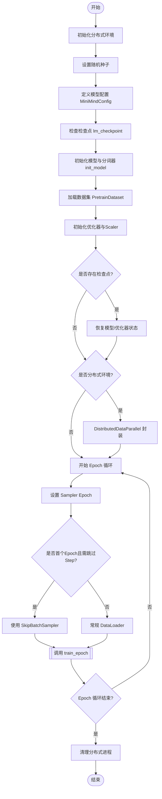
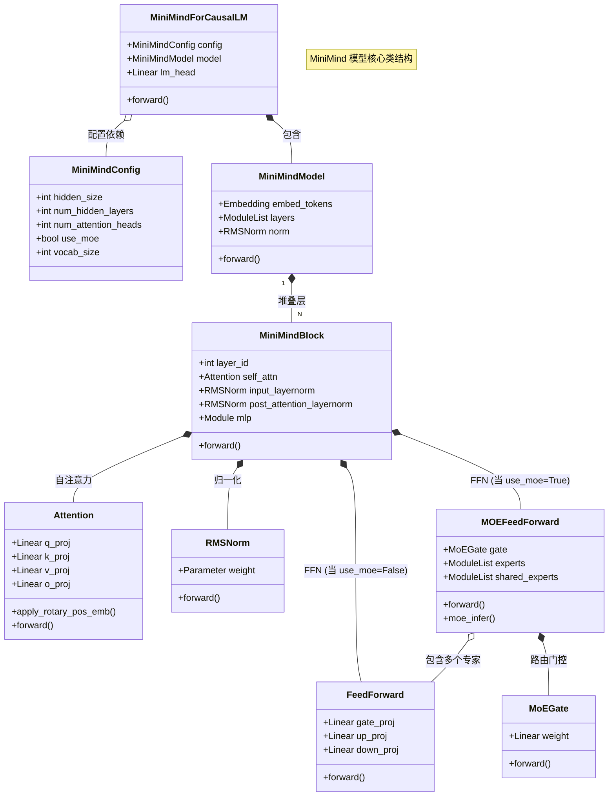

# 从头开始训练自己的大模型 - 流程图

基于 `从头开始训练自己的大模型.py` 代码的训练流程分析。

## 1. 整体训练流程



## 2. 训练循环详情 (train_epoch)


## 3. 模型组件架构 (Class Diagram)



## 4. 关键组件说明

*   **MiniMindConfig**: 模型的配置中心，定义了模型大小、层数、头数以及是否开启 MoE 等关键超参数。
*   **MiniMindForCausalLM**: 顶层封装，包含基础 Transformer 模型 (`MiniMindModel`) 和语言模型头 (`lm_head`)，用于生成任务。
*   **MiniMindModel**: 不含 Head 的基础模型，负责 Token Embedding、多层 Decoder 堆叠以及最终的 RMSNorm。
*   **MiniMindBlock**: 单个 Transformer Decoder 层，采用 Pre-Norm 结构，包含 Self-Attention 和 FFN/MoE。
*   **Attention**: 支持 GQA (Grouped Query Attention) 和 RoPE (Rotary Positional Embeddings) 的注意力机制，包含 Flash Attention 优化。
*   **FeedForward (SwiGLU)**: 标准的 SwiGLU 前馈网络，用于 Dense 模式或作为 MoE 的专家单元。
*   **MOEFeedForward**: 混合专家模块，包含一个门控网络 (`MoEGate`) 和多个专家网络 (`experts`/`shared_experts`)。
*   **MoEGate**: 路由网络，计算输入 Token 对各个专家的权重（Top-K 路由）。

---

# 代码通俗解读：教小明学写小说 (第一话：准备教材)

为了让你彻底看懂这段代码，我们将贯穿使用一个核心例子：**教一个完全不懂中文的外国留学生“小明”（MiniMind）学习写中文小说。**

这一话，我们先讲讲怎么给小明准备教材（数据载入）。

## 1. 什么是 Tokenizer (分词器)？

在代码里，你会看到 `tokenizer` 这个东西。

```python
# 代码片段 (init_model 函数中)
tokenizer = AutoTokenizer.from_pretrained(tokenizer_path)
```

**通俗解释**：
小明是外国人，他看不懂汉字“苹果”，但他能看懂数字。
**Tokenizer 就是一本《汉字-数字对照字典》。**
*   它查到“苹”是第 1023 号，“果”是第 45 号。
*   所以，当你给小明看“苹果”时，其实是塞给他一张纸条，上面写着 `[1023, 45]`。

---

## 2. 制作练习册：`PretrainDataset`

光有字典不行，还得有课本。`PretrainDataset` 就是负责把乱七八糟的小说文本，整理成小明能做的**练习题**。

### 原始代码

```python
class PretrainDataset(Dataset):
    def __init__(self, data_path, tokenizer, max_length=512):
        super().__init__()
        self.tokenizer = tokenizer
        self.max_length = max_length
        # 1. 加载所有的文本数据 (比如几千本小说)
        self.samples = load_dataset('json', data_files=data_path, split='train')

    def __len__(self):
        return len(self.samples)

    def __getitem__(self, index):
        sample = self.samples[index]
        # 2. 把文字变成数字 (查字典)
        # padding='max_length': 不够长就补0
        # truncation=True: 太长了就咔嚓剪掉
        encoding = self.tokenizer(
            str(sample['text']),
            max_length=self.max_length,
            padding='max_length',
            truncation=True,
            return_tensors='pt'
        )
        input_ids = encoding.input_ids.squeeze()
        labels = input_ids.clone()
        # 3. 把补0的地方标记为 -100 (不用考)
        labels[input_ids == self.tokenizer.pad_token_id] = -100
        return input_ids, labels
```

### 通俗解释

**场景**：你要给小明出填空题。
1.  **`load_dataset` (买书)**：你去书店买了一堆小说回来，比如《西游记》、《红楼梦》。
2.  **`__getitem__` (出题)**：
    *   **抽一篇**：你随手拿起一本《西游记》的某一章。
    *   **`self.tokenizer` (翻译)**：把这一章的汉字全部查字典变成数字。
    *   **`max_length=512` & `truncation` (剪裁)**：小明的桌子只有 512 格那么大。如果这章有 1000 字，多出来的咔嚓剪掉；如果只有 100 字，后面留空。
    *   **`padding` (补全)**：对于不够长的文章，后面的格子填上 `0` (代表空白)。
    *   **`labels` (标准答案)**：
        *   小明的任务是：看着现在的字，猜下一个字。
        *   所以**题目**是整篇文章，**答案**也是整篇文章（稍微错位一下，模型内部会自动处理这个错位）。
        *   **`-100` 是什么？** 对于那些补全的 `0` (空白格)，老师不需要小明去猜，所以把答案标记为 `-100`，意思是“这题不算分，不用做”。

---

## 3. 断点续学：`SkipBatchSampler`

如果小明学到一半停电了，第二天怎么接着学？

### 原始代码

```python
class SkipBatchSampler(Sampler):
    def __init__(self, sampler, batch_size, skip_batches=0):
        self.sampler = sampler
        self.batch_size = batch_size
        self.skip_batches = skip_batches # 之前学过多少捆

    def __iter__(self):
        batch = []
        skipped = 0
        for idx in self.sampler:
            batch.append(idx)
            if len(batch) == self.batch_size:
                # 如果这捆是之前学过的，直接扔掉
                if skipped < self.skip_batches:
                    skipped += 1
                    batch = []
                    continue
                yield batch # 没学过的，拿去给小明
                batch = []
        # ...
```

### 通俗解释

**场景**：
*   昨天小明已经学了 100 捆练习题。
*   今天重新开始上课，你不想让他从第 1 捆开始重做。
*   **`SkipBatchSampler`** 就是一个**记性好的助教**。他会数数：“第 1 捆...学过了，扔掉；第 2 捆...学过了，扔掉... 第 101 捆！好的，这个没学过，小明给你！”

---

## 4. 发卷子：`DataLoader`

最后，怎么把这些题目发给小明？

### 原始代码

```python
# 主程序中的代码
loader = DataLoader(
    train_ds, 
    batch_size=batch_size, 
    shuffle=(train_sampler is None),
    num_workers=num_workers, 
    pin_memory=True
)
```

### 通俗解释

**场景**：
*   **`batch_size=32` (批量)**：你觉得小明如果一张一张做题太慢了。于是你规定：**一次发 32 张卷子**。小明可以同时扫视这 32 张卷子，利用他的“并行大脑”（GPU）一起思考。这样效率高很多。
*   **`shuffle=True` (洗牌)**：为了防止小明死记硬背（比如记住第一题答案永远是A），你每次发卷子前都把顺序**打乱**。
*   **`num_workers=8` (助教团)**：你自己一个人从书架上拿书、翻译、剪裁太慢了，跟不上小明做题的速度。所以你雇了 **8 个助教**，他们在后台拼命地准备卷子，整理好一捆一捆地递给你，确保小明的手永远不闲着。

---

**下集预告**：
教材准备好了，小明怎么开始动脑子做题？什么是“注意力”？请看下一话：**模型架构篇**。
