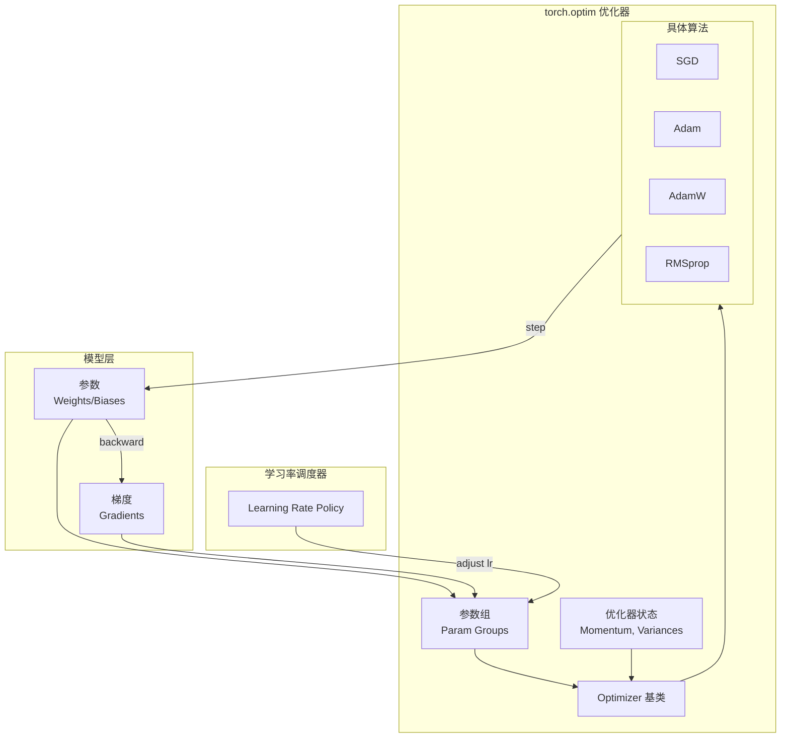

> **摘要**：`torch.optim` 是 PyTorch 中实现各种优化算法的核心库，涵盖了从经典的 SGD 到现代的 AdamW、RAdam 等多种优化器，并提供了灵活的学习率调度器（LR Scheduler）。本文将从架构设计、底层原理及工程实践三个维度，对 `torch.optim` 进行全面解析。

## 1. 模块概览

`torch.optim` 的设计遵循了 **"优化器与模型解耦"** 的原则。优化器仅负责更新参数，而不需要知道模型的具体结构，这通过管理参数组（Parameter Groups）来实现。

### 1.1 架构设计



## 2. 核心组件详解

### 2.1 Optimizer 基类
所有优化器都继承自 `torch.optim.Optimizer`，其核心职责包括：
1.  **管理参数组 (`param_groups`)**：允许对模型的不同部分（如特征提取层与分类头）设置不同的超参数（如学习率、权重衰减）。
2.  **维护状态 (`state`)**：存储动量（Momentum）、二阶矩（Variance）等历史信息。
3.  **执行更新 (`step`)**：根据梯度和状态更新参数。

### 2.2 常用优化器对比

| 优化器 | 特点 | 适用场景 | 关键公式 |
| :--- | :--- | :--- | :--- |
| **SGD** | 随机梯度下降，支持动量 | 计算机视觉 (CV)，需精细调参 | $w_{t+1} = w_t - \eta \cdot (g_t + \mu v_t)$ |
| **Adam** | 自适应学习率，结合动量与RMSProp | 自然语言处理 (NLP)，快速收敛 | $w_{t+1} = w_t - \eta \frac{\hat{m}_t}{\sqrt{\hat{v}_t} + \epsilon}$ |
| **AdamW** | Adam + 解耦权重衰减 (Decoupled Weight Decay) | Transformer, 大模型训练 (Standard) | 修复了 Adam 中 L2 正则化的实现问题 |
| **RMSprop** | 自适应学习率，仅使用二阶矩 | RNN, 强化学习 (RL) | 适用于非平稳目标函数 |

### 2.3 学习率调度器 (LR Scheduler)
`torch.optim.lr_scheduler` 提供了动态调整学习率的策略，这对于模型收敛至关重要。
*   **StepLR / MultiStepLR**：阶梯式衰减。
*   **CosineAnnealingLR**：余弦退火，常用于从头训练大模型。
*   **ReduceLROnPlateau**：当验证集指标不再提升时降低学习率。
*   **OneCycleLR / LinearLR**：包含预热（Warmup）阶段，防止训练初期梯度爆炸。

## 3. 算法原理与实现细节

### 3.1 Adam vs AdamW
Adam 的权重衰减（Weight Decay）通常被实现为 L2 正则化（即在 Loss 上加 $\lambda ||w||^2$）。但在自适应学习率算法中，这种方式会导致权重衰减与梯度更新耦合。
**AdamW** 将权重衰减项直接作用于参数更新步骤：
$$ w_{t+1} = w_t - \eta (\dots) - \eta \lambda w_t $$
这种解耦使得 AdamW 在 Transformer 等模型上的泛化能力显著优于 Adam。

### 3.2 梯度清零 (zero_grad)
PyTorch 默认会**累加梯度**（`grad += ...`），这在多任务学习或梯度累积（Gradient Accumulation）场景下非常有用。但在常规训练中，必须在 `backward()` 前调用 `optimizer.zero_grad()`。
> **性能优化**：使用 `optimizer.zero_grad(set_to_none=True)` 可以通过直接将 `.grad` 设为 `None` 来节省显存访问开销。

## 4. 工程实践与代码范式

### 4.1 基础训练循环
```python
import torch
import torch.nn as nn
import torch.optim as optim

# 1. 定义模型与数据
model = nn.Linear(10, 1)
data_loader = ... 

# 2. 定义优化器
optimizer = optim.AdamW(model.parameters(), lr=1e-3, weight_decay=0.01)

# 3. 定义学习率调度器
scheduler = optim.lr_scheduler.CosineAnnealingLR(optimizer, T_max=100)

# 4. 训练循环
for epoch in range(100):
    for inputs, targets in data_loader:
        # 清零梯度 (推荐 set_to_none=True)
        optimizer.zero_grad(set_to_none=True)
        
        # 前向 + 反向
        outputs = model(inputs)
        loss = nn.MSELoss()(outputs, targets)
        loss.backward()
        
        # 梯度裁剪 (防止梯度爆炸)
        torch.nn.utils.clip_grad_norm_(model.parameters(), max_norm=1.0)
        
        # 参数更新
        optimizer.step()
    
    # 更新学习率
    scheduler.step()
```

### 4.2 差异化参数设置 (Per-layer Learning Rate)
对于微调（Fine-tuning）任务，通常希望底层的学习率较小（保留预训练特征），顶层学习率较大。

```python
# 区分参数组
backbone_params = [p for n, p in model.named_parameters() if "backbone" in n]
head_params = [p for n, p in model.named_parameters() if "head" in n]

optimizer = optim.SGD([
    {'params': backbone_params, 'lr': 1e-4}, # 底层 LR 较小
    {'params': head_params, 'lr': 1e-2}      # 顶层 LR 较大
], momentum=0.9)
```

## 5. 最佳实践

1.  **首选 AdamW**：对于大多数深度学习任务（尤其是 Transformer），AdamW 是默认且稳健的选择。
2.  **使用 Warmup**：配合 `LinearLR` 或 `OneCycleLR` 进行学习率预热，能有效提高训练稳定性。
3.  **梯度裁剪**：始终使用 `clip_grad_norm_`，特别是在训练 LSTM 或深层 Transformer 时。
4.  **保存状态**：保存 Checkpoint 时，不仅要保存 `model.state_dict()`，还要保存 `optimizer.state_dict()`，以便恢复动量信息。

## 6. 参考资料

1.  [PyTorch Documentation - torch.optim](https://docs.pytorch.org/docs/stable/optim.html)
2.  [PyTorch Tutorial - Optimizing Model Parameters](https://pytorch.org/tutorials/beginner/basics/optimization_tutorial.html)
3.  [Decoupled Weight Decay Regularization (AdamW Paper)](https://arxiv.org/abs/1711.05101)
