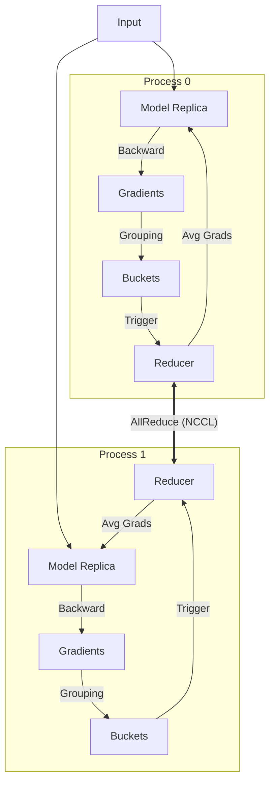

## 1. 概述

`torch.nn.parallel.DistributedDataParallel` (DDP) 是 PyTorch 官方推荐的分布式训练解决方案。与单进程多线程的 `DataParallel` 不同，DDP 采用**多进程架构**（Multi-Process），每个 GPU 对应一个独立的进程。这种架构不仅避免了 Python GIL（全局解释器锁）带来的性能限制，还支持跨多节点的扩展。

DDP 的核心目标是实现**透明的**分布式数据并行训练：它自动管理模型副本的初始化、梯度的同步以及通信与计算的重叠，使得用户编写分布式训练代码时，几乎感觉不到与单卡训练的区别。

## 2. 核心架构与工作流

DDP 的工作流程可以分为构建（Construction）、前向传播（Forward Pass）、反向传播（Backward Pass）和优化步骤（Optimizer Step）四个阶段。

### 2.1 预备与构建 (Prerequisite & Construction)

DDP 依赖于 `c10d` 库中的 `ProcessGroup` 进行底层通信（通常使用 NCCL 后端以获得最佳 GPU 性能）。

1.  **进程组初始化**：在构建 DDP 实例前，必须先初始化 `ProcessGroup`。
2.  **状态广播 (State Broadcast)**：DDP 构造函数会将 `rank 0` 进程上的模型 `state_dict()` 广播到所有其他进程，确保所有模型副本在训练开始时具有完全一致的权重。
3.  **Reducer 初始化与分桶 (Bucketing)**：
    *   每个 DDP 进程会创建一个本地的 `Reducer`。
    *   `Reducer` 负责在反向传播期间同步梯度。
    *   为了提高通信效率，参数的梯度被组织成**桶 (Buckets)**。DDP 按照模型参数的逆序（大致对应反向传播的顺序）将它们分配到不同的桶中。
    *   `Reducer` 为每个参数注册 **Autograd Hooks**。

### 2.2 前向传播 (Forward Pass)

1.  DDP 将输入数据传递给本地模型副本。
2.  如果 `find_unused_parameters=True`，DDP 会在本地模型输出后遍历 Autograd 图，标记那些未参与计算的参数为“Ready”，以便 Reducer 不会无限期等待它们的梯度。这会带来额外的开销。

### 2.3 反向传播 (Backward Pass) —— 核心机制

这是 DDP 这种架构最复杂也最精彩的部分。`backward()` 直接在 Loss Tensor 上调用，DDP 通过之前注册的 Autograd Hooks 介入。

1.  **梯度就绪 (Gradient Ready)**：当某个参数的梯度计算完成时，对应的 Hook 被触发，该参数在 `Reducer` 中被标记为 Ready。
2.  **桶就绪与异步通信**：当一个桶内的所有参数梯度都 Ready 后，`Reducer` 立即启动该桶的异步 `AllReduce` 操作（计算所有进程梯度的平均值）。
3.  **计算与通信重叠 (Overlap)**：由于 `AllReduce` 是异步的，后续层的梯度计算可以与当前层的梯度通信并行进行。这是 DDP 高效的关键。
4.  **等待同步**：在所有桶的 `AllReduce` 启动后，`Reducer` 会阻塞等待所有通信完成，并将平均后的梯度写回 `param.grad`。

### 2.4 优化步骤 (Optimizer Step)

由于此时所有进程上的 `param.grad` 已经是全局平均后的梯度（且所有进程完全一致），优化器在每个进程上独立执行 `step()` 更新参数，即可保证模型副本在更新后依然保持一致。

## 3. 关键优化技术

### 3.1 梯度分桶 (Gradient Bucketing)

如果对每个参数单独进行 `AllReduce`，会产生数以千计的小型通信操作，导致严重的网络延迟和开销。DDP 将多个参数的梯度打包进一个 **Bucket**（默认大小 25MB），对整个 Bucket 执行一次 `AllReduce`。

*   **逆序分桶**：DDP 尝试按参数在网络中**反向**出现的顺序进行分桶。
*   **优势**：靠近输出层的参数梯度最先计算完成，它们所在的 Bucket 可以尽早发送，最大化重叠时间。

### 3.2 计算与通信重叠 (Communication-Computation Overlap)

DDP 不需要等待整个 Backward Pass 结束才开始同步。
如下图所示，`Layer 1` 的梯度计算完成后，立即开始通信；与此同时，GPU 继续计算 `Layer 2` 的梯度。

```mermaid
gantt
    dateFormat  s
    axisFormat  %S
    title DDP Backward Pass: Overlap Mechanism
    
    section Compute (GPU)
    Grad Layer N      :active,  0, 1
    Grad Layer N-1    :active,  1, 2
    Grad Layer N-2    :active,  2, 3
    Grad Layer ...    :active,  3, 4
    
    section Comm (NCCL)
    Wait              :done,    0, 1
    AllReduce Bkt 1   :crit,    1, 3
    AllReduce Bkt 2   :crit,    3, 5
```



### 3.3 梯度累积与 `no_sync`

在进行梯度累积（Gradient Accumulation）时，我们不希望每一步都进行通信。DDP 提供了 `no_sync` 上下文管理器。
在 `no_sync` 块内，DDP 的 Autograd Hooks 不会触发梯度同步，梯度只会在本地累加。只有在 `no_sync` 块之外的最后一次 backward 时，才会触发同步。

```python
model = DDP(model)
with model.no_sync():
    for _ in range(accumulation_steps - 1):
        loss = model(inputs)
        loss.backward()  # 只累积，不通信
# 最后一步，通信并更新
loss = model(inputs)
loss.backward()
optimizer.step()
```

## 4. 完整代码实践 (Code Implementation)

以下是一个完整的单机多卡（Single-Node Multi-GPU）DDP 训练示例。它展示了从进程组初始化、数据分片、模型包装到训练循环的标准流程。

```python
import os
import torch
import torch.distributed as dist
import torch.multiprocessing as mp
import torch.nn as nn
import torch.optim as optim
from torch.nn.parallel import DistributedDataParallel as DDP
from torch.utils.data import DataLoader, DistributedSampler, TensorDataset

def setup(rank, world_size):
    """
    初始化分布式进程组。
    
    Args:
        rank: 当前进程的全局序号 (0 ~ world_size-1)
        world_size: 总进程数 (通常等于 GPU 数量)
    """
    os.environ['MASTER_ADDR'] = 'localhost'
    os.environ['MASTER_PORT'] = '12355'

    # 初始化进程组
    # backend: GPU 训练强烈推荐使用 'nccl'
    # init_method: 初始化方法，这里使用环境变量
    dist.init_process_group("nccl", rank=rank, world_size=world_size)
    
    # 设置当前进程使用的 GPU 设备
    torch.cuda.set_device(rank)

def cleanup():
    """销毁进程组，释放资源"""
    dist.destroy_process_group()

class ToyModel(nn.Module):
    def __init__(self):
        super(ToyModel, self).__init__()
        self.net1 = nn.Linear(10, 10)
        self.relu = nn.ReLU()
        self.net2 = nn.Linear(10, 5)

    def forward(self, x):
        return self.net2(self.relu(self.net1(x)))

def demo_basic(rank, world_size):
    """
    DDP 训练主函数，将在每个进程中运行。
    """
    print(f"Running basic DDP example on rank {rank}.")
    setup(rank, world_size)

    # 1. 准备模型
    # 将模型移动到对应的 GPU
    model = ToyModel().to(rank)
    # 使用 DDP 包装模型
    # device_ids: 指定模型所在的 GPU
    ddp_model = DDP(model, device_ids=[rank])

    # 2. 准备数据
    # 创建模拟数据集
    dataset = TensorDataset(torch.randn(100, 10), torch.randn(100, 5))
    
    # 关键：使用 DistributedSampler
    # 它负责将数据集切分，确保每个进程读取不同的数据子集
    sampler = DistributedSampler(dataset, num_replicas=world_size, rank=rank)
    
    # DataLoader 需要设置 shuffle=False (shuffle 由 sampler 控制)
    dataloader = DataLoader(dataset, batch_size=20, sampler=sampler)

    # 3. 定义损失函数和优化器
    loss_fn = nn.MSELoss()
    optimizer = optim.SGD(ddp_model.parameters(), lr=0.001)

    # 4. 训练循环
    for epoch in range(10):
        # 关键：每个 epoch 开始前设置 sampler 的 epoch
        # 这样能保证每个 epoch 的数据 shuffle 方式不同
        sampler.set_epoch(epoch)
        
        for batch_idx, (data, target) in enumerate(dataloader):
            # 将数据移动到对应的 GPU
            data, target = data.to(rank), target.to(rank)
            
            optimizer.zero_grad()
            output = ddp_model(data)
            loss = loss_fn(output, target)
            loss.backward()
            optimizer.step()
            
            if rank == 0 and batch_idx % 2 == 0:
                print(f"Epoch {epoch} | Batch {batch_idx} | Loss {loss.item()}")

    cleanup()

def run_demo():
    """
    启动多进程训练。
    假设我们有 2 个 GPU。
    """
    n_gpus = torch.cuda.device_count()
    if n_gpus < 2:
        print(f"Requires at least 2 GPUs to run, but got {n_gpus}.")
        return

    world_size = n_gpus
    # mp.spawn 自动生成 world_size 个进程
    # 每个进程执行 demo_basic(rank, world_size)
    mp.spawn(demo_basic,
             args=(world_size,),
             nprocs=world_size,
             join=True)

if __name__ == "__main__":
    # 实际运行时调用 run_demo()
    # run_demo() 
    pass
```

### 4.1 代码关键点解析

1.  **DistributedSampler**: 这是数据并行的关键。它根据 `rank` 和 `world_size` 将数据集划分为不重叠的子集。务必在每个 epoch 开始时调用 `sampler.set_epoch(epoch)` 以获得随机的 shuffle 效果。
2.  **DDP Wrapper**: `DDP(model, device_ids=[rank])` 负责处理梯度的 all-reduce。注意 `device_ids` 必须正确设置。
3.  **setup/cleanup**: 分布式环境的生命周期管理是必须的。

## 5. 架构示意图



## 6. 实现细节与组件

| 组件 | 描述 | 源码位置 |
| :--- | :--- | :--- |
| **distributed.py** | Python 入口，实现 `nn.Module` 包装，负责初始化和 Forward 调用。 | `torch/nn/parallel/distributed.py` |
| **Reducer** | C++ 核心组件，管理 Buckets，注册 Autograd Hooks，执行 AllReduce。 | `torch/csrc/distributed/c10d/reducer.h` |
| **ProcessGroup** | 抽象通信接口，提供 `broadcast`, `allreduce` 等原语。实现包括 NCCL, Gloo, MPI。 | `torch/lib/c10d/ProcessGroup.hpp` |
| **comm.h** | 提供 Coalesced Broadcast 辅助函数，用于初始化时的状态同步。 | `torch/csrc/distributed/c10d/comm.h` |

## 7. 参考资料

1.  [PyTorch Documentation: Distributed Data Parallel](https://docs.pytorch.org/docs/main/notes/ddp.html)
2.  [Medium: Demystifying PyTorch Distributed Data Parallel (DDP)](https://medium.com/@arjunsrinivasan.a/demystifying-pytorch-distributed-data-parallel-ddp-an-inside-look-6d0d42a645ff)
3.  [arXiv:2006.15704: PyTorch Distributed: Experiences on Accelerating Data Parallel Training](https://arxiv.org/abs/2006.15704)
