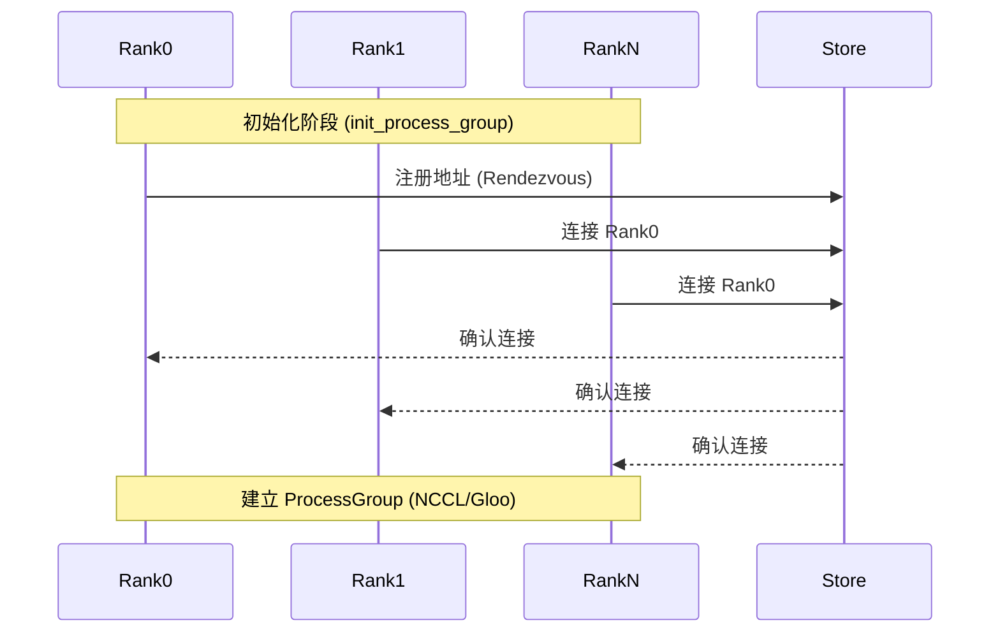
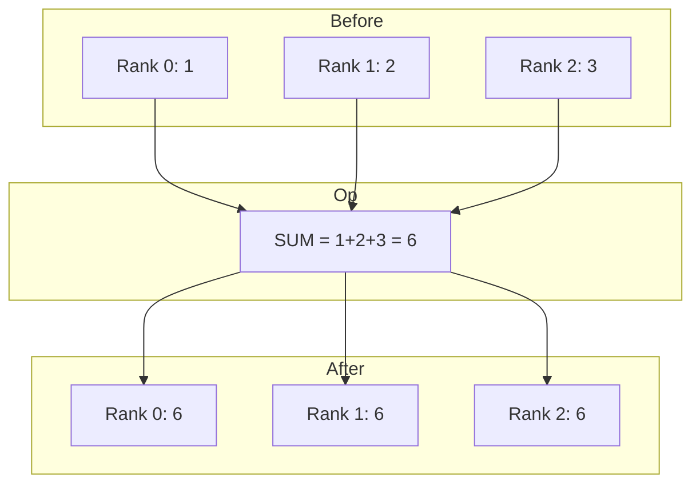
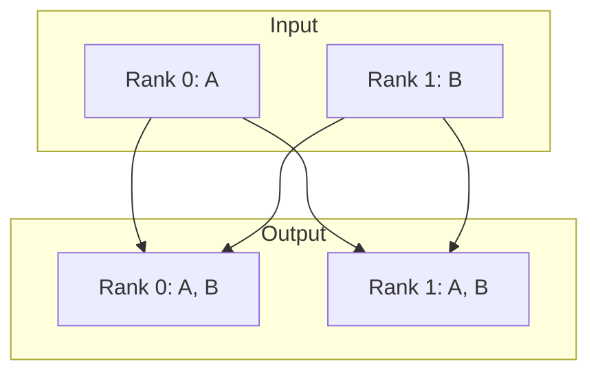

# PyTorch 分布式通信原语与常用 API 详解

`torch.distributed` 模块是 PyTorch 分布式并行计算的核心，提供了底层的进程间通信（IPC）原语和高层的分布式训练封装。本文档深入解析该模块的核心 API，涵盖环境初始化、进程组管理、点对点通信（P2P）及集合通信（Collective Communication）。

## 1. 分布式环境初始化

分布式任务的第一步是建立进程间的连接并初始化通信后端。

### `torch.distributed.init_process_group`

该函数负责初始化默认的分布式进程组（Process Group）。在调用任何其他 `distributed` 函数之前，必须先调用此函数。

**函数签名**：
```python
torch.distributed.init_process_group(
    backend: Optional[str] = None,
    init_method: Optional[str] = None,
    timeout: Optional[timedelta] = None,
    world_size: int = -1,
    rank: int = -1,
    store: Optional[Store] = None,
    group_name: str = '',
    pg_options: Optional[ProcessGroupOptions] = None
)
```

**关键参数详解**：
*   **`backend` (str)**: 通信后端。
    *   `nccl`: **GPU 训练首选**。NVIDIA Collective Communications Library，针对 CUDA Tensor 进行了高度优化，支持跨节点和单节点多 GPU 通信。
    *   `gloo`: **CPU 训练首选**。Facebook 开发的跨平台通信库，支持 CPU Tensor。在 GPU 训练中常用于协调控制平面（如 `barrier`）或作为 NCCL 的备用。
    *   `mpi`: Message Passing Interface，依赖外部 MPI 实现（如 OpenMPI）。需要从源码重新编译 PyTorch 才能启用。
*   **`init_method` (str)**: 初始化发现机制。
    *   `env://`: 读取环境变量（`MASTER_ADDR`, `MASTER_PORT`, `WORLD_SIZE`, `RANK`）。这是 `torchrun` 或 `torch.distributed.launch` 的默认方式。
    *   `tcp://<ip>:<port>`: 指定 Rank 0 的 IP 和端口。所有进程通过 TCP 握手。
    *   `file://<path>`: 使用共享文件系统中的文件进行同步。
*   **`world_size` (int)**: 全局进程总数。
*   **`rank` (int)**: 当前进程的全局序号（0 到 `world_size - 1`）。

**架构图：初始化流程**


---

## 2. 进程组状态查询

初始化后，使用以下 API 获取环境信息，通常用于控制逻辑分支（如只在 Rank 0 打印日志）。

*   **`torch.distributed.get_rank(group=None) -> int`**: 获取当前进程的 Rank ID。
*   **`torch.distributed.get_world_size(group=None) -> int`**: 获取进程组内的进程总数。
*   **`torch.distributed.is_initialized() -> bool`**: 检查分布式环境是否已初始化。

---

## 3. 集合通信 (Collective Communication)

集合通信涉及进程组内的所有进程，是分布式训练（如梯度同步）的基础。以下 API 均为原地操作（In-place）或接收预分配的 Tensor。

### 3.1 归约与同步 (Reduce & Synchronization)

#### `torch.distributed.all_reduce`
将所有进程的 Tensor 进行归约操作（如求和），并将结果广播回所有进程。

**函数签名**：
```python
torch.distributed.all_reduce(tensor, op=ReduceOp.SUM, group=None, async_op=False)
```
*   `tensor`: 输入和输出共用的 Tensor（In-place 修改）。
*   `op`: 归约操作类型，包括 `SUM`, `PRODUCT`, `MIN`, `MAX`, `BAND`, `BOR`, `BXOR`。

**原理图示**：


#### `torch.distributed.barrier`
同步路障。阻塞所有调用此函数的进程，直到组内所有进程都调用了该函数。用于确保某个阶段（如数据预处理、模型保存）所有进程都已完成。

---

### 3.2 收集与分发 (Gather & Scatter)

#### `torch.distributed.all_gather`
收集所有进程的 Tensor，结果由所有进程持有。

**函数签名**：
```python
torch.distributed.all_gather(tensor_list, tensor, group=None, async_op=False)
```
*   `tensor_list`: 输出列表，包含 `world_size` 个 Tensor。
*   `tensor`: 当前进程发送的 Tensor。

**原理图示**：


#### `torch.distributed.broadcast`
将某个进程（`src`）的 Tensor 广播给所有其他进程。

**函数签名**：
```python
torch.distributed.broadcast(tensor, src, group=None, async_op=False)
```

---

## 4. 点对点通信 (Point-to-Point Communication)

涉及两个特定进程之间的数据传输。支持同步和异步（Async）两种模式。

*   **`torch.distributed.send(tensor, dst, group=None, tag=0)`**: 同步发送。
*   **`torch.distributed.recv(tensor, src=None, group=None, tag=0)`**: 同步接收。会将数据写入 `tensor`。
*   **`torch.distributed.isend` / `irecv`**: 异步版本，返回 `Request` 对象，需调用 `wait()` 等待完成。

**注意**：使用 P2P 通信时需极其小心死锁（Deadlock）。例如两个进程互相等待对方发送数据。

---

## 5. 进阶：进程组管理 (Groups)

默认情况下，操作作用于全局默认进程组。但在模型并行（Model Parallelism）或专家混合模型（MoE）中，需要创建子组。

### `torch.distributed.new_group`
创建一个新的子进程组。

**函数签名**：
```python
torch.distributed.new_group(ranks=None, timeout=None, backend=None)
```
*   `ranks` (list[int]): 子组包含的全局 Rank 列表。

**示例**：
```python
# 假设 World Size = 4
# 创建两个子组：[0, 1] 和 [2, 3]
group1 = dist.new_group([0, 1])
group2 = dist.new_group([2, 3])

# 仅在组内进行 all_reduce
if dist.get_rank() in [0, 1]:
    dist.all_reduce(tensor, group=group1)
```

---

## 6. 总结

| API 类别 | 核心函数 | 典型应用场景 |
| :--- | :--- | :--- |
| **初始化** | `init_process_group` | 启动分布式环境，建立连接。 |
| **状态查询** | `get_rank`, `get_world_size` | 区分 Master/Worker 逻辑，配置数据分片。 |
| **规约** | `all_reduce` | **DDP 梯度同步**，计算全局 Loss 平均值。 |
| **同步** | `barrier` | 确保初始化完成，防止部分进程抢跑。 |
| **收集** | `all_gather` | 跨卡 Batch Norm，搜集评估结果。 |
| **广播** | `broadcast` | 初始化时同步模型参数，确保起点一致。 |
| **P2P** | `send`/`recv` | 流水线并行（Pipeline Parallelism）传递 Activation/Gradient。 |

掌握这些底层 API 对于理解 `DistributedDataParallel` (DDP) 的工作原理以及实现自定义的分布式算法（如 Tensor Parallelism, Pipeline Parallelism）至关重要。
