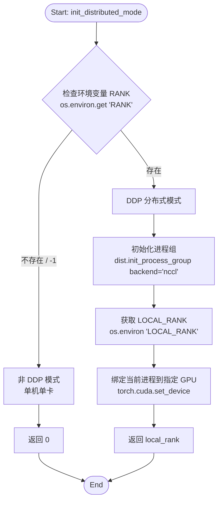

```python

def init_distributed_mode():
    if int(os.environ.get("RANK", -1)) == -1:
        return 0  # 非DDP模式

    dist.init_process_group(backend="nccl")
    local_rank = int(os.environ["LOCAL_RANK"])
    torch.cuda.set_device(local_rank)
    return local_rank

```

### 执行流程



### 代码解释

这段代码用于初始化 PyTorch 分布式训练环境（DDP - DistributedDataParallel）。

#### 1. 检查是否为分布式环境
```python
if int(os.environ.get("RANK", -1)) == -1:
    return 0  # 非DDP模式
```
- **`os.environ.get("RANK", -1)`**: 尝试获取环境变量 `RANK`。
- 如果获取不到，说明当前未通过分布式启动器运行，直接返回 0（默认为单卡模式）。

#### 2. 初始化进程组
```python
dist.init_process_group(backend="nccl")
```
- **`dist.init_process_group`**: 启用分布式通信的核心步骤。
- **`backend="nccl"`**: 指定通信后端。`nccl` (NVIDIA Collective Communications Library) 是 NVIDIA GPU 分布式训练推荐的后端，性能最佳。

#### 3. 获取 Local Rank 并绑定设备
```python
local_rank = int(os.environ["LOCAL_RANK"])
torch.cuda.set_device(local_rank)
```
- **`LOCAL_RANK`**: 表示当前进程在**当前物理节点（机器）**上的序号。
- **`torch.cuda.set_device(local_rank)`**: **关键步骤**。将当前进程绑定到对应的 GPU 上，防止所有进程争抢默认的 0 号显卡。

#### 4. 返回设备 ID
```python
return local_rank
```
- 返回 `local_rank` 供后续代码使用。

### 补充：关于 RANK 和 LOCAL_RANK

这两个环境变量通常**不是由开发者手动设置的**，而是由 **PyTorch 的分布式启动工具**（如 `torchrun`）在启动时自动注入到每个子进程中的。

#### 1. RANK 与 LOCAL_RANK 的区别

| 变量名 | 定义 | 作用 | 取值范围 |
| :--- | :--- | :--- | :--- |
| **RANK** | **全局进程 ID** | 整个分布式任务中唯一的身份标识。用于进程间通信（如 AllReduce）。 | `0` 到 `WORLD_SIZE - 1` |
| **LOCAL_RANK** | **本地进程 ID** | 当前物理机器（Node）上的进程序号。用于**选择 GPU 设备**。 | `0` 到 `NPROC_PER_NODE - 1` |

#### 2. 举例说明（多机多卡）

假设你进行**双机训练**，每台机器有 **4 张显卡**（总共 8 张卡，8 个进程）。

*   **机器 A (Node 0)**:
    *   显卡 0: `RANK=0`, `LOCAL_RANK=0`
    *   显卡 1: `RANK=1`, `LOCAL_RANK=1`
    *   显卡 2: `RANK=2`, `LOCAL_RANK=2`
    *   显卡 3: `RANK=3`, `LOCAL_RANK=3`

*   **机器 B (Node 1)**:
    *   显卡 0: `RANK=4`, `LOCAL_RANK=0`  ← **注意：LOCAL_RANK 重新从 0 开始**
    *   显卡 1: `RANK=5`, `LOCAL_RANK=1`
    *   显卡 2: `RANK=6`, `LOCAL_RANK=2`
    *   显卡 3: `RANK=7`, `LOCAL_RANK=3`

> **为什么代码中使用 `LOCAL_RANK` 来设置设备？**
>
> 在机器 B 上，虽然全局 `RANK` 是 4，但这台机器上只有 ID 为 0, 1, 2, 3 的物理显卡。如果使用 `RANK` (4) 去调用 `torch.cuda.set_device(4)`，会因为找不到第 4 号显卡而报错。因此必须使用 `LOCAL_RANK` (0) 来绑定到机器 B 的第 1 张卡。
