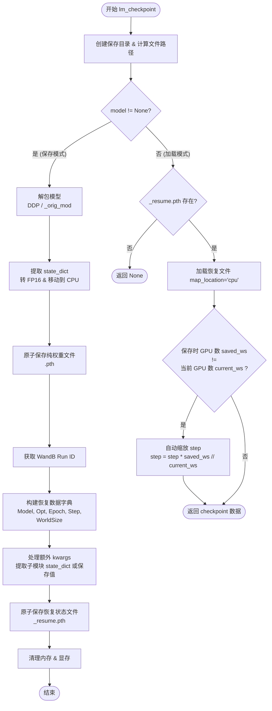

```python
def lm_checkpoint(lm_config, weight='full_sft', model=None, optimizer=None, epoch=0, step=0, wandb=None, save_dir='../checkpoints', **kwargs):
    """
    模型检查点保存与加载函数。
    
    Args:
        lm_config: 模型配置对象，用于获取 hidden_size 和是否使用 MoE。
        weight: 权重文件名标识，默认为 'full_sft'。
        model: 模型实例。如果不为 None，则执行保存操作；为 None 则执行加载操作。
        optimizer: 优化器实例，仅在保存时需要。
        epoch: 当前训练轮数。
        step: 当前训练步数。
        wandb: Weights & Biases 实例，用于记录 run id 以便断点续传。
        save_dir: 检查点保存目录。
        **kwargs: 其他需要保存的对象（如 scheduler），如果对象有 state_dict 方法会自动调用。
    
    Returns:
        加载模式下返回包含恢复信息的字典 (dict)，否则返回 None。
    """
    
    # 1. 准备保存目录和路径
    os.makedirs(save_dir, exist_ok=True)  # 确保目录存在
    moe_path = '_moe' if lm_config.use_moe else ''  # MoE 模型添加特殊后缀
    # 纯权重文件路径 (仅包含 model state_dict，体积小，用于推理)
    ckp_path = f'{save_dir}/{weight}_{lm_config.hidden_size}{moe_path}.pth'
    # 恢复文件路径 (包含 model, optimizer, step, epoch 等，用于断点续训)
    resume_path = f'{save_dir}/{weight}_{lm_config.hidden_size}{moe_path}_resume.pth'

    if model is not None:
        # ==================== 保存模式 ====================
        
        # 2. 解包模型 (Unwrap)
        # 如果是 DDP (分布式) 模型，取其 .module
        raw_model = model.module if isinstance(model, DistributedDataParallel) else model
        # 如果是 torch.compile 编译后的模型，取其 _orig_mod
        raw_model = getattr(raw_model, '_orig_mod', raw_model)
        
        # 3. 处理模型权重 (Save Model Weights)
        state_dict = raw_model.state_dict()
        # 将权重转为半精度 (FP16) 并移动到 CPU，节省存储空间和显存
        state_dict = {k: v.half().cpu() for k, v in state_dict.items()}
        
        # 4. 原子保存权重文件 (Atomic Save)
        ckp_tmp = ckp_path + '.tmp'
        torch.save(state_dict, ckp_tmp)  # 先写入临时文件
        os.replace(ckp_tmp, ckp_path)    # 原子替换，防止写入中断导致文件损坏
        
        # 5. 获取 WandB Run ID (用于恢复曲线)
        wandb_id = None
        if wandb:
            if hasattr(wandb, 'get_run'):
                run = wandb.get_run()
                wandb_id = getattr(run, 'id', None) if run else None
            else:
                wandb_id = getattr(wandb, 'id', None)

        # 6. 构建恢复数据字典 (Resume Data)
        resume_data = {
            'model': state_dict,                  # 模型权重
            'optimizer': optimizer.state_dict(),  # 优化器状态
            'epoch': epoch,                       # 当前 Epoch
            'step': step,                         # 当前 Step
            'world_size': dist.get_world_size() if dist.is_initialized() else 1, # 保存时的 GPU 数量
            'wandb_id': wandb_id                  # WandB ID
        }
        
        # 7. 处理额外的 kwargs (如 LR Scheduler)
        for key, value in kwargs.items():
            if value is not None:
                if hasattr(value, 'state_dict'):
                    # 如果是 DDP 或编译后的对象，同样需要解包
                    raw_value = value.module if isinstance(value, DistributedDataParallel) else value
                    raw_value = getattr(raw_value, '_orig_mod', raw_value)
                    resume_data[key] = raw_value.state_dict()
                else:
                    resume_data[key] = value

        # 8. 原子保存恢复文件
        resume_tmp = resume_path + '.tmp'
        torch.save(resume_data, resume_tmp)
        os.replace(resume_tmp, resume_path)
        
        # 9. 清理资源
        del state_dict, resume_data
        torch.cuda.empty_cache() # 释放显存
        
    else:
        # ==================== 加载模式 ====================
        
        if os.path.exists(resume_path):
            # 1. 加载恢复文件到 CPU
            ckp_data = torch.load(resume_path, map_location='cpu')
            
            # 2. 处理 GPU 数量变化带来的 Step 差异
            # 场景：例如 4 卡变 8 卡，Global Batch Size 翻倍，总 Step 数应减半
            saved_ws = ckp_data.get('world_size', 1)
            current_ws = dist.get_world_size() if dist.is_initialized() else 1
            
            if saved_ws != current_ws:
                ckp_data['step'] = ckp_data['step'] * saved_ws // current_ws
                Logger(f'GPU数量变化({saved_ws}→{current_ws})，step已自动转换为{ckp_data["step"]}')
            
            return ckp_data
        return None
```

## 代码详解

这段 `lm_checkpoint` 函数是一个通用的模型检查点（Checkpoint）管理工具，主要用于 PyTorch 训练过程中的**模型保存**和**断点恢复**。它考虑了分布式训练（DDP）、混合精度存储、原子写入以及 GPU 数量变化时的步数调整。

### 核心流程图



### 关键细节说明

1.  **文件命名策略**:
    *   根据 `lm_config.hidden_size` 和是否使用 MoE (`_moe`) 动态生成文件名，避免不同配置的模型混淆。
    *   生成两个文件：
        *   `xxx.pth`: 仅包含模型权重（fp16），体积较小，便于推理或分发。
        *   `xxx_resume.pth`: 包含模型权重、优化器状态、Epoch、Step 等所有恢复训练所需的信息。

2.  **原子写入 (Atomic Write)**:
    *   代码使用了 `保存到 .tmp` -> `os.replace` 的策略。
    *   **作用**: 防止在保存过程中程序中断（如断电、Kill），导致原来的 Checkpoint 文件损坏。`os.replace` 是原子操作，保证文件完整性。

3.  **兼容性处理 (Unwrap Model)**:
    *   自动处理 `DistributedDataParallel` (DDP) 包装的模型，通过 `.module` 获取原始模型。
    *   自动处理 `torch.compile` 优化后的模型（通常带有 `_orig_mod` 属性）。

4.  **存储优化**:
    *   `v.half().cpu()`: 保存前将模型权重转换为半精度 (FP16) 并移动到 CPU。这不仅节省了硬盘空间，也避免了保存时占用显存导致 OOM (Out Of Memory)。

5.  **kwargs 的灵活性**:
    *   函数接收 `**kwargs`，可以保存任意额外的对象（如 LR Scheduler）。
    *   如果对象有 `state_dict` 方法（如 Scheduler），会自动保存其状态字典；否则直接保存对象值。

6.  **智能步数调整 (World Size Scaling)**:
    *   在**加载模式**下，代码比较了“保存时的 GPU 数量”与“当前的 GPU 数量”。
    *   **场景**: 如果之前用 4 张卡训练，现在改用 8 张卡继续训练，全局 Batch Size 变大了，相同的 dataset 遍历一次所需的 step 数会变少。
    *   **处理**: `step = step * saved_ws // current_ws`。通过按比例缩放 step，尽量保持训练进度的逻辑一致性。