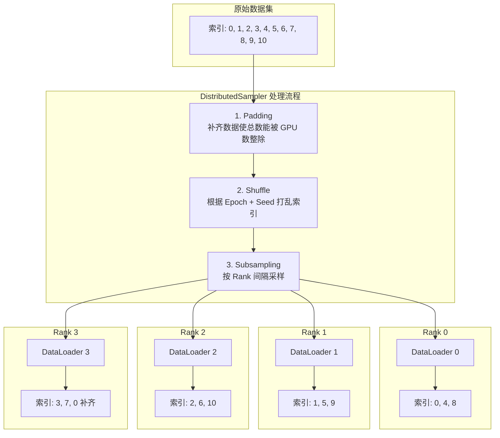

> **摘要**：在多机多卡或单机多卡的分布式训练（DDP）中，如何确保每个 GPU 既不重复读取数据、又能覆盖整个数据集？`torch.utils.data.distributed.DistributedSampler` 是 PyTorch 提供的标准解决方案。本文将深度剖析其工作原理、数学逻辑、核心参数以及在工程实践中的关键注意事项。

## 1. 核心作用与设计哲学

在单卡训练中，我们使用 `DataLoader` 配合 `RandomSampler`（随机打乱）或 `SequentialSampler`（顺序读取）来加载数据。但在分布式数据并行（Distributed Data Parallel, DDP）模式下，如果所有 GPU 都使用相同的 Sampler，它们将读取到完全相同的数据，这不仅浪费了计算资源，等效 Batch Size 也没有增加。

`DistributedSampler` 的核心职责是：**将整个数据集切分成 N 份（N = GPU 总数），确保每个 GPU 在每个 Epoch 中只读取属于它的那一份子集。**

### 1.1 架构原理图



## 2. 算法细节详解

假设数据集长度 `len(dataset) = 11`，共有 `world_size = 4` 个 GPU。

### 2.1 补齐 (Padding)
为了保证每个 GPU 分配到的数据量完全一致（避免 DDP 同步时挂起），Sampler 会自动对数据索引进行补齐。
*   目标总长度 `total_size` 必须是 `world_size` 的倍数。
*   计算公式：`total_size = ceil(11 / 4) * 4 = 12`。
*   补齐策略：通常重复数据集开头的数据。索引变成 `[0, 1, ..., 9, 10, 0]`。

### 2.2 打乱 (Shuffling)
*   **确定性**：为了保证实验可复现，同时确保每个 Epoch 的数据顺序不同，随机种子通常由 `seed + epoch` 决定。
*   **同步性**：所有 GPU 必须使用**相同的随机种子**进行 shuffle，否则它们切分的数据集可能会重叠！这就是为什么 `DistributedSampler` 内部会根据 `epoch` 来设置 seed。

### 2.3 分片 (Subsampling)
打乱后的索引列表，按照 `rank` 进行切片：
```python
indices = indices[rank : total_size : num_replicas]
```
即：Rank 0 取第 0, 4, 8 个；Rank 1 取第 1, 5, 9 个...

## 3. 核心 API 与参数

```python
torch.utils.data.distributed.DistributedSampler(
    dataset, 
    num_replicas=None, 
    rank=None, 
    shuffle=True, 
    seed=0, 
    drop_last=False
)
```

| 参数 | 含义 | 最佳实践 |
| :--- | :--- | :--- |
| `dataset` | 数据集对象 | 必须提供。 |
| `num_replicas` | 总进程数 (World Size) | 默认 `None`（自动从 `dist.get_world_size()` 获取），通常无需手动设置。 |
| `rank` | 当前进程 ID | 默认 `None`（自动从 `dist.get_rank()` 获取），通常无需手动设置。 |
| `shuffle` | 是否打乱数据 | 训练集设为 `True`，验证集/测试集设为 `False`。 |
| `seed` | 随机种子 | 设置一个固定的基数，确保所有 Rank 初始状态一致。 |
| `drop_last` | 是否丢弃无法整除的尾部数据 | 如果为 `True`，则不进行 Padding，而是直接丢弃多余数据（如 11 -> 8）。推荐 `False` 以利用所有数据。 |

## 4. 工程实践：标准代码范式

### 4.1 初始化与 DataLoader 绑定

```python
import torch
from torch.utils.data import DataLoader
from torch.utils.data.distributed import DistributedSampler

# 1. 准备数据集
train_dataset = MyDataset(...)

# 2. 定义 Sampler
# 注意：shuffle=True 是在 Sampler 里定义的，而不是 DataLoader
train_sampler = DistributedSampler(train_dataset, shuffle=True)

# 3. 定义 DataLoader
train_loader = DataLoader(
    dataset=train_dataset,
    batch_size=32,      # 这里的 batch_size 是单卡的 batch size
    shuffle=False,      # 必须设为 False！因为 Sampler 已经负责 shuffle 了
    sampler=train_sampler,
    num_workers=4,
    pin_memory=True
)
```

### 4.2 训练循环中的 set_epoch (至关重要！)

这是新手最容易犯的错误。必须在每个 Epoch 开始前调用 `sampler.set_epoch(epoch)`，否则每个 Epoch 的随机顺序都是一样的，导致模型训练效果大打折扣。

```python
for epoch in range(num_epochs):
    # 这一步决定了当前 epoch 的随机种子，确保数据重新洗牌
    train_sampler.set_epoch(epoch)
    
    for batch in train_loader:
        # 训练代码...
        pass
```

## 5. 常见坑点与 FAQ

### Q1: `DataLoader(shuffle=True)` 和 `DistributedSampler` 能共存吗？
**绝对不能。** `DataLoader` 的 `shuffle` 和 `sampler` 是互斥参数。如果指定了 `sampler`，`shuffle` 必须为 `False`。如果强行设置 `shuffle=True`，PyTorch 会报错。

### Q2: 验证集需要用 DistributedSampler 吗？
**需要。** 虽然验证集不涉及反向传播，但为了加速评估，我们通常也希望多卡并行计算 Metric。此时使用 `DistributedSampler(shuffle=False)` 可以把验证集切分给不同 GPU，最后再通过 `dist.all_gather` 汇总结果。

### Q3: Batch Size 怎么算？
`DataLoader` 中的 `batch_size` 参数是 **Per-GPU Batch Size**。
*   **Global Batch Size** = `batch_size` * `world_size`。
*   在调整学习率时，通常要参考 Global Batch Size。

## 6. 参考资料

1.  [PyTorch Official Docs - DistributedSampler](https://pytorch.org/docs/stable/data.html#torch.utils.data.distributed.DistributedSampler)
2.  [PyTorch Tutorial - Multi GPU training with DDP](https://pytorch.org/tutorials/beginner/ddp_series_multigpu.html)
3.  [Medium - A Comprehensive Tutorial to PyTorch DDP](https://medium.com/codex/a-comprehensive-tutorial-to-pytorch-distributeddataparallel-1f4b42bb1b51)
