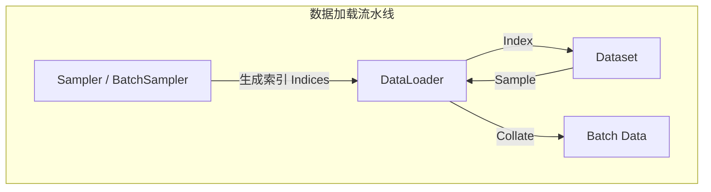

> **摘要**：在 PyTorch 的数据加载流水线中，`Sampler` 是决定数据加载顺序的幕后指挥官。它告诉 `DataLoader` 下一次应该读取哪个索引（Index）。通过自定义 `Sampler`，我们可以实现随机打乱、按顺序读取、加权采样、甚至分布式采样等各种复杂的数据读取策略。

## 1. 核心作用与架构位置

在 PyTorch 的数据管道中，`DataLoader` 是总调度，`Dataset` 是数据仓库，而 `Sampler` 则是**索引生成器**。

### 1.1 数据加载流程图



*   **Sampler**: 负责生成单个样本的索引序列（如 `[0, 3, 1, 2...]`）。
*   **BatchSampler**: 负责将 Sampler 生成的索引打包成批次（如 `[[0, 3], [1, 2]...]`）。
*   **DataLoader**: 根据 BatchSampler 提供的索引列表，从 Dataset 中并行抓取数据，并整理成 Tensor。

## 2. 核心 Sampler 详解

PyTorch 在 `torch.utils.data.sampler` 中内置了多种常用的采样器。

### 2.1 SequentialSampler (顺序采样)
*   **行为**：按数据集的原始顺序（0, 1, 2, ..., N-1）依次生成索引。
*   **场景**：验证集（Validation Set）或测试集（Test Set），因为评估时通常不需要打乱数据。
*   **默认行为**：当 `DataLoader(shuffle=False)` 时，默认使用此采样器。

### 2.2 RandomSampler (随机采样)
*   **行为**：随机打乱数据集的索引顺序。
*   **参数**：
    *   `replacement=False`：不放回采样（默认），遍历一轮即取完所有数据。
    *   `replacement=True`：有放回采样，可以无限采样或指定 `num_samples`。
*   **场景**：训练集（Training Set），打乱数据可以打破样本间的相关性，利于模型收敛。
*   **默认行为**：当 `DataLoader(shuffle=True)` 时，默认使用此采样器。

### 2.3 WeightedRandomSampler (加权随机采样)
*   **行为**：根据样本的权重概率进行采样。权重越大的样本被选中的概率越高。
*   **场景**：**类别不平衡（Imbalanced Dataset）**。
    *   例如：正样本 100 个，负样本 900 个。赋予正样本 9 倍的权重，可以使每个 Batch 中正负样本比例接近 1:1。
*   **注意**：通常配合 `replacement=True` 使用。

### 2.4 SubsetRandomSampler (子集随机采样)
*   **行为**：从指定的索引列表（Subset）中随机采样。
*   **场景**：将数据集划分为训练集和验证集时。只需维护两组索引列表，无需复制物理数据。

### 2.5 BatchSampler (批采样器)
*   **行为**：这是一个**包装器（Wrapper）**。它接受一个其他的 Sampler，将其生成的索引打包成 Batch。
*   **参数**：`batch_size`, `drop_last`。
*   **机制**：`DataLoader` 实际上在内部总是使用 `BatchSampler`（除非禁用了自动批处理）。

## 3. 自定义 Sampler

当内置采样器无法满足需求时（例如：每次从同一类别中采样 K 个样本），我们需要继承 `torch.utils.data.Sampler` 并实现以下方法：

1.  **`__iter__`**: 返回一个迭代器，生成索引。
2.  **`__len__`**: 返回采样器的长度（即总样本数）。

### 代码示例：按长度排序的采样器 (Smart Batching)
在 NLP 中，为了减少 Padding，我们希望同一个 Batch 内的句子长度相近。

```python
import torch
from torch.utils.data import Sampler

class SortedSampler(Sampler):
    def __init__(self, data_source):
        self.data_source = data_source
        # 假设 data_source 有一个 lengths 属性或可以计算长度
        self.lengths = [len(x) for x in data_source]

    def __iter__(self):
        # 返回按长度排序后的索引
        return iter(torch.argsort(torch.tensor(self.lengths)).tolist())

    def __len__(self):
        return len(self.data_source)
```

## 4. 常见问题 (FAQ)

### Q1: `DataLoader` 的 `shuffle` 参数和 `sampler` 参数可以同时使用吗？
**不可以。** 它们是互斥的。
*   如果指定了 `sampler`，`shuffle` 必须为 `False`。
*   如果需要打乱，应该在自定义 Sampler 内部实现，或者直接使用 `RandomSampler`。

### Q2: 如何处理类别不平衡？
使用 `WeightedRandomSampler`。
1.  计算每个类别的样本数量。
2.  计算每个类别的权重（样本数的倒数）。
3.  为每个样本分配其对应类别的权重。
4.  将权重列表传入 `WeightedRandomSampler`。

### Q3: 分布式训练（DDP）怎么采样？
使用 `DistributedSampler`。它会将数据集切分成 N 份（N=GPU数量），确保每个 GPU 读取不重叠的数据子集。详情请参考 [DistributedSampler 文档](./distributed_sampler.md)。

## 5. 参考资料

1.  [PyTorch Docs - Sampler](https://pytorch.org/docs/stable/data.html#torch.utils.data.Sampler)
2.  [Medium - PyTorch Dataset, DataLoader, Sampler](https://medium.com/geekculture/pytorch-datasets-dataloader-samplers-and-the-collat-fn-bbfc7c527cf1)
3.  [CSDN - 采样器解析](https://blog.csdn.net/zyw2002/article/details/128176507)
