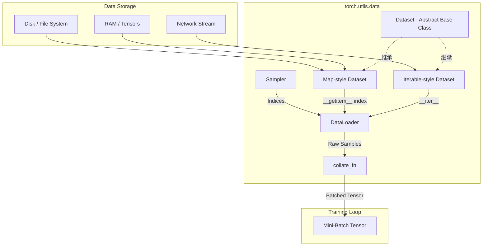

在深度学习流水线中，数据加载与预处理是制约训练效率的关键瓶颈之一。PyTorch 通过 `torch.utils.data` 模块提供了一套高效、灵活且可扩展的数据加载原语。其中，**`torch.utils.data.Dataset`** 是抽象数据的核心接口，负责定义“数据是什么”以及“如何获取单个样本”。

本文档旨在深入剖析 PyTorch `Dataset` 的底层架构、设计模式及实现原理，并探讨其与 `DataLoader`、`Sampler` 等组件的交互机制。

## 2. 核心架构 (Core Architecture)

PyTorch 的数据加载系统遵循 **生产者-消费者 (Producer-Consumer)** 模式。`Dataset` 作为生产者，负责从磁盘、内存或网络中提取数据；`DataLoader` 作为调度器，负责批处理、多进程调度和内存锁页 (Pin Memory)。

### 2.1 数据流架构



### 2.2 两类数据集范式

PyTorch 根据数据访问方式的不同，定义了两种数据集范式：

1.  **Map-style Datasets (映射式数据集)**
    *   **核心协议**: 实现 `__getitem__()` 和 `__len__()`。
    *   **特性**: 支持随机访问 (Random Access)。通过索引 `idx` 直接定位数据，适用于图像、文本等已知大小且可索引的数据集。
    *   **交互**: 必须配合 `Sampler` 使用，由 Sampler 生成索引序列，DataLoader 根据索引拉取数据。

2.  **Iterable-style Datasets (迭代式数据集)**
    *   **核心协议**: 实现 `__iter__()`。
    *   **特性**: 仅支持顺序访问 (Sequential Access)。适用于流式数据、无法一次性载入内存的大规模数据或从数据库动态读取的数据。
    *   **交互**: **不兼容** `Sampler`。在多进程加载时，需要手动处理 Worker 间的数据分片，否则会导致数据重复。

## 3. 底层原理与算法细节 (Underlying Principles)

### 3.1 `Dataset` 抽象基类设计

在源码 `torch/utils/data/dataset.py` 中，`Dataset` 是一个泛型类 (Generic Class)，支持协变 (Covariant) 类型提示。

```python
class Dataset(Generic[T_co]):
    def __getitem__(self, index) -> T_co:
        raise NotImplementedError
    
    def __add__(self, other: "Dataset[T_co]") -> "ConcatDataset[T_co]":
        return ConcatDataset([self, other])
```

*   **泛型支持**: 增强了静态类型检查能力，明确了数据集返回样本的类型。
*   **运算符重载**: 通过实现 `__add__` 方法，支持使用 `+` 运算符直接拼接两个数据集（自动封装为 `ConcatDataset`）。

### 3.2 Map-style 的索引映射机制

当 `DataLoader` 的 `shuffle=True` 时，PyTorch 会创建一个 `RandomSampler`。
1.  `RandomSampler` 生成一个乱序的索引列表 (e.g., `[3, 1, 9, ...]`).
2.  `DataLoader` 的 Worker 进程按照该列表，依次调用 `dataset[3]`, `dataset[1]`...
3.  **优势**: 随机性完全由索引控制，数据源本身无需物理打乱，适合磁盘 IO 优化。

### 3.3 Iterable-style 的多进程分片 (Sharding)

对于 `IterableDataset`，当 `num_workers > 0` 时，每个 Worker 都会拥有一份 Dataset 对象的副本。若不加处理，每个 Worker 都会从头迭代，导致数据重复。

**解决方案**: 在 `__iter__` 方法中利用 `torch.utils.data.get_worker_info()` 获取当前 Worker 的信息，并根据 `worker_id` 对数据进行切片。

```python
# 伪代码逻辑
def __iter__(self):
    worker_info = torch.utils.data.get_worker_info()
    if worker_info is None:  # 单进程
        return iter(self.data)
    else:  # 多进程
        # 将数据均分，每个 Worker 只取属于自己的一份
        per_worker = int(math.ceil(len(self.data) / float(worker_info.num_workers)))
        iter_start = worker_info.id * per_worker
        iter_end = min(iter_start + per_worker, len(self.data))
        return iter(self.data[iter_start:iter_end])
```

## 4. API 说明 (API Specifications)

### 4.1 标准实现类

| 类名 | 类型 | 描述 |
| :--- | :--- | :--- |
| `TensorDataset(*tensors)` | Map-style | 包装多个 Tensor。要求所有 Tensor 第一维大小相同。常用于简单的 `(X, y)` 训练数据。 |
| `ConcatDataset(datasets)` | Map-style | 拼接多个 Dataset。通过累计长度 (`cumulative_sizes`) 和二分查找 (`bisect`) 实现索引映射。 |
| `Subset(dataset, indices)` | Map-style | 取 Dataset 的子集。仅包含 `indices` 指定的样本，常用于划分验证集。 |
| `ChainDataset(datasets)` | Iterable-style | 串联多个 IterableDataset。当前一个迭代耗尽时，自动切换到下一个。 |
| `StackDataset(*args, **kwargs)`| Map-style | 堆叠多个数据集。返回的样本是各数据集对应样本的 Tuple 或 Dict。 |

### 4.2 关键工具函数

*   **`random_split(dataset, lengths, generator)`**: 将一个数据集随机划分为多个不重叠的子集 (Subsets)。
*   **`get_worker_info()`**: 在 Worker 进程中调用，返回包含 `id`, `num_workers`, `seed` 等信息的对象，用于配置多进程行为。

## 5. 代码示例 (Code Examples)

### 5.1 自定义 Map-style Dataset (图像数据)

这是最常见的用法，适用于从目录结构加载图像数据。

```python
import os
import pandas as pd
from torch.utils.data import Dataset
from torchvision.io import decode_image

class CustomImageDataset(Dataset):
    def __init__(self, annotations_file, img_dir, transform=None, target_transform=None):
        """
        初始化：读取标签文件，存储路径配置，但不加载实际图像数据（延迟加载）。
        """
        self.img_labels = pd.read_csv(annotations_file)
        self.img_dir = img_dir
        self.transform = transform
        self.target_transform = target_transform

    def __len__(self):
        """返回数据集总样本数"""
        return len(self.img_labels)

    def __getitem__(self, idx):
        """根据索引 idx 加载并返回一个样本 (image, label)"""
        img_path = os.path.join(self.img_dir, self.img_labels.iloc[idx, 0])
        # 实时读取图像，节省内存
        image = decode_image(img_path)
        label = self.img_labels.iloc[idx, 1]
        
        # 应用预处理变换
        if self.transform:
            image = self.transform(image)
        if self.target_transform:
            label = self.target_transform(label)
            
        return image, label
```

### 5.2 自定义 Iterable-style Dataset (流式数据)

适用于数据来自生成器或网络流的场景。

```python
import torch
import math

class MyIterableDataset(torch.utils.data.IterableDataset):
    def __init__(self, start, end):
        super(MyIterableDataset).__init__()
        self.start = start
        self.end = end

    def __iter__(self):
        worker_info = torch.utils.data.get_worker_info()
        if worker_info is None:  
            # 单进程：返回完整迭代器
            iter_start = self.start
            iter_end = self.end
        else:  
            # 多进程：根据 worker_id 划分工作负载
            per_worker = int(math.ceil((self.end - self.start) / float(worker_info.num_workers)))
            worker_id = worker_info.id
            iter_start = self.start + worker_id * per_worker
            iter_end = min(iter_start + per_worker, self.end)
            
        return iter(range(iter_start, iter_end))

# 使用示例
# ds = MyIterableDataset(start=0, end=100)
# dl = torch.utils.data.DataLoader(ds, num_workers=2)
# print(list(dl)) # 输出将包含 0-99，且不会重复
```

## 6. 参考资料 (References)

1.  **PyTorch Data Documentation**: [https://docs.pytorch.org/docs/stable/data.html](https://docs.pytorch.org/docs/stable/data.html)
2.  **PyTorch Data Tutorial**: [https://docs.pytorch.org/tutorials/beginner/basics/data_tutorial.html](https://docs.pytorch.org/tutorials/beginner/basics/data_tutorial.html)
3.  **PyTorch Source Code (Dataset)**: [https://github.com/pytorch/pytorch/blob/main/torch/utils/data/dataset.py](https://github.com/pytorch/pytorch/blob/main/torch/utils/data/dataset.py)
