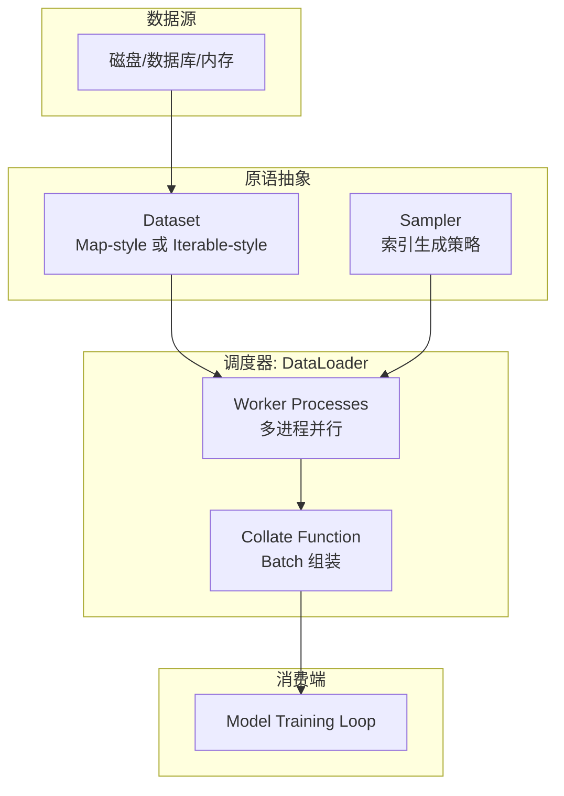

> **摘要**：`torch.utils` 是 PyTorch 框架中一个至关重要的工具箱，提供了数据加载、模型检查点、TensorBoard 可视化、C++ 扩展编译等一系列辅助功能。其中，`torch.utils.data` 是构建高效深度学习流水线的核心组件。本文将从架构设计、底层原理及工程实践三个维度，对 `torch.utils` 进行全面解析。

## 1. 模块概览

`torch.utils` 并非单一功能的模块，而是一个包含多个子模块的集合，旨在解决深度学习工程落地中的通用问题：

| 子模块 | 核心功能 | 典型应用场景 |
| :--- | :--- | :--- |
| **`torch.utils.data`** | 数据加载与预处理 | 构建高效的训练/验证数据流水线 (Pipeline) |
| **`torch.utils.checkpoint`** | 激活值检查点 | 用计算换内存，支持在有限显存上训练大模型 |
| **`torch.utils.tensorboard`** | 可视化日志 | 记录训练曲线、图像、网络结构供 TensorBoard 展示 |
| **`torch.utils.cpp_extension`** | C++ 扩展编译 | 实时编译 (JIT) 自定义 CUDA/C++ 算子 |
| **`torch.utils.dlpack`** | 跨框架张量共享 | 在 PyTorch 与 TensorFlow/JAX/NumPy 间零拷贝传递数据 |

## 2. 核心组件：torch.utils.data

数据加载是模型训练的瓶颈之一。PyTorch 的数据加载设计遵循 **"Dataset 负责存储/生成，DataLoader 负责调度"** 的解耦原则。

### 2.1 架构设计原理



### 2.2 Dataset 的两种范式

PyTorch 支持两种类型的 Dataset，分别适用于不同的场景：

1.  **Map-style Datasets (`torch.utils.data.Dataset`)**
    *   **接口**：必须实现 `__getitem__()` 和 `__len__()`。
    *   **机制**：支持随机访问（Random Access）。通过索引 `idx` 获取数据。
    *   **场景**：数据量能够被索引（如图像文件列表、文本语料库），支持 Shuffle。

2.  **Iterable-style Datasets (`torch.utils.data.IterableDataset`)**
    *   **接口**：必须实现 `__iter__()`。
    *   **机制**：流式访问（Streaming）。
    *   **场景**：数据量巨大无法完全载入内存、从数据库或远程服务器流式读取数据，或者数据是实时生成的。

### 2.3 DataLoader 的工程细节

`DataLoader` 是一个迭代器，它封装了复杂的并行加载逻辑。

*   **多进程 (Multi-processing)**：
    *   设置 `num_workers > 0` 会启动子进程。
    *   **关键点**：`Dataset` 对象会被序列化 (pickled) 并复制到每个 Worker 进程中。如果是 `Map-style`，主进程生成索引分发给 Worker；如果是 `Iterable-style`，需要用户手动在 `worker_init_fn` 中对 Worker 进行分片，否则每个 Worker 会返回重复数据。
*   **内存锁页 (Memory Pinning)**：
    *   设置 `pin_memory=True`。
    *   **原理**：将数据张量复制到 CUDA 驱动程序可见的锁页内存（Page-locked memory）中，从而加速 Host-to-Device (CPU -> GPU) 的数据传输。
*   **Collate Function (`collate_fn`)**：
    *   Worker 取出的样本是一个 List，`collate_fn` 负责将其堆叠（Stack）成 Batch Tensor。
    *   **自定义场景**：处理变长序列（Padding）、自定义数据结构（Graph 数据）等。

## 3. 显存优化：torch.utils.checkpoint

随着模型参数量激增（如 LLM），显存往往成为瓶颈。`checkpoint`（也称为 Gradient Checkpointing 或 Activation Checkpointing）是一种经典的 **"时间换空间"** 技术。

### 3.1 算法原理

*   **常规反向传播**：为了计算梯度，必须在前向传播（Forward）时保存所有中间层的激活值（Activations），这会占用大量显存。
*   **Checkpointing**：
    1.  在前向传播中，**不保存**中间激活值，只保存输入和输出。
    2.  在反向传播（Backward）需要用到某层激活值计算梯度时，利用保存的输入**重新计算（Recompute）**一遍该层的前向传播。

### 3.2 代码示例

```python
import torch
import torch.nn as nn
from torch.utils.checkpoint import checkpoint

class LargeModel(nn.Module):
    def __init__(self):
        super().__init__()
        self.block1 = nn.Linear(1024, 1024)
        self.block2 = nn.Linear(1024, 1024)

    def forward(self, x):
        # 常规方式：所有中间激活值都会常驻显存直到 Backward
        # x = self.block1(x)
        # x = self.block2(x)
        
        # Checkpoint 方式：
        # block1 的中间激活值不会被缓存，Backward 时会重算 block1
        x = checkpoint(self.block1, x, use_reentrant=False)
        x = self.block2(x)
        return x
```

> **注意**：`use_reentrant=False` 是 PyTorch 推荐的新实现方式，它提供了更好的向后兼容性和性能。

## 4. 可视化集成：torch.utils.tensorboard

该模块是 `TensorBoard` 的 Python 封装，允许在不依赖 TensorFlow 的情况下记录 PyTorch 的训练状态。

### 4.1 常用 API

| API | 功能 | 输入数据类型 |
| :--- | :--- | :--- |
| `add_scalar` | 记录标量（如 Loss, Accuracy） | float |
| `add_image` | 记录图像（如生成模型的采样） | Tensor (CHW) |
| `add_histogram` | 记录直方图（如权重分布） | Tensor |
| `add_graph` | 记录模型计算图 | Module, Input Tensor |
| `add_embedding` | 高维数据降维可视化 | Matrix (N, D) |

## 5. 最佳实践指南

1.  **数据加载性能调优**：
    *   优先使用 `num_workers = CPU 核心数`（或略小）。
    *   如果使用 GPU 训练，务必设置 `pin_memory=True`。
    *   对于小文件（如小图片、文本），避免频繁 IO，可考虑打包存储（如 LMDB, HDF5）。
2.  **多进程随机性**：
    *   在 `DataLoader` 的 `worker_init_fn` 中设置随机种子，否则所有 Worker 可能生成相同的随机数序列（取决于 NumPy/Python Random 的实现）。
3.  **Checkpointing 权衡**：
    *   仅在显存不足 (OOM) 时使用。它会增加约 30% 的计算时间，但能显著减少激活值显存占用（通常能减少 50%~80%）。

## 6. 参考资料

1.  [PyTorch Documentation - torch.utils](https://docs.pytorch.org/docs/stable/utils.html)
2.  [PyTorch Documentation - torch.utils.data](https://docs.pytorch.org/docs/stable/data.html)
3.  [PyTorch Documentation - torch.utils.checkpoint](https://docs.pytorch.org/docs/stable/checkpoint.html)
4.  [PyTorch Documentation - torch.utils.tensorboard](https://docs.pytorch.org/docs/stable/tensorboard.html)
