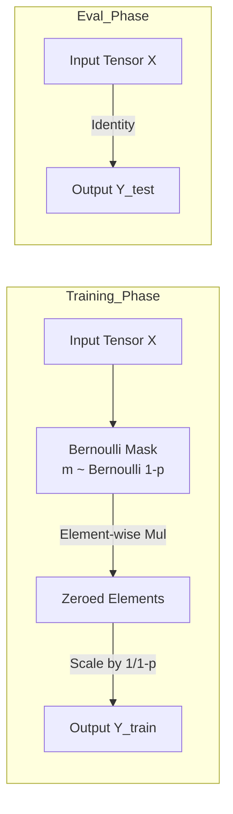

## 1. 概述 (Overview)

`torch.nn.Dropout` 是 PyTorch 中用于实现 [**Dropout (随机失活)**](../../相关概念/随机失活.md) 正则化技术的模块。它在训练过程中按概率 $p$ 随机将输入张量中的部分元素置零，旨在减少神经元之间的共适应关系 (co-adaptation)，从而有效防止模型过拟合。

## 2. 数学原理 (Mathematical Principles)

在训练阶段 (Training Phase)，对于输入张量 $X$ 中的每个元素 $x_i$，Dropout 执行以下操作：

1.  **伯努利采样**: 生成一个服从伯努利分布的掩码 $m_i \sim \text{Bernoulli}(1-p)$。
    *   $P(m_i=1) = 1-p$ (保留)
    *   $P(m_i=0) = p$ (置零)
2.  **掩码应用与缩放 (Scaling)**:
    $$
    y_i = \frac{x_i \cdot m_i}{1-p}
    $$

**关键点**:
*   **训练时缩放**: PyTorch 采用 **Inverted Dropout** 实现。它在训练时将保留下来的元素除以 $1-p$ 进行放大。
*   **测试时恒等**: 由于训练时已经进行了缩放，测试阶段 (Evaluation Phase) 不需要做任何处理，直接输出原值：$y = x$。这保证了训练和测试时输出的期望值一致。

### 架构图 (Architecture Diagram)



## 3. API 说明 (API Specification)

```python
class torch.nn.Dropout(p=0.5, inplace=False)
```

### 参数 (Parameters)

| 参数名 | 类型 | 说明 |
| :--- | :--- | :--- |
| `p` | `float` | 元素被置零的概率 (probability of an element to be zeroed)。默认值: 0.5。 |
| `inplace` | `bool` | 是否进行原地操作。如果设为 `True`，将直接修改输入张量。默认值: `False`。 |

### 形状 (Shape)

*   **Input**: $(*)$。输入可以是任意形状。
*   **Output**: $(*)$。输出形状与输入相同。

## 4. 实现细节与注意事项 (Implementation Details)

*   **模式切换**: Dropout 行为完全依赖于模型的运行模式。必须使用 `model.train()` 和 `model.eval()` 显式切换。
    *   `model.train()`: 启用 Dropout，随机置零并缩放。
    *   `model.eval()`: 禁用 Dropout，恒等映射。
*   **独立性**: 每次前向传播 (forward call) 时，掩码都是独立重新生成的。
*   **通道独立**: 每个元素独立采样，不考虑通道结构。如果需要对整个通道 (如 CNN 中的 Feature Map) 进行 Dropout，请使用 `nn.Dropout2d` 或 `nn.Dropout3d`。

## 5. 代码示例 (Code Examples)

### 基础用法

```python
import torch
import torch.nn as nn

# 定义 Dropout 层，丢弃概率为 0.2
m = nn.Dropout(p=0.2)
input_tensor = torch.randn(4, 5)

# 1. 训练模式
m.train()
output_train = m(input_tensor)
print("Training Output:\n", output_train)
# 观察：部分元素变也是0，非0元素被放大 (乘以 1/0.8 = 1.25)

# 2. 测试模式
m.eval()
output_eval = m(input_tensor)
print("Eval Output:\n", output_eval)
# 观察：输出与输入完全一致
```

### 在模型中的应用

```python
class SimpleMLP(nn.Module):
    def __init__(self):
        super().__init__()
        self.fc1 = nn.Linear(784, 256)
        self.relu = nn.ReLU()
        # 通常放在激活函数之后
        self.dropout = nn.Dropout(p=0.5)
        self.fc2 = nn.Linear(256, 10)

    def forward(self, x):
        x = self.fc1(x)
        x = self.relu(x)
        x = self.dropout(x) # 仅在 self.training=True 时生效
        x = self.fc2(x)
        return x
```

## 6. 参考资料 (References)

1.  [PyTorch Official Documentation: Dropout](https://docs.pytorch.org/docs/stable/generated/torch.nn.Dropout.html)
2.  [Dive into Deep Learning: Dropout](https://d2l.ai/chapter_multilayer-perceptrons/dropout.html)
3.  Srivastava, N., et al. (2014). "Dropout: A Simple Way to Prevent Neural Networks from Overfitting". JMLR.
