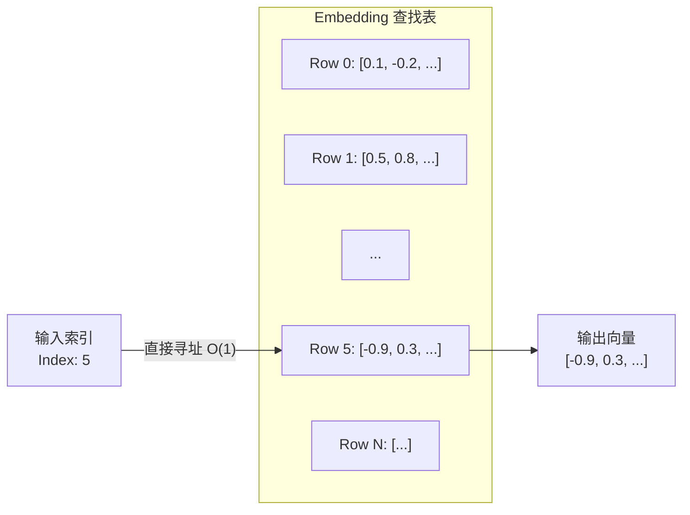

`torch.nn.Embedding` 是 PyTorch 中用于处理离散分类数据（Categorical Data）的核心模块，本质上是一个**可学习的查找表（Lookup Table）**。它将高维稀疏的索引（Indices）映射为低维稠密的连续向量（Dense Vectors）。

在数学上，`nn.Embedding` 等价于输入为 **One-Hot 编码** 的无偏置全连接层（Linear Layer without bias），但在实现上通过直接内存寻址（Direct Memory Access）替代了矩阵乘法，显著降低了计算复杂度和内存开销。

$$
\text{Output} = \text{Embedding}(\text{Index}) \equiv \text{Linear}(\text{OneHot}(\text{Index}))
$$

---

## 2. 架构与原理 (Architecture & Mechanism)

### 2.1 查找表机制

`nn.Embedding` 维护一个形状为 $(N, D)$ 的权重矩阵 $W$，其中：
*   $N$ (`num_embeddings`)：词表大小（Vocabulary Size）。
*   $D$ (`embedding_dim`)：嵌入向量的维度。

当输入一个索引 $i$ 时，模块直接返回 $W$ 的第 $i$ 行 $W[i]$。

### 2.2 架构图解



### 2.3 与 Linear 层的对比

假设词表大小 $V=10000$，嵌入维度 $D=300$。

| 特性 | nn.Embedding | nn.Linear (w/ One-Hot) |
| :--- | :--- | :--- |
| **操作方式** | 索引查找 (Slicing) | 矩阵乘法 (MatMul) |
| **计算复杂度** | $O(1)$ (per token) | $O(V \times D)$ |
| **空间复杂度** | $O(V \times D)$ | $O(V \times D)$ |
| **输入格式** | LongTensor (Indices) | FloatTensor (One-Hot) |
| **适用场景** | NLP 词嵌入、推荐系统 ID 嵌入 | 一般特征变换 |

---

## 3. API 详解 (API Specification)

```python
torch.nn.Embedding(
    num_embeddings: int,
    embedding_dim: int,
    padding_idx: Optional[int] = None,
    max_norm: Optional[float] = None,
    norm_type: float = 2.0,
    scale_grad_by_freq: bool = False,
    sparse: bool = False,
    _weight: Optional[Tensor] = None
)
```

### 关键参数说明

1.  **`num_embeddings` (int)**:
    *   嵌入字典的大小。即索引的最大值必须小于此值。
    
2.  **`embedding_dim` (int)**:
    *   每个嵌入向量的大小。

3.  **`padding_idx` (int, optional)**:
    *   **重要**：指定该索引为填充（Padding）索引。
    *   **特性**：初始化时，该位置的向量全为 0；在反向传播中，**该位置的梯度始终为 0**，即权重不更新。
    *   用途：处理变长序列时用于填充占位。

4.  **`max_norm` (float, optional)**:
    *   如果设置，前向传播时会将范数超过该值的向量重新归一化（Renormalize），使其范数等于 `max_norm`。

5.  **`scale_grad_by_freq` (bool)**:
    *   如果为 `True`，则根据单词在 mini-batch 中出现的频率缩放梯度。词频越高，梯度越小。
    *   公式：$\text{grad} = \frac{\text{grad}}{\text{frequency}}$

6.  **`sparse` (bool)**:
    *   如果为 `True`，权重的梯度将是稀疏张量（Sparse Tensor）。
    *   **注意**：目前仅部分优化器支持稀疏梯度（如 `optim.SGD`, `optim.SparseAdam`, `optim.Adagrad`）。

---

## 4. 梯度与反向传播 (Backpropagation)

在训练过程中，`nn.Embedding` 的权重矩阵 $W$ 是模型参数的一部分。

*   **前向传播**：选择特定的行。
*   **反向传播**：梯度仅回传到**被选中的行**。
    *   这意味着对于一个 Batch 中未出现的词，其对应的嵌入向量梯度为 0，权重不会更新。
    *   这种稀疏更新特性使得 `nn.Embedding` 在处理超大规模词表时非常高效。

### 代码验证梯度更新

```python
import torch
import torch.nn as nn

# 定义 Embedding
emb = nn.Embedding(num_embeddings=10, embedding_dim=4)
optimizer = torch.optim.SGD(emb.parameters(), lr=0.1)

# 输入索引 [1, 5]
input_indices = torch.tensor([1, 5])

# 前向传播
output = emb(input_indices)
loss = output.sum() # 模拟 Loss

# 反向传播
optimizer.zero_grad()
loss.backward()

# 检查梯度
print("Gradient for index 1:", emb.weight.grad[1]) # 有梯度
print("Gradient for index 2:", emb.weight.grad[2]) # 全为 0 (未被选中)
```

---

## 5. 高级用法 (Advanced Usage)

### 5.1 加载预训练向量 (Loading Pre-trained Embeddings)

使用 `from_pretrained` 类方法可以加载 GloVe 或 Word2Vec 等预训练向量。

```python
# 假设 pretrained_weights 是一个 Numpy 数组或 Tensor
pretrained_weights = torch.randn(1000, 300)

# 方法 1: 使用 from_pretrained (推荐)
# freeze=True 表示冻结参数，不参与训练（Fine-tuning 时可设为 False）
embedding_layer = nn.Embedding.from_pretrained(pretrained_weights, freeze=True)

# 方法 2: 手动赋值
embedding_layer = nn.Embedding(1000, 300)
embedding_layer.weight.data.copy_(torch.from_numpy(pretrained_weights))
```

### 5.2 处理变长序列 (Padding)

结合 `padding_idx` 和 `nn.utils.rnn.pad_sequence` 使用。

```python
# 指定 0 为 padding_idx
emb = nn.Embedding(10, 5, padding_idx=0)

# 输入包含 padding 索引 0
x = torch.tensor([[1, 2, 0], [3, 0, 0]])
out = emb(x)

# 索引 0 对应的向量始终为 0
print(out[0, 2]) # tensor([0., 0., 0., 0., 0.], grad_fn=<SelectBackward>)
```

---

## 6. 参考资料 (References)

1.  **PyTorch Official Documentation**: [torch.nn.Embedding](https://docs.pytorch.org/docs/stable/generated/torch.nn.Embedding.html)
2.  **PyTorch Forums**: [How does nn.Embedding work?](https://discuss.pytorch.org/t/how-does-nn-embedding-work/88518)
3.  **Stack Overflow**: [What exactly happens inside embedding layer in pytorch?](https://stackoverflow.com/questions/58718612/what-exactly-happens-inside-embedding-layer-in-pytorch)
4.  **Medium**: [What is nn.Embedding really?](https://medium.com/@gautam.e/what-is-nn-embedding-really-de038baadd24)
5.  **Towards Data Science**: [The Secret to Improved NLP: An In-Depth Look at the nn.Embedding Layer](https://towardsdatascience.com/the-secret-to-improved-nlp-an-in-depth-look-at-the-nn-embedding-layer-in-pytorch-6e901e193e16)
