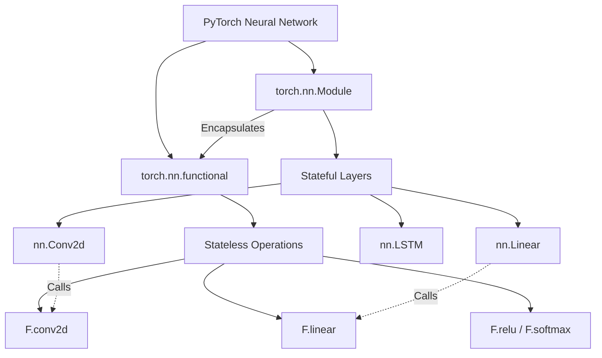

`torch.nn.functional`（通常缩写为 `F`）是 PyTorch 中包含所有神经网络原语的函数式接口。与 `torch.nn` 模块（Module）不同，`functional` 中的函数是**无状态的**，不存储任何权重（weights）或偏置（biases）。

## 1. 核心概念与区别 (Core Differences)

在 PyTorch 中，构建神经网络层主要有两种方式：使用 `torch.nn.Module` 或使用 `torch.nn.functional`。理解二者的区别是进行高效模型设计的关键。

### 1.1 对照表

| 特性 | torch.nn (Layers/Modules) | torch.nn.functional (Functions) |
| :--- | :--- | :--- |
| **范式 (Paradigm)** | 面向对象 (Object-Oriented) | 函数式编程 (Functional) |
| **状态 (State)** | **有状态**。内部维护 `weights` 和 `bias` 参数。 | **无状态**。不存储参数，所有参数需作为参数传递。 |
| **参数管理** | 自动注册到 `model.parameters()`，支持自动梯度更新。 | 不管理参数。如果是带权重的操作（如卷积），需手动定义并传递 `Parameter`。 |
| **使用场景** | 适合具有可学习参数的层 (Conv2d, Linear, BatchNorm)。 | 适合无参数操作 (ReLU, MaxPool) 或自定义复杂逻辑。 |
| **初始化** | 实例化类时初始化 (`self.conv = nn.Conv2d(...)`)。 | 直接调用，无需初始化 (`F.conv2d(input, weight, ...)`). |

### 1.2 架构关系



`torch.nn` 中的层（如 `nn.Conv2d`）实际上是对 `torch.nn.functional`（如 `F.conv2d`）的高级封装。`nn.Conv2d` 负责管理 `weight` 和 `bias` `Parameter`，并在 `forward()` 方法中调用 `F.conv2d` 进行实际计算。

## 2. 常用 API 详解

`torch.nn.functional` 涵盖了几乎所有深度学习需要的操作：

### 2.1 卷积函数 (Convolution Functions)
*   `F.conv2d(input, weight, bias=None, stride=1, padding=0, ...)`
*   `F.conv_transpose2d(...)`
*   **注意**：这里的 `weight` 必须是一个 Tensor（通常需要 `requires_grad=True`），你需要自己维护它的形状和初始化。

### 2.2 池化函数 (Pooling Functions)
*   `F.max_pool2d(input, kernel_size, ...)`
*   `F.avg_pool2d(input, kernel_size, ...)`
*   `F.adaptive_avg_pool2d(input, output_size)`: 自适应池化，指定输出大小即可，无需计算核大小。

### 2.3 非线性激活函数 (Non-linear Activations)
*   `F.relu(input, inplace=False)`
*   `F.softmax(input, dim=None)`
*   `F.sigmoid(input)`
*   `F.leaky_relu(input, negative_slope=0.01)`
*   大多数激活函数没有可学习参数，因此在 `forward` 函数中直接使用 `F.relu` 通常比在 `__init__` 中定义 `nn.ReLU()` 更简洁。

### 2.4 线性函数 (Linear Functions)
*   `F.linear(input, weight, bias=None)`: 实现 $y = xA^T + b$。

### 2.5 损失函数 (Loss Functions)
*   `F.cross_entropy(input, target, ...)`
*   `F.mse_loss(input, target, ...)`
*   `F.binary_cross_entropy_with_logits(...)`: 结合了 Sigmoid 和 BCE Loss，数值上更稳定。

### 2.6 视觉通用函数 (Vision Functions)
*   `F.interpolate(input, size=None, scale_factor=None, mode='nearest', ...)`: 上采样或下采样，非常常用。
*   `F.grid_sample(...)`: 空间变换网络（STN）的核心组件。
*   `F.pad(input, pad, mode='constant', value=0)`: 对 Tensor 进行填充。

## 3. 代码实战与最佳实践

### 3.1 混合使用 nn.Module 和 nn.functional

这是最常见的写法：有参数的层用 `nn.Module`，无参数的激活/池化用 `F`。

```python
import torch
import torch.nn as nn
import torch.nn.functional as F

class SimpleNet(nn.Module):
    def __init__(self):
        super(SimpleNet, self).__init__()
        # 1. 有状态层：定义在 __init__ 中
        # PyTorch 会自动注册这些层的参数 (weights/biases)
        self.conv1 = nn.Conv2d(1, 20, 5)
        self.conv2 = nn.Conv2d(20, 50, 5)
        self.fc1 = nn.Linear(4*4*50, 500)
        self.fc2 = nn.Linear(500, 10)

    def forward(self, x):
        # 2. 无状态操作：直接在 forward 中调用 F 函数
        # 这样代码更紧凑，不需要在 init 里写 self.relu = nn.ReLU()
        x = F.relu(self.conv1(x))
        x = F.max_pool2d(x, 2, 2)
        
        x = F.relu(self.conv2(x))
        x = F.max_pool2d(x, 2, 2)
        
        x = x.view(-1, 4*4*50) # Flatten
        x = F.relu(self.fc1(x))
        
        # 注意：Training/Eval 模式对某些 F 函数有影响（如 dropout）
        # F.dropout 需要显式传递 training=self.training
        x = F.dropout(x, p=0.5, training=self.training)
        x = self.fc2(x)
        
        # 最后一层通常返回 logits，直接用于 F.cross_entropy
        # 或者使用 F.log_softmax
        return F.log_softmax(x, dim=1)
```

### 3.2 纯 Functional 实现（手动管理权重）

这种方式通常用于元学习（Meta-Learning）、动态权重生成（HyperNetworks）或极低级的研究。

```python
import torch
import torch.nn.functional as F

# 手动定义参数
weights = torch.randn(10, 5, requires_grad=True)
bias = torch.randn(10, requires_grad=True)
input_data = torch.randn(1, 5)

# 必须手动传入参数
output = F.linear(input_data, weights, bias)
```

### 3.3 陷阱与注意事项

1.  **Dropout 的陷阱**：
    *   `nn.Dropout` 模块会自动根据 `model.train()` 或 `model.eval()` 切换状态。
    *   `F.dropout` 默认不会自动切换。你必须显式传递 `training` 参数：`F.dropout(x, training=self.training)`。如果忘记这一点，评估时 Dropout 仍会生效，导致结果错误。
2.  **权重共享**：
    *   如果需要多个层共享权重，使用 `functional` API 非常方便，只需多次传入同一个 weight Tensor 即可。
3.  **Hooks (钩子)**：
    *   `nn.Module` 支持 `register_forward_hook` 等机制，用于调试或提取中间层特征。
    *   纯 `functional` 调用很难挂载 Hook，除非将其封装进 `nn.Module`。

## 4. 总结

*   **torch.nn.functional** 是 PyTorch 的底层构建块，提供了纯函数的计算能力。
*   对于**有参数**的操作（Conv, Linear, BN），优先使用 **`torch.nn` 模块**，以便利用 PyTorch 的参数管理和自动梯度功能。
*   对于**无参数**的操作（Activation, Pooling, Arithmetic），优先使用 **`torch.nn.functional`**，使代码更简洁灵活。
*   在使用 `F.dropout` 等行为随训练模式变化的函数时，务必小心处理 `training` 参数。

## 参考资料

1.  [PyTorch Official Documentation - torch.nn.functional](https://pytorch.org/docs/stable/nn.functional.html)
2.  [PyTorch Forums - How to choose between torch.nn.Functional and torch.nn module?](https://discuss.pytorch.org/t/how-to-choose-between-torch-nn-functional-and-torch-nn-module/2800)
