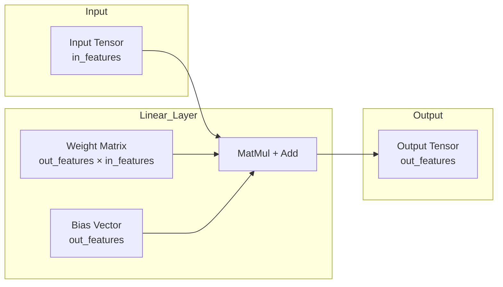

## 1. 概述 (Overview)

`torch.nn.Linear` 是 PyTorch 中用于实现[**线性变换**（Linear Transformation，亦称全连接层、仿射层）](../../相关概念/线性变换.md)的核心模块。它对输入数据应用线性变换 $y = xA^T + b$，是深度神经网络中最基础的构建单元之一。

## 2. 数学原理 (Mathematical Principles)

线性层执行的操作可以表示为矩阵乘法与偏置加法：

$$
y = xW^T + b
$$

其中：
*   $x$ 是输入张量，形状为 $(N, *, H_{in})$。
*   $y$ 是输出张量，形状为 $(N, *, H_{out})$。
*   $W$ 是权重矩阵（Weight Matrix），形状为 $(H_{out}, H_{in})$。注意 PyTorch 存储的权重是转置后的形式。
*   $b$ 是偏置向量（Bias Vector），形状为 $(H_{out})$。

### 架构图 (Architecture Diagram)



## 3. API 说明 (API Specification)

```python
class torch.nn.Linear(in_features, out_features, bias=True, device=None, dtype=None)
```

### 参数 (Parameters)

| 参数名 | 类型 | 说明 |
| :--- | :--- | :--- |
| `in_features` | `int` | 每个输入样本的大小 ($H_{in}$)。 |
| `out_features` | `int` | 每个输出样本的大小 ($H_{out}$)。 |
| `bias` | `bool` | 是否学习加性偏置。默认为 `True`。 |
| `device` | `torch.device` | 期望的设备（如 CPU 或 CUDA）。 |
| `dtype` | `torch.dtype` | 期望的数据类型（如 float32）。 |

### 形状 (Shape)

*   **Input**: $(*, H_{in})$，其中 $*$ 表示任意维度的前导维度（如 Batch Size），$H_{in} = \text{in\_features}$。
*   **Output**: $(*, H_{out})$，除了最后一维外，其他维度形状与输入相同，$H_{out} = \text{out\_features}$。

### 属性 (Attributes)

*   **`weight`**: 可学习的权重参数，形状为 `(out_features, in_features)`。
*   **`bias`**: 可学习的偏置参数，形状为 `(out_features)`。如果 `bias` 为 `False`，则该属性为 `None`。

## 4. 实现细节 (Implementation Details)

### 初始化策略 (Initialization)

PyTorch 默认使用 **Kaiming Uniform** (He Uniform) 的变体来初始化权重和偏置。

对于权重 $W$ 和偏置 $b$，初始化范围为 $\mathcal{U}(-\sqrt{k}, \sqrt{k})$，其中：

$$
k = \frac{1}{\text{in\_features}}
$$

源代码片段 (`torch/nn/modules/linear.py`):

```python
def reset_parameters(self) -> None:
    # Setting a=sqrt(5) in kaiming_uniform is the same as initializing with
    # uniform(-1/sqrt(in_features), 1/sqrt(in_features)).
    init.kaiming_uniform_(self.weight, a=math.sqrt(5))
    if self.bias is not None:
        fan_in, _ = init._calculate_fan_in_and_fan_out(self.weight)
        bound = 1 / math.sqrt(fan_in) if fan_in > 0 else 0
        init.uniform_(self.bias, -bound, bound)
```

## 5. 代码示例 (Code Examples)

### 基础用法

```python
import torch
import torch.nn as nn

# 定义线性层：输入特征 20，输出特征 30
m = nn.Linear(20, 30)

# 创建输入数据：Batch Size 为 128
input_tensor = torch.randn(128, 20)

# 前向传播
output = m(input_tensor)

print(f"Output shape: {output.size()}") # torch.Size([128, 30])
```

### 自定义模型中的应用

```python
class SimpleMLP(nn.Module):
    def __init__(self):
        super().__init__()
        self.fc1 = nn.Linear(784, 128)  # 隐藏层
        self.fc2 = nn.Linear(128, 10)   # 输出层 (分类)
        self.relu = nn.ReLU()

    def forward(self, x):
        x = self.fc1(x)
        x = self.relu(x)
        x = self.fc2(x)
        return x

model = SimpleMLP()
print(model)
```

## 6. 参考资料 (References)

1.  [PyTorch Official Documentation: Linear](https://docs.pytorch.org/docs/stable/generated/torch.nn.Linear.html)
2.  [PyTorch Source Code: torch/nn/modules/linear.py](https://github.com/pytorch/pytorch/blob/main/torch/nn/modules/linear.py)
3.  [Python Guides: PyTorch nn.Linear](https://pythonguides.com/pytorch-nn-linear/)
