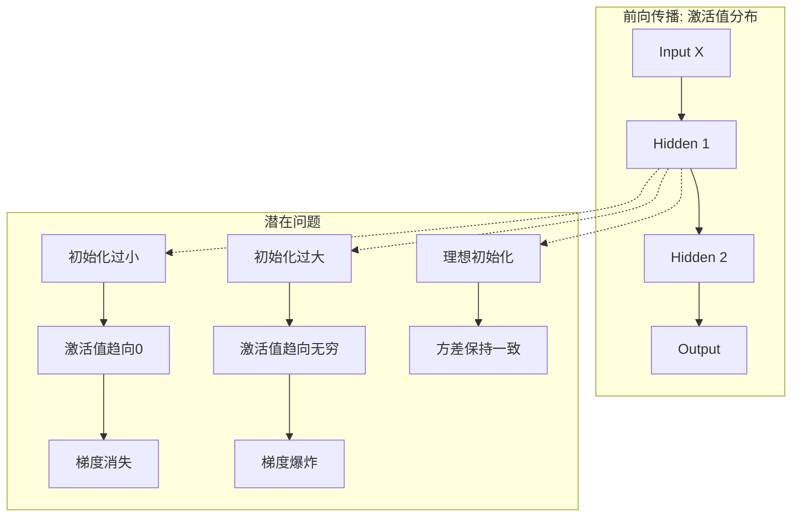

> **摘要**：在深度神经网络的训练过程中，参数初始化（Weight Initialization）是决定模型收敛速度和最终性能的关键因素之一。不恰当的初始化可能导致梯度消失（Vanishing Gradients）或梯度爆炸（Exploding Gradients），从而阻碍网络的训练。本文深入探讨 `torch.nn.init` 模块的底层原理、核心算法（Xavier 与 Kaiming 初始化）及其在 PyTorch 中的工程实现。

## 1. 理论基础：为何初始化至关重要

神经网络的每一层都可以看作是一个函数变换。在前向传播中，输入信号通过层层变换传递；在反向传播中，误差梯度通过链式法则回传。

### 1.1 信号传播与方差保持
为了保证信号在网络深层不发生衰减或爆炸，理想的初始化应满足两个条件：
1.  **前向传播均值与方差保持**：各层输出值的方差应与输入值方差保持一致。
2.  **反向传播梯度方差保持**：各层梯度的方差应在反向传播过程中保持一致。

如果初始化值过小，信号在深层会趋近于 0（梯度消失）；如果过大，信号会逐层放大（梯度爆炸）。

### 1.2 梯度流向示意图



## 2. 核心算法原理

PyTorch 的 `torch.nn.init` 提供了基于不同统计学假设的初始化方法。

### 2.1 Xavier (Glorot) 初始化
*   **适用场景**：Sigmoid, Tanh 激活函数。
*   **原理**：假设激活函数是线性的（在零点附近），为了保持输入输出方差一致，权重 $W$ 的方差应满足：
    $$ \text{Var}(W) = \frac{2}{n_{in} + n_{out}} $$
    其中 $n_{in}$ 是输入神经元数量（fan_in），$n_{out}$ 是输出神经元数量（fan_out）。
*   **分布**：
    *   **Uniform**: $W \sim U[-\text{bound}, \text{bound}]$, $\text{bound} = \text{gain} \times \sqrt{\frac{6}{n_{in} + n_{out}}}$
    *   **Normal**: $W \sim N(0, \sigma^2)$, $\sigma = \text{gain} \times \sqrt{\frac{2}{n_{in} + n_{out}}}$

### 2.2 Kaiming (He) 初始化
*   **适用场景**：ReLU, Leaky ReLU 及其变体。
*   **原理**：Xavier 假设激活函数是线性的，但 ReLU 将一半的输入置为 0，导致方差减半。为了补偿这一损失，Kaiming 初始化将方差放大两倍：
    $$ \text{Var}(W) = \frac{2}{n_{in}} $$
*   **分布**：
    *   **Uniform**: $W \sim U[-\text{bound}, \text{bound}]$, $\text{bound} = \sqrt{\frac{6}{(1 + a^2) \times n_{in}}}$
    *   **Normal**: $W \sim N(0, \sigma^2)$, $\sigma = \sqrt{\frac{2}{(1 + a^2) \times n_{in}}}$
    *(其中 $a$ 为 Leaky ReLU 的负斜率)*

## 3. torch.nn.init API 详解

PyTorch 的初始化函数通常以 `_` 结尾，表示**原地操作 (In-place operation)**，直接修改传入的 Tensor。

### 3.1 基础分布初始化
| API | 描述 | 数学公式 |
| :--- | :--- | :--- |
| `uniform_(tensor, a=0, b=1)` | 均匀分布 | $U(a, b)$ |
| `normal_(tensor, mean=0, std=1)` | 正态分布 | $N(\mu, \sigma^2)$ |
| `constant_(tensor, val)` | 常数填充 | $X = val$ |
| `zeros_(tensor)` / `ones_(tensor)` | 全0 / 全1 | - |

### 3.2 高级初始化
| API | 描述 | 参数说明 |
| :--- | :--- | :--- |
| `xavier_uniform_(tensor, gain=1)` | Glorot 均匀分布 | `gain`: 缩放因子 |
| `xavier_normal_(tensor, gain=1)` | Glorot 正态分布 | `gain`: 缩放因子 |
| `kaiming_uniform_(tensor, a=0, mode='fan_in', nonlinearity='leaky_relu')` | He 均匀分布 | `mode`: fan_in/fan_out, `nonlinearity`: 激活函数类型 |
| `kaiming_normal_(tensor, a=0, ...)` | He 正态分布 | 同上 |
| `orthogonal_(tensor, gain=1)` | 正交矩阵初始化 | 用于 RNN 等，解决梯度长期依赖问题 |

### 3.3 增益计算 (Calculate Gain)
不同的激活函数对信号方差的影响不同，`calculate_gain` 返回建议的缩放因子。

```python
import torch.nn as nn

# 获取 ReLU 的推荐 gain
gain_relu = nn.init.calculate_gain('relu') # 返回 sqrt(2) ≈ 1.414
gain_tanh = nn.init.calculate_gain('tanh') # 返回 5/3 ≈ 1.667
```

## 4. 最佳实践与代码示例

### 4.1 单层手动初始化
```python
import torch
import torch.nn as nn

layer = nn.Linear(64, 32)

# 使用 Xavier 初始化权重 (适用于 Tanh)
nn.init.xavier_uniform_(layer.weight, gain=nn.init.calculate_gain('tanh'))

# 偏差通常初始化为 0
nn.init.constant_(layer.bias, 0.0)
```

### 4.2 全局初始化 (Model.apply)
对于复杂网络，建议定义一个初始化函数，并使用 `model.apply()` 递归应用到所有子模块。

```python
def init_weights(m):
    if isinstance(m, nn.Linear):
        # 对于线性层，使用 Xavier Initialization
        nn.init.xavier_uniform_(m.weight)
        if m.bias is not None:
            nn.init.zeros_(m.bias)
    elif isinstance(m, nn.Conv2d):
        # 对于卷积层（通常接 ReLU），使用 Kaiming Initialization
        nn.init.kaiming_normal_(m.weight, mode='fan_out', nonlinearity='relu')
        if m.bias is not None:
            nn.init.zeros_(m.bias)
    elif isinstance(m, nn.BatchNorm2d):
        # BN 层权重初始化为 1，偏差为 0
        nn.init.ones_(m.weight)
        nn.init.zeros_(m.bias)

# 定义模型
model = nn.Sequential(
    nn.Conv2d(3, 16, 3),
    nn.ReLU(),
    nn.Linear(16*10*10, 10)
)

# 应用初始化
model.apply(init_weights)
```

### 4.3 在 `__init__` 中封装
在自定义 Module 的构造函数中直接初始化也是一种常见模式，这使得模型定义更加自包含。

```python
class CustomNet(nn.Module):
    def __init__(self):
        super().__init__()
        self.conv1 = nn.Conv2d(1, 32, 3)
        self.fc1 = nn.Linear(32 * 26 * 26, 10)
        
        # 初始化逻辑
        self._init_weights()
        
    def _init_weights(self):
        for m in self.modules():
            if isinstance(m, nn.Conv2d):
                nn.init.kaiming_normal_(m.weight, nonlinearity='relu')
            elif isinstance(m, nn.Linear):
                nn.init.xavier_normal_(m.weight)
```

## 5. 参考资料

1.  **PyTorch Official Documentation**: [torch.nn.init](https://docs.pytorch.org/docs/stable/nn.init.html)
2.  **PyTorch Initialization: A Comprehensive Guide**: [codegenes.net](https://www.codegenes.net/blog/pytorch-init/)
3.  **Dive into Deep Learning - Parameter Initialization**: [d2l.ai](https://d2l.ai/chapter_builders-guide/init-param.html)
4.  **UvA Deep Learning Tutorials**: [lightning.ai](https://lightning.ai/docs/pytorch/stable/notebooks/course_UvA-DL/03-initialization-and-optimization.html)
5.  **PyTorch vs TensorFlow Initialization**: [apxml.com](https://apxml.com/courses/pytorch-for-tensorflow-developers/chapter-2-pytorch-nn-module-for-keras-users/weight-initialization-pytorch)
