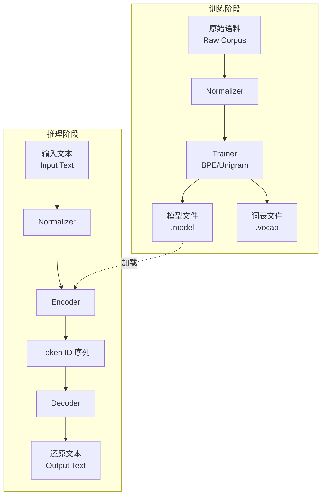

**SentencePiece** 是一个由 Google 开发的开源**无监督文本分词器 (Tokenizer)** 和 **反分词器 (Detokenizer)**。它主要用于基于神经网络的文本生成系统（如机器翻译 NMT、大语言模型 LLM）。

**核心特点：**
*   **语言无关性 (Language Independent)**：不依赖于特定语言的预分词（如英语的空格分词、中文的 jieba 分词），直接在**原始句子**上进行训练。
*   **无损性 (Lossless Tokenization)**：可以将 Token 序列完美还原为原始文本（包括空格）。它将空格视为普通字符（通常用 ` ` (U+2581) 表示）。
*   **子词算法支持**：内置支持 **BPE (Byte-Pair Encoding)** 和 **Unigram Language Model** 两种主流子词分割算法。
*   **端到端训练**：直接从原始语料训练分词模型，简化了 NLP 流水线。

$$
\text{Raw Sentence} \xrightarrow{\text{Encode}} \text{Subword Tokens} \xrightarrow{\text{Decode}} \text{Raw Sentence}
$$

---

## 2. 架构与原理 (Architecture & Mechanism)

### 2.1 核心组件

SentencePiece 的工作流程主要包含四个组件：
1.  **Normalizer**: 对输入文本进行 Unicode 规范化（如 NFKC），统一字符表示。
2.  **Trainer**: 从语料库中训练子词模型（BPE 或 Unigram）。
3.  **Encoder**: 将文本分割为子词 Token。
4.  **Decoder**: 将 Token 序列还原为文本。

### 2.2 架构图解



### 2.3 关键算法：Unigram vs. BPE

SentencePiece 支持两种主要算法，默认使用 **Unigram**。

| 特性 | Unigram Language Model | Byte-Pair Encoding (BPE) |
| :--- | :--- | :--- |
| **原理** | 基于概率的语言模型。假设每个子词独立出现，寻找使句子概率最大的切分方式。 | 基于频率的合并算法。迭代合并出现频率最高的相邻字符对。 |
| **词表构建** | 从大词表开始，迭代**剪枝 (Pruning)**，移除对整体似然影响最小的 token。 | 从字符开始，迭代**合并 (Merge)**，增加高频共现的 token。 |
| **分词方式** | 概率分词，可输出多种切分结果（Subword Regularization）。 | 确定性分词（通常是贪婪匹配）。 |
| **优势** | 往往能产生更符合语言学直觉的切分；支持采样正则化。 | 算法简单，广泛用于 GPT 系列。 |

### 2.4 空格处理 (Whitespace Handling)

SentencePiece 最具革命性的设计是将空格视为普通字符，通常替换为下划线 ` ` (U+2581 LOW LINE)。

*   **传统分词**：`Hello world` -> `[Hello, world]` (空格信息丢失)
*   **SentencePiece**：`Hello world` -> `[Hello,  world]` (空格保留在 token 中)

这使得 `Detokenize(Tokenize(Input)) == Input` 始终成立。

---

## 3. API 与代码示例 (API & Code Examples)

### 3.1 安装

```bash
pip install sentencepiece
```

### 3.2 训练模型 (Training)

```python
import sentencepiece as spm

# 准备训练语料 (data.txt 每行一个句子)
# 训练参数：
# --input: 输入文件
# --model_prefix: 模型前缀 (生成 m.model 和 m.vocab)
# --vocab_size: 词表大小
# --model_type: 算法类型 (unigram, bpe, char, word)
spm.SentencePieceTrainer.train(
    input='data.txt', 
    model_prefix='m', 
    vocab_size=1000, 
    model_type='unigram'
)
```

### 3.3 编码与解码 (Encoding & Decoding)

```python
import sentencepiece as spm

# 加载模型
sp = spm.SentencePieceProcessor()
sp.load('m.model')

# 编码：文本 -> Token 列表
text = "Hello, world!"
tokens = sp.encode_as_pieces(text)
print(tokens)
# Output: [' Hello', ',', ' world', '!'] (注意下划线表示空格)

# 编码：文本 -> ID 列表
ids = sp.encode_as_ids(text)
print(ids)
# Output: [15, 4, 32, 18]

# 解码：ID 列表 -> 文本
decoded_text = sp.decode(ids)
print(decoded_text)
# Output: Hello, world! (完美还原)
```

---

## 4. 高级特性 (Advanced Features)

### 4.1 子词正则化 (Subword Regularization)

在训练神经网络（如机器翻译）时，为了提高模型的鲁棒性，可以在分词时引入随机性。SentencePiece 支持在推理时对同一句话生成不同的分词结果。

```python
# 采样分词 (Sampling)
# nbest_size=-1 表示从所有可能的切分中采样
# alpha 是平滑参数
for _ in range(3):
    print(sp.sample_encode_as_pieces('New York', nbest_size=-1, alpha=0.1))

# 可能的输出：
# [' New', ' York']
# [' New', ' Y', 'ork']
# [' N', 'ew', ' York']
```

### 4.2 自定义字符与控制符

SentencePiece 允许定义两类特殊 Token：
*   **User Defined Symbols**: 总是被视为一个整体，不会被拆分（如实体名、特殊标记）。
*   **Control Symbols**: 用于控制模型生成的特殊 ID（如 `<pad>`, `<s>`, `</s>`）。

---

## 5. 常见问题与坑 (Pitfalls)

1.  **词表大小限制**：
    *   SentencePiece 的 `vocab_size` 是硬性限制。如果语料库太小，可能无法生成指定数量的 token。
    
2.  **UNK Token**：
    *   SentencePiece 默认包含 `<unk>` (Unknown) token。如果遇到从未见过的字符（且不是 BPE 模式），会被映射为 `<unk>`。
    *   在 BPE 模式下，通常字符集覆盖率设置为 1.0 (100%)，以启用字节回退 (Byte Fallback)，避免 `<unk>`。

3.  **模型文件通用性**：
    *   `.model` 文件是跨平台的（C++, Python, Go 等），直接加载即可使用。

---

## 6. 参考资料 (References)

1.  **GitHub Repository**: [google/sentencepiece](https://github.com/google/sentencepiece)
2.  **ArXiv Paper**: [SentencePiece: A simple and language independent subword tokenizer and detokenizer for Neural Text Processing](https://arxiv.org/abs/1808.06226)
3.  **Hugging Face**: [Summary of the tokenizers](https://huggingface.co/docs/transformers/tokenizer_summary)
4.  **Medium Article**: [SentencePiece Tokenizer Demystified](https://medium.com/data-science/sentencepiece-tokenizer-demystified-d0a3aac19b15)
5.  **TensorFlow Guide**: [Subword tokenizers](https://www.tensorflow.org/text/guide/subwords_tokenizer)
