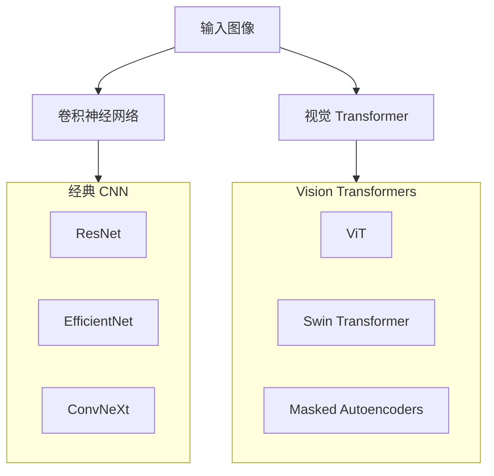
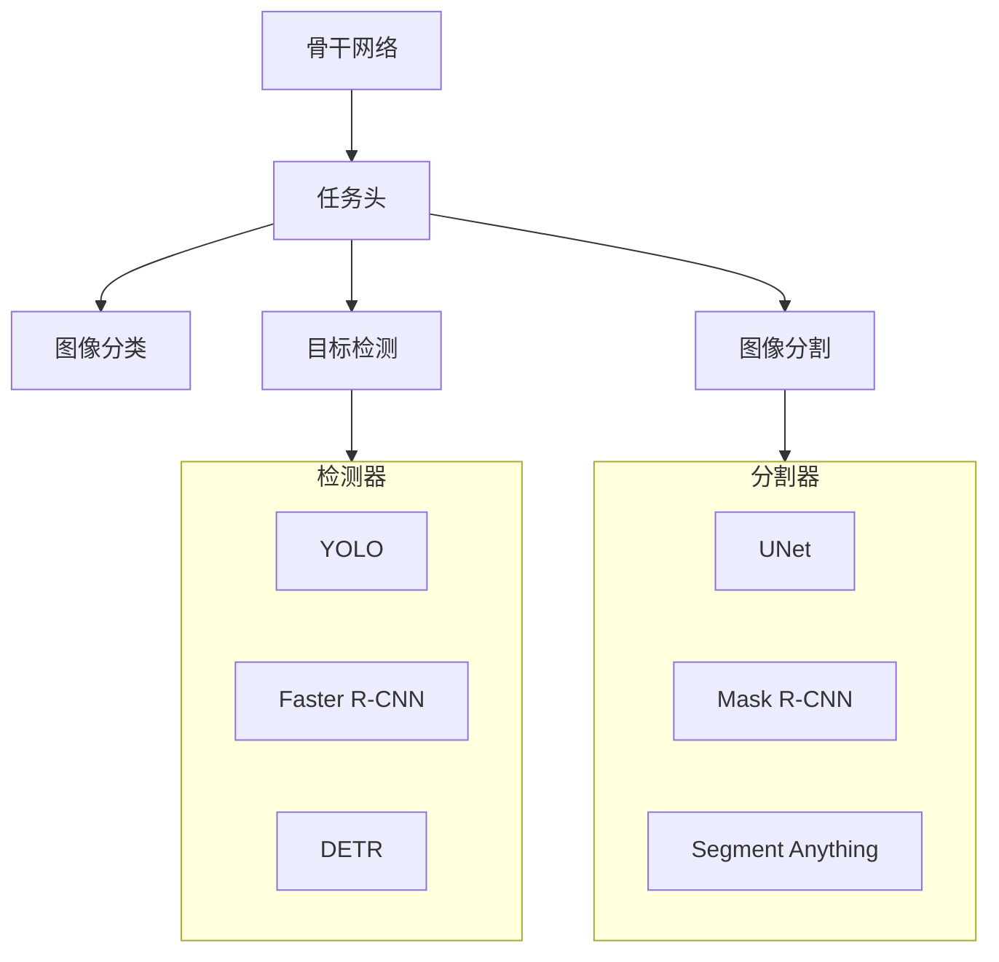
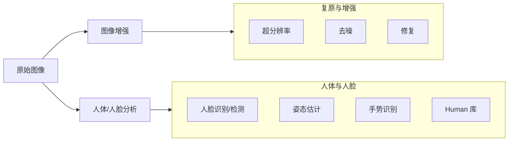
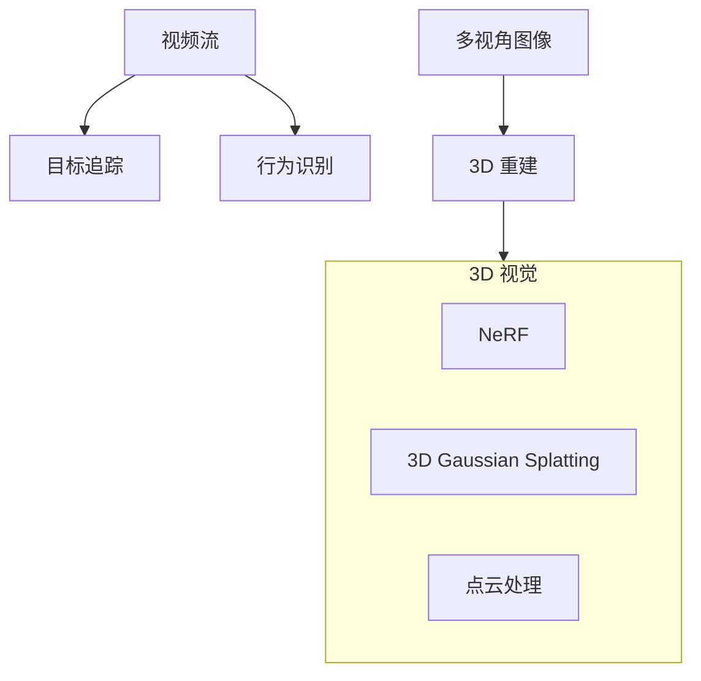
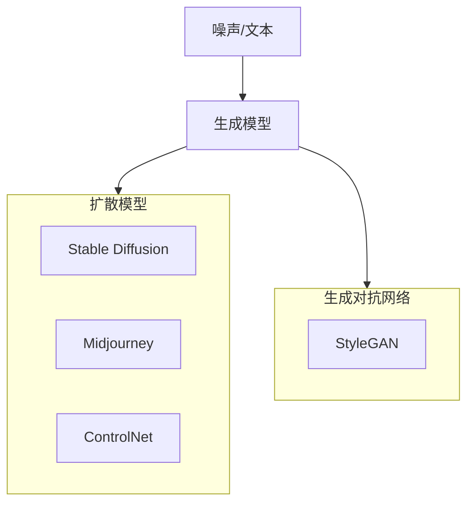
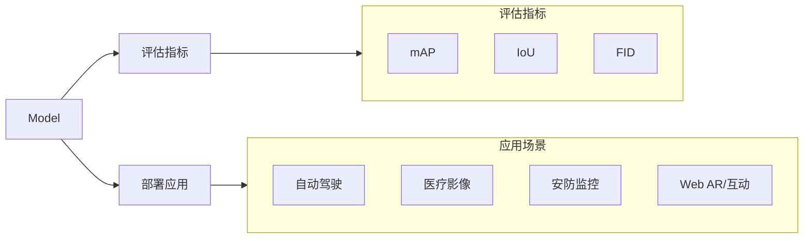

# 计算机视觉 (CV) 知识图谱

本文档旨在梳理计算机视觉 (CV) 生态系统中的关键概念、技术组件及其相互关系。

## 1. 基础模型 (Backbones)

基础模型是提取图像特征的骨干网络，决定了视觉任务的性能上限。

### 关键组件

### 参考链接

## 2. 核心任务 (Core Tasks)

核心任务是 CV 领域最基础的问题，包括分类、检测和分割。

### 关键组件

### 参考链接

## 3. 图像处理 (Image Processing)

关注图像质量增强、底层视觉处理及人脸/人体分析。

### 关键组件

### 概念说明

*   **Human (Human Library)**: 一个基于 TensorFlow.js 的浏览器端计算机视觉库，集成了一系列轻量级 AI 模型，专注于实时 3D 人脸检测、身体姿态追踪、手势识别、虹膜分析及情绪预测等任务。

### 参考链接
- [Human 官方仓库](https://github.com/vladmandic/human)

## 4. 视频与3D (Video & 3D)

处理时序数据和三维空间信息的任务。

### 关键组件

### 参考链接

## 5. 生成式视觉 (Generative Vision)

利用 AI 生成或编辑图像和视频。

### 关键组件

### 参考链接

## 6. 评估与应用 (Evaluation & Application)

模型评估指标及实际应用场景。

### 关键组件

### 参考链接
