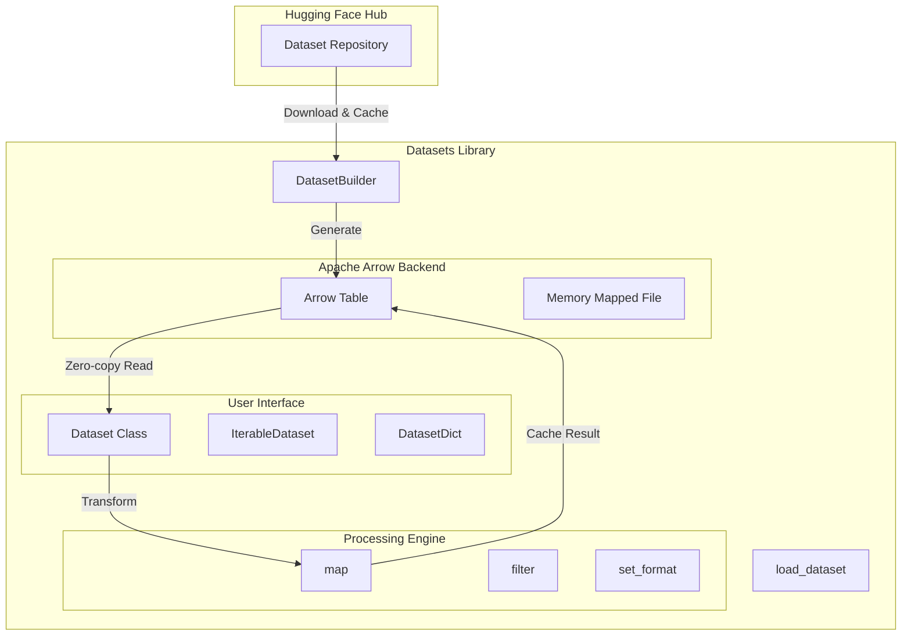

> **摘要**：`datasets` 是 Hugging Face 生态系统中用于访问和处理大规模数据集的轻量级 Python 库。它以 Apache Arrow 为底层存储格式，实现了内存高效的零拷贝读取，并提供了与 Hugging Face Hub 的无缝集成。本文将从架构设计、核心组件、数据处理流程及最佳实践等方面进行全面解析。

## 1. 架构概览

`datasets` 库的设计理念是**高效**、**易用**和**标准化**。它通过内存映射（Memory Mapping）技术，使得在普通硬件上处理 TB 级别的数据集成为可能。

### 1.1 核心架构图



## 2. 核心组件详解

### 2.1 Dataset 与 IterableDataset
*   **`Dataset`**：基于 Apache Arrow 的 Map-style 数据集。
    *   **特点**：支持随机访问（`__getitem__`）、切片、列操作。
    *   **优势**：利用 Arrow 的列式存储和内存映射，读取速度极快，内存占用极低。
    *   **适用场景**：数据量能够适应磁盘空间，需要随机打乱（Shuffle）或复杂索引操作。
*   **`IterableDataset`**：流式数据集。
    *   **特点**：只能按顺序迭代（`__iter__`），不支持随机访问。
    *   **优势**：无需下载完整数据，即时流式传输，适合超大规模数据集（如 TB 级语料）。
    *   **适用场景**：数据量远超磁盘容量，或仅需顺序读取进行训练。

### 2.2 Apache Arrow 后端
`datasets` 的核心竞争力在于其底层使用的 Apache Arrow 格式：
*   **零拷贝（Zero-copy）**：从磁盘读取数据到内存无需序列化/反序列化，极大降低了 IO 开销。
*   **内存映射（Memory Mapping）**：操作系统负责内存管理，只加载当前需要的数据页，使得处理超过 RAM 大小的数据集成为可能。
*   **列式存储**：适合数据分析和批处理操作，与 Pandas、NumPy 高度兼容。

### 2.3 DatasetDict
用于管理数据集的不同划分（Split），本质上是一个字典，键通常为 `'train'`, `'validation'`, `'test'`，值为 `Dataset` 对象。

## 3. 数据处理流程

### 3.1 加载 (Load)
使用 `load_dataset` 统一接口加载数据：
*   **Hugging Face Hub**：`load_dataset("squad")`
*   **本地文件**：`load_dataset("csv", data_files="my_file.csv")`
*   **流式模式**：`load_dataset("c4", streaming=True)`

### 3.2 变换 (Transform)
最强大的工具是 `map` 方法，它允许对数据集进行批量映射：
*   **Tokenization**：调用 Transformers 的 tokenizer 处理文本。
*   **预处理**：图像缩放、音频重采样等。
*   **多进程**：设置 `num_proc` 参数可利用多核 CPU 加速处理。
*   **缓存机制**：`map` 会自动缓存处理结果，避免重复计算。

### 3.3 格式化 (Format)
使用 `set_format` 方法可以零拷贝地转换数据格式，适配下游框架：
*   `dataset.set_format("torch")`：返回 PyTorch Tensor。
*   `dataset.set_format("tensorflow")`：返回 TensorFlow Tensor。
*   `dataset.set_format("numpy")`：返回 NumPy Array。

## 4. 代码示例

### 4.1 加载与预处理
```python
from datasets import load_dataset
from transformers import AutoTokenizer

# 1. 加载数据集
dataset = load_dataset("glue", "mrpc")

# 2. 加载分词器
tokenizer = AutoTokenizer.from_pretrained("bert-base-cased")

# 3. 定义预处理函数
def tokenize_function(examples):
    return tokenizer(examples["sentence1"], examples["sentence2"], truncation=True)

# 4. 批量应用预处理
tokenized_datasets = dataset.map(tokenize_function, batched=True)

# 5. 设置 PyTorch 格式
tokenized_datasets.set_format("torch", columns=["input_ids", "token_type_ids", "attention_mask", "label"])
```

### 4.2 创建自定义数据集
```python
from datasets import Dataset
import pandas as pd

# 从 Pandas DataFrame 创建
df = pd.DataFrame({"a": [1, 2], "b": [3, 4]})
dataset = Dataset.from_pandas(df)

# 从字典创建
data_dict = {"a": [1, 2], "b": [3, 4]}
dataset = Dataset.from_dict(data_dict)
```

## 5. 最佳实践

1.  **使用 `batched=True`**：在 `map` 中启用批处理通常能显著提高 Tokenizer 等操作的速度（利用 Rust 实现的多线程加速）。
2.  **利用内存映射**：不要试图将大型 `Dataset` 转换为 Python 列表或 Pandas DataFrame，除非数据量很小。保持 Arrow 格式以获得最佳性能。
3.  **流式处理超大数据**：对于像 C4、OSCAR 这样的大型语料库，始终使用 `streaming=True`，避免磁盘空间耗尽。
4.  **多进程处理**：对于 CPU 密集型任务（如复杂的文本清洗），在 `map` 中设置 `num_proc` 等于 CPU 核心数。

## 6. 参考资料

1.  **Official Documentation**: [Hugging Face Datasets Docs](https://huggingface.co/docs/datasets/index)
2.  **GitHub Repository**: [huggingface/datasets](https://github.com/huggingface/datasets)
3.  **Quick Tour**: [Datasets Quick Tour](https://huggingface.co/docs/datasets/quicktour)
4.  **DeepWiki Analysis**: [DeepWiki - datasets](https://deepwiki.com/huggingface/datasets)
