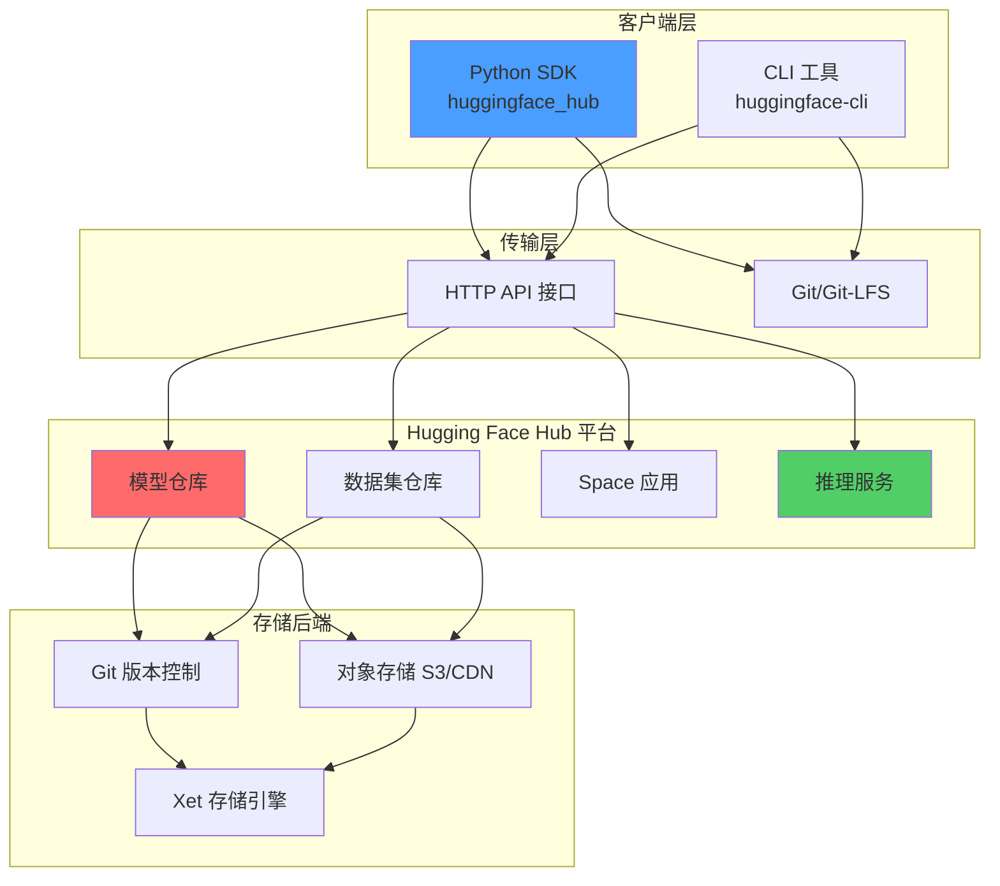
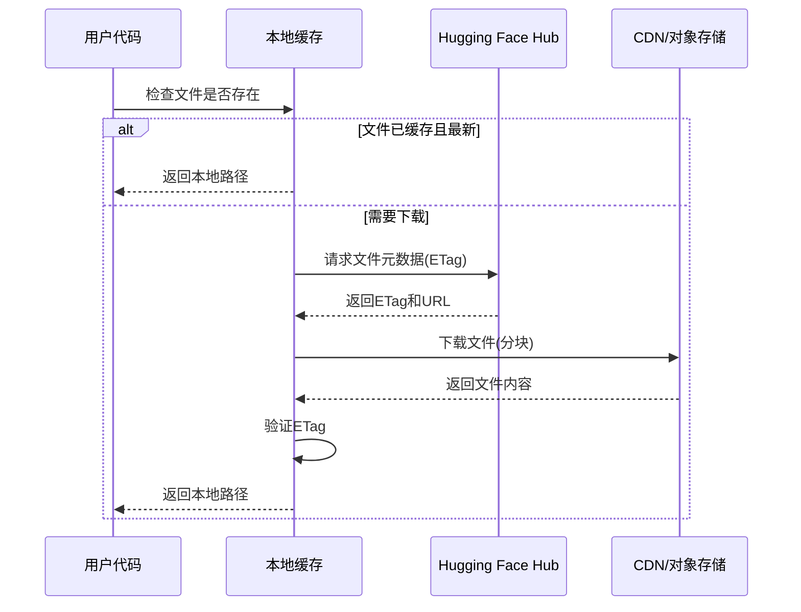
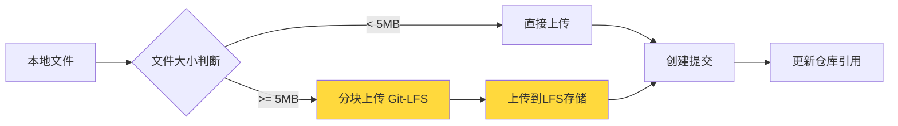
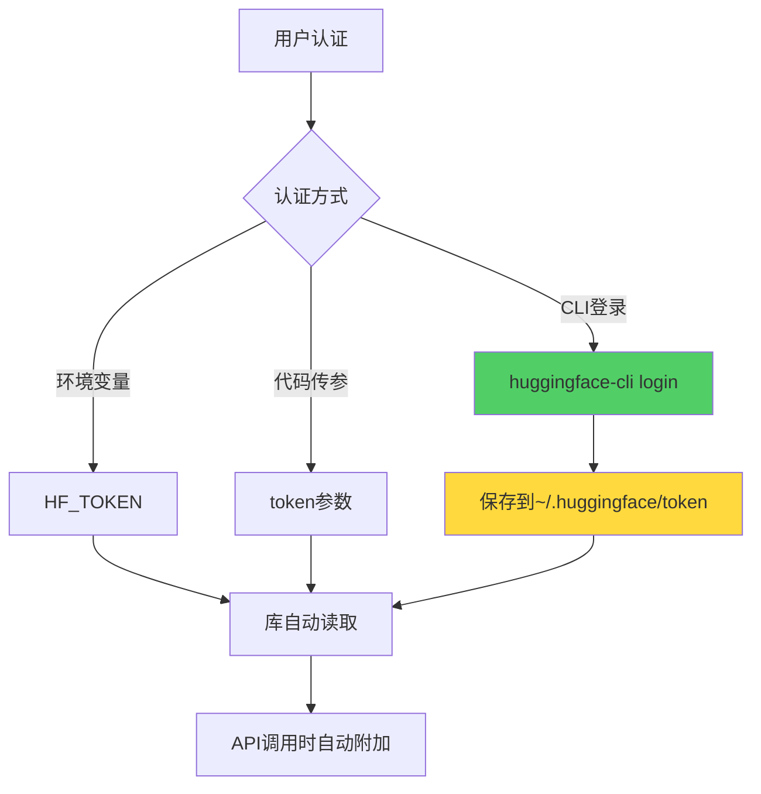
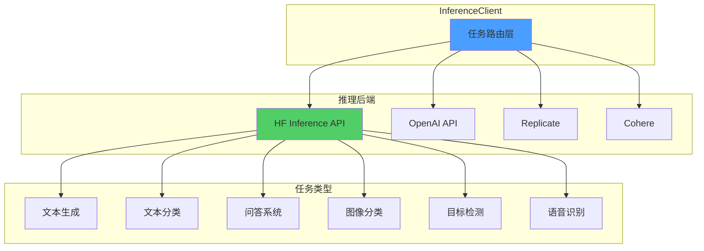

`huggingface_hub` 是由 Hugging Face 开发的官方 Python 客户端库,用于与 Hugging Face Hub 平台进行交互。该库为机器学习从业者提供了统一、简洁的 API 接口,用于管理和分发预训练模型、数据集及其他机器学习资源。

### 核心价值

- **统一接口**: 提供与 Hugging Face Hub 交互的标准化 Python API
- **版本管理**: 基于 Git 的版本控制机制,支持模型和数据集的完整历史追踪
- **资源分发**: 简化预训练模型和数据集的上传、下载流程
- **框架无关**: 支持 PyTorch、TensorFlow、JAX 等多种深度学习框架
- **云端推理**: 集成 Inference API,无需本地部署即可调用模型

## 系统架构

### 整体架构图



### 核心组件

#### 1. HfApi 类

`HfApi` 是与 Hub 交互的核心类,基于 HTTP 协议提供了丰富的 API 方法:

```python
from huggingface_hub import HfApi

api = HfApi()

# 搜索模型
models = api.list_models(filter="text-classification")

# 获取模型信息
model_info = api.model_info("bert-base-uncased")

# 创建仓库
api.create_repo(repo_id="username/my-model", repo_type="model")
```

**关键特性**:
- RESTful API 封装
- 支持分页和过滤
- 异常处理和重试机制
- Token 认证管理

#### 2. 文件传输机制



**下载机制**:
- **缓存策略**: 基于内容寻址(Content-Addressable)的缓存系统
- **ETag 验证**: 使用 HTTP ETag 进行文件完整性校验
- **并发下载**: `snapshot_download` 支持多线程并发下载(默认8个工作线程)
- **断点续传**: 支持 HTTP Range 请求实现断点续传

```python
from huggingface_hub import hf_hub_download, snapshot_download

# 单文件下载
model_path = hf_hub_download(
    repo_id="bert-base-uncased",
    filename="pytorch_model.bin",
    revision="main"  # 指定版本/分支/提交哈希
)

# 仓库快照下载
repo_path = snapshot_download(
    repo_id="gpt2",
    revision="main",
    cache_dir="/custom/cache",
    max_workers=16,  # 并发线程数
    allow_patterns=["*.bin", "*.json"]  # 文件过滤
)
```

#### 3. 上传机制



```python
from huggingface_hub import upload_file, upload_folder

# 单文件上传
upload_file(
    path_or_fileobj="./model.bin",
    path_in_repo="pytorch_model.bin",
    repo_id="username/my-model",
    commit_message="Add trained model weights",
    revision="main"
)

# 文件夹批量上传
upload_folder(
    folder_path="./trained_model",
    repo_id="username/my-model",
    path_in_repo="",  # 上传到仓库根目录
    commit_message="Initial model release",
    ignore_patterns=["*.tmp", "*.log"]  # 忽略文件
)
```

**大文件处理**:
- 自动启用 Git-LFS (>5MB)
- Xet 存储引擎: 块级去重技术,显著减少增量更新的传输量
- 多部分上传(Multipart Upload)支持

## 认证与权限管理

### Token 管理



```python
# 方式1: CLI 登录(推荐)
# $ huggingface-cli login

# 方式2: 编程方式登录
from huggingface_hub import login
login(token="hf_xxxxxxxxxxxxx")

# 方式3: 环境变量
import os
os.environ["HF_TOKEN"] = "hf_xxxxxxxxxxxxx"

# 方式4: 显式传递token
from huggingface_hub import HfApi
api = HfApi(token="hf_xxxxxxxxxxxxx")
```

### 权限级别

| 权限类型 | 能力范围 |
|---------|---------|
| **Read** | 下载公开/私有模型,查看仓库信息 |
| **Write** | 创建/编辑仓库,上传文件,管理发布 |
| **Fine-grained** | 自定义特定仓库的访问权限 |

## 模型搜索与发现

### 搜索 API

```python
from huggingface_hub import HfApi, ModelFilter

api = HfApi()

# 关键词搜索
results = api.list_models(
    search="text-generation",
    sort="downloads",  # 按下载量排序
    direction=-1,      # 降序
    limit=10
)

# 结构化过滤
filter_obj = ModelFilter(
    task="text-classification",
    library="pytorch",
    language="en",
    model_name="bert"
)

models = api.list_models(filter=filter_obj, limit=20)

for model in models:
    print(f"{model.modelId} - {model.downloads} downloads")
```

### 元数据获取

```python
# 详细模型信息
model_info = api.model_info("bert-base-uncased")

print(f"模型ID: {model_info.modelId}")
print(f"任务类型: {model_info.pipeline_tag}")
print(f"下载量: {model_info.downloads}")
print(f"点赞数: {model_info.likes}")
print(f"标签: {model_info.tags}")
print(f"最新提交: {model_info.sha}")

# 文件列表
files = api.list_repo_files("gpt2", repo_type="model")
print(f"仓库文件: {files}")
```

## 推理 API 集成

### InferenceClient 架构



### 使用示例

```python
from huggingface_hub import InferenceClient

# 初始化客户端
client = InferenceClient(
    model="mistralai/Mistral-7B-Instruct-v0.1",
    token="hf_xxxxx"
)

# 文本生成
response = client.text_generation(
    prompt="Write a Python function to calculate fibonacci numbers:",
    max_new_tokens=200,
    temperature=0.7,
    top_p=0.95
)
print(response)

# 文本分类
result = client.text_classification(
    "This movie is absolutely fantastic!"
)
print(result)  # [{'label': 'POSITIVE', 'score': 0.9998}]

# 问答系统
answer = client.question_answering(
    question="What is the capital of France?",
    context="Paris is the capital and most populous city of France."
)
print(answer)  # {'answer': 'Paris', 'score': 0.98, ...}

# 图像分类
with open("cat.jpg", "rb") as f:
    image_bytes = f.read()

predictions = client.image_classification(image=image_bytes)
print(predictions)  # [{'label': 'cat', 'score': 0.95}, ...]
```

### 多提供商支持

```python
# 使用 OpenAI
client_openai = InferenceClient(
    provider="openai",
    api_key="sk-xxxxx"
)

response = client_openai.chat_completion(
    model="gpt-3.5-turbo",
    messages=[
        {"role": "system", "content": "You are a helpful assistant."},
        {"role": "user", "content": "Explain quantum computing"}
    ]
)
```

## 缓存管理机制

### 缓存结构

```
~/.cache/huggingface/hub/
├── models--bert-base-uncased/
│   ├── refs/
│   │   └── main
│   ├── snapshots/
│   │   └── a8b9e8c.../
│   │       ├── config.json
│   │       ├── pytorch_model.bin
│   │       └── tokenizer.json
│   └── blobs/
│       └── a8b9e8c...
└── models--gpt2/
    └── ...
```

### 缓存管理 API

```python
from huggingface_hub import scan_cache_dir, HfApi

# 扫描缓存
cache_info = scan_cache_dir()

print(f"缓存路径: {cache_info.cache_dir}")
print(f"总大小: {cache_info.size_on_disk_str}")
print(f"仓库数: {len(cache_info.repos)}")

# 查看特定仓库
for repo in cache_info.repos:
    if "bert" in repo.repo_id:
        print(f"仓库: {repo.repo_id}")
        print(f"大小: {repo.size_on_disk_str}")
        print(f"修订版本数: {len(repo.revisions)}")

# 清理缓存
delete_strategy = cache_info.delete_revisions(
    "bert-base-uncased",
    "old-commit-hash"
)
delete_strategy.execute()
```

## 仓库管理

### 创建与配置

```python
from huggingface_hub import HfApi, create_repo

api = HfApi()

# 创建模型仓库
repo_url = create_repo(
    repo_id="username/my-awesome-model",
    private=False,
    repo_type="model",
    exist_ok=True
)

# 创建数据集仓库
dataset_repo = create_repo(
    repo_id="username/my-dataset",
    repo_type="dataset"
)

# 创建 Space 应用
space_repo = create_repo(
    repo_id="username/my-app",
    repo_type="space",
    space_sdk="gradio"  # 或 "streamlit"
)
```

### Git 操作集成

```python
from huggingface_hub import Repository

# 克隆仓库(可选,推荐使用HTTP API方式)
repo = Repository(
    local_dir="./local_repo",
    clone_from="username/my-model",
    use_auth_token=True
)

# 添加文件
repo.git_add("new_file.bin")
repo.git_commit("Add new model variant")
repo.git_push()

# 创建标签
repo.git_tag("v1.0.0", message="Release version 1.0.0")
repo.git_push(upstream="origin --tags")
```

## 性能优化策略

### 1. 并发下载

```python
from concurrent.futures import ThreadPoolExecutor
from huggingface_hub import hf_hub_download

def download_model(repo_id):
    return snapshot_download(repo_id, max_workers=16)

# 并行下载多个模型
model_ids = ["bert-base-uncased", "gpt2", "t5-small"]

with ThreadPoolExecutor(max_workers=3) as executor:
    futures = [executor.submit(download_model, mid) for mid in model_ids]
    results = [f.result() for f in futures]
```

### 2. 选择性下载

```python
# 仅下载所需文件类型
snapshot_download(
    "facebook/opt-350m",
    allow_patterns=["*.bin", "config.json", "tokenizer.json"],
    ignore_patterns=["*.md", "*.txt"]
)
```

### 3. 自定义缓存位置

```python
import os

# 设置缓存到SSD或更大的磁盘
os.environ["HF_HOME"] = "/mnt/fast_storage/hf_cache"

# 或在函数调用时指定
hf_hub_download(
    repo_id="model-name",
    filename="file.bin",
    cache_dir="/custom/cache/path"
)
```

### 4. Xet 存储优化

对于频繁更新的大文件,Xet 块级去重技术可显著减少传输量:

```python
# 环境变量启用高性能模式
os.environ["HF_XET_HIGH_PERFORMANCE"] = "1"

# 增量更新仅传输变化的块
upload_file(
    path_or_fileobj="./updated_model.bin",
    path_in_repo="model.bin",
    repo_id="username/my-model",
    commit_message="Incremental checkpoint update"
)
```

## 错误处理与重试机制

```python
from huggingface_hub import (
    HfApi,
    RepositoryNotFoundError,
    GatedRepoError,
    HfHubHTTPError,
    InferenceTimeoutError
)

api = HfApi()

try:
    model_info = api.model_info("username/non-existent-model")
except RepositoryNotFoundError:
    print("仓库不存在或您无权访问")
except GatedRepoError:
    print("模型需要接受使用协议")
except HfHubHTTPError as e:
    if e.response.status_code == 401:
        print("认证失败,请检查 token")
    elif e.response.status_code == 403:
        print("无权限访问")
    else:
        print(f"HTTP错误: {e}")

# 推理超时处理
try:
    result = client.text_generation("prompt", max_new_tokens=1000)
except InferenceTimeoutError:
    print("推理超时,尝试使用更小的模型或减少 max_new_tokens")
```

## CLI 工具

### 常用命令

```bash
# 认证登录
huggingface-cli login

# 查看当前用户
huggingface-cli whoami

# 创建仓库
huggingface-cli repo create my-model --type model

# 上传文件
huggingface-cli upload username/my-model ./model_dir

# 下载仓库
huggingface-cli download username/my-model --local-dir ./downloads

# 搜索模型
huggingface-cli models ls --author=google --task=text-classification

# 查看模型信息
huggingface-cli models info bert-base-uncased

# 扫描缓存
huggingface-cli cache scan

# 清理缓存
huggingface-cli cache delete
```

## 最佳实践

### 1. 版本固定

```python
# 生产环境使用固定的提交哈希
hf_hub_download(
    repo_id="bert-base-uncased",
    filename="pytorch_model.bin",
    revision="86b5e0934494bd15c9632b12f734a8a67f723594"
)

# 或使用标签
hf_hub_download(
    repo_id="stabilityai/stable-diffusion-2-1",
    filename="v2-1_768-ema-pruned.ckpt",
    revision="v2.1"  # Git 标签
)
```

### 2. 模型卡片规范

创建详尽的 `README.md` 模型卡片:

```markdown
---
language: en
license: apache-2.0
tags:
- text-classification
- sentiment-analysis
datasets:
- imdb
metrics:
- accuracy
model-index:
- name: my-sentiment-model
  results:
  - task:
      type: text-classification
    dataset:
      name: IMDB
      type: imdb
    metrics:
    - type: accuracy
      value: 0.94
---

# 模型说明
[详细描述模型架构、训练数据、性能指标]

## 使用方法
\```python
from transformers import AutoModelForSequenceClassification
model = AutoModelForSequenceClassification.from_pretrained("username/my-sentiment-model")
\```
```

### 3. 安全与隐私

```python
# 不要在代码中硬编码 token
# ❌ 错误做法
api = HfApi(token="hf_xxxxx")

# ✅ 正确做法
from huggingface_hub import HfApi
api = HfApi()  # 自动从环境变量或 ~/.huggingface/token 读取

# 上传前排除敏感文件
upload_folder(
    folder_path="./model",
    repo_id="username/my-model",
    ignore_patterns=[
        "*.env",
        "credentials.json",
        ".git/*",
        "__pycache__/*"
    ]
)
```

## 与其他库的集成

### Transformers

```python
from transformers import AutoModel, AutoTokenizer

# from_pretrained 内部使用 huggingface_hub
model = AutoModel.from_pretrained("bert-base-uncased")
tokenizer = AutoTokenizer.from_pretrained("bert-base-uncased")

# 训练后推送到 Hub
model.push_to_hub("username/fine-tuned-bert")
tokenizer.push_to_hub("username/fine-tuned-bert")
```

### Datasets

```python
from datasets import load_dataset

# 内部调用 huggingface_hub 下载数据集
dataset = load_dataset("squad")

# 上传自定义数据集
dataset.push_to_hub("username/my-dataset")
```

### Diffusers

```python
from diffusers import StableDiffusionPipeline

# 加载 Stable Diffusion 模型
pipe = StableDiffusionPipeline.from_pretrained(
    "stabilityai/stable-diffusion-2-1"
)

# 推送微调后的模型
pipe.push_to_hub("username/my-stable-diffusion")
```

## 企业级应用

### 私有 Hub 部署

```python
# 配置企业内部 Hub 实例
from huggingface_hub import HfApi

api = HfApi(
    endpoint="https://hub.company.internal",
    token="internal_token"
)

# 所有操作指向内部实例
api.create_repo("company-models/project-x")
```

### 组织管理

```python
# 在组织下创建仓库
create_repo(
    repo_id="my-organization/shared-model",
    organization="my-organization",
    private=True
)

# 列出组织的所有模型
org_models = api.list_models(author="my-organization")
```

## 常见问题与解决方案

### 问题1: 大文件下载中断

**解决方案**: 启用自动重试
```python
from huggingface_hub import hf_hub_download
from requests.adapters import HTTPAdapter
from requests.packages.urllib3.util.retry import Retry

# 配置重试策略
retry_strategy = Retry(
    total=3,
    backoff_factor=1,
    status_forcelist=[429, 500, 502, 503, 504]
)
```

### 问题2: Windows 符号链接权限

**解决方案**:
1. 启用开发者模式
2. 或设置环境变量禁用符号链接警告:
```python
os.environ["HF_HUB_DISABLE_SYMLINKS_WARNING"] = "1"
```

### 问题3: 代理网络环境

**解决方案**:
```python
import os
os.environ["HTTP_PROXY"] = "http://proxy.company.com:8080"
os.environ["HTTPS_PROXY"] = "http://proxy.company.com:8080"

# 或配置 requests 会话
import requests
from huggingface_hub import configure_http_backend

session = requests.Session()
session.proxies = {
    "http": "http://proxy.company.com:8080",
    "https": "http://proxy.company.com:8080"
}
configure_http_backend(backend_factory=lambda: session)
```

## 未来发展方向

1. **增强的流式传输**: 支持模型权重的流式加载,减少内存占用
2. **联邦学习集成**: 支持分布式模型训练和聚合
3. **更细粒度的访问控制**: 基于角色的权限管理(RBAC)
4. **改进的数据版本控制**: 针对数据集的专用版本管理工具
5. **边缘计算支持**: 优化移动和嵌入式设备的模型分发

## 参考资料

- [Hugging Face Hub 官方文档](https://huggingface.co/docs/huggingface_hub/en/index)
- [Hugging Face Hub GitHub 仓库](https://github.com/huggingface/huggingface_hub)
- [PyPI 项目页面](https://pypi.org/project/huggingface-hub/)
- [快速入门指南](https://huggingface.co/docs/huggingface_hub/en/quick-start)
- [Deepnote 深度教程](https://deepnote.com/blog/ultimate-guide-to-huggingfacehub-library-in-python)

---

**文档版本**: 1.0  
**最后更新**: 2026-01-18  
**基于版本**: huggingface_hub 1.3.2
