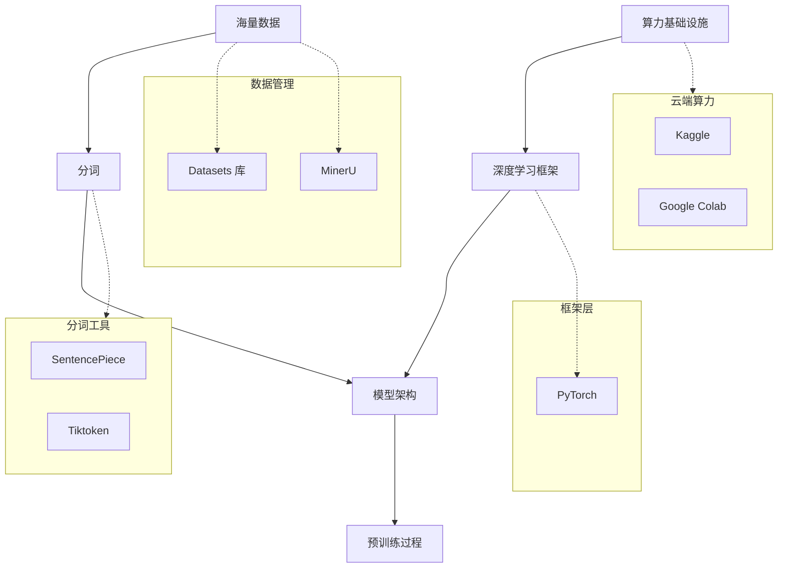
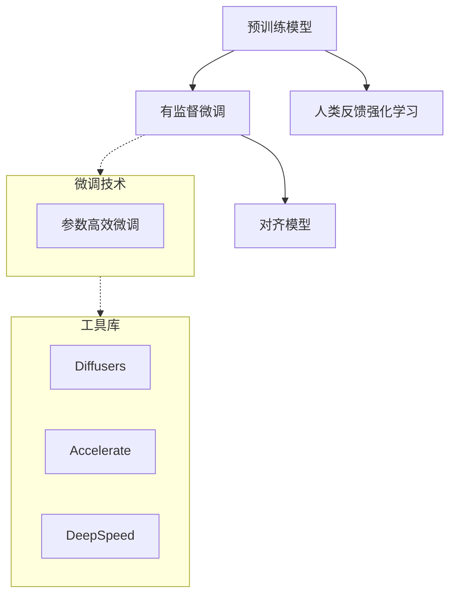
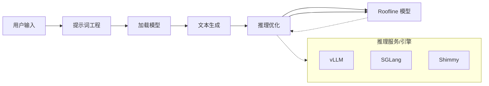
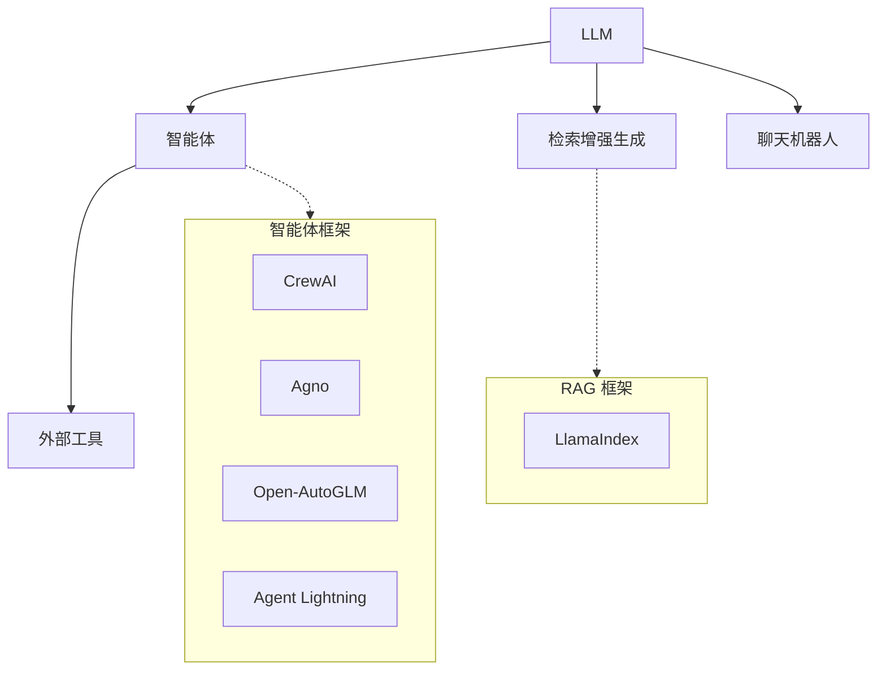
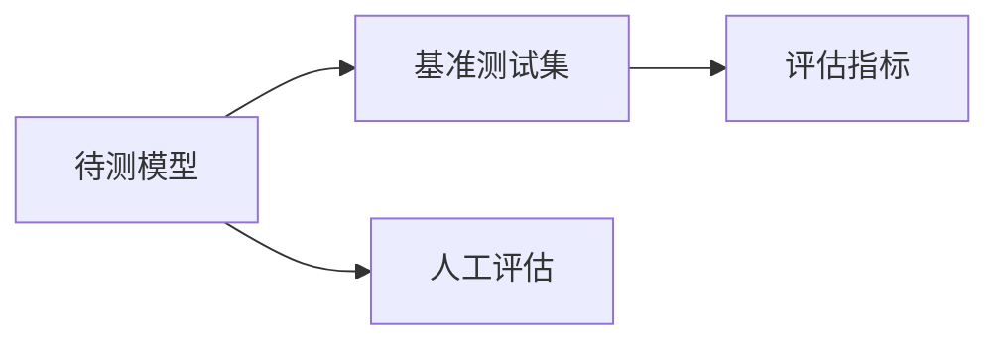
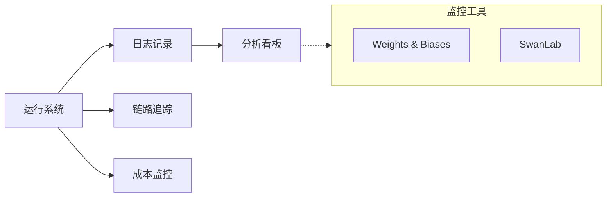

# LLM 知识图谱

本文档旨在梳理大语言模型（LLM）生态系统中的关键概念、技术组件及其相互关系。

## 1. 预训练 (Pre-training)

预训练是大语言模型构建的基础阶段，通过在海量数据上进行无监督学习，使模型掌握语言规律和世界知识。

### 关键组件

### 概念说明

*   **Torch (PyTorch)**: PyTorch 是一个开源的机器学习库，广泛用于计算机视觉和自然语言处理，是构建和训练大语言模型的主流底层框架。
*   **Datasets (Datasets 库)**: Hugging Face 推出的轻量级 Python 库，用于高效访问和处理大规模数据集，支持内存映射和流式传输。
*   **MinerU**: OpenDataLab 开源的一站式高质量数据提取工具，专注于将 PDF、网页等复杂非结构化数据转化为适配 LLM 训练的 Markdown 或 JSON 格式。
*   **SentencePiece**: Google 开源的无监督文本分词器，支持 BPE 和 Unigram 算法，具有语言无关性和无损还原特性。
*   **Tiktoken**: OpenAI 开源的高性能 BPE 分词器，专为 GPT 系列模型设计，速度极快且支持字节级编码。
*   **Kaggle**: 一个数据科学竞赛平台，提供免费的 GPU/TPU 算力环境（Notebooks），广泛用于模型训练、实验和分享。
*   **Colab (Google Colab)**: Google 提供的托管 Jupyter Notebook 服务，提供免费的 GPU 算力，是快速实验和微调轻量级 LLM 的常用工具。

### 参考链接
- [PyTorch 介绍](./Pytorch/介绍.md)
- [Datasets 库简介](./datasets/简介.md)
- [MinerU 官方仓库](https://github.com/opendatalab/MinerU)
- [SentencePiece 简介](./SentencePiece/简介.md)
- [Tiktoken 简介](./tiktoken/简介.md)

## 2. 微调 (Fine-tuning)

微调是在预训练模型的基础上，使用特定任务的数据进行进一步训练，以提升模型在特定领域的表现。

### 关键组件

### 概念说明

*   **Diffusers**: Hugging Face 推出的用于生成式 AI（特别是扩散模型）的库，虽然主要用于图像生成，但也常用于微调和推理相关的扩散模型任务。
*   **Accelerate**: Hugging Face 提供的训练加速库，用于简化多 GPU/TPU/多机训练与混合精度配置，常用于 LLM 的微调流程。
*   **DeepSpeed**: Microsoft 开源的分布式训练与内存优化库，提供 ZeRO 等技术以支持超大模型的高效微调与训练。
*   **PEFT (Parameter-Efficient Fine-Tuning)**: 一种微调技术集合（如 LoRA, Prefix Tuning），旨在通过仅训练少量参数来适应大型预训练模型，显著降低计算和存储成本。

### 参考链接
- [Diffusers 官方文档](https://huggingface.co/docs/diffusers/index)
- [Accelerate 官方文档](https://huggingface.co/docs/accelerate/index)
- [DeepSpeed 官方文档](https://www.deepspeed.ai/)
- [PEFT 官方文档](https://huggingface.co/docs/peft/index)

## 3. 推理 (Inference)

推理是将训练好的模型部署并用于生成文本或处理请求的过程，关注延迟、吞吐量和资源占用。

### 关键组件

### 概念说明

*   **vLLM**: 高吞吐量、内存高效的大语言模型推理和服务引擎，以其 PagedAttention 技术著称。
*   **SGLang**: 一种用于大语言模型的高效执行引擎，通过结构化生成语言优化复杂提示工作流的推理性能。
*   **Shimmy**: 一个基于 Rust 开发的轻量级 OpenAI API 兼容服务器，专为本地运行 GGUF 格式的大语言模型设计，支持零配置的 GPU 自动加速。
*   **Roofline 模型 (Roofline Model)**: 一种用于分析计算任务性能瓶颈的直观模型。它通过比较任务的**算术强度**（Arithmetic Intensity，计算量与访存量的比值）与硬件的**峰值性能**及**内存带宽**，判断任务是**计算受限 (Compute-bound)** 还是**内存受限 (Memory-bound)**。在 LLM 推理中，Prefill 阶段通常为计算受限，而 Decoding 阶段通常为内存受限。

### 参考链接
- [vLLM 完整指南](./vllm/vLLM完整指南.md)
- [Shimmy 官方仓库](https://github.com/Michael-A-Kuykendall/shimmy)

## 4. 应用 (Application)

应用层关注如何利用 LLM 解决实际问题，包括智能体、RAG（检索增强生成）等模式。

### 关键组件

### 概念说明

*   **LlamaIndex**: 一个专为 LLM 应用程序设计的数据框架，擅长连接私有数据与大模型，特别是在 RAG（检索增强生成）场景下表现出色。
*   **Agno**: 一个轻量级的智能体开发框架，旨在简化多智能体系统的构建和编排（前身为 Phidata）。
*   **CrewAI**: 一个用于编排角色扮演自主 AI 智能体的框架，通过让智能体像团队一样协作来处理复杂任务。
*   **Open-AutoGLM**: 智谱AI开源的手机操作智能体框架，基于视觉语言模型（VLM）实现对Android设备的自然语言控制和自动化操作。
*   **Agent Lightning**: Microsoft 推出的智能体优化框架，支持通过强化学习（RL）和微调技术（SFT）并在几乎零代码修改的情况下优化任意 AI 智能体的性能。

### 参考链接
- [LlamaIndex 介绍](./LLamaIndex/介绍.md)
- [Agno 介绍](./Agno/介绍.mdx)
- [CrewAI 简介](./CrewAI/简介.mdx)

## 5. 评估 (Evaluation)

评估旨在衡量模型的能力、安全性、偏见和幻觉等指标，确保模型达到上线标准。

### 关键组件

### 参考链接

## 6. 观察 (Observation)

观察涉及对模型运行状态、成本、延迟和输出质量的监控与分析。

### 关键组件

### 概念说明

*   **WandB (Weights & Biases)**: 一个用于机器学习实验跟踪、数据集版本控制和模型可视化的开发者工具平台。
*   **SwanLab**: 一款开源、轻量的 AI 模型训练跟踪与可视化工具，提供训练可视化、自动日志记录、实验对比等功能，被誉为“中国版 Weights & Biases”。

### 参考链接
- [WandB 简介](./wandb/简介.md)
- [SwanLab 官方文档](https://docs.swanlab.cn/)

