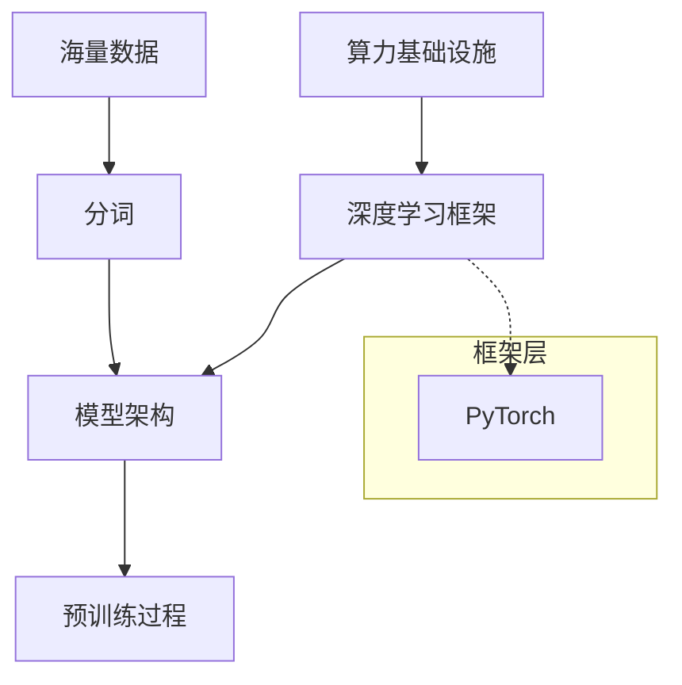
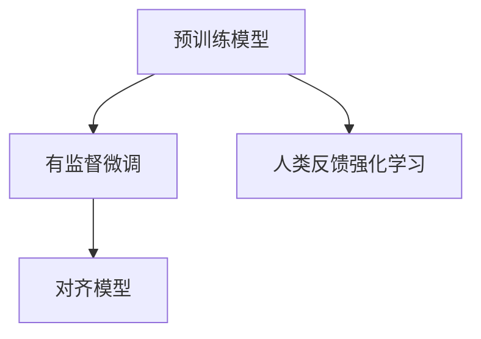
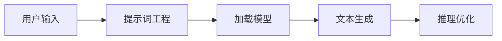
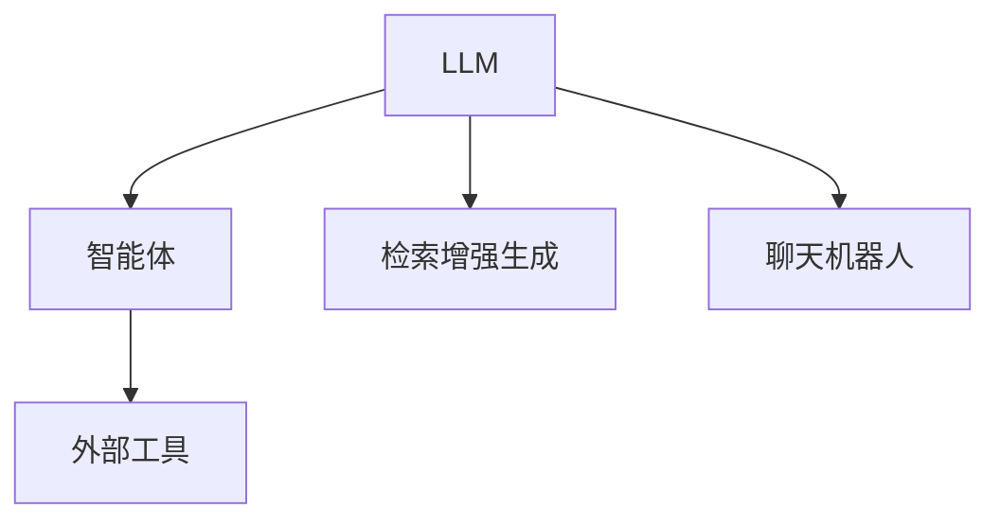
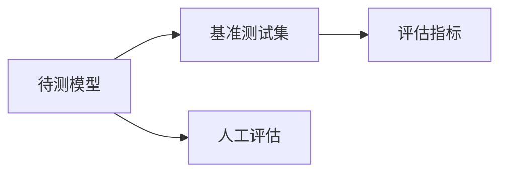
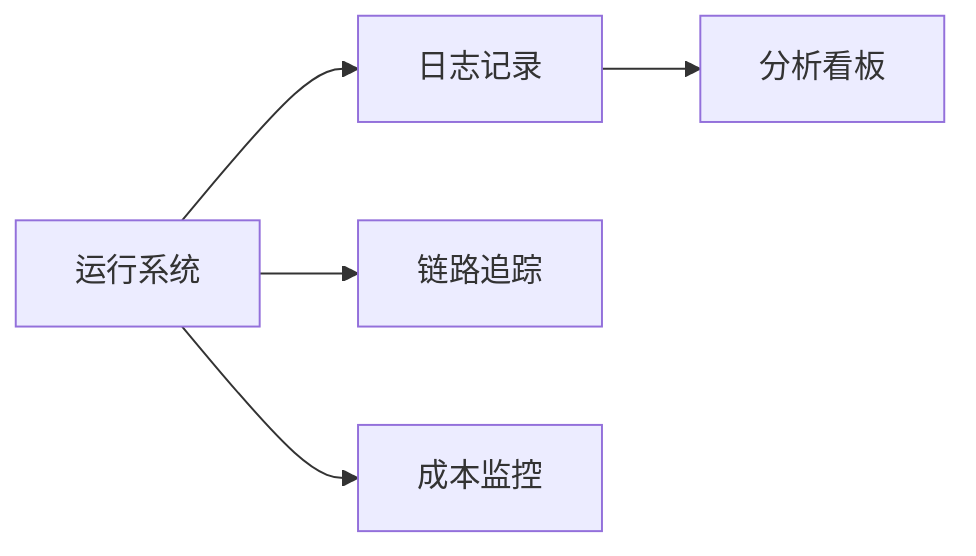

# LLM 知识图谱

本文档旨在梳理大语言模型（LLM）生态系统中的关键概念、技术组件及其相互关系。

## 1. 预训练 (Pre-training)

预训练是大语言模型构建的基础阶段，通过在海量数据上进行无监督学习，使模型掌握语言规律和世界知识。

### 关键组件

### 概念说明

*   **Torch (PyTorch)**: PyTorch 是一个开源的机器学习库，广泛用于计算机视觉和自然语言处理，是构建和训练大语言模型的主流底层框架。

### 参考链接
- [PyTorch 介绍](./Pytorch/介绍.md)

## 2. 微调 (Fine-tuning)

微调是在预训练模型的基础上，使用特定任务的数据进行进一步训练，以提升模型在特定领域的表现。

### 关键组件

### 参考链接

## 3. 推理 (Inference)

推理是将训练好的模型部署并用于生成文本或处理请求的过程，关注延迟、吞吐量和资源占用。

### 关键组件

### 参考链接

## 4. 应用 (Application)

应用层关注如何利用 LLM 解决实际问题，包括智能体、RAG（检索增强生成）等模式。

### 关键组件

### 参考链接

## 5. 评估 (Evaluation)

评估旨在衡量模型的能力、安全性、偏见和幻觉等指标，确保模型达到上线标准。

### 关键组件

### 参考链接

## 6. 观察 (Observation)

观察涉及对模型运行状态、成本、延迟和输出质量的监控与分析。

### 关键组件

### 参考链接
