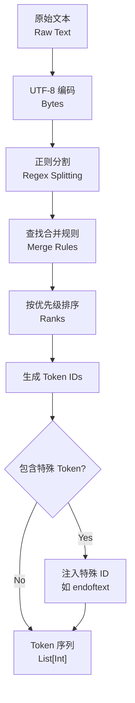

**Tiktoken** 是 OpenAI 开源的一种快速 **BPE (Byte Pair Encoding)** 分词器（Tokenizer）。它专为 OpenAI 的模型（如 GPT-3.5, GPT-4, o1 等）设计，用于将文本转换为模型可处理的 token 序列，并将 token 序列还原为文本。

Tiktoken 的核心特点是：
*   **高性能**：底层使用 Rust 编写，速度比 Python 实现的 Hugging Face Tokenizers 快 3-6 倍。
*   **确定性**：确保在不同环境中对同一文本产生相同的 Token 序列。
*   **无损性**：支持可逆的编码和解码，确保文本信息的完整性。
*   **字节级 BPE**：直接在 UTF-8 字节上运行，无需复杂的 Unicode 预处理，能处理任何语言和二进制数据。

$$
\text{Text} \xrightarrow{\text{Encode}} \text{List[Integers]} \xrightarrow{\text{Decode}} \text{Text}
$$

---

## 2. 架构与原理 (Architecture & Mechanism)

### 2.1 字节对编码 (Byte Pair Encoding, BPE)

Tiktoken 使用的是 BPE 算法，这是一种迭代的合并算法。

**算法流程**：
1.  **初始化**：将输入文本转换为 UTF-8 字节序列。初始词表包含 256 个基础字节（0-255）。
2.  **统计频率**：统计所有相邻字节对（bigram）在数据集中出现的频率。
3.  **合并**：选择出现频率最高的字节对，将其合并为一个新的 token，并加入词表。
4.  **迭代**：重复步骤 2-3，直到达到预设的词表大小（如 GPT-4 的 `cl100k_base` 为 100,277 个 token）。

### 2.2 架构图解



### 2.3 关键组件详解

1.  **Regex Splitting (正则预分词)**：
    *   在进行 BPE 合并前，先用正则表达式将文本切分为基础块（Chunks）。
    *   **目的**：防止跨类别的合并（例如避免将 "dog" 和 "." 合并，保持语义独立性）。
    *   **GPT-4 正则模式**：
        ```regex
        '(?i:[sdmt]|ll|ve|re)|[^\r\n\p{L}\p{N}]?+\p{L}+|\p{N}{1,3}| ?[^\s\p{L}\p{N}]++[\r\n]*|\s*[\r\n]|\s+(?!\S)|\s+
        ```
        *   `(?i:[sdmt]|ll|ve|re)`: 处理缩写（如 's, 're），不区分大小写。
        *   `\p{N}{1,3}`: 将数字按 1-3 位切分，防止长数字变成独立 token。

2.  **Merge Rules (合并规则)**：
    *   这是一个查找表（HashMap），映射 `(token_a, token_b) -> new_token`。
    *   **Rank (优先级)**：每个合并规则都有一个 rank，数字越小优先级越高。编码时按 rank 从小到大顺序执行合并。

3.  **Special Tokens (特殊 Token)**：
    *   用于控制模型行为的特殊标记，不参与普通 BPE 合并。
    *   例如：`<|endoftext|>` (文档结束), `<|im_start|>` (对话开始)。
    *   Tiktoken 允许用户自定义特殊 token。

---

## 3. API 与代码示例 (API & Code Examples)

### 3.1 基础用法

```python
import tiktoken

# 1. 获取编码器 (Encoding)
# cl100k_base 是 GPT-4 和 GPT-3.5-turbo 使用的编码
enc = tiktoken.get_encoding("cl100k_base")

# 2. 编码 (Encode): 文本 -> Token IDs
text = "Hello, world!"
tokens = enc.encode(text)
print(f"Tokens: {tokens}") 
# Output: [9906, 11, 1917, 0] 
# (注意: 具体 ID 可能因版本略有差异，这里仅作示意)

# 3. 解码 (Decode): Token IDs -> 文本
decoded_text = enc.decode(tokens)
print(f"Decoded: {decoded_text}")
# Output: Hello, world!

# 4. 统计 Token 数量 (常用于计费估算)
print(f"Token count: {len(tokens)}")
```

### 3.2 指定模型获取编码器

如果你不知道某个模型具体用什么编码，可以使用 `encoding_for_model`：

```python
# 自动获取 gpt-4 对应的编码器
enc_gpt4 = tiktoken.encoding_for_model("gpt-4")
print(enc_gpt4.name)  # Output: cl100k_base

# 获取旧版 text-davinci-003 的编码器
enc_p50k = tiktoken.encoding_for_model("text-davinci-003")
print(enc_p50k.name)  # Output: p50k_base
```

### 3.3 处理特殊 Token

默认情况下，`encode` 方法会将特殊 token 字符串视为普通文本处理，以防止注入攻击。如果需要处理特殊 token，需显式指定 `allowed_special`。

```python
special_text = "Hello <|endoftext|>"

# 默认行为：将 <|endoftext|> 视为普通字符编码
default_tokens = enc.encode(special_text)
print(enc.decode(default_tokens)) 
# Output: Hello <|endoftext|> (作为纯文本)

# 允许特殊 token 解析
special_tokens = enc.encode(special_text, allowed_special={"<|endoftext|>"})
# 或者允许所有特殊 token: allowed_special="all"
print(special_tokens)
# Output: [9906, 100257] (100257 是 <|endoftext|> 的 ID)
```

---

## 4. 常见编码方案对比 (Comparison)

| 编码名称 | 适用模型 | 词表大小 | 特点 |
| :--- | :--- | :--- | :--- |
| **o200k_base** | GPT-4o | ~200k | 最新方案，对多语言支持更好，压缩率更高。 |
| **cl100k_base** | GPT-4, GPT-3.5-turbo, text-embedding-ada-002 | ~100k | 相比 p50k 词表翻倍，增强了对代码和数字的处理。 |
| **p50k_base** | Codex models, text-davinci-002/003 | ~50k | 针对代码进行了优化。 |
| **r50k_base** | GPT-3 (davinci, curie, etc.) | ~50k | 早期的 GPT-3 编码方案。 |

**压缩率对比**：
通常 `o200k_base` > `cl100k_base` > `p50k_base`。更高的压缩率意味着同样的文本需要更少的 token，从而降低 API 调用成本并提升模型上下文窗口的利用率。

---

## 5. 常见问题与坑 (Pitfalls)

1.  **空格处理**：
    *   Tiktoken 通常将前导空格合并到单词 token 中（例如 `" world"` 是一个 token）。
    *   **注意**：`encode("Hello world")` 和 `encode("Hello") + encode(" world")` 结果通常一致，但 `encode("Hello") + encode("world")` (缺空格) 则是完全不同的 token。

2.  **非英语语言效率**：
    *   虽然 BPE 支持 Unicode，但如果词表中缺乏特定语言的合并规则，该语言可能会退化为字节级编码，导致 Token 数量激增（效率低）。`o200k_base` 对此有显著改进。

3.  **特殊 Token 注入**：
    *   在处理用户输入时，务必小心 `allowed_special="all"`，这可能导致用户通过注入 `<|im_start|>` 等 Prompt 注入攻击来干扰模型逻辑。通常应保持默认设置（不解析特殊 token）。

---

## 6. 参考资料 (References)

1.  **Tiktoken GitHub Repository**: [https://github.com/openai/tiktoken](https://github.com/openai/tiktoken)
2.  **OpenAI Cookbook**: [How to count tokens with tiktoken](https://github.com/openai/openai-cookbook/blob/main/examples/How_to_count_tokens_with_tiktoken.ipynb)
3.  **Sebastian Raschka's Blog**: [Implementing A Byte Pair Encoding (BPE) Tokenizer From Scratch](https://sebastianraschka.com/blog/2025/bpe-from-scratch.html)
4.  **Hugging Face**: [Byte-Pair Encoding tokenization](https://huggingface.co/learn/nlp-course/chapter6/5?fw=pt)
5.  **Fast.ai**: [Let’s Build the GPT Tokenizer](https://www.fast.ai/posts/2025-10-16-karpathy-tokenizers.html)
