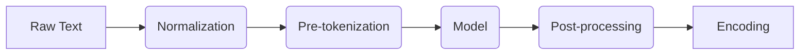

`tokenizers` 是 Hugging Face 推出的一款高性能、多功能的文本分词库。它的核心目标是为现代自然语言处理（NLP）模型提供快速、灵活且易于使用的分词解决方案。该库底层采用 **Rust** 编写，确保了极高的执行效率和内存安全性，同时提供了 Python、Node.js 等多语言绑定，广泛应用于 Research（研究）和 Production（生产）环境。

### 核心特性
*   **高性能**：基于 Rust 实现，训练和分词速度极快。在服务器 CPU 上，处理 1GB 文本的训练时间通常少于 20 秒。
*   **全流程控制**：提供从文本归一化（Normalization）到解码（Decoding）的完整流水线控制。
*   **对齐追踪（Alignment Tracking）**：即使经过破坏性的归一化操作，也能始终保持 Token 与原始文本字符索引的对应关系。
*   **预置算法**：内置 BPE (Byte-Pair Encoding)、WordPiece、Unigram 等主流分词算法。
*   **无缝集成**：设计上与 Hugging Face 的 `transformers` 库高度兼容，但也可以独立使用。

## 2. 架构设计：Tokenization Pipeline

`tokenizers` 的处理流程被设计为一个模块化的流水线（Pipeline）。当调用 `encode` 方法时，原始文本会依次经过以下四个主要步骤：



### 2.1 Normalization (归一化)
这是分词的第一步，旨在“清洗”文本，使其更加标准和统一，从而减少随机性。
*   **功能**：包括去除空格、统一大小写（Lowercase）、Unicode 归一化（如 NFD, NFKC）、去除重音符号（StripAccents）等。
*   **实现**：通过 `Normalizer` 组件实现。可以组合多个 Normalizer（使用 `Sequence`）。
*   **特点**：在此阶段所有的修改都会被记录，以保持与原始文本的对齐（Alignment）。

### 2.2 Pre-tokenization (预分词)
预分词将文本切分为初步的“词”或“片段”，为后续的模型分词设定边界。
*   **功能**：通常基于空格、标点符号进行切分。这确保了后续的子词（Subword）不会跨越单词边界。
*   **实现**：通过 `PreTokenizer` 组件实现。
*   **示例**：
    *   `Whitespace`：基于空格和非字母数字字符切分。
    *   `ByteLevel`：GPT-2 采用的方法，将文本按字节处理，适用于构建无需 `<UNK>` 标记的词表。
    *   `Metaspace`：SentencePiece 使用的方法，将空格替换为特殊字符（如 `_` 或 `U+2581`）后进行切分。

### 2.3 Model (模型)
这是分词的核心算法部分。它负责根据训练好的词表（Vocabulary）和规则，将预分词后的片段进一步切分为 Subword Tokens（子词标记），并将其映射为对应的 ID。
*   **功能**：Token Discovery（发现 Token）和 Mapping（映射 ID）。
*   **主要算法**：
    *   **BPE (Byte-Pair Encoding)**：从字符开始，迭代合并最频繁出现的字符对。适用于 GPT 系列、RoBERTa。
    *   **WordPiece**：类似 BPE，但基于最大似然估计选择合并。适用于 BERT、DistilBERT。
    *   **Unigram**：从一个巨大的词表开始，迭代修剪概率最低的 Token。适用于 ALBERT、T5、XLNet。
*   **训练**：这一步是唯一需要通过数据进行“训练（Train）”的组件。

### 2.4 Post-processing (后处理)
在生成 Token ID 序列后，对其进行最后的修饰，以符合特定模型的输入要求。
*   **功能**：添加特殊标记（Special Tokens，如 `[CLS]`, `[SEP]`, `<s>`, `</s>`）、生成 Attention Mask、Token Type IDs。
*   **示例**：
    *   BERT 格式：`[CLS] Token1 ... TokenN [SEP]`
    *   RoBERTa 格式：`<s> Token1 ... TokenN </s>`

## 3. 解码 (Decoding)

解码是分词的逆过程，将 Token ID 序列转换回人类可读的文本。
*   **Decoder**：负责将 ID 转换回 Token，并处理特殊字符的还原。
*   **示例**：
    *   `WordPiece` Decoder：去除 `##` 前缀。
    *   `ByteLevel` Decoder：将字节映射回 Unicode 字符。
    *   `Metaspace` Decoder：将下划线 `_` 还原为空格。

## 4. 代码示例：构建一个 BERT Tokenizer

以下代码展示了如何使用 `tokenizers` 库从零构建一个类似 BERT 的分词器。

```python
from tokenizers import Tokenizer, models, normalizers, pre_tokenizers, processors, trainers, decoders

# 1. 初始化 Tokenizer，使用 WordPiece 模型
tokenizer = Tokenizer(models.WordPiece(unk_token="[UNK]"))

# 2. 设置 Normalizer
# BERT 使用 NFD 归一化、小写转换和去除重音
tokenizer.normalizer = normalizers.Sequence([
    normalizers.NFD(),
    normalizers.Lowercase(),
    normalizers.StripAccents()
])

# 3. 设置 Pre-tokenizer
# 基于空格切分
tokenizer.pre_tokenizer = pre_tokenizers.Whitespace()

# 4. 准备 Trainer
# 定义特殊 Token 和词表大小
special_tokens = ["[UNK]", "[PAD]", "[CLS]", "[SEP]", "[MASK]"]
trainer = trainers.WordPieceTrainer(vocab_size=30522, special_tokens=special_tokens)

# 假设我们在 'data.txt' 上训练
# tokenizer.train(["data.txt"], trainer=trainer)

# 5. 设置 Post-processor
# 添加 [CLS] 和 [SEP] 标记
cls_id = tokenizer.token_to_id("[CLS]")
sep_id = tokenizer.token_to_id("[SEP]")
tokenizer.post_processor = processors.TemplateProcessing(
    single="[CLS] $A [SEP]",
    pair="[CLS] $A [SEP] $B:1 [SEP]:1",
    special_tokens=[("[CLS]", cls_id), ("[SEP]", sep_id)],
)

# 6. 设置 Decoder
tokenizer.decoder = decoders.WordPiece(prefix="##")

# 使用示例
# encoding = tokenizer.encode("Hello, World!")
# print(encoding.tokens)
# print(encoding.ids)
```

## 5. 总结

Hugging Face 的 `tokenizers` 库通过将分词过程解耦为归一化、预分词、模型、后处理和解码五个独立的组件，提供了极高的灵活性和定制能力。这种架构不仅支持了现有的主流 NLP 模型（如 BERT, GPT, Llama），也为研究人员探索新的分词算法提供了强大的基础设施。其 Rust 后端保证了在处理大规模语料库时的高效性，是现代 NLP 工程不可或缺的基石。

---

### 参考资料

本文内容的撰写参考了以下专业资料：

1.  **Hugging Face Documentation**: [The tokenization pipeline](https://huggingface.co/docs/tokenizers/en/pipeline)
2.  **Hugging Face Documentation**: [Components](https://huggingface.co/docs/tokenizers/en/components)
3.  **Hugging Face LLM Course**: [Building a tokenizer, block by block](https://huggingface.co/learn/llm-course/en/chapter6/8)
4.  **GitHub Repository**: [huggingface/tokenizers](https://github.com/huggingface/tokenizers)
