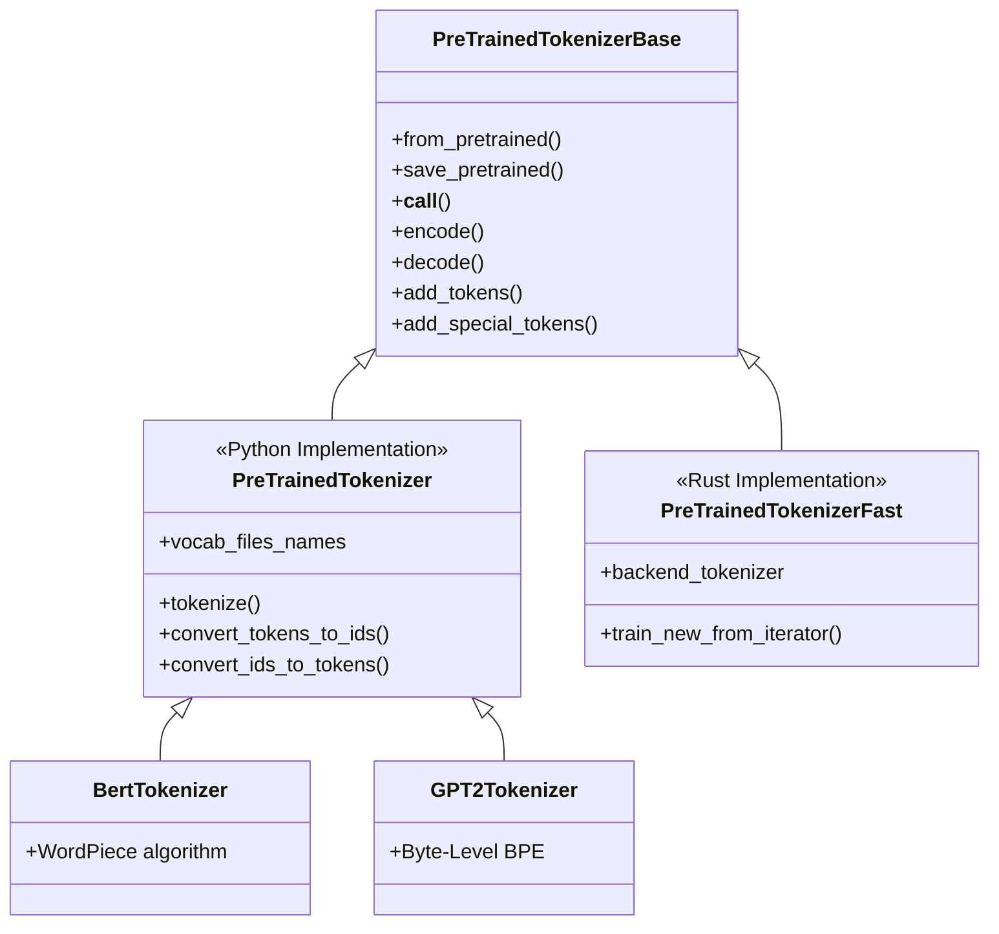
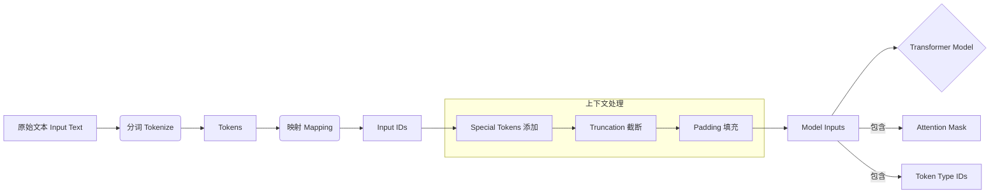

## 1. 概述

`PreTrainedTokenizer` 是 Hugging Face `transformers` 库中用于处理文本数据的核心组件之一。作为所有 Python 实现（"slow"）[分词器](../../相关概念/分词器的作用.md)的基类，它负责将原始文本转换为模型可理解的数值输入（Input IDs），并管理相关的辅助信息（如 Attention Mask、Token Type IDs）。

尽管目前 `transformers` 库大力推崇基于 Rust 的 `PreTrainedTokenizerFast` 以获得更高的性能，`PreTrainedTokenizer` 依然是理解分词机制、自定义特殊分词逻辑以及兼容旧版模型的基石。它实现了分词（Tokenization）、编码（Encoding）、解码（Decoding）以及词表管理（Vocabulary Management）等通用接口。

## 2. 架构设计

`PreTrainedTokenizer` 继承自 `PreTrainedTokenizerBase`，并与 `PreTrainedTokenizerFast` 并列，构成了 `transformers` 的分词器双后端架构。

### 2.1 类层次结构



### 2.2 数据处理流

分词器在模型推理管道中的位置至关重要，它充当了自然语言与高维向量空间之间的桥梁。



## 3. 核心原理：子词分词 (Subword Tokenization)

`PreTrainedTokenizer` 支持多种子词分词算法，旨在平衡词表大小（Vocabulary Size）与语义表达能力（Semantic Representation）。

### 3.1 常见算法

1.  **Byte-Pair Encoding (BPE)**
    *   **原理**：从字符级开始，通过迭代合并最频繁出现的字符对来构建词表。
    *   **应用**：GPT-2, RoBERTa, BART。
    *   **特点**：使用 Unicode 字节作为基础单位（Byte-level BPE），几乎可以编码任何文本而无需 `<unk>` 标记。

2.  **WordPiece**
    *   **原理**：类似 BPE，但在选择合并对时，依据的是语言模型的似然度（Likelihood）最大化，而非简单的频率。
    *   **应用**：BERT, DistilBERT, Electra。
    *   **特点**：未登录词会被拆分为更小的单元，前缀保留，后续部分添加 `##` 前缀（如 `playing` -> `play`, `##ing`）。

3.  **SentencePiece**
    *   **原理**：将文本视为原始字节流，不依赖空格分词，直接在 Unicode 字符集上训练 Unigram 或 BPE 模型。
    *   **应用**：T5, ALBERT, XLNet。
    *   **特点**：无损重构（Reversible），对多语言和不使用空格的语言（如中文、日文）支持更好。

## 4. 关键属性与特殊标记

`PreTrainedTokenizer` 通过一系列属性管理特殊标记（Special Tokens），这些标记对模型的结构化输入至关重要。

| 属性 | 描述 | 典型示例 |
| :--- | :--- | :--- |
| `vocab_size` | 词表总大小 | 30522 (BERT), 50257 (GPT-2) |
| `model_max_length` | 模型能处理的最大序列长度 | 512, 1024, 2048 |
| `bos_token` | 序列起始标记 (Beginning of Sentence) | `<s>`, `[CLS]` (有时混用) |
| `eos_token` | 序列结束标记 (End of Sentence) | `</s>`, `[SEP]` |
| `unk_token` | 未知词标记 (Unknown) | `<unk>`, `[UNK]` |
| `sep_token` | 句子分隔符 (Separator) | `[SEP]`, `</s>` |
| `pad_token` | 填充标记 (Padding) | `[PAD]`, `<pad>` |
| `cls_token` | 用于分类的标记 (Classification) | `[CLS]`, `<s>` |
| `mask_token` | 掩码语言模型标记 (Mask) | `[MASK]`, `<mask>` |

## 5. API 接口详解

### 5.1 `__call__` 方法 (瑞士军刀)

这是最常用的入口，能够处理分词、截断、填充、并返回张量。

```python
def __call__(
    self,
    text: str | List[str],
    text_pair: str | List[str] = None,
    padding: bool | str = False,      # 'max_length', 'longest', False
    truncation: bool | str = False,   # True, 'only_first', 'only_second'
    max_length: int = None,
    return_tensors: str = None,       # 'pt' (PyTorch), 'tf' (TensorFlow), 'np' (NumPy)
    return_attention_mask: bool = None,
    **kwargs
) -> BatchEncoding
```

**返回对象** (`BatchEncoding`) 包含：
*   `input_ids`: Token 索引列表。
*   `attention_mask`: 标记哪些是有效 token（1），哪些是 padding（0）。
*   `token_type_ids`: 区分第一句和第二句（用于 BERT 等）。

### 5.2 编码与解码

*   **`encode(text, ...)`**: 仅返回 `input_ids` 的列表。是 `tokenize` + `convert_tokens_to_ids` 的组合，并添加了特殊标记。
*   **`decode(token_ids, ...)`**: 将 ID 序列还原为文本字符串。参数 `skip_special_tokens=True` 可去除 `[CLS]`, `[PAD]` 等标记。

### 5.3 词表管理

*   **`add_tokens(new_tokens)`**: 向词表中添加普通新词。
*   **`add_special_tokens(special_tokens_dict)`**: 添加具有特殊功能的标记（不会被拆分，且可以方便地通过属性访问）。
*   **注意**：添加 token 后，必须调用 `model.resize_token_embeddings(len(tokenizer))` 以调整模型的 Embedding 层大小。

## 6. 代码示例

### 6.1 基础使用

```python
from transformers import AutoTokenizer

# 加载预训练分词器
tokenizer = AutoTokenizer.from_pretrained("bert-base-uncased")

# 单句处理
text = "PreTrainedTokenizer is powerful."
encoded = tokenizer(text, return_tensors="pt")
print(f"Input IDs: {encoded['input_ids']}")
# Output: tensor([[ 101, 3653, 22564, 19204, 17629, 2003, 3928, 1012,  102]])
# 101: [CLS], 102: [SEP]

# 解码
decoded = tokenizer.decode(encoded['input_ids'][0])
print(f"Decoded: {decoded}")
# Output: "[CLS] pretrainedtokenizer is powerful. [SEP]"
```

### 6.2 批处理与填充截断

```python
batch_sentences = [
    "Hello world.",
    "Transformers are transforming the way we do NLP."
]

# 自动填充到最长序列，并截断到模型最大长度
encoded_batch = tokenizer(
    batch_sentences,
    padding=True,
    truncation=True,
    return_tensors="pt"
)

print(f"Attention Mask:\n{encoded_batch['attention_mask']}")
```

### 6.3 添加新 Token

```python
# 假设 "skibidi" 是一个新词，原模型无法识别
print(tokenizer.tokenize("skibidi")) 
# 可能输出: ['sk', '##ib', '##idi'] (被拆分)

# 添加新词
num_added = tokenizer.add_tokens(["skibidi"])
print(f"Added {num_added} tokens")

# 再次分词
print(tokenizer.tokenize("skibidi"))
# 输出: ['skibidi'] (作为一个整体)

# 重要：记得调整模型 embedding 大小
# model.resize_token_embeddings(len(tokenizer))
```

## 7. 总结

`PreTrainedTokenizer` 提供了 NLP 预处理的标准范式。理解其底层的子词算法（BPE/WordPiece）以及填充、截断和特殊标记的处理机制，是高效使用 Transformer 模型的前提。在实际生产中，推荐尽可能使用 `PreTrainedTokenizerFast` 以获得数十倍的速度提升，但其 API 行为与 Python 版保持高度一致。

## 8. 参考资料

1.  [Hugging Face Documentation: Tokenizer](https://huggingface.co/docs/transformers/main_classes/tokenizer)
2.  [Hugging Face Documentation: Summary of the tokenizers](https://huggingface.co/docs/transformers/tokenizer_summary)
