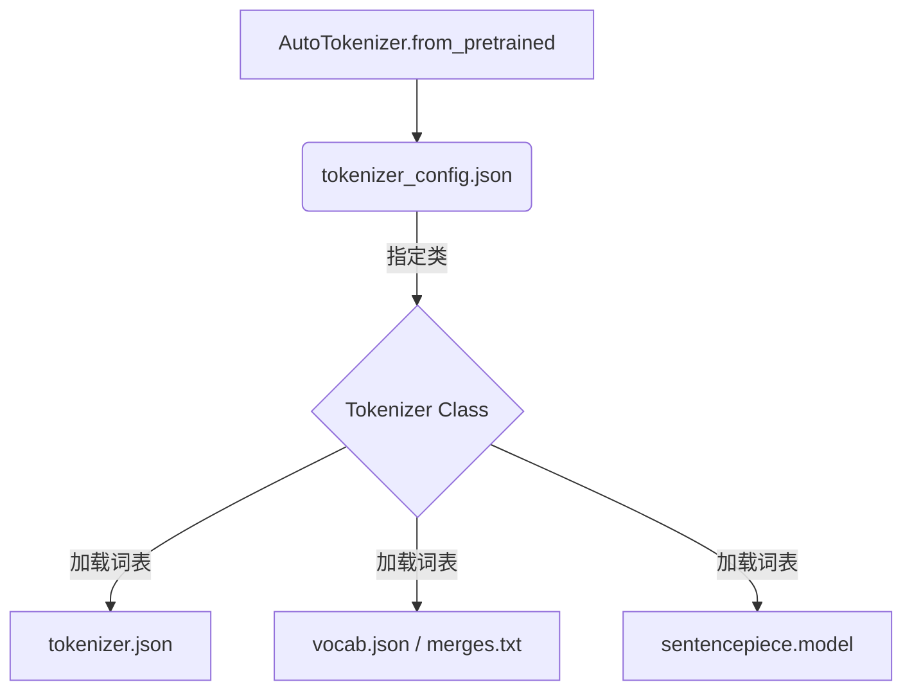
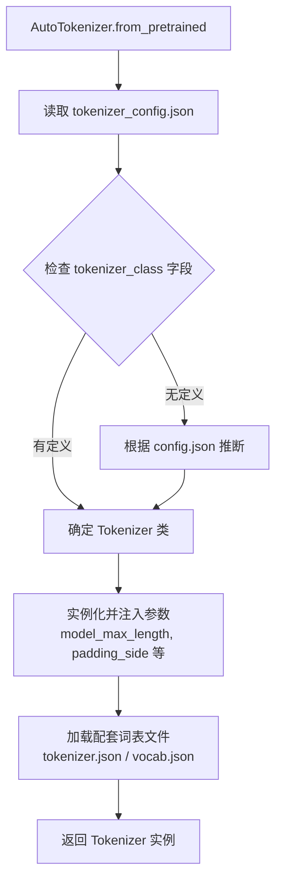

## 1. 概述

`tokenizer_config.json` 是 Hugging Face `transformers` 库中用于定义和持久化分词器（Tokenizer）行为的核心配置文件。

它主要承担两个职责：
1.  **实例化指引**：告诉 `AutoTokenizer` 应该加载哪个具体的 Tokenizer 类（例如 `LlamaTokenizerFast` 或 `BertTokenizer`）。
2.  **运行时配置**：定义分词器在编码（Encoding）和解码（Decoding）过程中的行为参数，如特殊 Token 定义、最大序列长度截断策略、填充方向等。

## 2. 核心字段详解

`tokenizer_config.json` 是一个标准的 JSON 对象，以下是其中最关键的字段及其作用：

| 字段名 | 类型 | 描述 | 示例 |
| :--- | :--- | :--- | :--- |
| `tokenizer_class` | `str` | 指定加载时实例化的 Python 类名。 | `"PreTrainedTokenizerFast"`, `"LlamaTokenizer"` |
| `model_max_length` | `int` | 模型支持的最大输入序列长度（Token 数）。超过此长度通常会被截断。 | `131072` |
| `model_input_names` | `List[str]` | 模型 `forward` 方法期望接收的输入参数名。 | `["input_ids", "attention_mask"]` |
| `bos_token` | `str/obj` | 序列开始 Token (Beginning of Sentence)。 | `"<\|begin_of_text\|>"` |
| `eos_token` | `str/obj` | 序列结束 Token (End of Sentence)。 | `"<\|end_of_text\|>"` |
| `pad_token` | `str/obj` | 填充 Token，用于将 batch 中的序列对齐到相同长度。 | `"<\|finetune_right_pad_id\|>"` |
| `chat_template` | `str` | (高级) Jinja2 模板字符串，用于将对话列表转换为模型输入的 Prompt 格式。 | `"..."` |
| `clean_up_tokenization_spaces` | `bool` | 解码时是否清理 Token 拼接产生的多余空格。 | `true` |

### 2.1 特殊 Token 定义 (Special Tokens)

除了上述标准的 `bos`, `eos`, `pad` 等，配置文件中通常还会包含 `added_tokens_decoder` 字段，用于精确控制额外添加的 Token（AddedTokens）及其属性（如是否归一化、是否为特殊字符）。

```json
"added_tokens_decoder": {
  "128000": {
    "content": "<|begin_of_text|>",
    "lstrip": false,
    "normalized": false,
    "rstrip": false,
    "single_word": false,
    "special": true
  }
}
```

## 3. 文件生态与关系

`tokenizer_config.json` 并不是孤立工作的，它通常与以下文件配合：



*   **`tokenizer_config.json` (配置)**: 负责“怎么用”。定义行为、特殊符号、类选择。
*   **`tokenizer.json` (数据)**: 负责“是什么”。仅用于 Fast Tokenizer (Rust 后端)，包含完整的词表、合并规则（Merges）、正则预处理逻辑等。它是最完整的数据文件。
*   **`vocab.json` / `merges.txt` / `spm.model`**: 传统的词表数据文件，主要用于 Python 慢速实现或旧版模型。

## 4. 加载机制

当调用 `AutoTokenizer.from_pretrained("path/to/repo")` 时，库的内部执行流程如下：

1.  **下载/读取配置**：首先读取 `tokenizer_config.json`。
2.  **解析类**：根据 `tokenizer_class` 字段（如 `LlamaTokenizerFast`）确定要实例化的类。如果没有该字段，会尝试根据 `config.json` 中的架构推断。
3.  **实例化与参数注入**：初始化该类，并将 `tokenizer_config.json` 中的所有其他字段（如 `model_max_length`, `padding_side`）作为关键字参数（kwargs）传递给构造函数。
4.  **加载词表**：根据实例化的类，自动查找并加载配套的词表文件（如 `tokenizer.json`）。




## 5. 代码示例

### 5.1 查看配置

```python
from transformers import AutoTokenizer

tokenizer = AutoTokenizer.from_pretrained("meta-llama/Llama-3.1-8B-Instruct")

# 访问配置属性
print(f"Class: {tokenizer.__class__.__name__}")
print(f"Max Length: {tokenizer.model_max_length}")
print(f"Chat Template: {tokenizer.chat_template[:50]}...") 

# 查看特殊 Token
print(f"EOS Token: {tokenizer.eos_token}")
```

### 5.2 修改并保存配置

你可以修改 Tokenizer 的属性，保存时 `tokenizer_config.json` 会自动更新。

```python
# 修改填充策略
tokenizer.padding_side = "left"
tokenizer.model_max_length = 2048

# 添加新的特殊 token
new_tokens = ["<|custom_tag|>"]
tokenizer.add_special_tokens({"additional_special_tokens": new_tokens})

# 保存
tokenizer.save_pretrained("./my_custom_tokenizer")
# 此时 ./my_custom_tokenizer/tokenizer_config.json 已被更新
```

## 6. 高级特性：Chat Template

在现代 LLM 中，`tokenizer_config.json` 也是存储 **Chat Template** 的标准位置。这解决了不同模型（Llama 2, Llama 3, ChatML, Zephyr）使用不同对话格式的痛点。

通过配置 `chat_template` 字段（Jinja2 格式），用户可以直接使用统一的 API：

```python
messages = [
    {"role": "user", "content": "Hello!"},
    {"role": "assistant", "content": "Hi there!"}
]

# 自动根据配置文件中的模板渲染 Prompt
prompt = tokenizer.apply_chat_template(messages, tokenize=False)
```

## 参考资料

1.  [Hugging Face Documentation: Tokenizer](https://huggingface.co/docs/transformers/main_classes/tokenizer)
2.  [Cameron Barker: Introduction to HuggingFace Tokenizers](https://cameronbarker.uk/posts/intro-to-hf-tokenizers/)
3.  [Transformers Source Code: tokenization_utils_base.py](https://github.com/huggingface/transformers/blob/main/src/transformers/tokenization_utils_base.py)
