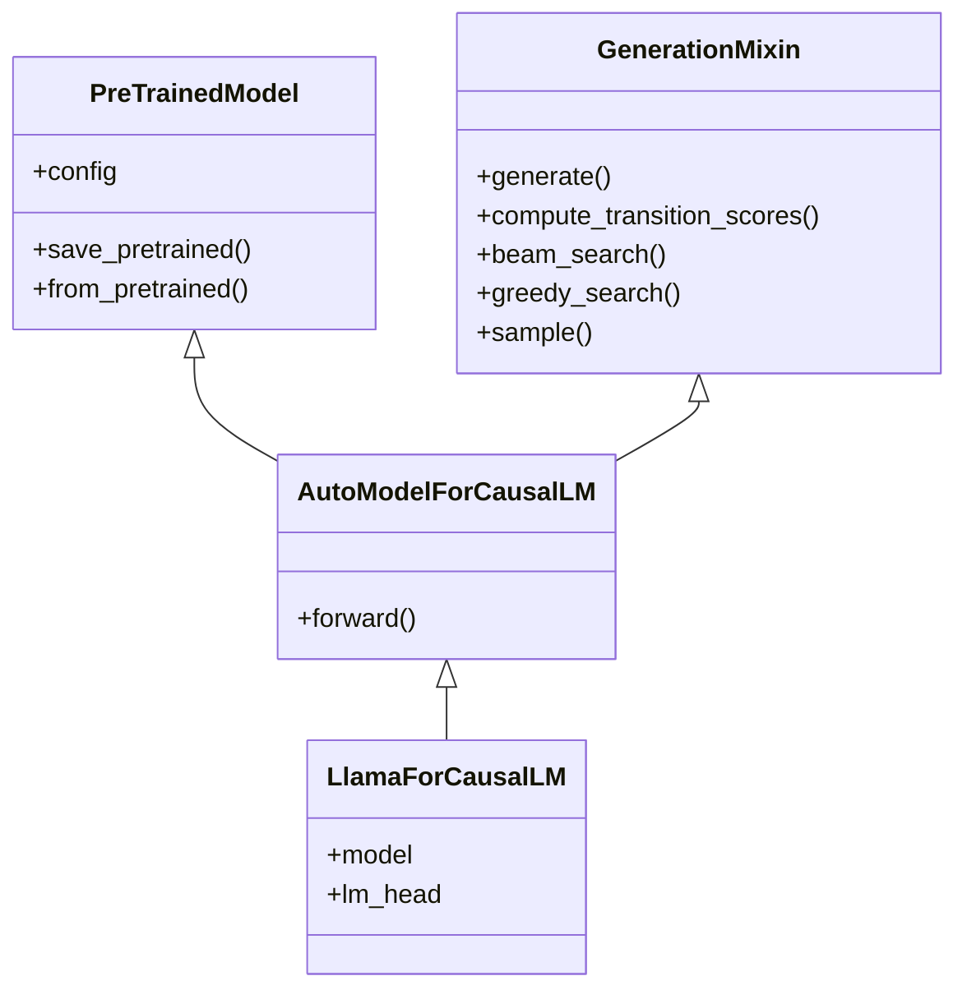
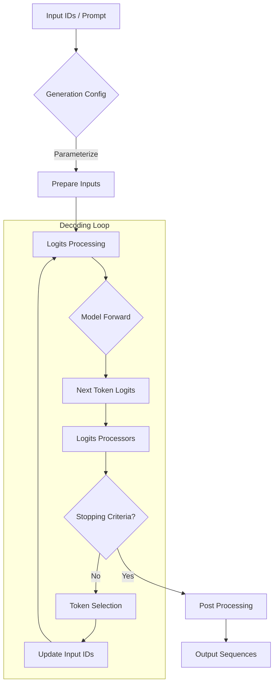

## 1. 概述

`GenerationMixin` 是 Hugging Face `transformers` 库中用于[自回归文本生成](/AI/相关概念/自回归文本生成.md)的核心组件。作为一个混入类（Mixin Class），它为模型类提供了统一的生成接口，特别是核心的 `generate()` 方法。任何支持生成的模型（如 Causal LM、Encoder-Decoder 模型）都继承自该类，从而获得了灵活且强大的序列生成能力。

该类不仅封装了多种解码策略（如 Beam Search、Sampling、Greedy Search），还处理了输入预处理、Logits 处理、停止条件判断以及输出后处理等复杂逻辑，使得用户可以通过简单的 API 调用实现高效的文本生成。

## 2. 架构设计

### 2.1 类层次结构

`GenerationMixin` 设计为被模型主类（如 `LlamaForCausalLM`, `BartForConditionalGeneration`）继承。它通常与 `PreTrainedModel` 结合使用，利用模型的 `forward` 方法进行推理。



### 2.2 生成流程 (Generate Pipeline)

`generate()` 方法的执行流程是一个典型的自回归循环，涉及多个组件的协同工作：



## 3. 核心 API 详解

### 3.1 `generate()` 方法

这是 `GenerationMixin` 的主入口，支持多种重载和参数配置。

```python
def generate(
    self,
    inputs: Optional[torch.Tensor] = None,
    generation_config: Optional[GenerationConfig] = None,
    logits_processor: Optional[LogitsProcessorList] = None,
    stopping_criteria: Optional[StoppingCriteriaList] = None,
    **kwargs,
) -> Union[ModelOutput, torch.LongTensor]
```

**关键参数：**

*   **`inputs`**: 输入张量（如 Token IDs）。对于 Decoder-only 模型，这是 Prompt；对于 Encoder-Decoder 模型，这是 Encoder 的输入。
*   **`generation_config`**: `GenerationConfig` 实例，包含所有控制生成的超参数（如 `max_new_tokens`, `do_sample`, `temperature` 等）。
*   **`logits_processor`**: 自定义的 Logits 处理器列表，用于在 Softmax 之前修改模型输出的 Logits（例如实现词表约束）。
*   **`stopping_criteria`**: 自定义的停止条件列表。
*   **`streamer`**: 用于流式输出生成的 Token。

**返回值：**
默认返回生成的 Token IDs 张量。如果设置 `return_dict_in_generate=True`，则返回 `ModelOutput` 对象，包含序列、Logits、Attention Map 等详细信息。

### 3.2 `compute_transition_scores()`

该方法用于计算生成序列的转移分数（Transition Scores）。这对于评估生成质量或重构序列概率非常有用。

```python
def compute_transition_scores(
    self,
    sequences: torch.Tensor,
    scores: Tuple[torch.Tensor],
    beam_indices: Optional[torch.Tensor] = None,
    normalize_logits: bool = False
) -> torch.Tensor
```

## 4. 解码策略 (Decoding Strategies)

`GenerationMixin` 根据 `GenerationConfig` 的配置自动选择合适的解码策略。

| 策略 | 配置条件 | 描述 | 适用场景 |
| :--- | :--- | :--- | :--- |
| **Greedy Search** | `num_beams=1`, `do_sample=False` | 每步选择概率最高的 Token。 | 确定性任务，如算术推理。 |
| **Multinomial Sampling** | `num_beams=1`, `do_sample=True` | 根据概率分布随机采样 Token。需配合 `temperature`, `top_k`, `top_p`。 | 创意写作，对话生成。 |
| **Beam Search** | `num_beams>1`, `do_sample=False` | 维护多个候选序列（Beams），最终选择全局最优。 | 翻译，摘要。 |
| **Beam Sampling** | `num_beams>1`, `do_sample=True` | 在 Beam Search 的基础上引入采样。 | 需要高质量且具多样性的生成。 |
| **Assisted/Speculative** | 设置 `assistant_model` | 使用小模型草稿大模型验证，加速生成。 | 延迟敏感的实时推理。 |

## 5. 代码示例

### 5.1 基础生成

```python
from transformers import AutoModelForCausalLM, AutoTokenizer

model = AutoModelForCausalLM.from_pretrained("gpt2")
tokenizer = AutoTokenizer.from_pretrained("gpt2")

inputs = tokenizer("Artificial Intelligence is", return_tensors="pt")

# 使用 Greedy Search 生成
outputs = model.generate(**inputs, max_new_tokens=20)
print(tokenizer.decode(outputs[0], skip_special_tokens=True))
```

### 5.2 高级采样配置

使用 `GenerationConfig` 显式控制生成行为。

```python
from transformers import GenerationConfig

# 创建配置：使用 Top-p (Nucleus) 采样，开启早停
gen_config = GenerationConfig(
    max_new_tokens=50,
    do_sample=True,
    top_p=0.9,
    temperature=0.7,
    repetition_penalty=1.2,
    pad_token_id=tokenizer.eos_token_id
)

outputs = model.generate(**inputs, generation_config=gen_config)
```

### 5.3 获取详细输出 (Logits & Scores)

```python
outputs = model.generate(
    **inputs, 
    max_new_tokens=5, 
    return_dict_in_generate=True, 
    output_scores=True
)

# 计算每个生成 Token 的 Log Probability
transition_scores = model.compute_transition_scores(
    outputs.sequences, outputs.scores, normalize_logits=True
)

print(f"Generated Sequence Score: {transition_scores.sum().item()}")
```

## 6. 自定义生成方法

`transformers` 支持通过 `custom_generate` 参数加载外部定义的生成逻辑，这允许在不修改库源码的情况下实验新的解码算法。

```python
# 假设有一个自定义生成方法的仓库
model.generate(
    **inputs, 
    custom_generate="transformers-community/custom_generate_example", 
    trust_remote_code=True
)
```

## 7. 总结

`GenerationMixin` 是现代 NLP 模型生成能力的基础设施。它通过高度抽象的接口屏蔽了复杂的解码逻辑，同时保留了极高的可配置性。无论是学术研究中的新算法验证，还是工业界的生产部署，深入理解 `GenerationMixin` 的工作原理都是优化模型输出质量与推理性能的关键。

## 8. 参考资料

1.  [Hugging Face Documentation: Generation](https://huggingface.co/docs/transformers/main_classes/text_generation)
2.  [Hugging Face Documentation: Generation Strategies](https://huggingface.co/docs/transformers/generation_strategies)
3.  [Transformers GitHub Source Code: generation/utils.py](https://github.com/huggingface/transformers/blob/main/src/transformers/generation/utils.py)
