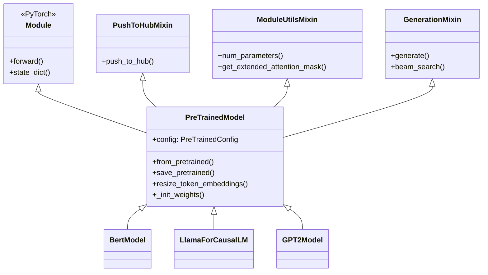
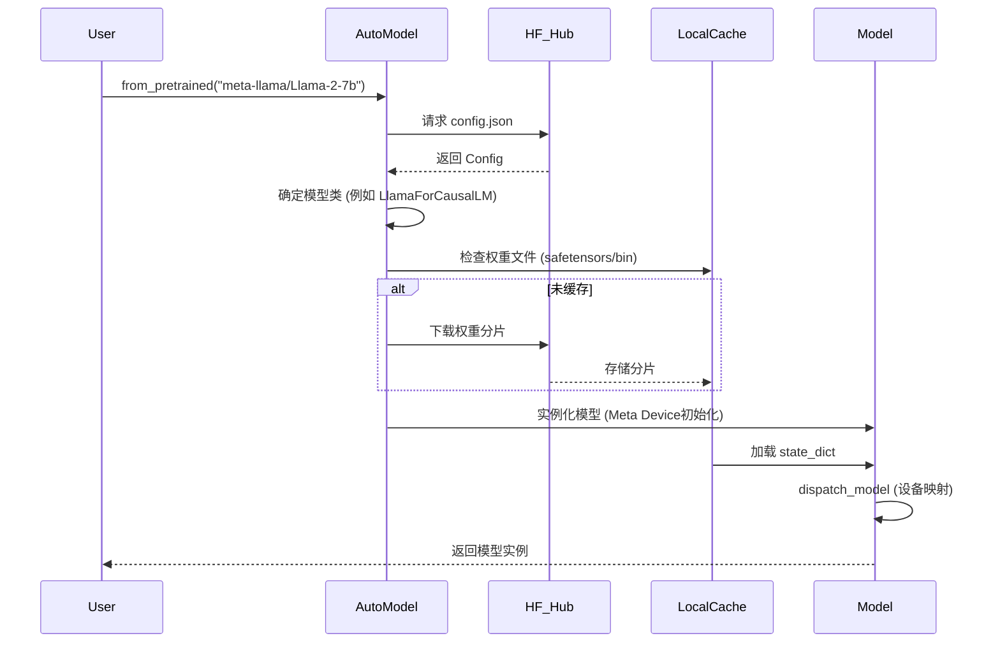

`PreTrainedModel` 是 Hugging Face `transformers` 库的核心抽象基类，它为库中支持的 230+ 种模型架构提供了统一的生命周期管理接口。它不仅是 PyTorch `nn.Module` 的扩展，更是连接模型权重、配置（Configuration）和分发平台（Hugging Face Hub）的桥梁。

从架构设计的角度看，`PreTrainedModel` 实现了"模型定义框架"（Model Definition Framework）的作用，确立了所有 Transformer 模型必须遵循的接口规范，使得 Trainer、Pipeline 和 AutoClass 能够以多态的方式操作任意模型。

## 2. 核心架构设计

### 2.1 继承体系

`PreTrainedModel` 并非孤立存在，它通过多重继承和 Mixin 模式集成了多种能力：



*   **`torch.nn.Module`**: 提供基础的神经网络构建块、自动微分和 GPU 支持。
*   **`ModuleUtilsMixin`**: 提供参数统计、Attention Mask 处理等底层工具。
*   **`GenerationMixin`**: 赋予模型自回归生成能力（如 Beam Search, Sampling），主要用于 Causal LM 和 Seq2Seq 模型。
*   **`PushToHubMixin`**: 实现与 Hugging Face Hub 的交互，支持模型上传。

### 2.2 核心抽象三要素

`PreTrainedModel` 是 Transformers 库三大核心抽象之一，它们协同工作：

1.  **Configuration (`PreTrainedConfig`)**: 定义模型结构（隐藏层大小、层数等），负责蓝图。
2.  **Model (`PreTrainedModel`)**: 实例化神经网络权重，负责计算。
3.  **Tokenizer (`PreTrainedTokenizer`)**: 处理输入数据，负责映射。

## 3. 核心机制详解

### 3.1 模型加载机制 (`from_pretrained`)

`from_pretrained` 是库中最复杂的方法之一，它处理了文件解析、下载缓存、权重加载和兼容性适配。

**加载流程图：**



**关键技术点：**
*   **权重分片 (Sharding)**: 对于大模型，权重被分割为多个 chunk（如 `model-00001-of-00003.safetensors`），通过 `index.json` 映射加载，避免单文件过大。
*   **Safetensors**: 优先使用 `.safetensors` 格式，支持内存映射（mmap），加载速度更快且无需 pickle，安全性更高。
*   **Meta Device Initialization**: 使用 `init_empty_weights` 上下文，先在 "meta" 设备上创建空壳模型，不占用物理内存，然后按需加载权重到指定设备，支持超大模型加载。

### 3.2 动态模块加载 (Dynamic Module Loading)

对于库中尚未包含的新架构，`PreTrainedModel` 支持 `trust_remote_code=True` 机制。

*   **原理**：模型仓库中包含 `modeling_xxx.py` Python 代码。
*   **执行**：`from_pretrained` 检测到 `auto_map` 配置后，将远程代码下载到 `~/.cache/huggingface/modules`，并在运行时动态 import 该模块。
*   **安全**：这是一个高风险操作，因此必须显式开启 `trust_remote_code=True`。

### 3.3 内存与设备管理

`PreTrainedModel` 集成了 `accelerate` 库的能力，支持复杂的设备映射策略：

*   **`device_map="auto"`**: 自动计算各层的显存占用，将模型切分到 GPU、CPU 和 Disk（Offload）。
*   **`quantization_config`**: 在加载时通过 `bitsandbytes` 或 `AutoGPTQ` 动态量化模型（如 4-bit/8-bit），大幅降低显存需求。

## 4. API 参考与代码示例

### 4.1 基础加载与保存

```python
from transformers import AutoModel, AutoConfig

# 1. 自动加载（推荐）
model = AutoModel.from_pretrained("bert-base-uncased")

# 2. 修改配置加载
config = AutoConfig.from_pretrained("bert-base-uncased", output_attentions=True)
model = AutoModel.from_pretrained("bert-base-uncased", config=config)

# 3. 保存模型
model.save_pretrained("./my_local_bert")
# 保存目录结构:
# ├── config.json
# ├── model.safetensors
# └── tokenizer_config.json (如果保存了tokenizer)
```

### 4.2 自定义模型开发

开发者可以通过继承 `PreTrainedModel` 创建符合 Transformers 标准的自定义模型：

```python
import torch.nn as nn
from transformers import PreTrainedModel, PretrainedConfig

class MyModelConfig(PretrainedConfig):
    model_type = "my_model"
    def __init__(self, hidden_size=768, **kwargs):
        super().__init__(**kwargs)
        self.hidden_size = hidden_size

class MyModel(PreTrainedModel):
    config_class = MyModelConfig
    
    def __init__(self, config):
        super().__init__(config)
        self.config = config
        self.layer = nn.Linear(config.hidden_size, 2)
        
        # 必须调用此方法初始化权重
        self.post_init()
    
    def forward(self, input_ids, **kwargs):
        return self.layer(input_ids)
        
    def _init_weights(self, module):
        """定义权重初始化逻辑，post_init 会自动调用"""
        if isinstance(module, nn.Linear):
            module.weight.data.normal_(mean=0.0, std=self.config.initializer_range)
            if module.bias is not None:
                module.bias.data.zero_()
```

### 4.3 高级功能：Embedding 调整

当在 Tokenizer 中添加新词（如特殊符号）时，必须调整模型的 Embedding 层大小：

```python
# 添加新 token
new_tokens = ["<SPECIAL_TOKEN>"]
num_added_toks = tokenizer.add_tokens(new_tokens)

# 关键：调整模型 embedding 矩阵大小
model.resize_token_embeddings(len(tokenizer))

# 注意：新增加的 embedding 向量是随机初始化的，需要进一步训练
```

## 5. 总结

`PreTrainedModel` 提供了以下核心价值：
1.  **标准化接口**：统一了 NLP、CV、Audio 模型的交互方式。
2.  **生态兼容性**：使得模型可以无缝接入 Hugging Face 的生态工具（Hub, Accelerate, PEFT）。
3.  **工程鲁棒性**：内置了经过实战检验的权重加载、分片处理和设备调度逻辑，极大地降低了训练和部署大模型的工程门槛。

## 参考资料

1.  [Hugging Face Documentation: Models](https://huggingface.co/docs/transformers/main/main_classes/model)
2.  [DeepWiki: Model Loading and Hub Integration](https://deepwiki.com/huggingface/transformers/2.2-model-loading-and-pretrainedmodel)
3.  [DeepWiki: Core Architecture](https://deepwiki.com/huggingface/transformers/2-core-architecture)
