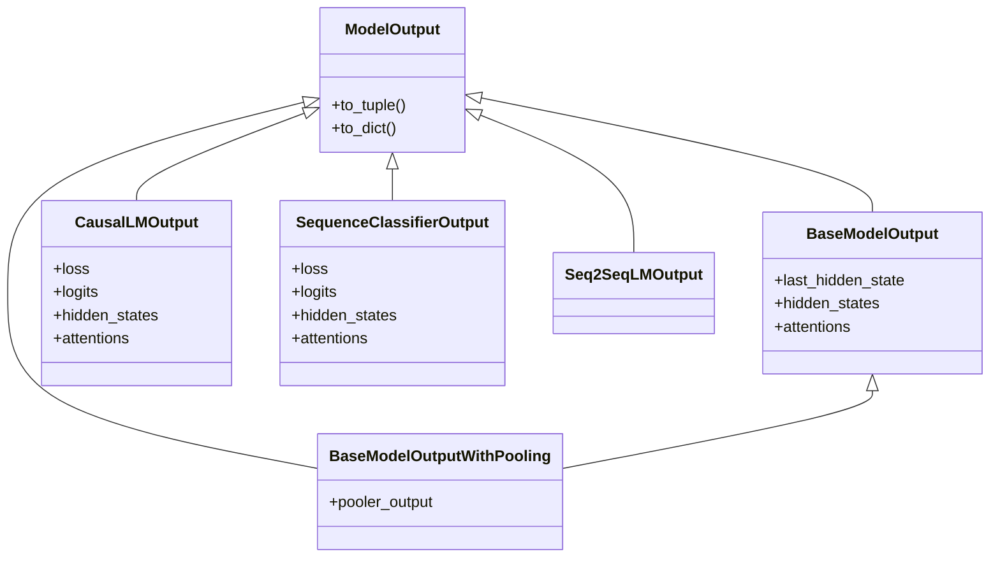

`transformers.modeling_outputs` 模块定义了 Hugging Face Transformers 库中所有模型的标准输出数据结构。这些类不仅仅是简单的数据容器，它们提供了统一的接口，使得模型输出既可以像 Python 对象一样访问属性，也可以像字典或元组一样进行解包和索引。

## 1. 核心设计哲学：`ModelOutput` 基类

所有模型输出类都继承自 `transformers.utils.ModelOutput`。这个基类使用了 Python 的 `@dataclass` 装饰器，并实现了特殊的方法以提供灵活的访问方式。

### 1.1 三种访问模式

`ModelOutput` 的实例支持三种访问模式，这通过覆写 `__getitem__`、`__iter__` 等魔法方法实现：

1.  **属性访问 (Attribute Access)**: 推荐方式，代码可读性最强。
    ```python
    outputs.logits
    outputs.loss
    ```
2.  **字典访问 (Dictionary Access)**: 兼容字典操作。
    ```python
    outputs["logits"]
    ```
3.  **元组解包 (Tuple Unpacking)**: 用于兼容旧代码或简单的解包赋值。注意：解包顺序是固定的，且只包含非 `None` 的元素。
    ```python
    loss, logits = outputs  # 仅当 loss 存在时
    ```

### 1.2 数据结构特性

*   **可选字段**: 大多数 output 类的字段都是 `Optional` 的。如果模型在前向传播时未计算某个值（例如未传入 `labels` 计算 `loss`，或未设置 `output_attentions=True`），则对应属性为 `None`。
*   **Tensor 类型**: 所有数值数据通常为 `torch.FloatTensor`。

## 2. 核心输出类架构

Transformers 库根据任务类型和模型架构定义了一系列输出类。以下是继承关系的简化视图：



## 3. 通用输出类详解

### 3.1 `BaseModelOutput`
这是最基础的 Transformer 编码器输出，包含隐藏层状态和注意力权重。

| 字段 | 类型 | 形状 (Shape) | 描述 |
| :--- | :--- | :--- | :--- |
| **`last_hidden_state`** | `torch.FloatTensor` | `(batch, seq_len, hidden)` | 模型最后一层的输出序列。通常用于后续的 Token 级任务或通过池化用于序列任务。 |
| **`hidden_states`** | `Tuple[torch.FloatTensor]` | `n_layers + 1` 个张量 | **可选**。包含 embedding 层的输出加上每一层的输出。形状同上。需要设置 `output_hidden_states=True`。 |
| **`attentions`** | `Tuple[torch.FloatTensor]` | `n_layers` 个张量 | **可选**。每一层的注意力权重矩阵。形状为 `(batch, num_heads, seq_len, seq_len)`。需要设置 `output_attentions=True`。 |

### 3.2 `BaseModelOutputWithPooling` (如 BERT)
在 `BaseModelOutput` 基础上增加了池化输出。

| 字段 | 类型 | 形状 | 描述 |
| :--- | :--- | :--- | :--- |
| **`pooler_output`** | `torch.FloatTensor` | `(batch, hidden)` | 序列的聚合表示。对于 BERT，这是 `[CLS]` token 经过全连接层和 Tanh 激活后的结果。常用于分类任务。 |

### 3.3 `CausalLMOutputWithPast` (如 GPT-2, Llama)
用于自回归（Autoregressive）文本生成任务。

| 字段 | 类型 | 形状 | 描述 |
| :--- | :--- | :--- | :--- |
| **`loss`** | `torch.FloatTensor` | `(1,)` | **可选**。语言建模损失（CrossEntropy）。仅当提供了 `labels` 时返回。 |
| **`logits`** | `torch.FloatTensor` | `(batch, seq_len, vocab_size)` | 预测分数（未经过 Softmax）。 |
| **`past_key_values`** | `Tuple[Tuple[torch.FloatTensor]]` | 详见下文 | **关键字段**。预计算的 Key 和 Value 矩阵，用于加速解码。 |

#### 深入解析 `past_key_values`
这是 KV Cache 的核心实现。
*   **结构**: 一个元组，包含 `n_layers` 个元素。每个元素又是一个元组 `(key_tensor, value_tensor)`。
*   **形状**: `(batch, num_heads, past_seq_len, head_dim)`。
*   **作用**: 在生成第 $t$ 个 token 时，我们只需要关注第 $t$ 个 token 的 Query，但需要所有 $0...t$ 时刻的 Key 和 Value。通过传入 `past_key_values`，模型只需计算当前的 Attention，而无需重新计算之前所有 token 的 KV 矩阵。

### 3.4 `Seq2SeqLMOutput` (如 T5, BART)
用于序列到序列任务（翻译、摘要）。这是一个复杂的复合对象，包含 Encoder 和 Decoder 的信息。

*   **`loss`**: 生成任务的损失。
*   **`logits`**: Decoder 生成的词汇表预测分数。
*   **`past_key_values`**: Decoder 的 KV Cache。
*   **`encoder_last_hidden_state`**: Encoder 最后一层的输出。
*   **`encoder_hidden_states`**: Encoder 所有层的隐藏状态（可选）。
*   **`decoder_hidden_states`**: Decoder 所有层的隐藏状态（可选）。

### 3.5 `SequenceClassifierOutput` (如 BERT For Classification)
用于文本分类任务。

| 字段 | 类型 | 形状 | 描述 |
| :--- | :--- | :--- | :--- |
| **`loss`** | `torch.FloatTensor` | `(1,)` | 分类损失（CrossEntropy）或回归损失（MSE）。 |
| **`logits`** | `torch.FloatTensor` | `(batch, num_labels)` | 分类得分。分类任务通常需要接 `softmax` 或 `argmax`。 |

## 4. 代码示例

### 4.1 获取隐藏状态和注意力
```python
from transformers import AutoModel, AutoTokenizer

model_name = "bert-base-uncased"
tokenizer = AutoTokenizer.from_pretrained(model_name)
model = AutoModel.from_pretrained(model_name)

inputs = tokenizer("Hello, world!", return_tensors="pt")

# 显式要求返回 hidden_states 和 attentions
outputs = model(**inputs, output_hidden_states=True, output_attentions=True)

# 1. 属性访问 (推荐)
last_hidden = outputs.last_hidden_state
all_layers = outputs.hidden_states
all_attentions = outputs.attentions

# 2. 验证形状
print(f"Last Hidden Shape: {last_hidden.shape}") 
# torch.Size([1, 5, 768]) -> (batch, seq_len, hidden)

print(f"Number of layers (including embedding): {len(all_layers)}") 
# 13 (12 layers + 1 embedding)
```

### 4.2 处理生成模型的 KV Cache
```python
from transformers import AutoModelForCausalLM, AutoTokenizer

model = AutoModelForCausalLM.from_pretrained("gpt2")
tokenizer = AutoTokenizer.from_pretrained("gpt2")

input_ids = tokenizer("AI is", return_tensors="pt").input_ids

# 第一步：初始推理
outputs = model(input_ids)
pkvs = outputs.past_key_values  # 获取 KV Cache

# 第二步：生成下一个 token，传入 past_key_values
next_token_input = outputs.logits[:, -1, :].argmax(dim=-1).unsqueeze(-1)
outputs_next = model(next_token_input, past_key_values=pkvs) # 极大加速

# outputs_next.past_key_values 包含了更新后的 Cache
```

## 5. 参考资料

1.  **Hugging Face Official Docs**: [Model outputs](https://huggingface.co/docs/transformers/en/main_classes/output)
2.  **GitHub Source Code**: [modeling_outputs.py](https://github.com/huggingface/transformers/blob/main/src/transformers/modeling_outputs.py)
