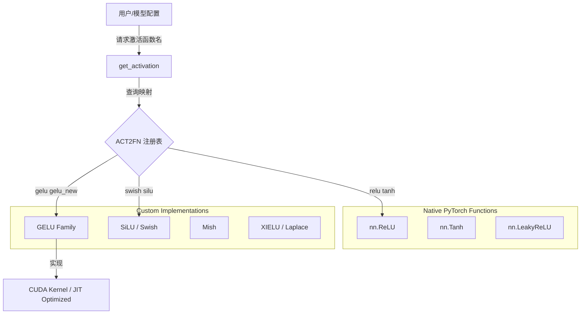

## 1. 概述 (Overview)

`transformers.activations` 是 Hugging Face Transformers 库中的核心模块，负责管理和提供各种神经网络[激活函数](../../相关概念/激活函数.md)。该模块不仅封装了 PyTorch 原生的激活函数（如 ReLU, Tanh），还提供了在大语言模型（LLM）和 Transformer 架构中广泛使用的特定激活函数的优化实现（如 GELU 的多种变体、Mish、Swish/SiLU 等）。

其核心设计目标是提供统一的接口 `get_activation`，通过字符串标识符（如 `"gelu"`, `"swish"`）动态加载对应的激活函数，从而解耦模型配置与具体实现。

## 2. 架构与设计 (Architecture & Design)

该模块采用了 **工厂模式 (Factory Pattern)** 与 **注册表机制**。所有激活函数通过一个字典 `ACT2FN` 进行注册，对外暴露统一的获取接口。

### 2.1 核心流程图



### 2.2 核心类：`ClassInstantier`

为了支持惰性实例化和参数传递，模块实现了一个自定义的字典类 `ClassInstantier`。它可以存储类对象及其初始化参数，仅在实际请求时进行实例化。

```python
class ClassInstantier(OrderedDict):
    def __getitem__(self, key):
        content = super().__getitem__(key)
        cls, kwargs = content if isinstance(content, tuple) else (content, {})
        return cls(**kwargs)
```

## 3. 关键算法与数学原理 (Core Algorithms)

Transformer 架构的演进伴随着激活函数的创新。本模块涵盖了从经典的 ReLU 到现代 LLM 标配的 GELU/Swish 系列。

### 3.1 GELU 系列 (Gaussian Error Linear Units)

GELU 是 Transformer 模型（如 BERT, GPT-2）中最常用的激活函数。`transformers.activations` 提供了多种近似实现以平衡精度与速度。

*   **Standard GELU (`gelu`)**:
    PyTorch 原生实现 `nn.functional.gelu`。
    $$ \text{GELU}(x) = x \Phi(x) \approx 0.5x(1 + \text{erf}(x/\sqrt{2})) $$

*   **GELU Tanh Approximation (`gelu_new`, `gelu_pytorch_tanh`)**:
    这是 OpenAI GPT 系列和 BERT 原始代码中使用的近似版本，通常被称为 "New GELU"。
    $$ \text{GELU}(x) \approx 0.5x(1 + \tanh(\sqrt{2/\pi}(x + 0.044715x^3))) $$
    *代码实现 (`NewGELUActivation`)*:
    ```python
    return 0.5 * input * (1.0 + torch.tanh(math.sqrt(2.0 / math.pi) * (input + 0.044715 * torch.pow(input, 3.0))))
    ```

*   **Fast / Quick GELU (`gelu_fast`, `quick_gelu`)**:
    更快的近似实现，牺牲少量精度换取推理速度，常用于某些特定架构。
    $$ \text{QuickGELU}(x) = x \cdot \sigma(1.702x) $$

### 3.2 SiLU / Swish

SiLU (Sigmoid Linear Unit) 是 Swish 函数在 $\beta=1$ 时的特例。它在 Llama 等现代大模型中常与门控机制组合使用（如 SwiGLU）。

$$ \text{SiLU}(x) = x \cdot \sigma(x) = \frac{x}{1 + e^{-x}} $$

*特点*: 非单调、有下界无上界、平滑。

### 3.3 Mish

Mish 是一种自正则化的非单调激活函数，旨在解决 ReLU 的 "Dying ReLU" 问题并在某些任务上优于 Swish。

$$ \text{Mish}(x) = x \cdot \tanh(\text{softplus}(x)) = x \cdot \tanh(\ln(1 + e^x)) $$

### 3.4 前沿/实验性激活函数

*   **XIELU (`xielu`)**: 一种包含可学习参数的实验性激活函数，设计用于提高特定条件下的收敛性和性能。支持 CUDA 加速。
*   **Laplace (`laplace`)**: 引入于 MEGA 架构，受 Squared ReLU 启发，具有有界范围和更好的梯度稳定性。
*   **ReLUSquared (`relu2`)**: 即 $(\max(0, x))^2$，常用于某些强化学习或特定的 NLP 任务中。

## 4. API 参考与使用 (Usage)

### 4.1 获取激活函数

最常用的接口是 `get_activation`。

```python
from transformers.activations import get_activation
import torch

# 1. 获取标准 GELU
act_fn = get_activation("gelu")
x = torch.tensor([-1.0, 0.0, 1.0])
output = act_fn(x)

# 2. 获取 BERT 风格的 Tanh 近似 GELU
bert_act = get_activation("gelu_new")

# 3. 获取特定参数的激活函数 (如 Clipped GELU)
# 注：内部通过 ACT2FN 映射自动处理参数
clipped_act = get_activation("gelu_10") # 映射到 ClippedGELUActivation(min=-10, max=10)
```

### 4.2 支持的标识符列表 (`ACT2FN`)

| 字符串 Key | 对应类/函数 | 说明 |
| :--- | :--- | :--- |
| `"gelu"` | `GELUActivation` | 标准 PyTorch 实现 |
| `"gelu_new"` | `NewGELUActivation` | Tanh 近似 (OpenAI GPT/BERT) |
| `"gelu_fast"` | `FastGELUActivation` | 更快的 Tanh 近似 |
| `"quick_gelu"` | `QuickGELUActivation` | Sigmoid 近似 |
| `"silu"`, `"swish"` | `SiLUActivation` | Llama 等模型常用 |
| `"mish"` | `MishActivation` | YOLOv4 等模型常用 |
| `"relu"` | `nn.ReLU` | 经典激活函数 |
| `"xielu"` | `XIELUActivation` | 实验性，支持 CUDA |

## 5. 实现细节与优化

*   **Kernel Fusion**: 模块利用 `transformers.integrations.hub_kernels` 中的装饰器 `@use_kernel_forward_from_hub`，在条件允许时加载融合的 CUDA 内核，显著提升训练和推理吞吐量。
*   **JIT 编译**: 部分实现（如 `XIELU`）尝试使用 `torch.compile` 或 `torch._dynamo` 进行图层面的优化。
*   **精度控制**: 在 `XIELU` 等实现中，显式处理了 `bfloat16` 等混合精度训练的数据类型转换，防止数值溢出。

## 6. 参考资料 (References)

1.  **Hugging Face Transformers Source Code**: [src/transformers/activations.py](https://github.com/huggingface/transformers/blob/main/src/transformers/activations.py)
2.  **Diffusers Documentation (Activations)**: [Hugging Face Diffusers API](https://huggingface.co/docs/diffusers/api/activations)
3.  **Transformers Model Summary**: [Hugging Face Model Docs](https://huggingface.co/transformers/v4.9.2/model_summary.html)
4.  **Gaussian Error Linear Units (GELU)**: [arXiv:1606.08415](https://arxiv.org/abs/1606.08415)
5.  **Swish/SiLU Paper**: [arXiv:1710.05941](https://arxiv.org/abs/1710.05941)
