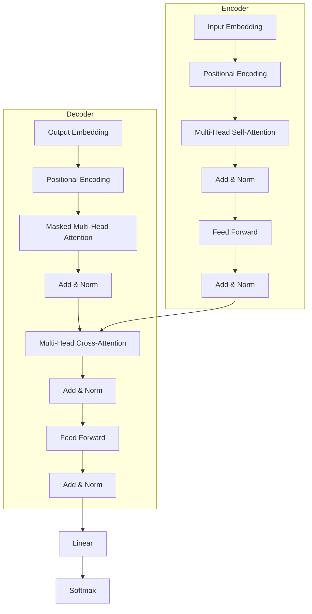

Hugging Face 的 Transformers 库已成为自然语言处理（NLP）领域的行业标准，提供了统一的 API 来访问和使用数千种预训练模型（如 BERT, GPT, RoBERTa, T5 等）。本文将从学术和技术角度深入剖析 Transformers 库的架构设计、底层的 Transformer 模型原理以及其在 PyTorch 中的实现细节。

## 1. 核心设计哲学 (Core Design Philosophy)

Transformers 库的设计核心在于 **Unified API（统一接口）**。它旨在为不同的模型架构（BERT, GPT-2, T5）和不同的深度学习后端（PyTorch, TensorFlow, JAX）提供一致的使用体验。

库围绕三个主要类构建，这三个类共同定义了一个预训练模型：

1.  **Model (`PreTrainedModel`)**: 包含神经网络的权重参数，实现了模型的前向传播逻辑（Forward Pass）。
2.  **Tokenizer (`PreTrainedTokenizer`)**: 负责将原始文本转换为模型可理解的数字输入（Token IDs），处理词汇表（Vocabulary）和特殊标记（Special Tokens）。
3.  **Configuration (`PreTrainedConfig`)**: 存储定义模型结构所需的超参数（如层数、隐藏层维度、注意力头数等），确保模型实例化的正确性。

## 2. Transformer 模型架构详解 (Transformer Architecture)

Transformer 架构由 Vaswani 等人在 2017 年的论文《Attention Is All You Need》中提出。它完全摒弃了递归（RNN）和卷积（CNN），完全依赖于注意力机制（Attention Mechanism）。

### 2.1 整体架构 (Encoder-Decoder)

标准的 Transformer 包含两个主要部分：
*   **Encoder（编码器）**: 处理输入序列，生成上下文相关的表示（Contextual Representation）。BERT 等模型仅使用 Encoder。
*   **Decoder（解码器）**: 根据 Encoder 的输出自回归地生成目标序列。GPT 等模型仅使用 Decoder。



### 2.2 自注意力机制 (Self-Attention Mechanism)

Self-Attention 是 Transformer 的核心，它允许模型在处理序列中的每个位置时，关注序列中的其他位置。

其数学本质是将输入向量映射为三个向量：**Query ($Q$)**, **Key ($K$)**, **Value ($V$)**。

**缩放点积注意力 (Scaled Dot-Product Attention)** 的计算公式为：

$$
\text{Attention}(Q, K, V) = \text{softmax}\left(\frac{QK^T}{\sqrt{d_k}}\right)V
$$

*   **$QK^T$**: 计算 Query 和 Key 的点积，得到注意力分数（Attention Scores），表示不同词之间的相关性。
*   **$\sqrt{d_k}$**: 缩放因子（Scaling Factor），用于防止点积过大导致 Softmax 梯度消失。
*   **Softmax**: 将分数归一化为概率分布（权重）。
*   **$V$**: 将权重作用于 Value 向量，加权求和得到最终输出。

### 2.3 多头注意力 (Multi-Head Attention)

多头注意力机制将 $Q, K, V$ 投影到多个不同的子空间中并行计算注意力。这使得模型能够从不同的“视角”（Representation Subspaces）捕捉序列中的依赖关系。

$$
\text{MultiHead}(Q, K, V) = \text{Concat}(\text{head}_1, ..., \text{head}_h)W^O
$$

其中每个 head 计算如下：

$$
\text{head}_i = \text{Attention}(QW_i^Q, KW_i^K, VW_i^V)
$$

## 3. Transformers 库的实现细节

### 3.1 分词器 (Tokenizers)

Transformers 库支持多种子词分词算法（Subword Tokenization），这是处理 NLP 任务的关键。常见的算法包括：
*   **Byte-Pair Encoding (BPE)**: GPT-2, RoBERTa 使用。
*   **WordPiece**: BERT 使用。
*   **SentencePiece**: T5, XLNet 使用。

这些算法有效地解决了 OOV (Out-Of-Vocabulary) 问题，并显著减小了词汇表的大小。

### 3.2 隐状态与输出 (Hidden States & Outputs)

`PreTrainedModel` 的输出通常是一个类似字典的对象（`ModelOutput`），包含：
*   `last_hidden_state`: 最后一层 Encoder 的输出，形状为 `(batch_size, sequence_length, hidden_size)`。
*   `pooler_output`: (针对 BERT) 序列第一个 token ([CLS]) 经过线性层和 Tanh 激活后的输出，常用于分类任务。
*   `attentions` (可选): 所有层的注意力权重矩阵。
*   `hidden_states` (可选): 所有层的隐藏状态。

## 4. 代码实战 (Implementation)

以下代码展示了如何使用 `transformers` 库加载一个预训练的 BERT 模型，对输入进行分词，并获取其嵌入表示。

```python
import torch
from transformers import BertTokenizer, BertModel

# 1. 初始化分词器和模型
model_name = "bert-base-uncased"
tokenizer = BertTokenizer.from_pretrained(model_name)
model = BertModel.from_pretrained(model_name)

# 2. 准备输入文本
text = "Transformers library explains the architecture of BERT."
# return_tensors='pt' 表示返回 PyTorch 张量
inputs = tokenizer(text, return_tensors="pt")

print(f"Token IDs: {inputs['input_ids']}")

# 3. 前向传播 (No Gradient Calculation for Inference)
with torch.no_grad():
    outputs = model(**inputs)

# 4. 获取输出
last_hidden_states = outputs.last_hidden_state
pooler_output = outputs.pooler_output

print(f"Last Hidden State Shape: {last_hidden_states.shape}")
# 输出: torch.Size([1, 12, 768]) -> (Batch size, Sequence length, Hidden size)
```

## 5. 总结

Hugging Face Transformers 库通过高度抽象的 API 封装了复杂的 Transformer 架构，使得研究人员和工程师能够轻松利用最先进的预训练模型。理解其背后的 Encoder-Decoder 架构、Self-Attention 机制以及 Query-Key-Value 的交互，是深入掌握现代 NLP 技术的基石。
