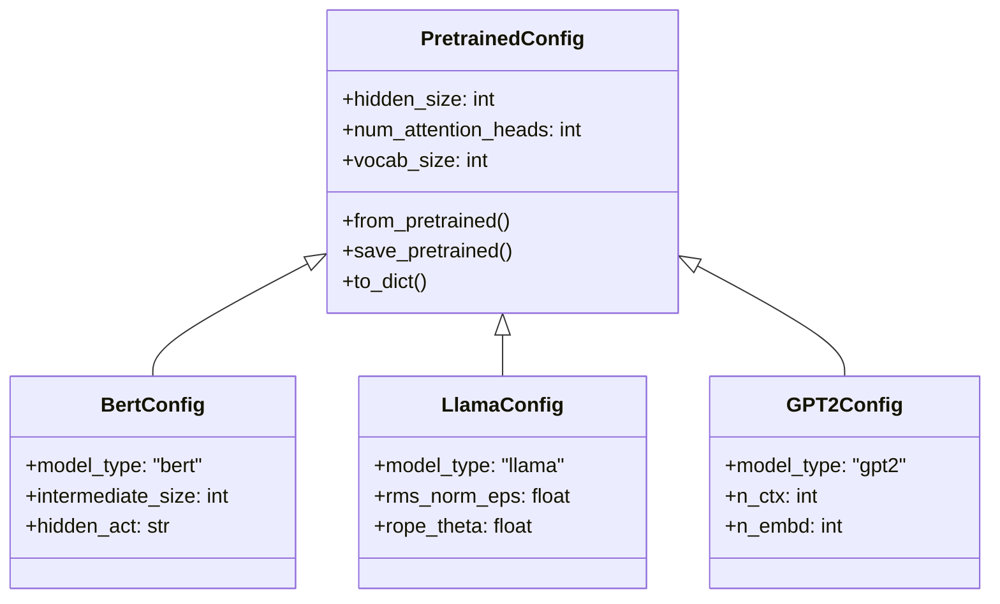

在 Hugging Face Transformers 库的架构体系中，`PretrainedConfig` 类扮演着至关重要的角色。它是所有模型配置类的基类（Base Class），定义了模型实例化的“蓝图”和“基因”。从软件工程的角度来看，它实现了模型架构定义与权重数据的解耦，确保了模型的可复现性（Reproducibility）和可移植性（Portability）。

本文将从类结构、核心属性、生命周期管理以及继承体系等方面，对 `PretrainedConfig` 进行深度的技术剖析。

## 1. 核心设计理念 (Core Design Philosophy)

`PretrainedConfig` 的设计遵循 **“配置即代码”（Configuration as Code）** 的原则。它不仅存储了构建[计算图（Computational Graph）](/AI/相关概念/computational_graph.md)所需的[超参数（Hyperparameters）](/AI/相关概念/超参数.md)，还负责处理模型在不同环境下的序列化与反序列化。

其核心职责包括：
1.  **定义架构参数**：如层数、隐藏单元数、注意力头数等。
2.  **控制推断行为**：如是否输出注意力权重 (`output_attentions`)、是否返回隐藏状态 (`output_hidden_states`)。
3.  **模型元数据管理**：记录模型的来源 (`name_or_path`)、ID 映射 (`id2label`) 等。

## 2. 类继承体系 (Class Hierarchy)

Transformers 库采用以 `PretrainedConfig` 为根的单继承结构。所有的具体模型配置（如 `BertConfig`, `LlamaConfig`）均直接或间接继承自该类。



这种设计模式确保了所有模型共享一套标准的 I/O 接口，同时允许特定模型定义其独有的架构参数（例如 Llama 的 `rope_theta` 或 BERT 的 `intermediate_size`）。

## 3. 关键属性详解 (Key Attributes)

`PretrainedConfig` 维护了众多通用属性，这些属性在所有 Transformer 模型中具有语义一致性。

### 3.1 架构维度参数
*   **`hidden_size`** ($d_{model}$): 嵌入层和隐藏层的维度。决定了模型的容量和表示能力。
*   **`num_hidden_layers`** ($L$): Transformer Encoder 或 Decoder 的层数（Block 数量）。
*   **`num_attention_heads`** ($H$): 多头注意力机制中的头数。通常满足 $d_{model} \mod H = 0$。
*   **`vocab_size`** ($V$): 词表大小，定义了 Embedding 矩阵的第一维度形状。

### 3.2 控制流参数
*   **`is_decoder`**: 布尔值，指示模型是否用作解码器（如 GPT 系列）。若为 `True`，则会启用因果掩码（Causal Masking）。
*   **`output_attentions`**: 若为 `True`，模型前向传播将返回所有层的 Attention map，常用于可解释性分析。
*   **`output_hidden_states`**: 若为 `True`，模型将返回每一层的隐藏状态张量，常用于探测（Probing）或特征提取。

## 4. 实例化与序列化机制 (Instantiation & Serialization)

`PretrainedConfig` 最核心的功能是其强大的加载与保存机制，这是通过 `from_pretrained` 和 `save_pretrained` 两个方法实现的。

### 4.1 加载流程 (`from_pretrained`)
当调用 `PretrainedConfig.from_pretrained("model_id")` 时，库会执行以下逻辑：
1.  **解析路径**：检查输入是本地路径还是 Hugging Face Hub 的模型 ID。
2.  **下载/读取**：获取 `config.json` 文件。
3.  **字典映射**：将 JSON 数据解析为 Python 字典。
4.  **参数注入**：将字典中的 Key-Value 对注入到配置实例的 `__dict__` 中，对于未定义的参数使用默认值。

```python
from transformers import BertConfig

# 方式一：加载预训练配置
config = BertConfig.from_pretrained("bert-base-uncased")

# 方式二：自定义配置（从零训练）
config = BertConfig(
    vocab_size=30522,
    hidden_size=768,
    num_hidden_layers=12,
    num_attention_heads=12,
    intermediate_size=3072
)
```

### 4.2 序列化流程 (`save_pretrained`)
调用 `config.save_pretrained("./my_model")` 会将配置对象序列化为标准的 JSON 文件：

```json
{
  "architectures": ["BertForMaskedLM"],
  "attention_probs_dropout_prob": 0.1,
  "hidden_size": 768,
  "model_type": "bert",
  ...
}
```
这种标准化的 JSON 格式使得 Transformers 模型可以轻松地在不同框架（PyTorch, TensorFlow, Flax）甚至不同语言（Rust, C++）之间迁移。

## 5. 最佳实践与注意事项

1.  **不可变性原则**：虽然 Python 允许动态修改 Config 属性，但在模型初始化后修改 Config 是危险操作，可能导致模型结构与权重不匹配。建议将 Config 视为不可变对象（Immutable）。
2.  **版本兼容性**：Config 文件中通常包含 `transformers_version` 字段。在跨大版本迁移时，应检查该字段以避免兼容性问题。
3.  **区分 `Config` 与 `Model`**：`Config` 仅定义结构，不包含权重。`Model` 包含权重且依赖 `Config` 构建结构。

## 6. 总结

`PretrainedConfig` 是 Hugging Face Transformers 库的基石之一。它通过标准化的接口抽象了复杂的神经网络架构，使得“模型”可以像普通软件配置一样被管理、版本控制和分发。理解 `PretrainedConfig` 是深入掌握 Transformers 源码、开发自定义模型架构以及进行模型压缩/优化的必经之路。
