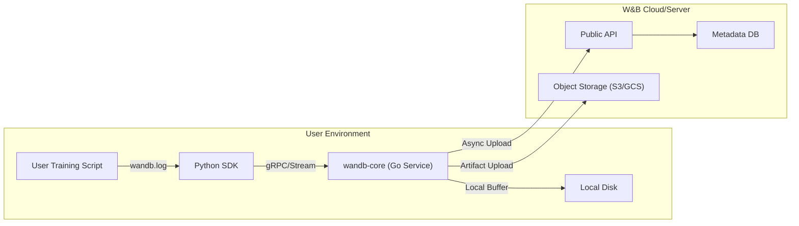
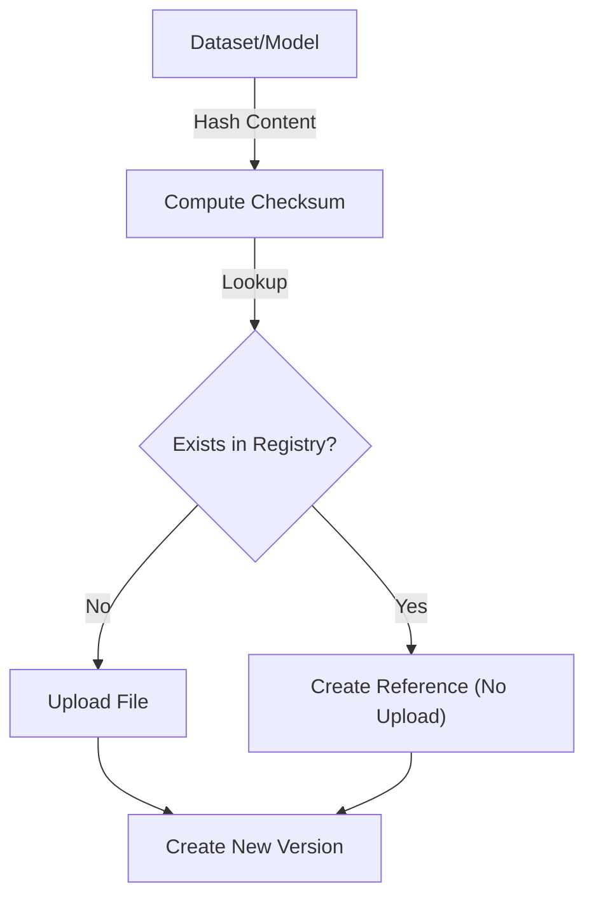

Weights & Biases (简称 W&B 或 WandB) 是一个面向 AI 开发者的 MLOps 平台，旨在为机器学习实验跟踪、模型版本控制、数据集管理和可视化提供统一的记录系统（System of Record）。它支持从实验探索到模型部署的完整生命周期管理。

W&B 采用**客户端-服务器**架构，支持云端（Multi-tenant/Dedicated Cloud）和私有化部署（Self-Managed）。

## 2. 核心系统架构 (System Architecture)

W&B 的系统架构主要由三个部分组成：
1.  **Python SDK**: 集成在用户训练代码中的客户端库。
2.  **wandb-core**: 高性能的 Go 语言服务进程，负责数据处理和上传。
3.  **W&B Backend**: 负责存储、处理和可视化数据的后端服务。

### 2.1 数据流架构 (Data Flow Architecture)

*   **异步通信**: SDK 与 Core 之间、Core 与后端之间均采用异步通信，确保日志记录不会阻塞模型训练主进程。
*   **本地缓存**: 在网络不稳定的情况下，`wandb-core` 会将数据缓冲在本地磁盘，待网络恢复后自动重试上传，保证数据不丢失。

## 3. 关键组件详解

### 3.1 Run Lifecycle (实验生命周期)
`Run` 是 W&B 的原子管理单元，代表一次具体的模型训练或计算过程。

*   **Initialization**: `wandb.init()` 启动进程，认证用户身份，加载配置。
*   **Logging**: `wandb.log()` 接收指标（Metrics）、媒体（Images/Audio）等数据。
*   **Artifacts**: `wandb.log_artifact()` 管理数据集和模型权重，支持版本控制和去重。
*   **Finish**: `wandb.finish()` 确保所有数据上传完毕并关闭运行。

### 3.2 Artifacts System (制品系统)
Artifacts 系统通过**内容寻址存储（Content-Addressed Storage, CAS）**实现高效的版本控制。

*   **去重**: 相同内容的文件只存储一份，不同版本的 Artifact 引用同一份物理文件。
*   **血缘追踪 (Lineage)**: 自动记录 Artifact 的生产者（Run）和消费者（Run），形成完整的实验依赖图谱。

## 4. 框架集成 (Framework Integrations)

W&B 通过 `wandb.watch` 和回调（Callback）机制深度集成主流框架：

| 框架 | 集成方式 | 自动捕获内容 |
| :--- | :--- | :--- |
| **PyTorch** | `wandb.watch(model)` | 梯度 (Gradients)、权重分布 (Weights)、拓扑结构 |
| **Keras/TF** | `WandbCallback()` | Loss, Accuracy, 系统资源 (System Metrics) |
| **Hugging Face** | `WandbCallback` (Trainer) | Trainer 中的所有指标、模型配置 (Config) |
| **PyTorch Lightning** | `WandbLogger` | 自动记录超参数、模型检查点 |

## 5. 部署模式 (Deployment Modes)

1.  **SaaS Cloud**: 最简单的模式，数据托管在 wandb.ai。
2.  **Self-Managed**: 企业级私有化部署，数据存储在用户自己的 VPC (AWS/GCP/Azure) 或本地服务器中，满足合规性要求。

## 6. 参考资料 (References)

1.  **W&B Documentation**: [https://docs.wandb.ai/](https://docs.wandb.ai/)
2.  **Architecture Overview**: [DeepWiki: wandb architecture](https://deepwiki.com/wandb/wandb/1.1-architecture-overview)
3.  **GitHub Repository**: [https://github.com/wandb/wandb](https://github.com/wandb/wandb)
