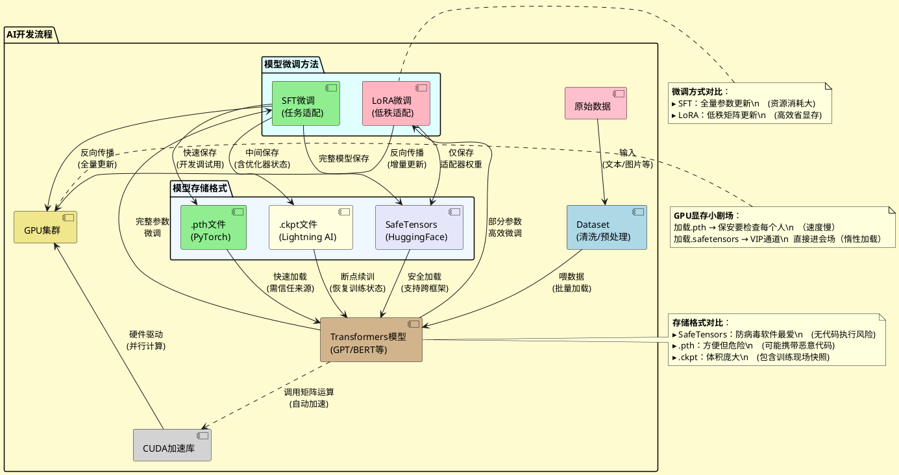

```plantuml
@startuml
skinparam backgroundColor #FFFBD0
skinparam componentStyle uml2

package "AI开发流程" {
  [原始数据] as raw_data #Pink
  [Dataset\n(清洗/预处理)] as dataset #LightBlue
  [Transformers模型\n(GPT/BERT等)] as model #tan
  
  package "模型微调方法" #LightCyan {
    [SFT微调\n(任务适配)] as sft #LightGreen
    [LoRA微调\n(低秩适配)] as lora #LightPink
  }
  
  package "模型存储格式" #AliceBlue {
    [SafeTensors\n(HuggingFace)] as safetensors #lavender
    [.pth文件\n(PyTorch)] as pth #LightGreen
    [.ckpt文件\n(Lightning AI)] as ckpt #LightYellow
  }
  
  [CUDA加速库] as cuda #LightGray
  [GPU集群] as gpu #khaki

  raw_data --> dataset : 输入\n(文本/图片等)
  dataset --> model : 喂数据\n(批量加载)
  model --> sft : 完整参数\n微调
  model --> lora : 部分参数\n高效微调
  sft --> safetensors : 完整模型保存
  sft --> pth : 快速保存\n(开发调试用)
  sft --> ckpt : 中间保存\n(含优化器状态)
  lora --> safetensors : 仅保存\n适配器权重
  safetensors --> model : 安全加载\n(支持跨框架)
  pth --> model : 快速加载\n(需信任来源)
  ckpt --> model : 断点续训\n(恢复训练状态)
  cuda -up-> gpu : 硬件驱动\n(并行计算)
  model .down.> cuda : 调用矩阵运算\n(自动加速)
  sft --> gpu : 反向传播\n(全量更新)
  lora --> gpu : 反向传播\n(增量更新)
}

note right of model
  **存储格式对比**：
  ▸ SafeTensors：防病毒软件最爱\n    (无代码执行风险)
  ▸ .pth：方便但危险\n    (可能携带恶意代码)
  ▸ .ckpt：体积庞大\n    (包含训练现场快照)
end note

note left of lora
  **微调方式对比**：
  ▸ SFT：全量参数更新\n    (资源消耗大)
  ▸ LoRA：低秩矩阵更新\n    (高效省显存)
end note

note left of gpu
  **GPU显存小剧场**：
  加载.pth → 保安要检查每个人\n  （速度慢）
  加载.safetensors → VIP通道\n  直接进会场（惰性加载）
end note
@enduml
```

