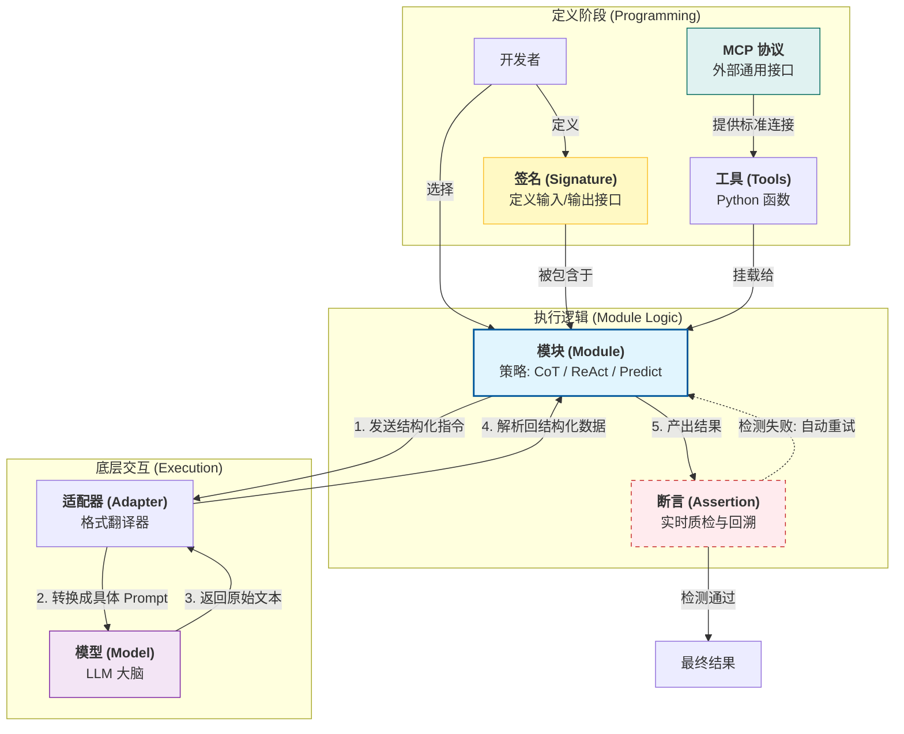

这个菜单里的每一项，其实对应了**构建一个 AI 系统的不同“零部件”**。在 DSPy 的逻辑里，它试图把“写 Prompt”这件事变成正规的软件工程。

我们可以用**“组建一支特工小队去执行任务”**来类比这些概念：

### 1. 核心概念拆解

#### **1. 签名 (Signature) —— “任务说明书”**
*   **职责：** 定义任务的**输入**和**输出**是什么，但不关心具体怎么做。
*   **比喻：** 比如你要发一个任务：“给我翻译”。签名就是一张单子，上面写着“输入：一句英文；输出：一句中文”。
*   **特点：** 它完全不包含提示词里的客套话（比如“你是一个翻译专家”），只关注数据结构。
    *   *代码示例：* `"question -> answer"`, `"context, query -> summary"`

#### **2. 模块 (Module) —— “特工的工作手册/策略”**
*   **职责：** 决定**如何**使用模型来完成那个“签名”定义的任务。它是 DSPy 电路板上的元器件。
*   **比喻：** 同样是“回答问题”这个任务，你可以选择不同的特工策略：
    *   `dspy.Predict`：直肠子特工，拿到问题直接回答。
    *   `dspy.ChainOfThought`：谨慎特工，先在心里写下“Reasoning（推理）”，再给出答案。
    *   `dspy.ReAct`：全能特工，遇到不会的先去查资料（调用工具），循环几次再回答。
*   **关键点：** 模块内部包含了提示词模板、推理逻辑和参数（Wait）。**它是优化的主要对象。**

#### **3. 模型 (Model / LM) —— “大脑/引擎”**
*   **职责：** 提供底层的智力支持。即 GPT-4, Claude-3.5, Llama-3 等大模型。
*   **比喻：** 这是特工的大脑。你可以给特工换个更聪明的脑子（GPT-4），或者换个反应快但便宜的脑子（GPT-4o-mini）。
*   **特点：** 在 DSPy 中，模型是可插拔的。同一套代码，换个 Model 定义就能跑。

#### **4. 适配器 (Adapter) —— “翻译官”**
*   **职责：** 把 DSPy 的高级指令“翻译”成特定模型能听懂的字符串格式。
*   **比喻：**
    *   如果用 Llama-3，适配器会把指令包装成 `<|begin_of_text|>...` 格式。
    *   如果用 OpenAI，适配器会把指令包装成 `{"role": "system", ...}` 的 JSON 格式。
*   **为什么重要：** 你不需要自己去调这些恶心的格式，适配器帮你干了。这让你的 DSPy 程序可以在不同模型间无缝迁移。

#### **5. 工具 (Tool) —— “装备包”**
*   **职责：** 模型本身无法完成的事情（如联网、查库、计算），封装成 Python 函数给模型调用。
*   **比喻：** 特工手里的计算器、Google 搜索入口、公司内网查询器。

#### **6. MCP (Model Context Protocol) —— “通用装备接口”**
*   **职责：** 这是一个**行业标准协议**（由 Anthropic 提出）。它允许 DSPy 直接连接通用的数据源或工具，而不需要你手写 Python 连接器。
*   **比喻：** 它是**USB 接口**。以前你要用某个数据库，得自己焊电线（写 Tool 代码）。现在只要那个数据库支持 MCP 协议，插上就能用。
    *   *场景：* 通过 MCP 协议直接把你的本地文件系统、GitHub 仓库变成 DSPy 的工具。

#### **7. 断言 (Assertion) —— “质检员/防呆机制”**
*   **职责：** 在运行时检查模型的输出是否合规。如果不合规，DSPy 会自动把错误信息反馈给模型，让它**重试**（Self-Correction）。
*   **比喻：** 一个站在特工背后的严厉考官。
    *   *考官说：* “你的回答不能超过 50 个字，且不能包含‘抱歉’这两个字。”
    *   如果特工答错了，考官会打回去：“太长了，重写！”

---

### 2. 组件关系图 (Mermaid)

这就展示了这些组件是如何在一个 DSPy 程序流中协作的：

### 3. 一句话串联

当你使用 DSPy 编写程序时，你首先定义**签名（Signature）**来明确目标，然后选择一个**模块（Module）**作为解决策略，你可以给这个模块装备普通的**工具（Tools）**或者通过 **MCP** 标准接入外部系统。

在运行时，**适配器（Adapter）** 会把你的指令翻译给**模型（Model）** 听，模型生成的结果会被适配器解析回来。如果结果触犯了你设定的**断言（Assertion）**，系统会自动让模型重试，直到产出合格结果。