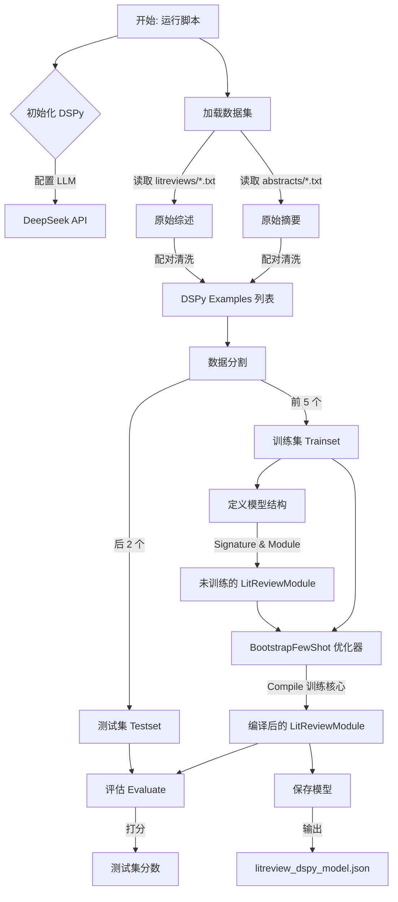
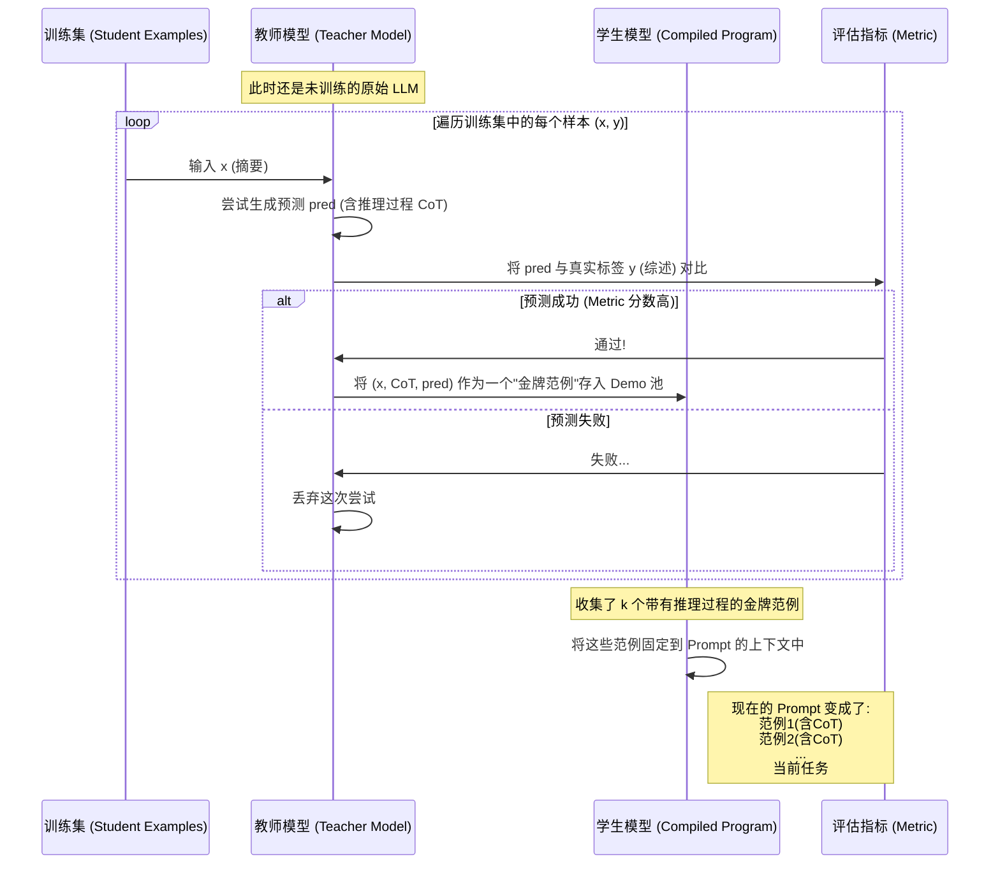

# DSPy 训练流程详解 (scripts\train_litreview_dspy.py)

本文档旨在详细解释 `scripts\train_litreview_dspy.py` 脚本的工作原理，以及 DSPy 核心优化器 `BootstrapFewShot` 是如何将你的数据转化为高质量 AI 模型的。

## 1. 整体训练脚本工作流

训练脚本的整体逻辑可以分为四个主要阶段：**初始化 -> 数据加载 -> 编译(训练) -> 评估与保存**。

### 关键步骤解析：

1.  **加载数据集 (Load Dataset)**: 脚本遍历文件系统，寻找同名的摘要和综述文件，将它们通过 `dspy.Example` 封装成对。
2.  **定义模型 (Module Definition)**: `LitReviewModule` 内部包含了一个 `ChainOfThought` 层。此时它只是一个空壳，只有逻辑，没有“经验”。
3.  **编译 (Compile)**: 这是魔法发生的时刻。`BootstrapFewShot` 接收“未训练的模型”和“训练集”，输出一个“训练好的模型”。
4.  **保存 (Save)**: 训练好的模型被保存为 JSON，里面实质上是包含了一组精选的 **Prompt 示例 (Demos)**。

---

## 2. BootstrapFewShot 优化器工作原理

`BootstrapFewShot` 是 DSPy 中最常用的优化器（Teleprompter）。它的核心思想是：**“不仅要给模型看好的例子，还要教模型这些例子是怎么推导出来的。”**

它通过“自我举证”的方式，为你的训练数据自动生成**思维链 (CoT)**。

### BootstrapFewShot 的三个关键动作：

1.  **Bootstrapping (自举/引导)**:
    *   它拿训练集里的问题去问大模型（Teacher）。
    *   但它不只是问“答案是什么”，它让模型输出“推理过程 + 答案”。
    *   例如：它会尝试解释“为什么这篇关于满意度的摘要，最后写成了那样一篇综述”。

2.  **Filtering (过滤)**:
    *   模型生成的解释不一定是对的。
    *   所以它用我们定义的 `metric`（评分函数）去检查。只有当模型生成的综述和我们提供的标准答案（Ground Truth）足够接近（分数高）时，这个“推理过程”才会被保留。

3.  **Few-Shot Prompting (少样本提示)**:
    *   最后生成的 `litreview_dspy_model.json`，实际上就是把这几个通过了筛选的 `(输入, 推理过程, 输出)` 组合保存了下来。
    *   以后你用这个模型时，DeepSeek 每次都会先看到这几个成功的例子，模仿它们的推理逻辑，然后再处理你的新任务。

---

## 3. 为什么需要这个过程？

你可能会问：*“我直接给几个例子写在 Prompt 里不就行了吗？为什么要写代码训练？”*

| 手写 Prompt (普通方法) | DSPy BootstrapFewShot (当前方法) |
| :--- | :--- |
| 你手动挑选 2-3 个例子复制粘贴。 | 脚本自动从数据集中尝试，找出模型最容易理解、效果最好的例子。 |
| 例子通常只有“输入 -> 输出”。 | 脚本自动生成中间的 **“思维链” (Reasoning)**，教模型*如何思考*。 |
| 每次修改需求都要重写 Prompt。 | 修改需求只需改 Signature，重新运行脚本即可自动生成新 Prompt。 |
| 很难保证输出格式稳定。 | 因为有高质量的范例引导，输出格式（如 Markdown 结构）会非常稳定。 |

## 4. 总结

`scripts\train_litreview_dspy.py` 实质上是一个**自动化 Prompt 工程脚本**。

它利用你现有的数据，强迫大模型进行了一次“自我反思”：
> “面对这些摘要，我是怎么写出那么好的综述的？”

如果它反思对了（生成了高分结果），就把这个反思过程记录下来，变成永久的教材（json 模型文件）。下次它遇到新摘要，就翻开这本教材，照着里面的逻辑写。