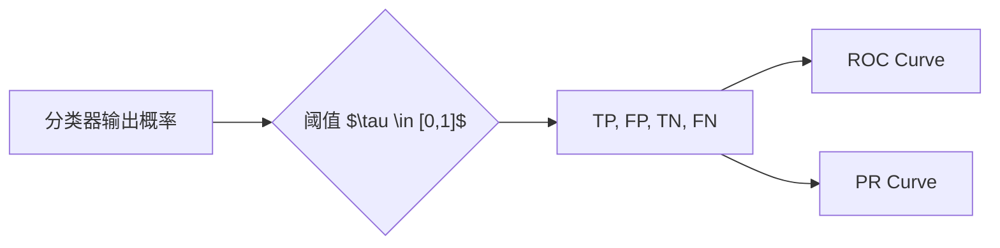
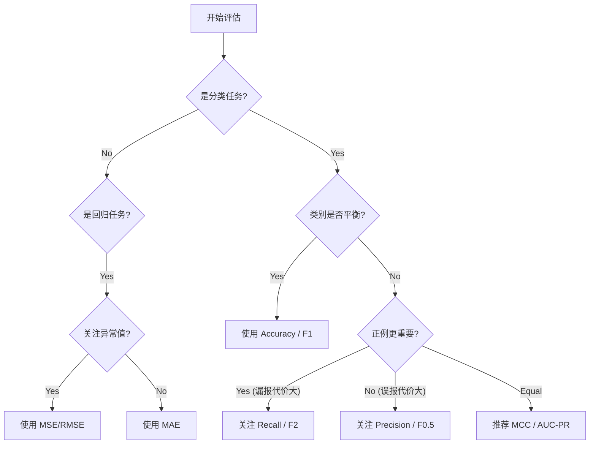

# 模型精度评估指标体系 (Model Evaluation Metrics) —— 学术专业版

## 1. 引言 (Introduction)

在机器学习（Machine Learning, ML）研究与应用中，模型评估是验证算法有效性、比较不同模型性能以及指导超参数优化的核心环节。一个严谨的评估体系不仅依赖于单一的准确率指标，更需要根据任务类型（分类、回归、聚类、排序等）、数据分布特性（平衡或非平衡）以及业务代价函数（Type I vs Type II error）选择合适的度量标准。

本文档旨在提供一个系统化的模型评估指标参考，涵盖数学定义、适用场景、统计检验方法及底层原理。

## 2. 混淆矩阵与基础定义 (Confusion Matrix & Fundamentals)

对于二分类问题，混淆矩阵（Confusion Matrix）是所有评估指标的基础。设 $C$ 为分类器，$D$ 为测试数据集。

| 真实类别 \ 预测类别 | Positive (预测为正) | Negative (预测为负) |
| :--- | :---: | :---: |
| **Positive (真实为正)** | **TP** (True Positive, 真阳性) | **FN** (False Negative, 假阴性/漏报) |
| **Negative (真实为负)** | **FP** (False Positive, 假阳性/误报) | **TN** (True Negative, 真阴性) |

基于上述定义，我们引入四个基础概率度量：

### 2.1 核心指标数学形式

1.  **准确率 (Accuracy)**: 全局预测正确的比例。
    $$ \text{Accuracy} = \frac{TP + TN}{TP + TN + FP + FN} $$
    *   *局限性*：在类别极度不平衡（Imbalanced Data）时失效（例如：正样本仅占 1% 时，全预测为负也能达到 99% 准确率，称为 Accuracy Paradox）。

2.  **精确率 (Precision / Positive Predictive Value, PPV)**: 预测为正的样本中，真正为正的比例。侧重于**抗干扰能力**（减少误报）。
    $$ \text{Precision} = \frac{TP}{TP + FP} $$

3.  **召回率 (Recall / Sensitivity / True Positive Rate, TPR)**: 真实为正的样本中，被正确预测出来的比例。侧重于**覆盖能力**（减少漏报）。
    $$ \text{Recall} = \frac{TP}{TP + FN} $$

4.  **特异度 (Specificity / True Negative Rate, TNR)**: 真实为负的样本中，被正确识别为负的比例。
    $$ \text{Specificity} = \frac{TN}{TN + FP} $$

## 3. 高级与综合指标 (Advanced Metrics)

为了平衡精确率与召回率的 Trade-off，或解决类别不平衡问题，学术界引入了更鲁棒的复合指标。

### 3.1 F-Score 系列
F-Score 是 Precision 和 Recall 的加权调和平均数。

$$ F_\beta = (1 + \beta^2) \cdot \frac{\text{Precision} \cdot \text{Recall}}{(\beta^2 \cdot \text{Precision}) + \text{Recall}} $$

*   **F1-Score** ($\beta=1$): Precision 与 Recall 权重相等。
    $$ F1 = \frac{2 \cdot TP}{2 \cdot TP + FP + FN} $$
*   **F0.5-Score** ($\beta=0.5$): 更侧重 Precision（如垃圾邮件过滤）。
    $$ F_{0.5} = \frac{1.25 \cdot TP}{1.25 \cdot TP + 0.25 \cdot FN + FP} $$
*   **F2-Score** ($\beta=2$): 更侧重 Recall（如癌症筛查）。

### 3.2 机会校正指标 (Chance-Corrected Metrics)
当类别极度不平衡时，即使随机猜测也可能获得高准确率。以下指标对此进行了校正。

*   **Matthews Correlation Coefficient (MCC)**:
    被认为是二分类问题中最均衡的单一度量，本质上是观测分类与预测分类之间的皮尔逊相关系数（Pearson Correlation Coefficient）。取值范围 $[-1, 1]$，0 表示随机预测。
    $$ \text{MCC} = \frac{TP \cdot TN - FP \cdot FN}{\sqrt{(TP+FP)(TP+FN)(TN+FP)(TN+FN)}} $$

*   **Cohen's Kappa ($\kappa$)**:
    衡量两个评估者（分类器与真实标签）的一致性，排除偶然一致的可能性。
    $$ \kappa = \frac{p_o - p_e}{1 - p_e} $$
    其中 $p_o$ 是观察到的准确率，$p_e$ 是期望的偶然准确率。

### 3.3 图形化评估 (Graphical Evaluation)

*   **ROC 曲线 (Receiver Operating Characteristic)**: 以 FPR ($1 - \text{Specificity}$) 为横轴，TPR ($\text{Recall}$) 为纵轴。
    *   **AUC (Area Under Curve)**: ROC 曲线下的面积，衡量分类器对正负样本的排序能力（Ranking Quality）。AUC=0.5 表示随机分类。
*   **PR 曲线 (Precision-Recall Curve)**: 以 Recall 为横轴，Precision 为纵轴。
    *   *学术建议*：在正负样本极度不平衡（Positive 很少）的情况下，PR 曲线比 ROC 曲线更能反映分类器的真实性能。

## 4. 多分类与多任务评估 (Multi-Class & Task-Specific)

### 4.1 多分类聚合策略
对于 $K$ 个类别的问题，需要将二分类指标聚合：
*   **Micro-Average**: 全局累加 TP, FP, FN 后计算指标。受大类影响显著。
*   **Macro-Average**: 对每个类别分别计算指标，然后取算术平均。平等对待每个类别（无论样本量大小）。
*   **Weighted-Average**: 对每个类别分别计算指标，按样本量加权平均。

### 4.2 任务特定指标

| 任务类型 | 核心指标 | 说明 |
| :--- | :--- | :--- |
| **回归 (Regression)** | MSE, MAE, $R^2$, RMSE | MSE 对异常值敏感；$R^2$ 衡量拟合优度。 |
| **语义分割 (Segmentation)** | IoU (Intersection over Union), Dice Coefficient | IoU = $\frac{TP}{TP + FP + FN}$ |
| **目标检测 (Object Detection)** | mAP (mean Average Precision) | 结合了不同 IoU 阈值下的 Precision-Recall 表现。 |
| **信息检索 (Information Retrieval)** | NDCG (Normalized Discounted Cumulative Gain), MRR | 关注排序的位置权重。 |

## 5. 统计显著性检验 (Statistical Significance Testing)

在学术论文中，仅比较指标的均值是不够的，必须证明模型性能的提升具有统计显著性（Statistical Significance）。

1.  **McNemar's Test**: 用于二分类模型在单一测试集上的比较。关注两模型预测结果不一致的样本（$b$ vs $c$）。
    $$ \chi^2 = \frac{(|b - c| - 1)^2}{b + c} $$
2.  **Wilcoxon Signed-Rank Test**: 非参数检验，用于比较两个模型在多个数据集（或交叉验证的多个Fold）上的性能差异。推荐替代 Paired t-test，因为其不假设差值服从正态分布。
3.  **Friedman Test**: 用于比较多个模型（>2）在多个数据集上的性能。

## 6. 指标选择决策流 (Metric Selection Guide)

## 7. 参考资料 (References)

1.  Rainio, O., Teuho, J. & Klén, R. **Evaluation metrics and statistical tests for machine learning**. *Scientific Reports* 14, 6086 (2024). [https://www.nature.com/articles/s41598-024-56706-x](https://www.nature.com/articles/s41598-024-56706-x)
2.  Beddar-Wiesing, S. et al. **Absolute Evaluation Measures for Machine Learning: A Survey**. *arXiv preprint arXiv:2507.03392* (2025). [https://arxiv.org/html/2507.03392v1](https://arxiv.org/html/2507.03392v1)
3.  Google Developers. **Classification: Accuracy, recall, precision, and related metrics**. [https://developers.google.com/machine-learning/crash-course/classification/accuracy-precision-recall](https://developers.google.com/machine-learning/crash-course/classification/accuracy-precision-recall)
4.  Evidently AI. **Accuracy vs. precision vs. recall in machine learning**. [https://www.evidentlyai.com/classification-metrics/accuracy-precision-recall](https://www.evidentlyai.com/classification-metrics/accuracy-precision-recall)
